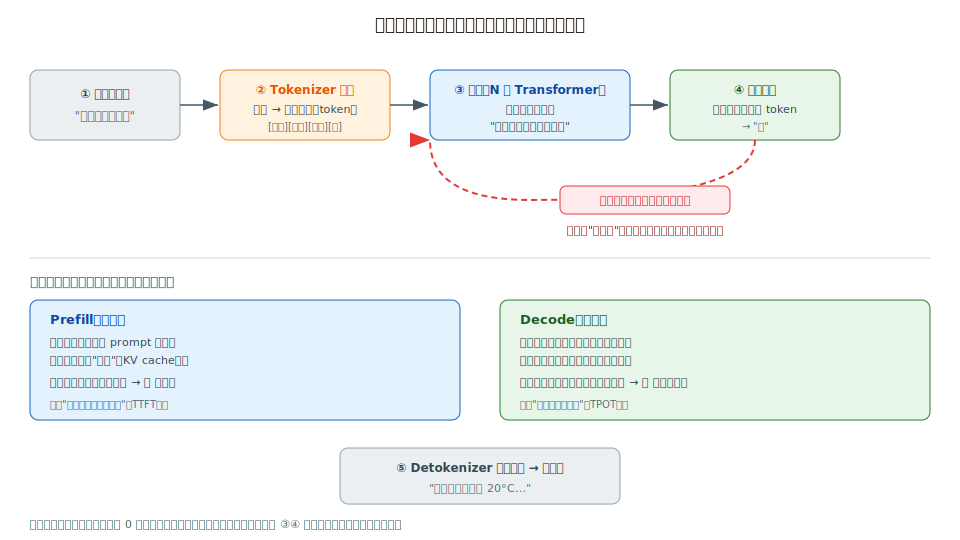

# 前置篇｜上车准备：基础概念 + 环境搭建

> 一句话定位：如果你还说不清"什么是 token、模型、推理、训练"，或还没装好能跑大模型的环境——**从这里开始**。读完你能跑通人生第一个大模型推理，并听得懂阶段 0 起每一章的"行话"。已经会用 vLLM/HuggingFace 的，可以直接跳到 [阶段 0](00-prereq-hardware.md)。

## 目录

- [P.0 这一篇写给谁（要不要读）](#p0-这一篇写给谁要不要读)
- [P.1 30 分钟补完深度学习地基](#p1-30-分钟补完深度学习地基)
- [P.2 Python 与数学：够用就行](#p2-python-与数学够用就行)
- [P.3 环境搭建：从零到能跑](#p3-环境搭建从零到能跑)
- [P.4 跑通你的第一个大模型推理](#p4-跑通你的第一个大模型推理)
- [P.5 学习路径：小白的最短主线](#p5-学习路径小白的最短主线)
- [P.6 常见坑与 FAQ](#p6-常见坑与-faq)
- [P.7 延伸阅读](#p7-延伸阅读)

---

## P.0 这一篇写给谁（要不要读）

这本书的正文（阶段 0–12）默认你**有 PyTorch 基础、用过 vLLM 或 HuggingFace**。如果你符合，跳过这一篇，直接去 [阶段 0](00-prereq-hardware.md)。

但如果你是下面任何一种，先读这篇——它专门为你补上"上车前"缺的那块：

- 听过"大模型"，但说不清**什么是 token、参数、推理**；
- 写过一点 Python，但没碰过深度学习；
- 想动手，但**不知道怎么把环境搭起来**、第一个程序怎么跑；
- 读正文时，被 "KV cache"、"prefill/decode"、"GQA" 这些词劝退过。

**怎么用这一篇**：

- 不需要你懂高等数学，也不需要你会写神经网络。只要你**会用电脑、写过几行任何语言的代码**就行。
- 目标不是"学会造模型"，而是"**看懂别人造好的模型怎么跑、怎么调**"——这正是整本书的定位。
- 读完这一篇，你会跑通一个真实的大模型推理，并建立起一张"大图"。后面每章往这张大图里填细节。

> 一句话期望：**这一篇结束时，你不再怕那些术语，并且亲手让一个大模型对你说了第一句话。**

---

## P.1 30 分钟补完深度学习地基

大模型听起来玄，但**核心概念其实很少**。这一节用大白话把它们一次讲清。不求严谨，只求你能"听懂行话、看懂大图"。

### P.1.1 模型、参数、权重：到底是什么

把**模型**想成一个超级复杂的函数：你给它一段文字，它算出"接下来最该说什么"。

这个函数里有一大堆**可调的数字旋钮**——这些旋钮就叫**参数**（parameter），也叫**权重**（weight）。"7B 模型"的意思就是它有 **70 亿个**这样的旋钮（B = billion = 十亿）。

- **训练**做的事：拿海量文本，一点点拧这 70 亿个旋钮，让模型说出来的话越来越像人话。这一步极贵（几千张显卡、几个月）。
- **推理**做的事：旋钮已经拧好、固定不动了，你给输入、它给输出。**这本书绝大部分在讲推理**（怎么让推理又快又省又便宜），训练在阶段 7 讲。

> 记住一个数：参数越多，模型越聪明，但也越占显存。**1 个参数用 2 字节（BF16）存** → 7B 模型光存参数就要 14 GB 显存。这就是为什么后面整本书都在跟"显存"较劲。

### P.1.2 token / tokenizer / embedding

模型不认识文字，只认识**数字**。所以要先把文字翻译成数字。

- **token**：文字被切成的小块。可能是一个词、半个词、一个字、或一个标点。比如 "今天天气" 可能被切成 `[今天][天气]` 两个 token，英文 "unhappy" 可能切成 `[un][happy]`。**token 是大模型处理文字的最小单位**——后面所有"长度""速度""显存"都按 token 算，不是按字。
- **tokenizer**（分词器）：负责"文字 ↔ token 数字"互译的工具。每个 token 对应词表里的一个编号（id）。
- **embedding**（词向量）：光有编号不够，模型把每个 token 编号再变成一串数字（一个向量，比如 4096 个数），这串数字才进入模型计算。你可以理解为"把 token 翻译成模型能理解的'语义坐标'"。

直觉：**文字 → token（切块编号）→ embedding（语义坐标）→ 进模型**。

### P.1.3 训练 vs 推理：两件完全不同的事

新手最容易混的两个词，其实是两件事：

| | 训练（Training） | 推理（Inference） |
|---|---|---|
| 做什么 | 拧旋钮，造出模型 | 用造好的模型，给输入出输出 |
| 旋钮（参数） | 一直在变 | 固定不动 |
| 成本 | 极高（几千卡 × 几个月） | 相对低（你日常用的就是它） |
| 本书重点 | 阶段 7 一章 | **阶段 1–6、8–12 主要讲这个** |
| 类比 | 十年寒窗学知识 | 考场上答题 |

你平时"和 AI 聊天"，用的全是**推理**。这本书的核心就是：怎么把推理服务做得快、省、稳。

### P.1.4 prefill 与 decode：推理的两个阶段



这是**全书最重要的一对概念**，现在记住，后面每章都会回到它（看上图下半部分）：

一次推理分两步：

1. **Prefill（读题）**：模型一次性把你的**整段问题**读完，算好"对这段话的理解"（存成 KV cache，下一节细说）。就像考试先把题目读一遍。
   - 特点：要算的东西多、能并行 → **吃算力**。
   - 决定**第一个字多久蹦出来**（术语叫 TTFT，Time To First Token）。

2. **Decode（答题）**：基于已有的理解，**一个 token 一个 token**地往外吐。每吐一个，就把它接到末尾，再算下一个——循环，直到说完。这叫**自回归**（autoregressive）。
   - 特点：每步算得少，但要反复读"记忆" → **吃显存带宽**。
   - 决定**后面每个字多快**（术语叫 TPOT，Time Per Output Token）。

> 为什么这对概念这么重要？因为**它俩的瓶颈完全相反**——prefill 缺算力、decode 缺带宽。全书一半的优化技巧（continuous batching、chunked prefill、KV 量化……）都是在分别伺候这两个阶段。现在不用懂细节，**记住"推理 = prefill 读题 + decode 逐字答题"就够了**。

### P.1.5 KV cache：模型的"短期记忆"

decode 每吐一个新词，都要"回顾前面说过的所有词"。如果每次都从头重算，会慢到无法接受。

所以模型把"前面每个 token 的理解"**存下来**，下次直接用——这份存下来的东西就叫 **KV cache**（KV 缓存）。

- 它是模型的**短期记忆**：对话越长，记忆越大，**越占显存**。
- 它是全书的"显存第一矛盾"：阶段 5 整章在讲怎么管它，阶段 4/8 在讲怎么压缩它。

直觉：**KV cache = 用显存换速度**。现在记住这一句就行。

### P.1.6 把这张大图记住

到这里，你已经有了一张"大图"：

```
你的文字
  → tokenizer 切成 token（P.1.2）
  → embedding 变成语义坐标
  → 模型（一堆拧好的参数，P.1.1）
       ├─ Prefill：一次读完，存 KV cache（P.1.4 / P.1.5）
       └─ Decode：一个一个吐词（自回归），每次复用 KV cache
  → detokenizer 拼回文字
  → 回复你
```

**全书在做的事，几乎都是让这张图里的某一步更快、更省、更便宜。**

- 嫌算得慢？→ 阶段 4（算子）、阶段 0（硬件）
- 嫌显存不够？→ 阶段 5（KV 管理）、阶段 8（量化）
- 嫌一张卡装不下？→ 阶段 2（多卡并行）、阶段 3（多卡通信）
- 想做成线上服务？→ 阶段 6（推理引擎）、阶段 10（生产部署）

看不懂细节没关系——你现在**有了挂细节的钩子**。这就是这一篇的目的。

---

## P.2 Python 与数学：够用就行

这本书要你看懂代码、看懂少量公式。但**门槛比你想的低**——下面这些够你读懂全书 90% 的内容。

### P.2.1 Python：会读就行

你不需要会写复杂 Python，只要**看得懂**这几样：

```python
# 1) 变量、函数、循环（任何语言都有，略）

# 2) 张量（tensor）：大模型里的"数据"几乎都是它
#    张量 = 带形状的多维数组。记住"形状（shape）"这个词就够了。
import torch
x = torch.randn(2, 4096)     # 一个形状为 [2, 4096] 的张量：2 行、每行 4096 个数
print(x.shape)               # torch.Size([2, 4096])

# 3) 矩阵乘 @：大模型 99% 的计算就是它
a = torch.randn(2, 4096)
b = torch.randn(4096, 11008)
c = a @ b                    # 结果形状 [2, 11008]
```

读全书代码时，**你最该关注的是"张量的形状怎么变"**——`[B, S, D]` 这种标注（batch、序列长、维度）会反复出现。看不懂某行代码细节没关系，**先看它把形状从什么变成了什么**。

### P.2.2 数学：只需三个直觉

不需要微积分、不需要证明。三个直觉够用：

1. **矩阵乘法 = 大模型的主要计算。** 你不用会手算，只要知道："两个矩阵相乘，是一堆乘法加法堆起来的，量很大。" 大模型慢/费电，主要就慢在这。
2. **向量 = 一串数字 = 语义坐标。** token 的 embedding（P.1.2）就是个向量。"相似的词，坐标也接近"——这是大模型理解语义的方式。
3. **概率 = 模型怎么"选词"。** 模型最后吐出的不是一个词，而是"每个候选词的概率"。从概率里挑一个，就是 P.1.4 的 decode。挑的方式（贪心/随机/控制随机度）在阶段 1 讲。

> 一句话：**会看张量形状 + 知道"主要计算是矩阵乘" + 知道"模型按概率选词"，数学就够上路了。** 真要深究的公式，正文会在用到时现场解释。

---

## P.3 环境搭建：从零到能跑

这一节带你把环境搭起来。**没有 GPU 也能完成 P.4 的第一个推理**（用 CPU 跑小模型），所以现在没显卡也别停。

### P.3.1 先决定：在哪跑

| 选项 | 适合 | 说明 |
|---|---|---|
| **自己的电脑（CPU）** | 先跑通流程、学概念 | 任何笔记本都行，跑小模型，慢但能学 |
| **自己的 GPU（NVIDIA）** | 有游戏/工作站显卡 | 8GB+ 显存能跑 1–7B 小模型，体验真实加速 |
| **云 GPU**（AutoDL / 阿里云 / Lambda 等） | 想跑大模型、学分布式 | 按小时租 H100/A100，几块到几十块一小时 |
| **免费在线**（Google Colab / Kaggle） | 零成本试 GPU | 免费送有限 GPU 时长，适合做练习 |

**建议**：先在自己电脑用 CPU 跑通 P.4（理解流程），需要速度或大模型时再上云。

### P.3.2 装 Python 与 PyTorch

```bash
# 1) 装 Python（建议 3.10–3.12）。已有可跳过。
#    推荐用 conda 或 venv 建独立环境，避免污染系统：
python -m venv llm-env
source llm-env/bin/activate        # Windows: llm-env\Scripts\activate

# 2) 装 PyTorch
#    —— 只有 CPU：
pip install torch
#    —— 有 NVIDIA GPU（按你的 CUDA 版本，去 pytorch.org 选命令，例如 CUDA 12.1）：
# pip install torch --index-url https://download.pytorch.org/whl/cu121

# 3) 验证
python -c "import torch; print('torch', torch.__version__); print('GPU 可用:', torch.cuda.is_available())"
```

期望输出（CPU 机器）：

```
torch 2.x.x
GPU 可用: False
```

`GPU 可用: False` 在 CPU 机器上是**正常的**，不影响 P.4。如果你有 GPU 却显示 False，多半是装了 CPU 版 torch 或 CUDA 没配好（见 P.6）。

### P.3.3 装推理用的库

```bash
pip install transformers        # HuggingFace：加载模型、跑推理，CPU/GPU 都行
# vLLM 需要 NVIDIA GPU（CPU 跑不了），有 GPU 再装：
# pip install vllm
```

**transformers** 是入门首选——任何机器都能用、模型最全。**vLLM** 是生产级高性能引擎（阶段 6 主角），但要 GPU。所以 P.4 的第一个例子用 transformers，保证你现在就能跑。

---

## P.4 跑通你的第一个大模型推理

来让一个真实的大模型对你说第一句话。**这段代码在纯 CPU 上也能跑**（用一个很小的模型）。

### P.4.1 用 transformers 跑（CPU 也行）

把下面存成 `first_run.py`：

```python
# first_run.py —— 你的第一个大模型推理（CPU 可跑）
from transformers import AutoModelForCausalLM, AutoTokenizer

# 选一个很小的模型（约 0.5B，CPU 也扛得住）。第一次会自动下载。
model_name = "Qwen/Qwen2.5-0.5B-Instruct"

tokenizer = AutoTokenizer.from_pretrained(model_name)
model = AutoModelForCausalLM.from_pretrained(model_name)   # 默认 CPU

# 1) 把你的问题套上对话模板，再 tokenize（对应 P.1.2）
messages = [{"role": "user", "content": "用一句话解释什么是大模型推理。"}]
text = tokenizer.apply_chat_template(messages, tokenize=False, add_generation_prompt=True)
inputs = tokenizer(text, return_tensors="pt")             # 文字 → token 数字

print("输入被切成了", inputs.input_ids.shape[1], "个 token")  # 看看 P.1.2 的 token

# 2) 让模型生成（这一步内部就是 prefill + decode，对应 P.1.4）
outputs = model.generate(**inputs, max_new_tokens=64, do_sample=False)

# 3) 把输出的 token 拼回文字（detokenize）
reply = tokenizer.decode(outputs[0][inputs.input_ids.shape[1]:], skip_special_tokens=True)
print("模型回复：", reply)
```

运行：

```bash
python first_run.py
```

期望输出（内容会变，形态如此）：

```
输入被切成了 28 个 token
模型回复： 大模型推理是指用训练好的模型，根据输入生成输出的过程……
```

**恭喜——你刚刚完整跑了一遍 P.1.6 的大图**：你的文字被切成 28 个 token（① tokenize），喂进模型做 prefill + decode（②③④ 自回归生成），再拼回文字回复你（⑤）。`model.generate` 这一行，内部就是整本书后面要拆解和优化的全部。

### P.4.2 进阶：用 vLLM 起一个服务（需要 GPU）

有 NVIDIA GPU 的话，体验一下生产级引擎（阶段 6 主角）。它把模型变成一个 **OpenAI 兼容的 HTTP 服务**（阶段 10 §10.2）：

```bash
# 启动服务（一行）
vllm serve Qwen/Qwen2.5-0.5B-Instruct

# 另开一个终端，像调用 OpenAI 一样调用它
curl http://localhost:8000/v1/chat/completions \
  -H "Content-Type: application/json" \
  -d '{"model": "Qwen/Qwen2.5-0.5B-Instruct",
       "messages": [{"role": "user", "content": "你好"}]}'
```

你会看到一段 JSON 回复。**这就是真实线上大模型服务的样子**——你平时用的 AI 产品，后面跑的就是类似 vLLM 这样的引擎。它为什么比 P.4.1 的 transformers 快几十倍？答案是阶段 4/5/6 的全部内容。

> 跑不通也别慌：P.4.1（CPU）能跑通就够了，你已经建立了完整的"输入→token→模型→输出"心智。P.4.2 是给有 GPU 的同学的甜点，不是必需。

---

## P.5 学习路径：小白的最短主线

全书 13 章（含本篇）按"由底向上"排，但小白没必要一上来全啃。给你三条路径：

### 路径 A：最短主线（想最快"会用 + 看懂"）

```
前置篇（你在这）→ 阶段 1（模型结构）→ 阶段 5（KV/调度）→ 阶段 6（推理引擎）→ 阶段 10（部署）
```

跳过硬核的并行/通信/kernel，先打通"一个模型怎么跑成一个服务"。**4 章读完，你就能搭一个像样的推理服务并讲清原理。**

### 路径 B：完整精读（想"会改、会调、会讲"）

阶段 0 → 12 顺序全读。这是本书设计的主路径，每章建立在前面之上。**遇到"详见阶段 X"时，别跳过去**——记下"这里有个坑后面会填"，继续往下读，到那章自然懂。

### 路径 C：带着问题查（已上手、要解决具体问题）

| 你的问题 | 直接去 |
|---|---|
| 显存不够 / 想塞下更大模型 | 阶段 5、阶段 8 |
| 吞吐上不去 / 延迟高 | 阶段 5、阶段 11 |
| 一张卡装不下 | 阶段 2、阶段 3 |
| 多卡训练 | 阶段 7 |
| 做成线上服务 / 接多模态 | 阶段 6、阶段 10 |
| 看懂某个具体模型（LLaMA/DeepSeek…） | 阶段 12 |

> 给小白的纪律：**先走路径 A 建立全局观，再回头按路径 B 补深度。** 别第一遍就钻进阶段 2 的并行公式里——那是最容易劝退的地方，等你有了全局观再看会轻松得多。

---

## P.6 常见坑与 FAQ

1. **`torch.cuda.is_available()` 是 False，但我有 GPU**：八成装成了 CPU 版 torch，或 CUDA 没配好。去 [pytorch.org](https://pytorch.org) 按你的 CUDA 版本重装；先 `nvidia-smi` 确认系统认得显卡。
2. **第一次跑 `from_pretrained` 卡在下载**：模型从 HuggingFace 下载，国内网络可能慢。设镜像：`export HF_ENDPOINT=https://hf-mirror.com` 再跑。
3. **CPU 跑大模型慢到无法忍**：正常——CPU 跑 7B 就是慢。学概念用 0.5B 小模型；要速度去 P.3.1 的云 GPU。
4. **显存不够（CUDA out of memory）**：模型太大装不下。换更小的模型，或用量化版（阶段 8），或上更大显存的卡。
5. **"token 数"和"字数"对不上**：正常——token 不等于字（P.1.2）。一个汉字可能是 1–2 个 token，英文一个词可能拆成几个 token。
6. **被术语劝退**：回到 P.1 的"大图"（P.1.6）。任何术语，先问它落在大图哪一步，再去对应阶段看细节。**先有钩子，再填细节。**
7. **vLLM 装不上 / 跑不了**：vLLM 需要 NVIDIA GPU + 对应 CUDA，CPU 和 Mac 跑不了。没有 GPU 就用 P.4.1 的 transformers，本地推理也可以用 Ollama / llama.cpp（阶段 6 §6.7）。
8. **该用哪个 Python 版本**：3.10–3.12 最稳。3.13 太新、部分库还没跟上（比如某些环境装 vLLM/torch 会有坑）。

---

## P.7 延伸阅读

- **《动手学深度学习》（d2l.ai，中文免费）** — 想补更扎实的深度学习地基，这是最好的中文入门，可只读前几章。
- **HuggingFace `transformers` 快速上手文档** — P.4.1 用的库，官方 quicktour 十分钟跑通更多例子。
- **3Blue1Brown 的 Transformer / 神经网络视频（中文字幕）** — 想"看动画理解"注意力机制，这是最直观的可视化。
- **Jay Alammar《The Illustrated Transformer》** — 图解 Transformer 的经典博客，配阶段 1 读。
- **vLLM 官方 Quickstart** — P.4.2 的来源，有 GPU 后照着跑通一个真服务。
- **本书 [阶段 0](00-prereq-hardware.md)** — 读完本篇，正式从这里开始。建立硬件直觉后，阶段 1 起的所有"快/省/贵"才有参照。

---

> **读完这一篇**，你已经：跑通了第一个大模型推理、建立了"输入→token→模型→输出"的大图、认识了 prefill/decode/KV cache 这些贯穿全书的核心词、并选好了适合自己的学习路径。**现在，正式上车——去 [阶段 0｜先修与硬件基础](00-prereq-hardware.md)。**
