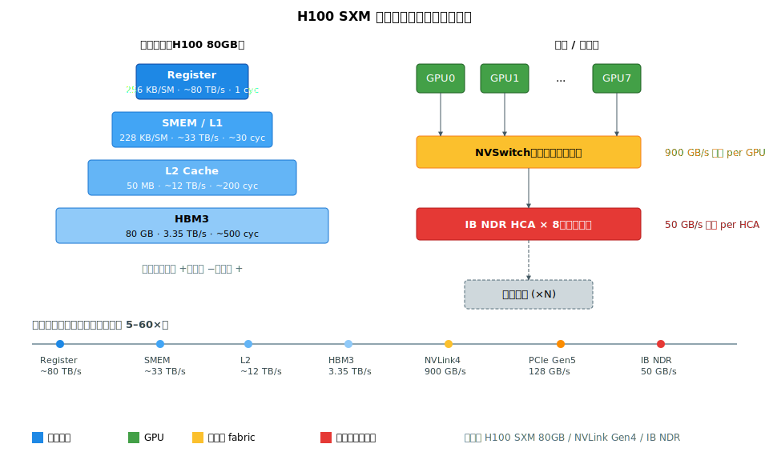

# 阶段 0｜先修与硬件基础 ✓

> 一句话定位：在脑子里建一张物理参考系——GPU 内部、显存层级、互联拓扑、数值精度——让后续每一章的"算力/显存/通信"权衡都有具体的硬件参数可对。
>
> 还说不清"什么是 token / 推理 / KV cache"，或环境还没搭好？先读[前置篇](0-onboarding.md)再回来。

## 目录

- [0.0 为什么需要这一层](#00-为什么需要这一层)
- [0.1 核心概念与术语](#01-核心概念与术语)
- [0.2 原理详解](#02-原理详解)
- [0.3 关键实现剖析：CUDA 编程模型](#03-关键实现剖析cuda-编程模型)
- [0.4 最小可运行示例：测一遍带宽](#04-最小可运行示例测一遍带宽)
- [0.5 性能与调优](#05-性能与调优)
- [0.6 常见坑与 FAQ](#06-常见坑与-faq)
- [自测](#自测)
- [0.7 延伸阅读](#07-延伸阅读)

---

## 0.0 为什么需要这一层

读者大概率已经会用 `model.cuda()`、跑过 PyTorch DDP，所以这层听起来像"复习"。但每个有 1–2 年大模型工程经验的人回头看，都会发现自己**至少踩过以下一种**：

- 8 卡 H100 训练吞吐只有理论 FLOPs 的 30%——`nsys` 一拉发现某两张卡跨 socket 走了 PCIe，不是 NVLink；
- 同一份 FP8 权重换到 A100 上跑，吞吐和精度全对不上 H100 数据——A100 根本没有 FP8 Tensor Core；
- 推理加上 FlashAttention 反而更慢——batch=1 时被 kernel launch overhead 吃掉了；
- 估 KV cache 显存按 MHA 算半天，结果模型用的是 GQA，H\_kv 已经砍到 8，算出来的数差 8 倍。

这些坑**根都在硬件**——HBM 带宽、SMEM 容量、NVLink 拓扑、kernel launch 成本、Tensor Core 精度支持。不把这些数字烙进脑子，后面讲并行策略、PagedAttention、FlashAttention-3 时都会变成猜谜。

本章只有一个目标：读完之后，给你一个模型 config + 一台机器，你能在白板上估出**算力上限**、**显存上限**、**通信瓶颈在哪条线上**，并知道下一步该用 `nvidia-smi topo -m` / `nsys` / `ncu` 中哪个工具去验证。

---

## 0.1 核心概念与术语

后续章节反复出现的硬件缩写一次集中，按"GPU 内 → GPU 之间 → 跨节点"由内向外排：

| 缩写 | 全称 | 一句话 |
|---|---|---|
| SM | Streaming Multiprocessor | GPU 的"核"，H100 SXM 有 132 个 |
| Warp | Warp | 32 个 thread 锁步执行的最小调度单位 |
| Tensor Core | Tensor Core | 矩阵乘专用单元，跑 BF16 / FP8 / INT 的 GEMM |
| SMEM | Shared Memory | 每 SM 内的 scratchpad，H100 可配 228 KB |
| L2 | L2 Cache | 全 GPU 共享，H100 50 MB |
| HBM | High Bandwidth Memory | GPU 主存，H100 SXM 80 GB / 3.35 TB/s |
| TMA | Tensor Memory Accelerator | Hopper 起的异步 DMA 引擎（SMEM ↔ HBM），FlashAttention-3 的关键 |
| NVLink | NVLink | GPU 间点对点高速链路，第四代 900 GB/s 双向 |
| NVSwitch | NVSwitch | NVLink 的 crossbar，做节点内全连接 |
| NVL72 | NVL72 | 72 张 B200 通过第五代 NVLink 全互联的机架，打破"节点"边界 |
| P2P | Peer-to-Peer | GPU 直接读写另一张 GPU 的显存 |
| GDR | GPUDirect RDMA | 网卡直接 DMA 显存，bypass CPU |
| IB | InfiniBand | 主流 RDMA 网络，NDR 400 Gb/s = 50 GB/s 单向 |
| RoCE | RDMA over Converged Ethernet | IB 之外的 RDMA 方案 |
| NUMA | Non-Uniform Memory Access | CPU socket 间访存延迟非对称，跨 socket 走 QPI |
| Roofline | — | 判定算子 compute-bound vs memory-bound 的图形模型 |

> 公式记号约定（贯穿全书）：`B`=batch，`S`=seq，`D`=hidden\_size，`H`=Q heads，`H_kv`=KV heads，`d`=head\_dim，`L`=层数。

---

## 0.2 原理详解

### 0.2.1 GPU 内部：SM、Tensor Core 与 TMA

以 H100 SXM 80GB 为例。132 个 SM，每个 SM 含：

- 4 个 sub-partition，每个 16 个 FP32 CUDA core + 1 个第四代 Tensor Core
- 256 KB 寄存器堆（每 thread 最多 255 个 32-bit reg）
- 228 KB 可配 SMEM + L1（运行时按 kernel 切分）
- 1 个 TMA 引擎，做 SMEM ↔ HBM 异步搬运

H100 SXM 稠密峰值算力，**精度每降一位算力翻一倍**：

| 精度 | TFLOPS / TOPS | 典型用途 |
|---|---:|---|
| FP32（CUDA core） | 67 | 控制流、reduction、loss scaling |
| TF32（Tensor Core） | 989 | A100 默认 GEMM 精度 |
| BF16 / FP16（Tensor Core） | 989 | 训练默认 |
| FP8 E4M3 / E5M2 | 1979 | 推理 + Hopper FP8 训练 |
| INT8 | 1979 | W8A8 推理 |
| INT4 | 3958 | W4Ax 推理 |

铁律：大模型几乎所有重算子都该走 Tensor Core，FP32 只剩控制流和数值敏感小算子。精度阶梯翻倍是 FP8 / INT8 / INT4 推理被反复推广的**物理驱动力**，不是软件优化的副作用。

### 0.2.2 内存层级与 Roofline



从 register 到 IB，带宽差三个数量级、延迟差四个数量级：

| 层级 | 容量 | 带宽 | 延迟（典型） |
|---|---|---|---|
| Register | 256 KB / SM | 直读 | 1 cycle |
| SMEM / L1 | 228 KB / SM | ~33 TB/s | ~30 cycle |
| L2 | 50 MB | ~12 TB/s | ~200 cycle |
| HBM3 | 80 GB | 3.35 TB/s | ~500 cycle |
| NVLink Gen4 | — | 900 GB/s 双向 | μs |
| PCIe Gen5 ×16 | — | 128 GB/s 双向 | μs |
| IB NDR | — | 50 GB/s 单向 | μs + 拥塞 |

**Roofline** 给出算子的性能上限：

$$\text{性能上限} = \min(\text{峰值算力},\;\text{算术强度} \times \text{HBM 带宽})$$

算术强度 = **FLOPs / 从 HBM 搬运的字节数**。在 H100 BF16 上，ridge point ≈ 989 TFLOPS / 3.35 TB/s ≈ **295 FLOP/Byte**——算子算术强度低于这个值就是 memory-bound，再优化算法没用，得提复用率（融合算子、共用 input、加大 batch）。

实战分类：

| 算子 / 阶段 | 算术强度 | 类型 |
|---|---|---|
| Prefill 的大 GEMM（QKV、O\_proj、FFN） | > 200 | compute-bound |
| Decode 单 token 的 GEMV、RMSNorm、Softmax | < 10 | memory-bound |
| KV cache 读 | ~2 | memory-bound（推理头号瓶颈） |
| All-Reduce 跨节点 | — | 受 IB 带宽约束（通信-bound） |

> Continuous batching 的本质：把 decode 阶段一堆 memory-bound 的 GEMV 拼成一个 compute-bound 的 GEMM。这个动作就在 ridge point 两侧来回搬，是阶段 5 全章的主角。

### 0.2.3 多卡互联拓扑

**节点内 (intra-node)**——决定 TP / EP 的上限：

- 8 卡 H100 SXM 通过 4 个 NVSwitch 全互联，**任意两卡** 900 GB/s 双向；
- PCIe 版 H100 只能走 PCIe Gen5 ×16 ≈ 128 GB/s——同型号 GPU，拓扑差 7 倍，买卡先看是 SXM 还是 PCIe；
- AMD MI300X 类似，节点内 8 卡通过 Infinity Fabric 互联。

**节点间 (inter-node)**——决定 PP / DP 的可扩展性：

- 每卡通常配一张 IB NDR 400 Gb/s HCA，8 卡出节点总带宽 ≈ 3.2 Tb/s；
- 加上 GPUDirect RDMA（HCA 直 DMA 显存）和 IBGDA（kernel 内发起 IB verbs），是 NCCL / DeepEP 高性能 all-to-all 的物理底座；
- 跨多 hop 拓扑（fat-tree、Dragonfly）会引入额外延迟，详见阶段 3。

**NVL72**：72 张 B200 走第五代 NVLink + NVSwitch 全互联，1.8 TB/s 双向 per GPU。传统的"节点内/节点间"二分被打破——72 张卡互相之间都是 NVLink 级带宽。大 MoE 的 EP 域可以一举做到 64+，DeepSeek-V3 这类 256-expert MoE 的部署形态从此改变。

### 0.2.4 数值精度

| 类型 | bits | 指数 / 尾数 | H100 算力 | 典型用途 |
|---|---:|---|---:|---|
| FP32 | 32 | 8 / 23 | 67 TF | reduction、loss scale |
| TF32 | 19 | 8 / 10 | 989 TF | A100 默认 GEMM |
| BF16 | 16 | 8 / 7 | 989 TF | 训练默认 |
| FP16 | 16 | 5 / 10 | 989 TF | 早期训练 / 推理 |
| FP8 E4M3 | 8 | 4 / 3 | 1979 TF | 推理权重 + 激活 |
| FP8 E5M2 | 8 | 5 / 2 | 1979 TF | 梯度（动态范围更大） |
| INT8 | 8 | — | 1979 TOPS | W8A8 推理 |
| INT4 | 4 | — | 3958 TOPS | W4Ax 推理 |

四条必须建立的直觉：

1. **BF16 指数范围 = FP32**，所以**不需要 loss scaling**（FP16 才需要）。BF16 是当前 LLM 训练事实标准。
2. **FP8 E4M3 动态范围只到 ±448**，必须配 per-tensor / per-token / per-block 缩放，否则 outlier 直接溢出。这是阶段 8 量化章节的核心难点。
3. **Tensor Core 算力随位宽折半翻倍**——量化省的不是算法，是物理算力档位。
4. **Hopper 之前没有 FP8 Tensor Core**：A100 / V100 跑 FP8 模型会回退到 BF16，对不上 H100 吞吐数据。买卡 / 选模型时务必核对精度支持矩阵。

---

## 0.3 关键实现剖析：CUDA 编程模型

PyTorch 每次 `tensor.cuda()` 背后是 CUDA 的两层抽象：**主机端 API**（malloc / memcpy / stream / event）和**设备端代码**（kernel）。理解这两层，才能看懂 vLLM 为什么用多 stream 重叠通信与计算，FlashAttention 为什么要算 SMEM 占用，CUDA Graph 为什么能把 decode 吞吐翻倍。

最小内核启动（C++）：

```cpp
__global__ void add(float* a, float* b, float* c, int n) {
    int i = blockIdx.x * blockDim.x + threadIdx.x;
    if (i < n) c[i] = a[i] + b[i];
}

int main() {
    float *a, *b, *c;
    cudaMalloc(&a, N * 4); cudaMalloc(&b, N * 4); cudaMalloc(&c, N * 4);
    cudaStream_t s; cudaStreamCreate(&s);
    add<<<(N + 255) / 256, 256, /*smem=*/0, s>>>(a, b, c, N);   // 异步 launch
    cudaStreamSynchronize(s);
}
```

六个必须建立的直觉，每个都对应后续章节里反复出现的工程问题：

| 概念 | 一句话 | 对应工程问题 |
|---|---|---|
| **Launch overhead** | 每次 `<<<...>>>` ~5–10 μs；70B decode 一个 token ≈ 数百次 launch ≈ ms 级 | 为什么 vLLM 默认开 CUDA Graph |
| **Stream** | 同 stream 内顺序、跨 stream 并发 | 怎么把 NCCL 与 GEMM 重叠（阶段 3） |
| **Event** | 跨 stream 同步的轻量原语 | PD 分离 KV 传输的握手（阶段 5） |
| **P2P / UVA** | `cudaDeviceEnablePeerAccess` 后 GPU 互读显存 | NCCL ring 的物理基础（阶段 3） |
| **`cudaMemcpyAsync`** | 异步拷贝必须配 pinned host 内存 + 非默认 stream | KV offload 到 CPU / NVMe（阶段 5） |
| **TMA**（Hopper+） | 硬件 DMA 引擎，替代手写异步拷贝 | FlashAttention-3 提速的来源（阶段 4） |

PyTorch 等价物：

| CUDA 概念 | PyTorch 入口 |
|---|---|
| stream | `torch.cuda.Stream`、`with torch.cuda.stream(s)` |
| event | `torch.cuda.Event` |
| pinned memory | `torch.empty(..., pin_memory=True)` |
| async copy | `tensor.to(dev, non_blocking=True)` |
| graph capture | `torch.cuda.CUDAGraph` / `torch.cuda.graph` |
| p2p | `torch.distributed` + NCCL backend |

---

## 0.4 最小可运行示例：测一遍带宽

下面这段 PyTorch 脚本 5 分钟出结果，用真实数字把手上这台机器的硬件参考系校准一遍（可跑版：[`examples/00_bandwidth_probe.py`](../examples/00_bandwidth_probe.py)）。三项指标分别对应 0.2 节的三条性能线：**HBM 带宽**、**NVLink P2P 带宽**、**kernel launch overhead**。

```python
# bandwidth_probe.py — H100 / A100 / MI300X 都能跑
import torch, time

def hbm_bw_gbps(gb=4.0, iters=20):
    n = int(gb * 1024**3 / 4)
    x = torch.empty(n, dtype=torch.float32, device='cuda')
    y = torch.empty_like(x)
    torch.cuda.synchronize()
    t0 = time.perf_counter()
    for _ in range(iters):
        y.copy_(x)                          # HBM→HBM，读+写 = 2 × gb
    torch.cuda.synchronize()
    return 2 * gb * iters / (time.perf_counter() - t0)

def p2p_bw_gbps(src=0, dst=1, gb=1.0, iters=20):
    x = torch.empty(int(gb * 1024**3 / 4), dtype=torch.float32, device=f'cuda:{src}')
    y = torch.empty_like(x, device=f'cuda:{dst}')
    torch.cuda.synchronize()
    t0 = time.perf_counter()
    for _ in range(iters):
        y.copy_(x)
    torch.cuda.synchronize()
    return gb * iters / (time.perf_counter() - t0)

def launch_overhead_us(iters=10000):
    a = torch.zeros(1, device='cuda')      # 接近空 kernel
    torch.cuda.synchronize()
    t0 = time.perf_counter()
    for _ in range(iters):
        a.add_(1.0)
    torch.cuda.synchronize()
    return (time.perf_counter() - t0) * 1e6 / iters

if __name__ == '__main__':
    print(f'HBM copy bandwidth : {hbm_bw_gbps():.0f} GB/s')
    if torch.cuda.device_count() >= 2:
        print(f'P2P GPU0 -> GPU1   : {p2p_bw_gbps():.0f} GB/s')
    print(f'Kernel launch cost : {launch_overhead_us():.1f} μs')
```

H100 SXM 节点典型输出：

```
HBM copy bandwidth : 2800 GB/s     # 接近 3.35 TB/s 理论的 ~84%
P2P GPU0 -> GPU1   : 420 GB/s      # 接近 NVLink 单向 450 GB/s
Kernel launch cost : 6.8 μs        # 这就是 CUDA Graph 要消除的开销
```

异常排查表：

| 现象 | 可能原因 |
|---|---|
| HBM 带宽 < 2 TB/s（H100） | ECC 开启损失 ~10% 是预期；明显更低看 `nvidia-smi -q -d POWER` 是否被 power cap 限频 |
| P2P 带宽只有几十 GB/s | 走了 PCIe，重看 `nvidia-smi topo -m`；或 `NCCL_P2P_DISABLE=1` 被误设 |
| Launch overhead > 20 μs | host 端 Python 解释器忙、CPU 被 NUMA 错配；先 `numactl` 绑核再测 |

---

## 0.5 性能与调优

调优时按下面三步顺序问自己——绝大多数性能问题在前两步就能定位。

### 第一招：拓扑——`nvidia-smi topo -m`

```
        GPU0    GPU1    GPU2    GPU3    NIC0
GPU0     X     NV18    NV18    NV18    PXB
GPU1    NV18    X      NV18    NV18    PXB
...
```

| 符号 | 含义 | 速度 |
|---|---|---|
| `NV<n>` | n 条 NVLink 直连 | 极快 |
| `PIX` | 同一 PCIe switch | 快 |
| `PXB` | 跨 PCIe bridge | 中 |
| `PHB` | 同 host bridge | 中 |
| `NODE` | 跨 NUMA、同 socket | 慢 |
| `SYS` | 跨 socket / QPI | **要避免** |

跨 NUMA 的常见后果：CPU → GPU pinned 拷贝走 QPI，带宽掉一半甚至更多。多进程训练务必 `numactl --cpunodebind=N --membind=N`，按 GPU↔NUMA 拓扑分别绑核。

### 第二招：Roofline——算子是 compute-bound 还是 memory-bound？

H100 BF16 ridge point ≈ **295 FLOP/Byte**。任何 GEMM $M \times K \times N$：

$$\text{算术强度} = \frac{2 M K N}{2(M K + K N + M N)}$$

低于 295 就是 memory-bound，优化算法白搭，得合并 GEMM 或增大 batch。例：decode 阶段 batch=1 的 `[1, D] × [D, 3D]`（QKV 投影），算术强度 ≈ 1，纯 memory-bound；continuous batching 把 batch 拉到 256 后，算术强度 → 200+，进入 compute-bound 区。这就是阶段 5 调度器的核心套利。

### 第三招：launch overhead——`nsys profile python infer.py`

打开 timeline 看 kernel 之间是否有大量空白条带、CPU 是否在频繁 `cuLaunchKernel`。如果是，上 CUDA Graph（vLLM 默认 `enforce_eager=False`）。70B 模型 decode 单 token ~数百次 kernel，未加 Graph 的 launch overhead 可达 2–4 ms——这往往是 TTFT 报表里"莫名其妙的尾巴"。

> 三招记忆口诀：**先拓扑（机器对不对）→ 再 Roofline（算子在哪一侧）→ 最后 launch（CPU 端是不是漏了气）**。

---

## 0.6 常见坑与 FAQ

1. **`torch.cuda.is_available()` 为 True 但 P2P 跑不起来**：多半是 ACS（PCIe Access Control Service）没关。BIOS 关或 `setpci` 临时关。
2. **`nccl-tests` allreduce 只有 ~50 GB/s**：节点内但被 PCIe 限速。检查 `NCCL_P2P_DISABLE` 是否被设了 1、`nvidia-smi topo -m` 是否显示 `NV`。
3. **混合精度训练 loss 爆炸**：FP16 没开 loss scaling、或梯度溢出。换 BF16 通常解决。
4. **A100 跑 FP8 模型对不上吞吐**：A100 没有 FP8 Tensor Core，会回退到 BF16。
5. **`cudaMemcpy` 阻塞整个进程**：用 `cudaMemcpyAsync` + non-default stream + pinned host 内存（`torch.empty(..., pin_memory=True)`）。
6. **CUDA Graph capture 失败**：动态 shape、CPU sync、显式 `cudaMalloc` 都不能出现在 capture region 里。变长 batch 要用 padding 或 piecewise graph。
7. **HBM 带宽比理论低 30%+**：先看 `nvidia-smi -q -d POWER` 是不是被 power cap 限频；ECC 开关只损失 ~10%。
8. **`numactl` 绑核后吞吐反降**：多进程都绑到同一个 NUMA node 了，要按 GPU↔NUMA 拓扑分别绑。

---

## 自测

1. **（口算）** H100 SXM 的 HBM 带宽约 3.35 TB/s，BF16 算力约 989 TFLOPS。它的 Roofline "拐点"（ridge point）算术强度约是多少 FLOP/Byte？低于这个值的算子属于哪一类 bound？
2. **（判读）** `nvidia-smi topo -m` 显示两张常通信的卡之间是 `SYS`。这意味着什么？为什么要尽量避免把 TP 放在这种连接上？
3. **（应用）** 你把一个 FP8 量化的模型部署到 A100 上，发现吞吐和精度都对不上 H100 的数据。最可能的原因是什么？
4. **（口算）** decode 阶段单请求是 memory-bound 的 GEMV。为什么"把几十条请求拼成一个大 batch"能把它推向 compute-bound？（提示：算术强度怎么变）

<br>

**参考答案**

1. ridge point ≈ 989 TFLOPS / 3.35 TB/s ≈ **295 FLOP/Byte**。算术强度**低于** 295 的算子是 **memory-bound**（带宽受限），高于的是 compute-bound。（§0.2.2、§0.5）
2. `SYS` = 跨 socket / 走 QPI 的最慢连接。TP 每层都有高频 AllReduce、对带宽极敏感，放 `SYS` 上会让训练慢几倍——TP 必须放节点内 NVLink（`NV`）。（§0.5）
3. A100 **没有 FP8 Tensor Core**（FP8 是 Hopper 起才有）。模型会回退到 BF16 执行，吞吐对不上 H100、数值路径也变了。（§0.2.4）
4. 单请求 GEMV 算术强度 ≈ 1（每个权重读一次只算一次），memory-bound；拼成 batch=N 后，同一份权重被 N 条请求复用，**算术强度 → N**，越过 ridge point 进入 compute-bound。这就是 continuous batching 的物理本质。（§0.2.2，详见阶段 5）

> 答得上 1、4 说明你抓住了本章最关键的 Roofline 直觉——它是全书所有性能判断的指南针。

---

## 0.7 延伸阅读

- **NVIDIA《H100 Tensor Core GPU Architecture》白皮书** — 读 SM / TMA / FP8 三节，硬件直觉就有了一半。
- **NVIDIA《GPU Performance Background User's Guide》** — 官方 Roofline 教程，图清晰，反复回看。
- **《CUDA C++ Best Practices Guide》第 9 章 Memory Optimizations** — SMEM bank conflict、coalesced access 的标准教材。
- **Horace He《Making Deep Learning Go Brrrr From First Principles》** — 把性能问题分成 compute / memory / overhead 三类的必读博客。
- **`nccl-tests` README** — 不写 CUDA 代码也能读，建立 busbw vs algbw 的直觉。
- **Lambda Labs《Demystifying GPU Architectures》** — 跨厂商对比（NVIDIA / AMD / TPU），看清 Tensor Core 在生态里的位置。
