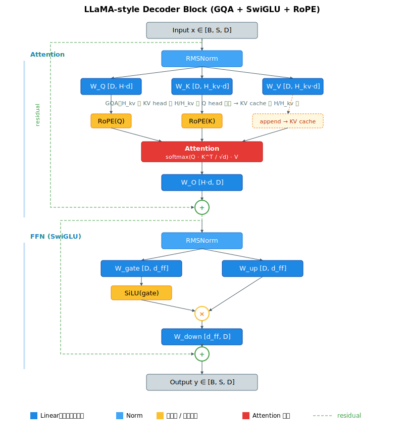
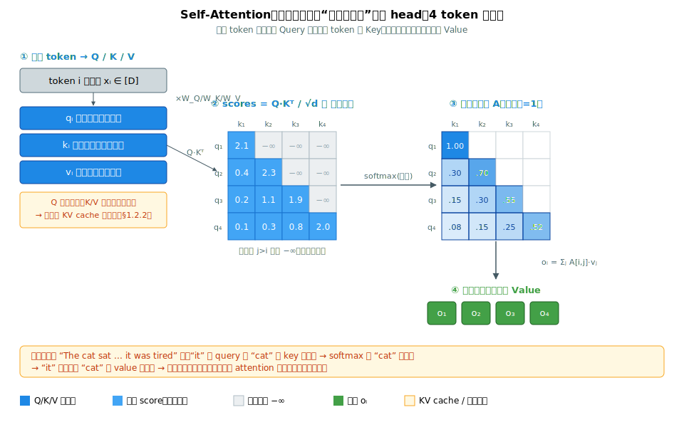
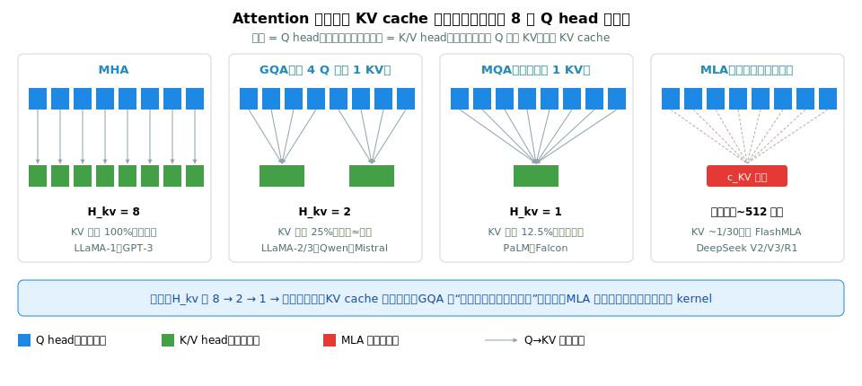
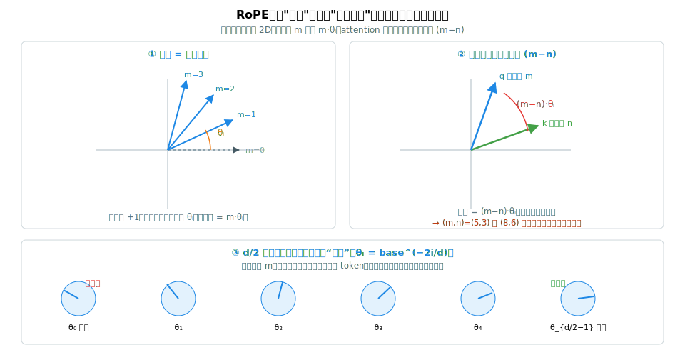
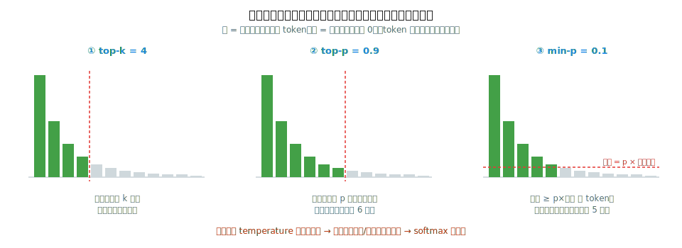
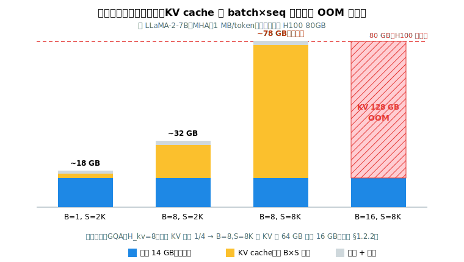

# 阶段 1｜Transformer 与单卡推理基础 ✓

> 一句话定位：把现代 decoder-only LLM 拆到模块级——Embedding、RMSNorm、GQA Attention、SwiGLU FFN、RoPE、采样——并用 ~150 行 PyTorch 完整复刻一遍 LLaMA forward，作为 Capstone P1（mini-vLLM）的起点。

## 目录

- [1.0 为什么需要这一层](#10-为什么需要这一层)
- [1.1 核心概念与术语](#11-核心概念与术语)
- [1.2 原理详解](#12-原理详解)
- [1.3 关键实现剖析：vLLM LlamaModel](#13-关键实现剖析vllm-llamamodel)
- [1.4 最小可运行示例：~150 行 LLaMA forward](#14-最小可运行示例150-行-llama-forward)
- [1.5 性能与显存估算](#15-性能与显存估算)
- [1.6 常见坑与 FAQ](#16-常见坑与-faq)
- [自测](#自测)
- [1.7 延伸阅读](#17-延伸阅读)

---

## 1.0 为什么需要这一层

你要写 mini-vLLM、读 vLLM / SGLang 源码、判断 KV cache 该用 GQA 还是 MLA——这些都需要先在脑子里有一张精确的 Transformer block 拓扑：每一层进什么 shape、出什么 shape、显存占多少、算量分布在哪。

**这一章是后面所有章节的地基。** 往上每一层都建在它之上：阶段 2 的并行（TP 怎么切、为什么 TP ≤ $H_{kv}$）、阶段 4 的 kernel（FlashAttention 优化的就是 §1.2.1 的 attention）、阶段 5 的 KV cache（管理的就是 §1.2.2 的那块显存）、阶段 8 的量化（压的就是这些权重）、阶段 12 的架构选读（全是在这个骨架上拧旋钮）。**Transformer 的结构本身高度收敛**——读懂这一个 LLaMA block，就读懂了 95% 的现代 LLM；后面的章节不是学新结构，而是学"这个结构怎么跑得快、装得下、训得动"。

本章的脉络：**§1.2 把原理讲透（attention/KV/RoPE/MoE/采样）→ §1.4 用 ~150 行手撕一遍 → §1.5 学会口算显存与算力**。理解 + 手写 + 估算，三件事齐了，才算真正"拿下"了 Transformer。

读完这一章你应当能：

- 默写一个 LLaMA decoder block 的前向，含每一步 shape，并说清 self-attention 在算什么（§1.2.1）
- 给定 model config（`hidden_size`、`num_heads`、`num_kv_heads`、`d_ff`）口算单层参数量、单层算量、KV cache 大小（§1.5）
- 解释 MHA → GQA → MLA 的演进为什么是为推理服务的（§1.2.2）
- 说清 RoPE 为什么能编码相对位置、MoE 为什么能解耦容量与算力（§1.2.3、§1.2.4）
- 选对采样参数：`temperature` / `top_p` / `min_p` 的相互作用（§1.2.5）

---

## 1.1 核心概念与术语

| 缩写 | 全称 | 一句话 |
|---|---|---|
| D / hidden | hidden\_size | token embedding 维度 |
| H | num\_heads | Q head 数 |
| H\_kv | num\_kv\_heads | KV head 数（MHA 时 H\_kv=H；GQA 时 H\_kv<H） |
| d | head\_dim | 单 head 维度，通常 D / H |
| d\_ff | ffn\_dim | FFN 中间层维度，LLaMA 约 2.67×D |
| S | seq\_len | 序列长度 |
| B | batch | batch size |
| V | vocab | 词表大小 |
| MHA | Multi-Head Attention | 标准多头 |
| MQA | Multi-Query Attention | 所有 Q head 共享 1 个 KV head（H\_kv=1） |
| GQA | Grouped-Query Attention | g 个 Q head 共享一个 KV head |
| MLA | Multi-head Latent Attention | DeepSeek，KV 压缩到低秩潜空间 |
| RoPE | Rotary Position Embedding | 旋转位置编码 |
| YaRN | Yet another RoPE extensioN | 长上下文外推 |
| RMSNorm | Root Mean Square Norm | LayerNorm 简化版，省去均值 |
| SwiGLU | Swish-Gated Linear Unit | 门控 FFN：SiLU(W\_gate x) ⊙ (W\_up x) |
| LM head | Language Modeling Head | 最后一层 Linear，hidden → vocab |
| KV cache | Key/Value Cache | 历史 K/V 缓存，让 decode 复杂度从 O(S²) 降到 O(S) |

**典型值速记**（拿到 config 心里要有的标尺）：

| 量 | 7B | 70B | 为什么是这个量级 |
|---|---|---|---|
| $D$ (hidden) | 4096 | 8192 | 随规模放大；$D$ 决定单 token 表示宽度 |
| $L$ (层数) | 32 | 80 | 随规模加深；深度和宽度一起涨 |
| $d$ (head_dim) | 128 | 128 | **几乎恒为 128**——Tensor Core 和 FlashAttention 对 128 最友好，所以放大模型靠加 head 数而非加 $d$ |
| $H$ (Q head) | 32 | 64 | $H = D/d$；放大模型主要加这个 |
| $H_{kv}$ (KV head) | 32 (MHA) | 8 (GQA) | 大模型用 GQA 压到 8，省 KV（§1.2.2） |
| $d_{ff}$ | 11008 | 28672 | ≈ $\frac{2}{3}\times 4D$，让 SwiGLU 三矩阵总量与经典 FFN 持平（§1.2.1.5） |
| $V$ (vocab) | 32K | 128K+ | 新模型词表越来越大（多语言/压缩率，阶段 12） |

记住三条**比例直觉**就能对任何 config 做心算：**① $d$ 恒等于 128；② $H = D/d$；③ $d_{ff} \approx 2.67D$。** 看到一个偏离这些的值（如 $d$≠128、$H_{kv}$≠$H$），那里往往就是这个模型的设计取向所在（阶段 12 §12.1）。

---

## 1.2 原理详解

### 1.2.1 LLaMA 风格 Decoder Block



整个 block 的张量流（pre-norm，LLaMA 起沿用至今）：

```
x         = [B, S, D]
h         = x + Attention(RMSNorm(x))
y         = h + FFN(RMSNorm(h))
```

Attention 子块（GQA）展开：

```
xn    = RMSNorm(x)              [B, S, D]
Q     = xn @ W_Q                [B, S, H,    d]
K     = xn @ W_K                [B, S, H_kv, d]
V     = xn @ W_V                [B, S, H_kv, d]
Q, K  = RoPE(Q, pos), RoPE(K, pos)
K, V  = append(KV_cache, K), append(KV_cache, V)   # decode 时复用历史
out   = softmax(Q · K^T / √d) · V                   # K/V 在 head 维上广播 H/H_kv 倍
out   = out @ W_O               [B, S, D]
```

FFN 子块（SwiGLU）：

```
h = RMSNorm(...)                [B, S, D]
y = (SiLU(h @ W_gate) ⊙ (h @ W_up)) @ W_down        [B, S, D]
```

注意 SwiGLU 比经典 FFN 多了 `W_gate`，参数量从 `2 × D × d_ff` 增到 `3 × D × d_ff`。LLaMA 一般取 `d_ff ≈ (2/3) × 4D ≈ 2.67D`，让总参数量与原始 FFN 持平。

上面这张图是**地图**——它告诉你数据怎么流，但没说清每个零件**为什么这么设计**。下面 1.2.1.1–1.2.1.5 把这张地图上最关键的几个零件逐个拆开讲透：先讲 block 的两个动作（attention vs FFN 的分工），再把 Transformer 的心脏——self-attention——从第一性原理推一遍，最后补 RMSNorm、残差、FFN 这几个配套件各自解决什么问题。

#### 1.2.1.1 一个 block 在做两件事：混合 + 加工

把一整个 decoder block 抽象成两个动作，先建立全局直觉：

```
x = x + Attention(RMSNorm(x))   # 动作一：让每个 token "看" 别的 token，按相关性吸收信息
x = x + FFN(RMSNorm(x))         # 动作二：对每个 token 单独做非线性变换，加工吸收来的信息
```

- **Attention 是"横向"操作**——它**跨 token** 工作：token *i* 的输出依赖序列里所有 token。这是信息在序列内**流动 / 混合（mixing）**的唯一通道。
- **FFN 是"纵向"操作**——它**逐 token 独立**工作：每个 token 各自过同一个两层 MLP，token 之间互不影响。它负责把 attention 收集来的信息**加工成更高级的特征**。

一句话记牢：**只有 attention 能让 token 之间交换信息，FFN 只在 token 内部加工。** 把这两个动作交替堆叠 L 次（LLaMA-2-7B 是 32 次），信息就在序列里反复"流动→加工→再流动"。理解了这个分工，后面所有结构（KV cache 为什么只缓存 attention 的 K/V、并行时为什么 TP 切 FFN 容易、attention 难）才有根。

#### 1.2.1.2 Self-Attention 到底在算什么：一次"软字典查询"



Self-attention 的核心可以用一个比喻一次说穿：**它是一次"软字典查询"（soft dictionary lookup）**。

普通字典查询是"硬"的：给一个 key，精确匹配，取出对应 value。Attention 把它变"软"：每个 token 同时扮演查询者和被查询者，用相似度做**加权**的模糊匹配。具体地，每个 token 的向量 $x_i$ 投影出三个角色向量（对应 SVG 第①列）：

| 向量 | 角色 | 直觉 |
|---|---|---|
| $q_i = x_i W_Q$ | **Query**（查询） | "我想找什么样的信息" |
| $k_i = x_i W_K$ | **Key**（键 / 索引） | "我能提供什么信息的索引" |
| $v_i = x_i W_V$ | **Value**（值 / 内容） | "我实际携带的信息" |

有了 Q/K/V，attention 分三步（对应 SVG 第②③④段）：

**第一步：算相关性分数。** 用 token $i$ 的 query 去和**每一个** token $j$ 的 key 做内积，得到一个 $S \times S$ 的分数矩阵：

$$\text{scores}[i,j] = \frac{q_i \cdot k_j}{\sqrt{d}}$$

$\text{scores}[i,j]$ 衡量"token $i$ 该多关注 token $j$"——两个向量方向越一致，内积越大，越该关注。（$\sqrt d$ 的作用见 1.2.1.3。）

**第二步：归一化成注意力分布。** 对分数矩阵**逐行** softmax，得到权重矩阵 $A$，每一行加起来等于 1：

$$A[i,:] = \text{softmax}(\text{scores}[i,:])$$

$A[i,j]$ 就是"token $i$ 把多少注意力分给了 token $j$"——一个真正的概率分布（SVG ③里颜色越深权重越大）。

**第三步：按权重聚合 value。** token $i$ 的输出，是所有 token 的 value 按这行注意力权重做的加权平均：

$$o_i = \sum_j A[i,j] \cdot v_j$$

写成矩阵就是大家最熟的那一行：

$$\text{Attention}(Q,K,V) = \text{softmax}\!\left(\frac{QK^\top}{\sqrt d}\right)V$$

**为什么这套机制能解决长程依赖？** 看 SVG 底部的例子：句子 "The cat sat … it was tired" 里，代词 "it" 的 query 和 "cat" 的 key 内积很大 → softmax 后 "cat" 的权重很高 → "it" 的输出向量里 "cat" 的 value 占主导 → 模型据此"知道" it 指代 cat。**注意这个过程跟 "it" 和 "cat" 隔多远无关**——不管中间隔了 3 个还是 3000 个 token，attention 都是一次直接的内积匹配。这正是 Transformer 碾压 RNN 的根本：RNN 的信息要逐步传递、远了就衰减，attention 是**任意两个位置直接连线**。

#### 1.2.1.3 三个一眼看不出原因的细节：√d、softmax、causal mask

上面公式里有三个"看着理所当然、其实每个都有硬道理"的设计：

**为什么要除以 $\sqrt d$（scaled）。** $q_i \cdot k_j$ 是两个 $d$ 维向量的内积。若各分量近似独立、方差为 1，内积的方差约为 $d$——$d=128$ 时标准差约 $\sqrt{128}\approx 11$。这么大的数直接喂 softmax，会让最大的那个分数的指数**压倒性地**大于其它，softmax 退化成近似 one-hot：注意力"焊死"在单个 token 上，且梯度几乎消失（softmax 饱和区导数趋 0），模型学不动。除以 $\sqrt d$ 把内积方差拉回约 1，softmax 保持平滑、梯度健康。**这一个看似不起眼的缩放，是 attention 能训起来的前提。**

**为什么是 softmax（而不是别的归一化）。** 要把任意实数分数变成"和为 1 的权重"，softmax 的指数有两个好处：一是天然非负、可归一；二是**指数放大对比度**——让模型可以"聚焦"在少数高相关 token 上（高分被放大、低分被压扁），而不是平均地看所有 token。这种"可锐可钝"的聚焦能力（配合 temperature 思想，见 §1.2.5）正是 attention 要的。

**为什么要 causal mask（因果掩码）。** decoder-only LLM 是**自回归**的：生成第 $i$ 个 token 时，模型只能依赖位置 $\le i$ 的 token，绝不能"偷看"未来的 $j>i$。但上面的 $QK^\top$ 是个**全连接**的 $S\times S$ 矩阵，每个 query 看到了所有 key——包括未来的。解决办法：把分数矩阵的**上三角**（$j>i$ 的位置）全设成 $-\infty$（SVG ②里灰色的 −∞ 格），softmax 后这些位置权重恰好为 0。于是 token $i$ 只剩对 $\le i$ 的注意力——这就是 PyTorch 里 `is_causal=True` 干的事。**没有这个 mask，训练时模型就能从未来抄答案，推理时却没有未来，训练和推理直接对不上。**

#### 1.2.1.4 多头：为什么要切成 H 个 head

到这里讲的都是**单头** attention——它只能学**一种**关注模式。但语言里的关系是多样的：有的要看语法上的相邻词，有的要看代词指代的远处名词，有的要看主题相关的全局信息。一种模式不够用。

**多头注意力（Multi-Head Attention）**的做法：把 $D$ 维切成 $H$ 份，每份 $d = D/H$ 维，**各自独立**做一遍上面的 Q/K/V attention，让每个 head 学不同的关注模式，最后把 $H$ 个 head 的输出拼回 $D$ 维，再过 $W_O$ 融合。shape 流转：

```
x          [B, S, D]
Q,K,V      [B, S, D]            →  reshape  [B, S, H, d]   (D = H·d)
每个 head   独立算 [S, S] attention            ↓ 并行
concat 回   [B, S, H, d]        →  [B, S, D]
out = · W_O [B, S, D]
```

三个要点：

1. **$H$ 个 head 是并行的**——它们在 head 维度上一起算，不增加渐进计算复杂度（总计算量和单头 $D$ 维 attention 同量级），只是把"一次大 attention"拆成"$H$ 次小 attention"。
2. **$W_O$ 不是摆设**——拼接只是把 $H$ 个 head 的结果摞在一起，$W_O$ 才把它们**混合**成一个统一表示。少了 $W_O$，各 head 的信息永远各管一段维度，互不交流。
3. **这里埋着 GQA 的伏笔**——注意 attention 里 **Q 是"当前 token 的查询"、K/V 是"被查询的历史"**。decode 时每步只新增一个 token 的 Q，但它要和**全部历史**的 K/V 做匹配。历史 K/V 每步都一样、何必重算？把它们缓存下来就是 **KV cache**（所以缓存 K/V 不缓存 Q）。而 KV cache 太占显存，于是有了让多个 Q head 共享 KV head 的 **GQA**——这正是下一节 §1.2.2 的主题。

#### 1.2.1.5 配套三件套：RMSNorm、残差、FFN 各解决什么

attention 是心脏，但光有心脏跑不起来。block 里还有三个配套件，各修一个深层网络的老毛病：

**RMSNorm —— 稳住数值规模。** 深层网络里，每层的输出规模会逐层漂移，越堆越深越容易梯度爆炸/消失。归一化层在每个子层**之前**（pre-norm，LLaMA 沿用至今）把输入拉回稳定的数值范围。RMSNorm 是 LayerNorm 的简化版——**只除以均方根、不减均值**：

$$\text{RMSNorm}(x) = \frac{x}{\sqrt{\frac1D\sum_i x_i^2 + \epsilon}} \cdot \gamma$$

比 LayerNorm 省掉了求均值和中心化两步，**几乎不掉效果却更快**，所以现代 LLM 基本统一用它（旋钮细节见阶段 12 §12.1）。工程上有个坑：均方根要在 **FP32** 下算完再 cast 回 BF16，否则长序列尾部数值漂移、质量肉眼可见下降（§1.6 第 4 条）。

**残差连接 —— 让梯度有"高速公路"。** 注意上面两个动作都是 `x = x + Sublayer(...)`，不是 `x = Sublayer(...)`。这个 `x +` 就是**残差（residual）**：它给梯度一条**绕过子层直达底层**的通路（反向传播时 `+` 的梯度是 1，畅通无阻）。没有残差，几十层的 Transformer 根本训不动——这是能把网络堆到上百层的关键结构（SVG `svg/09` 里的绿色虚线就是它）。

**FFN（SwiGLU）—— 真正的"知识"容器。** attention 负责搬运信息，但**非线性加工**主要发生在 FFN。它先把 $D$ 维升到 $d_{ff}\approx 2.67D$ 的高维（升维 → 有空间做复杂变换），过一个门控非线性，再降回 $D$ 维。SwiGLU 的"门控"是它比经典 FFN 强的地方：

$$\text{SwiGLU}(x) = \big(\underbrace{\text{SiLU}(xW_{\text{gate}})}_{\text{门：开多大}} \odot \underbrace{(xW_{\text{up}})}_{\text{值：放什么}}\big) W_{\text{down}}$$

`SiLU(xW_gate)` 这一支充当**门**——逐元素地决定 `xW_up` 那一支的信息放多少过去，让 FFN 有了"按内容选择性激活"的能力。值得记住的事实：**一个 dense LLM 里 FFN 占了约 2/3 的参数量**（$3Dd_{ff}$ vs attention 的约 $4Dd$），模型的大部分"知识"存在这里——这也是为什么 MoE（把 FFN 换成多个专家，阶段 9）是扩容量的主战场。

> 小结：**block = attention（横向混合）+ FFN（纵向加工），外加 RMSNorm（稳数值）、残差（通梯度）两个支撑件。** Self-attention 的本质是"软字典查询"——Q 找、K 配、V 取，softmax 加权、causal mask 挡未来、$\sqrt d$ 稳数值、多头学多种模式。把这一节的"为什么"想透，后面 GQA/MLA（怎么省 KV）、RoPE（位置怎么进来）、MoE（FFN 怎么扩）都只是在这套骨架上拧某一个旋钮。

### 1.2.2 Attention 家族演进

§1.2.1.4 末尾埋了个伏笔：decode 时 K/V 是历史、可以缓存复用，于是有了 **KV cache**。Attention 家族 MHA → MQA → GQA → MLA 的全部演进，本质就是**围绕这个 KV cache 做文章**——怎么把它压小。理解这一节的关键，是先想清楚"KV cache 为什么是推理的命门"。

#### 1.2.2.1 为什么 KV cache 是推理的命门

回到 §1.2.1.4 的观察：decode 每生成一个新 token，它的 Q 要和**全部历史 token 的 K/V** 做 attention。如果不缓存，每步都要把整个前缀重算一遍，复杂度从 $O(S)$ 爆到 $O(S^2)$（§1.6 第 6 条）。所以 KV cache 是**必需品**——它用显存换计算，把历史 K/V 存下来，每步只算新 token。

但这个"必需品"带来两个新的硬约束（后面阶段 5 整章都在处理它们）：

1. **它吃显存，而且随 $B \times S$ 线性增长。** 长上下文（$S$ 大）+ 大 batch（$B$ 大）时，KV cache 能轻松超过模型权重本身。下面会算到：LLaMA-3-70B 在 8K 上下文下，光 KV 就 2.68 GB/请求——并发几十路就把显存吃光。
2. **它决定 decode 速度。** decode 是 **memory-bound** 的（§1.5）：每步的瓶颈不是算力，是**把整个 KV cache 从 HBM 读一遍**。KV cache 越大，每步要搬的字节越多，token 生成越慢。

把这两条合起来：**KV cache 的大小，同时卡住了"能并发多少请求"和"每个 token 多快"**——它是推理吞吐和时延的共同命门。看 §1.2.2.3 公式里的变量，$L$、$B$、$S$、$d$ 都由模型规模和负载定死，工程上唯一能动的旋钮就是 **$H_{kv}$**（KV head 数）。于是整个 attention 家族的演进，就是一部"想方设法缩小 $H_{kv}$（或干脆换掉 KV 的表示）"的历史。

#### 1.2.2.2 四代演进：每一步省什么、代价是什么



上图把四种方案画在一起——**上排是 Q head（每步新算、不缓存），下排是 K/V head（要缓存）**。让多个 Q 共享同一个 KV，下排就变窄，KV cache 就省。逐代看这条主线：

| 类型 | $H_{kv}$ | KV cache 体积 | 代表模型 | 推理收益 / 代价 |
|---|---|---|---|---|
| **MHA** | $H$ | 100%（基线） | GPT-3、LLaMA-1 | 每个 Q head 配一个独立 KV head，质量最足，但 KV 最大 |
| **MQA** | 1 | $1/H$ | PaLM、Falcon | 所有 Q head 共享 1 个 KV head，KV 极致省，但质量有可感知下降 |
| **GQA** | $H/g$（$g$=4/8 常见） | $g/H$ | LLaMA-2/3、Qwen、Mistral | 每 $g$ 个 Q head 共享 1 个 KV head，KV 缩 $g$ 倍、质量几乎无损 |
| **MLA** | 低秩潜向量（~512 维）+ 解耦 RoPE | ~1/30（DeepSeek-V3） | DeepSeek V2/V3/R1 | 不再按 head 存 KV，整体压成一个低秩潜向量，压得最狠但要专用 kernel |

**MHA → MQA：一步迈太大。** 最早的想法很直接：既然 $H$ 个 KV head 最占地方，那就**全砍成 1 个**——所有 Q head 共享同一份 K/V（MQA）。KV cache 直接缩 $H$ 倍（$H$=32 时省 97%）。但代价是 KV 的表达能力被压得太狠：不同 Q head 本该用不同的 K/V 视角，现在被逼共用一份，**质量有肉眼可感的下降**。MQA 省得爽，但很多场景不敢用。

**MQA → GQA：找到甜点。** GQA 是 MHA 和 MQA 之间的**插值**：不是全独立（MHA）也不是全共享（MQA），而是**分组共享**——把 $H$ 个 Q head 分成 $H/g$ 组，每组 $g$ 个 Q head 共享 1 个 KV head（上图 GQA panel：8 个 Q 分 2 组，每组 4 个共享 1 个 KV）。关键发现是：**KV head 不需要那么多**——从 $H$ 个降到 $H/g$ 个（如 64→8），质量几乎无损，但 KV cache 缩了 $g$ 倍（8 倍）。这个"省得多又几乎不掉质量"的甜点，让 GQA 成了 LLaMA-2 之后的**事实标准**：所有要做长上下文 + 大 batch 推理的开源模型基本都用它。

**GQA → MLA：换一条赛道。** GQA/MQA 都还在"减少 KV head 数量"这条路上。DeepSeek 的 **MLA（Multi-head Latent Attention）** 换了思路：**不按 head 存 K/V 了**，而是把所有 head 的 K/V 信息**压缩进一个低秩潜向量**（latent，典型 512 维），用的时候再升维还原（上图 MLA panel 的红色潜向量）。这相当于对 KV 做了一次"有损压缩"，压缩比能到约 1/30——比 GQA 还狠得多。代价是结构复杂：升降维、还要处理 RoPE（解耦 RoPE，见 §1.2.3 + 阶段 4 §4.5），且需要专用 kernel（FlashMLA）才能跑得快。**MLA 是目前 KV 压缩的极致，但接入成本也最高**（阶段 9 §9.5 详解）。

把这条链一句话串起来：**MHA（全独立、KV 最大）→ MQA（全共享、省最多但掉质量）→ GQA（分组共享、找到甜点）→ MLA（换成低秩压缩、压到极致）**。四代都在回答同一个问题——"KV cache 怎么再小一点而质量别掉"。

#### 1.2.2.3 KV cache 体积怎么算

把 §1.2.2.1 的定性结论落成一个必须会口算的公式（FP16，$L$ 层）：

$$\text{KV bytes} = \underbrace{2}_{K+V} \times L \times \underbrace{2}_{\text{FP16 字节}} \times B \times S \times H_{kv} \times d$$

第一个 `2` 是 K 和 V 各存一份，第二个 `2` 是 FP16 每个数 2 字节。**注意 $H_{kv}$ 在式子里是一次项**——这就是为什么把它从 64 缩到 8 能直接把 KV 砍到 1/8。

**例**：LLaMA-3-70B（$L$=80，$D$=8192，$H$=64，$H_{kv}$=8，$d$=128），$B$=1，$S$=8192：

```
KV = 2 × 80 × 2 × 1 × 8192 × 8 × 128  ≈  2.68 GB   （GQA，H_kv=8）
```

若退回 MHA（$H_{kv}$=64），同样条件就是 **21.5 GB**——单张 80GB 卡放一个请求的 KV 就用掉四分之一，并发几路就 OOM。**GQA 把它压到 2.68 GB，才让 70B 模型的长上下文 + 多并发推理成为可能。** 这也直接解释了 §1.2.2.1 的命门论断：同一张卡，GQA 能比 MHA 多塞 8 倍的并发请求，或支持 8 倍长的上下文。

> 一句话：**attention 家族不是"谁更先进"的排序，是"在 KV cache 体积 ↔ 质量 ↔ 接入复杂度"三角里的不同取点。** MHA 质量满但 KV 大、MQA 省但掉质量、GQA 是当下甜点、MLA 压到极致但要专用 kernel。拿到一个模型先看 config 的 `num_key_value_heads`：等于 `num_attention_heads` 是 MHA、等于 1 是 MQA、介于之间是 GQA、有 `kv_lora_rank` 字段则是 MLA（阶段 12 §12.1.2）。

### 1.2.3 位置编码

#### 1.2.3.1 为什么 attention 必须额外注入位置

先问一个容易被跳过的问题：**self-attention 本身知不知道 token 的顺序？** 不知道。回看 §1.2.1.2 的公式——$o_i = \sum_j A[i,j] v_j$，它是对所有 token 的 value 做**加权求和**。求和是**与顺序无关**的：把输入序列的 token 打乱，attention 算出来的集合完全一样（只是跟着换了位置）。换句话说，**attention 是置换不变（permutation-invariant）的**——"猫追狗"和"狗追猫"在纯 attention 眼里没区别。

但语言是强顺序的。所以必须**显式地把位置信息注入进去**。怎么注入，就是位置编码要解决的问题。早期方案（绝对位置编码：给每个位置加一个可学习/正弦向量）能用，但有个软肋：它编码的是**绝对位置**，模型很难泛化到训练时没见过的更长位置。现代 LLM 几乎统一改用 **RoPE（旋转位置编码）**，因为它直接编码的是**相对位置**——这才是 attention 真正需要的（"it" 指代 3 个词前的 "cat"，重要的是"隔 3 个"，不是"在第 7 个绝对位置"）。

#### 1.2.3.2 RoPE 的机制：把位置变成旋转角度



RoPE 的做法（上图 panel ①）：把每个 head 的 $d$ 维向量**两两配对**成 $d/2$ 个 2D 平面，每一对 $(x_{2i}, x_{2i+1})$ 按 token 所在位置 $m$ **旋转**一个角度 $m\theta_i$：

$$\text{RoPE}(x, m)_{2i,\,2i+1} =
\begin{pmatrix} \cos(m\theta_i) & -\sin(m\theta_i) \\ \sin(m\theta_i) & \cos(m\theta_i) \end{pmatrix}
\begin{pmatrix} x_{2i} \\ x_{2i+1} \end{pmatrix},
\qquad \theta_i = \text{base}^{-2i/d}$$

`base` 通常取 10000（长上下文模型调大，如 500K/1M，见阶段 12）。直觉就是 panel ① 画的：**同一个向量，位置每往后一格，就在每个 2D 平面里多转一个固定的小角度 $\theta_i$。** 位置信息不再是"加"上去的一个向量，而是"转"进了向量的方向里。

#### 1.2.3.3 关键：为什么旋转能编码"相对"位置

这是 RoPE 的灵魂，也是它比绝对编码强的根本原因。看 panel ②：把位置 $m$ 的 query 和位置 $n$ 的 key 各自旋转后，它们的**内积只依赖 $(m-n)$，与绝对位置 $m$、$n$ 无关**。

道理用 2D 旋转的性质一句话就能说清：两个向量各自旋转后做内积，等价于"先把一个转回去、另一个转对应的相对角度"再做内积。形式化地，在每个 2D 平面里：

$$\langle R(m\theta_i)\,q_i,\ R(n\theta_i)\,k_i \rangle = \langle q_i,\ R((n-m)\theta_i)\,k_i \rangle$$

右边只剩 $q_i$、$k_i$ 和**相对角度 $(n-m)\theta_i$**——绝对位置 $m$、$n$ 被消掉了。所以 attention 分数 $q_m \cdot k_n$ 自动变成"只看相对距离"的函数。

这带来一个非常实在的好处（panel ② 下方红字）：**位置对 $(5,3)$ 和 $(8,6)$ 给出完全相同的注意力分数**——因为它们相对距离都是 2。模型学到的是"隔多远"的规律，而不是"在第几个绝对位置"，泛化能力天然更好。这也是为什么 RoPE 在长上下文外推上比绝对编码友好得多。

> 一个工程推论（埋给阶段 5）：RoPE 把 K 和它的**绝对位置**绑死了——位置 100 的 token 和位置 200 的同一个 token，旋转角度不同、KV 也不同。所以 prefix cache 做 hash 时**必须带上完整前缀位置**，不能只 hash token 内容（阶段 5 §5.5.4）。

#### 1.2.3.4 多频率：一组快慢不同的"指针"

为什么 $\theta_i = \text{base}^{-2i/d}$ 要让不同维度对**不同频率**旋转？看 panel ③：$d/2$ 个 2D 平面就像一组**快慢不同的钟表指针**——$i$ 小的维度 $\theta_i$ 大、转得快（高频），$i$ 大的维度 $\theta_i$ 小、转得慢（低频）。

- **高频维度**（转得快）：相邻位置就有明显角度差，负责**区分局部、近距离**的位置关系；
- **低频维度**（转得慢）：要隔很远位置才转明显，负责编码**全局、远距离**的位置关系。

这套多分辨率设计，让一个 RoPE 同时具备"分得清相邻"和"看得到远处"两种能力——也正是长上下文外推方法（下一节）能"分频段下手"的基础。

补两个常被问到的点：

- **RoPE 只作用于 Q 和 K，不碰 V**——因为位置信息只需要影响"谁该关注谁"（注意力分数 = Q·K），不需要改变"携带什么内容"（V）。看 §1.2.1 的 block 图，RoPE 正是夹在 QKV 投影之后、attention 之前。
- **每一层都重新做 RoPE**——位置编码不是只在输入加一次，而是每个 attention 子层都对当层的 Q/K 旋转，保证深层依然保有位置感。

#### 1.2.3.5 长上下文外推：训练 4K 想跑 128K

RoPE 虽然对相对位置友好，但**外推不是免费的**：模型只在训练长度内见过那些旋转角度，推理超出训练长度时，低频维度会转到"没见过的大角度"，直接用会让质量崩塌。于是有一系列方法，核心思路都是"**把推理时的位置/角度缩放回训练见过的范围**"：

| 方法 | 思路 | 备注 |
|---|---|---|
| PI（Position Interpolation） | 把 $m$ 缩成 $m\cdot(L_{\text{train}}/L_{\text{infer}})$，全维度统一压缩 | 简单粗暴，高频信息被压坏，质量下降明显 |
| NTK-aware | 调 base，让高频维度少压、低频维度多压 | 利用 §1.2.3.4 的频率结构，社区常见 |
| YaRN | 分频段用不同策略（高频不动、低频插值、中间过渡） | 目前最好的开源方案，LLaMA-3.1 / Qwen2.5 都用 |
| LongRoPE | 每个维度独立搜索缩放系数 | Phi-3-128K 等，外推到 2M+ |

注意这些方法之所以能"分频段下手"，全靠 §1.2.3.4 那组快慢指针——高频管局部、低频管全局，所以外推时对它们区别对待。完整推导和实测见阶段 9 §9.3。

### 1.2.4 MoE 路由（仅 MoE 模型）

> 本节只讲**原理直觉**——为什么要 MoE、路由怎么工作、难在哪。EP 并行、All-to-All 通信、DeepSeekMoE 的工程设计都在阶段 9 §9.6。

#### 1.2.4.1 为什么要 MoE：把"容量"和"算力"解耦

回 §1.2.1.5 的事实：**FFN 占了一个 dense LLM 约 2/3 的参数，模型大部分"知识"存在那里。** 想让模型更聪明，最直接的办法是把 FFN 做大（容量更大）。但 dense FFN 有个硬伤——**每个 token 都要过完整个 FFN**，FFN 越大，每个 token 的计算量（FLOPs）就越大。容量和算力被**死死绑在一起**：想多存知识，就得为每个 token 多付算力。

**MoE（Mixture of Experts，专家混合）就是来拆开这个绑定的。** 它把单个大 FFN 换成 **$N$ 个小 FFN（专家 / expert）+ 一个路由器（router）**：每个 token 不再过所有专家，而是由 router 挑出**最相关的 $K$ 个**专家来过（如 256 个里选 8 个）。于是：

- **总参数（容量）** = $N$ 个专家之和 → 可以做得非常大；
- **每 token 算力** = 只过 $K$ 个专家 → 几乎不随 $N$ 增长。

这就是**稀疏激活（sparse activation）**：DeepSeek-V3 总参数 671B、但每个 token 只激活约 37B（256 选 8 + 1 共享）。容量翻几倍，每 token 的算力却基本不变——这是当前把模型做大、又不让推理成本爆炸的主流路线。

#### 1.2.4.2 路由怎么工作：一段最小代码

路由的核心其实很简单：**router 给每个专家打分 → 取 top-K → 把这 K 个专家的输出按分数加权求和**。复用 §1.4 里定义的 `SwiGLU` 当专家，最小实现长这样：

```python
class MoEFFN(nn.Module):
    def __init__(self, c, n_experts=8, top_k=2):
        super().__init__()
        self.router  = nn.Linear(c.hidden_size, n_experts, bias=False)   # 打分器
        self.experts = nn.ModuleList([SwiGLU(c) for _ in range(n_experts)])
        self.top_k   = top_k
    def forward(self, x):                              # x: [B, S, D]
        scores       = self.router(x)                 # [B, S, n_experts]  每个专家一个分
        weights, idx = scores.softmax(-1).topk(self.top_k, dim=-1)  # 每 token 选 top-k
        out = torch.zeros_like(x)
        for k in range(self.top_k):                   # 把 k 个被选专家的输出加权累加
            for e in range(len(self.experts)):
                mask = idx[..., k] == e               # 本轮路由到专家 e 的 token
                if mask.any():
                    out[mask] += weights[..., k][mask, None] * self.experts[e](x[mask])
        return out
```

把 §1.4 的 block 里 `self.ffn = SwiGLU(c)` 换成 `self.ffn = MoEFFN(c)`，就从 dense 变成了 MoE——**MoE 只改 FFN 这一个旋钮，attention 那半边完全不动**（呼应 §1.2.1.1 的"横向 vs 纵向"分工）。

> 这段代码是**讲原理用的**，故意写成双层循环、好读但慢。真实推理引擎绝不这么干——专家分布在不同 GPU 上（专家并行 EP），靠 All-to-All 把 token 发到对应专家、算完再收回，还要 grouped GEMM 把同一专家的 token 批起来算。这些是阶段 2 §2.2.5、阶段 3 §3.4、阶段 9 §9.6 的主题。

#### 1.2.4.3 核心难题：负载均衡

MoE 看着美好，但有一个贯穿始终的难题：**负载均衡（load balancing）**。router 是学出来的，如果放任不管，它很容易**塌缩（collapse）**——少数几个专家被路由了绝大多数 token，其余专家几乎收不到 token。后果有两层：

1. **训练时**：冷门专家拿不到足够 token，学不充分，相当于白白浪费了容量（说好的 256 个专家，实际有用的没几个）；
2. **推理时**：专家分布在不同 GPU 上（EP），如果 token 都挤向少数专家，那几张卡过载、其余卡空转——**整体吞吐被最忙的那张卡卡住**（阶段 9 §9.6.3）。

所以"如何让 token 均匀分到各专家"是 MoE 工程的核心。两大流派：

- **辅助 loss（auxiliary loss）**：在训练 loss 里加一项惩罚，专门压制路由不均衡。简单有效，但这项额外 loss 会和主任务 loss"拔河"，略微拖累模型质量。Mixtral、早期 MoE 都用它。
- **loss-free balance（无辅助 loss 均衡）**：DeepSeek-V3 的做法——不加额外 loss，而是给每个专家的路由分数加一个**可学习的偏置**，动态地把 token 从过载专家"推"向空闲专家。避开了拔河问题，是目前更先进的方案（阶段 9 §9.6.3 详解）。

#### 1.2.4.4 路由变体一览

知道了"路由 = 打分 + 选择"和"均衡是核心难题"，这几个变体就是在**"谁选谁、选几个、怎么均衡"**上做文章：

| 变体 | 怎么做 | 特点 |
|---|---|---|
| **Top-K** | 每个 token 选分数最高的 $K$ 个专家 | 最主流；Mixtral 是 8 选 2、DeepSeek-V3 是 256 选 8 |
| **Switch** | Top-K 的 $K=1$ 特例，每 token 只选 1 个专家 | 最简单、通信最省，但容量利用不如 K>1 |
| **Expert Choice** | 反过来——由每个专家挑它最想要的若干 token | 天然均衡（每个专家收的 token 数固定），但一个 token 可能不被任何专家选中 |
| **Loss-Free Balance** | Top-K + 可学习偏置动态调均衡 | DeepSeek-V3，无辅助 loss，质量与均衡兼得 |

> 一句话：**MoE = 把 dense FFN 拆成"多专家 + 路由"，用稀疏激活让容量涨、算力不涨；代价是引入了"负载均衡"这个全新的核心难题。** 它只动 FFN 旋钮，是当下大模型扩容量的主战场（LLaMA-4、Qwen3、DeepSeek 都上了 MoE）。原理到此为止，EP/通信/DeepSeekMoE 的完整工程在阶段 9。

### 1.2.5 采样与解码

前面 §1.2.1–§1.2.4 讲的都是"前向算出 logits"。最后一步：**从 logits 怎么选出下一个 token**。这一步看着简单，却直接决定输出的质量和风格。

#### 1.2.5.1 为什么不直接取概率最大的 token

最朴素的想法：每步取概率最高的 token（**greedy / argmax**）。但实践中纯 greedy 有明显毛病：

- **输出乏味、重复**——总挑最高概率，容易陷进"the the the""我觉得我觉得"这类高频死循环，长文本尤其明显；
- **缺多样性**——同一个 prompt 永远输出同一句话，对创作、对话、头脑风暴都不行；
- **不等于全局最优**——逐步取局部最大（贪心），并不保证整句话概率最高。

根子在于：**模型输出的是一个概率分布，不是一个确定答案。** "今天天气真__"后面，"好""不错""糟糕"都合理。逼模型每次只取最高，等于扔掉了语言本身的多样性。所以实际生成时用**采样（sampling）**——按概率分布随机抽一个 token，让输出既合理又有变化。

但纯按原始分布抽也不行：分布的**长尾**里有成千上万个低概率 token，偶尔抽中一个就蹦出离谱的词。于是采样管线要做两件事——**先调整分布的"形状"，再砍掉不该要的"尾巴"**，最后才抽样。

#### 1.2.5.2 采样管线：一个逐步收窄候选集的漏斗

logits 出来后的常见管线，本质是个**漏斗**——一层层把候选 token 收窄，最后抽一个：

```
logits = lm_head(h_last)                # [B, V]   全词表打分（V 可达 15 万）
logits = logits / temperature           # ① 调形状：T 改变分布尖/平
logits = top_k_filter(logits, k=40)     # ② 砍尾：只留概率最高的 k 个
logits = top_p_filter(logits, p=0.9)    # ③ 砍尾：留累计概率达 p 的最小集合
logits = min_p_filter(logits, p=0.05)   # ④ 砍尾：留 ≥ p×最高概率 的 token
probs  = softmax(logits)                # 归一化成概率
next   = multinomial(probs)             # 从收窄后的分布里随机抽一个
```

`temperature` 改的是分布**形状**，`top-k/top-p/min-p` 改的是**候选集大小**——两类旋钮正交，可以叠加用（实际很少全开，按场景选一两个）。

#### 1.2.5.3 核心旋钮怎么相互作用

**temperature——调分布的尖与平。** 把 logits 除以 $T$ 再 softmax：

- $T < 1$：放大 logits 差距，分布变**尖**，高概率 token 更突出 → 输出更确定、更保守；
- $T > 1$：压缩差距，分布变**平**，长尾 token 也有机会 → 输出更随机、更发散；
- $T \to 0$：退化成 greedy（argmax）；
- $T = 1$：用模型原始分布。

记住 temperature 是**第一步、改形状**——它不删任何 token，只重新分配概率。代码里要注意 $T=0$ 别真去除零，直接走 argmax（§1.6 第 7 条）。

**top-k / top-p / min-p——三种砍尾策略。** 它们都在删低概率 token，区别是"砍线"怎么定（见下图）：



- **top-k**（图①）：**固定**保留前 $k$ 个。简单，但不管分布是尖是平都砍同样数量——分布很尖时 $k$ 太大（留了垃圾），很平时 $k$ 太小（砍了好的）。
- **top-p / nucleus**（图②）：保留**累计概率**达到 $p$ 的最小集合。数量**自适应**——分布尖时自动少留几个、平时多留几个，比 top-k 聪明，是目前最常用的。
- **min-p**（图③）：保留概率 $\ge p \times \text{最高概率}$ 的 token。它锚定在**最高概率的相对比例**上——分布越尖（最高概率越大）留得越少，对"一个 token 极度自信"的情况更鲁棒，是社区较新的偏好。

**怎么配合用**：最常见是 `temperature + top-p` 两件套——temperature 先定"多保守/多发散"，top-p 再把长尾切掉防止蹦词。想要更稳就调低 $T$、调小 $p$；想要更有创意就反过来。三个砍尾旋钮一般**不全开**，选一个主力（多数选 top-p 或 min-p）即可。

完整参数表：

| 参数 | 作用 | 直觉 |
|---|---|---|
| temperature | logits / T，调分布尖平 | T<1 更确定，T>1 更随机；T→0 即 greedy |
| top-k | 只保留概率最高的 k 个 | 固定数量截断，最简单 |
| top-p (nucleus) | 累计概率达 p 的最小集合 | 数量自适应，最常用 |
| min-p | 保留 P ≥ p · max(P) 的 token | 锚定最高概率比例，对长尾更鲁棒 |
| typical | 抑制偏离典型熵的 token | 防奇怪输出 |
| DRY / no-repeat-ngram | 惩罚已出现的 n-gram | 抑制重复，多轮对话 / RP 常用 |

#### 1.2.5.4 结构化输出：在采样前动手

最后一个机制，是把"采样"和"约束格式"结合起来。当你需要模型输出**合法的 JSON / 正则 / 语法（CFG）**时，结构化输出在 **softmax 之前**对 logits 做 mask——把所有"会导致不合法"的 token 的 logit 设成 $-\infty$，让模型**只能从合法 token 里采样**。

关键认知：它不是"请模型守规矩"，而是**从机制上让违规在数学上不可能发生**（呼应 §1.2.1.3 causal mask 也是 $-\infty$ mask 的同一招）。xgrammar / outlines / lm-format-enforcer 的工程实现，以及它在引擎里的位置，详见阶段 6 §6.3.4 和阶段 10 §10.3。

> 一句话：**采样 = 先用 temperature 调分布形状、再用 top-p/min-p 砍长尾、最后随机抽一个。** 之所以不 greedy，是因为模型输出的是分布而非答案，要多样性又要防蹦词。结构化输出则是再加一层 $-\infty$ mask，把输出锁在合法格式内。这套机制是所有"可控生成"（对话风格、tool use、数据抽取）的底层旋钮。

---

## 1.3 关键实现剖析：vLLM LlamaModel

vLLM 的 LLaMA 实现在 `vllm/model_executor/models/llama.py`。骨架和我们手写版完全一致，但所有 Linear 被替换成 **TP-aware 版本**（`QKVParallelLinear`、`MergedColumnParallelLinear`、`RowParallelLinear`），attention 走 `vllm.attention.Attention`（内部分派到 FlashAttn / PagedAttention / FlashInfer）。

简化骨架：

```python
class LlamaAttention(nn.Module):
    def __init__(self, config):
        self.qkv_proj = QKVParallelLinear(
            hidden_size=config.hidden_size,
            head_size=config.head_dim,
            total_num_heads=config.num_attention_heads,
            total_num_kv_heads=config.num_key_value_heads,
        )
        self.o_proj = RowParallelLinear(
            input_size=config.num_attention_heads * config.head_dim,
            output_size=config.hidden_size,
        )
        self.rotary_emb = get_rope(...)
        self.attn = Attention(num_heads_local, head_size, scale, num_kv_heads_local)

    def forward(self, positions, hidden_states, kv_cache, attn_metadata):
        qkv, _   = self.qkv_proj(hidden_states)
        q, k, v  = qkv.split([q_size, kv_size, kv_size], dim=-1)
        q, k     = self.rotary_emb(positions, q, k)
        attn_out = self.attn(q, k, v, kv_cache, attn_metadata)
        out, _   = self.o_proj(attn_out)
        return out
```

值得记下的几个工程决策：

1. **QKV 合并成一个 Linear**：少一次 launch、复用 input activation。是几乎所有推理引擎的标配。
2. **`positions` 是显式参数**：vLLM 的 attention metadata 把 prefill / decode 的位置统一编码，不依赖 RNN 风格的隐含 state，方便 continuous batching。
3. **`kv_cache` 是 PagedAttention 的 block table**：这里只看到接口，物理布局详见阶段 5。
4. **TP rank 切分发生在 `QKVParallelLinear` 内部**：每张卡只持有自己负责的 head 子集；GQA 时 KV head 不能再切（已经只有 H\_kv 个），所以 TP ≤ H\_kv 是硬约束——详见阶段 2。

读 vLLM 时建议这条路径：`model_executor/models/llama.py` → `attention/layer.py` → `attention/backends/flash_attn.py`。

---

## 1.4 最小可运行示例：~150 行 LLaMA forward

下面这段代码是一个**单卡、纯 PyTorch、无外部依赖**的 LLaMA forward。形状全部标注，可直接 `python llama_mini.py` 跑通（可跑版：[`examples/01_llama_mini.py`](../examples/01_llama_mini.py)）。

```python
# llama_mini.py — 单卡 prefill 演示（不含 KV cache 管理，专注架构）
import torch, torch.nn as nn, torch.nn.functional as F

class Config:
    vocab_size = 32000
    hidden_size = 1024
    n_layers = 4
    n_heads = 16
    n_kv_heads = 4            # GQA：16 Q / 4 KV → group=4
    head_dim = 64             # = hidden_size // n_heads
    d_ff = 2752               # ≈ 2.67 × hidden_size
    rope_base = 10000.0
    max_seq = 2048

cfg = Config()

class RMSNorm(nn.Module):
    def __init__(self, d, eps=1e-6):
        super().__init__()
        self.w = nn.Parameter(torch.ones(d))
        self.eps = eps
    def forward(self, x):
        # rms 计算在 FP32 做，避免长序列尾部数值漂移
        v = x.float().pow(2).mean(-1, keepdim=True).add(self.eps).rsqrt()
        return (x.float() * v).to(x.dtype) * self.w

def build_rope_cache(seq, d, base):
    inv_freq = 1.0 / (base ** (torch.arange(0, d, 2).float() / d))     # [d/2]
    pos = torch.arange(seq).float()
    freqs = torch.outer(pos, inv_freq)                                  # [seq, d/2]
    return torch.cos(freqs), torch.sin(freqs)                           # 各 [seq, d/2]

def apply_rope(x, cos, sin):
    # x: [B, S, H, d]； cos/sin: [S, d/2]
    x1, x2 = x[..., ::2], x[..., 1::2]                                  # [B,S,H,d/2]
    cos = cos[None, :, None, :]
    sin = sin[None, :, None, :]
    return torch.stack([x1 * cos - x2 * sin, x1 * sin + x2 * cos], dim=-1).flatten(-2)

class Attention(nn.Module):
    def __init__(self, c):
        super().__init__()
        self.c = c
        self.wq = nn.Linear(c.hidden_size, c.n_heads    * c.head_dim, bias=False)
        self.wk = nn.Linear(c.hidden_size, c.n_kv_heads * c.head_dim, bias=False)
        self.wv = nn.Linear(c.hidden_size, c.n_kv_heads * c.head_dim, bias=False)
        self.wo = nn.Linear(c.n_heads    * c.head_dim, c.hidden_size, bias=False)

    def forward(self, x, cos, sin):
        B, S, _ = x.shape
        c = self.c
        q = self.wq(x).view(B, S, c.n_heads,    c.head_dim)
        k = self.wk(x).view(B, S, c.n_kv_heads, c.head_dim)
        v = self.wv(x).view(B, S, c.n_kv_heads, c.head_dim)
        q = apply_rope(q, cos, sin)
        k = apply_rope(k, cos, sin)
        # GQA：把 KV 在 head 维度复制 group 次
        g = c.n_heads // c.n_kv_heads
        k = k.repeat_interleave(g, dim=2)                              # [B,S,H,d]
        v = v.repeat_interleave(g, dim=2)
        # [B, H, S, d]
        q, k, v = q.transpose(1, 2), k.transpose(1, 2), v.transpose(1, 2)
        # PyTorch ≥ 2.0 会自动选 FlashAttn / mem-efficient / math 后端
        out = F.scaled_dot_product_attention(q, k, v, is_causal=True)  # [B,H,S,d]
        out = out.transpose(1, 2).contiguous().view(B, S, -1)
        return self.wo(out)

class SwiGLU(nn.Module):
    def __init__(self, c):
        super().__init__()
        self.w_gate = nn.Linear(c.hidden_size, c.d_ff,       bias=False)
        self.w_up   = nn.Linear(c.hidden_size, c.d_ff,       bias=False)
        self.w_down = nn.Linear(c.d_ff,        c.hidden_size, bias=False)
    def forward(self, x):
        return self.w_down(F.silu(self.w_gate(x)) * self.w_up(x))

class Block(nn.Module):
    def __init__(self, c):
        super().__init__()
        self.attn_norm = RMSNorm(c.hidden_size)
        self.attn      = Attention(c)
        self.ffn_norm  = RMSNorm(c.hidden_size)
        self.ffn       = SwiGLU(c)
    def forward(self, x, cos, sin):
        x = x + self.attn(self.attn_norm(x), cos, sin)
        x = x + self.ffn(self.ffn_norm(x))
        return x

class MiniLlama(nn.Module):
    def __init__(self, c):
        super().__init__()
        self.embed   = nn.Embedding(c.vocab_size, c.hidden_size)
        self.blocks  = nn.ModuleList([Block(c) for _ in range(c.n_layers)])
        self.norm    = RMSNorm(c.hidden_size)
        self.lm_head = nn.Linear(c.hidden_size, c.vocab_size, bias=False)
        cos, sin = build_rope_cache(c.max_seq, c.head_dim, c.rope_base)
        self.register_buffer('cos', cos, persistent=False)
        self.register_buffer('sin', sin, persistent=False)
    def forward(self, ids):                                            # ids: [B, S]
        B, S = ids.shape
        x = self.embed(ids)                                            # [B, S, D]
        cos, sin = self.cos[:S], self.sin[:S]
        for blk in self.blocks:
            x = blk(x, cos, sin)
        return self.lm_head(self.norm(x))                              # [B, S, V]

if __name__ == '__main__':
    torch.manual_seed(0)
    model = MiniLlama(cfg).cuda().bfloat16()
    ids   = torch.randint(0, cfg.vocab_size, (2, 64), device='cuda')
    logits = model(ids)
    print('logits.shape =', tuple(logits.shape))
    print('param count  =', sum(p.numel() for p in model.parameters()) / 1e6, 'M')
```

H100 SXM 上预期输出（< 1 秒）：

```
logits.shape = (2, 64, 32000)
param count  = 116.5 M
```

把 config 改成 `n_layers=32, hidden_size=4096, n_heads=32, n_kv_heads=8, d_ff=11008`，就是 LLaMA-2-7B 的骨架；外接 `safetensors` 加载真权重就能跑出真实输出。Capstone P1 的 mini-vLLM 在此基础上加 **KV cache 管理 + 分页 + continuous batching scheduler** 即成。

---

## 1.5 性能与显存估算

拿到一个模型，工程上立刻要回答三个数：**显存够不够装、prefill 多快、decode 多快。** 这三个都能用 §1.1–§1.2 的结构口算出来——本节把公式从"背结论"变成"会推导"。统一记号：$B$=batch，$S$=seq，$L$=层数。

### 1.5.1 显存账：权重 + KV cache + 激活

推理时显存分三大块，**第一块固定、第二块会失控、第三块通常最小**：



1. **模型权重**——参数量 $P$ × 每参数字节数。BF16 是 2 字节，所以 7B 模型权重 = $7\text{B} \times 2 = 14$ GB。这块是**死的**，加载完就不变。
2. **KV cache**——§1.2.2 的公式，随 $B \times S$ **线性增长**。上图就是这块的故事：LLaMA-2-7B（MHA，1 MB/token）在 $B$=8、$S$=8K 时 KV 就 64 GB，逼近 80 GB 卡的上限；再大就 OOM。**这块是推理 OOM 的头号元凶**，也是 GQA/MLA（§1.2.2）拼命压它的原因。
3. **激活 + 框架开销**——prefill 时激活随 $B \times S \times D$ 走、可能不小；decode 时激活极小（只算 1 个 token）。再加 CUDA context、通信 buffer 等固定开销（约 1–2 GB）。

口算纪律：**先算权重（固定）、再算 KV（按负载）、给激活和开销留 ~15% 余量。** 权重塞不下要靠并行（阶段 2）；KV 塞不下要靠 GQA/量化/PagedAttention（阶段 4/5/8）。

### 1.5.2 参数量公式怎么来

单层参数量（attention + SwiGLU FFN，不含 norm 的少量参数）：

$$P_{\text{layer}} = \underbrace{D \cdot (H + 2H_{kv}) \cdot d}_{QKV} + \underbrace{H \cdot d \cdot D}_{W_O} + \underbrace{3 \cdot D \cdot d_{ff}}_{SwiGLU}$$

每一项都直接来自 §1.2.1 的权重形状：

- **QKV**：$W_Q$ 是 $[D,\,H{\cdot}d]$、$W_K/W_V$ 各是 $[D,\,H_{kv}{\cdot}d]$（GQA 下 KV 只有 $H_{kv}$ 个 head），加起来 $D(H+2H_{kv})d$；
- **$W_O$**：把 $H{\cdot}d$ 维拼接结果投回 $D$ 维，即 $[H{\cdot}d,\,D]$；
- **SwiGLU**：三个矩阵 $W_{\text{gate}}/W_{\text{up}}$（各 $[D,\,d_{ff}]$）+ $W_{\text{down}}$（$[d_{ff},\,D]$），共 $3Dd_{ff}$（§1.2.1.5）。

**LLaMA-2-7B 实算校验**（MHA：$D$=4096，$H{=}H_{kv}$=32，$d$=128，$d_{ff}$=11008，$L$=32，$V$=32000）。注意 MHA 下 $H{\cdot}d = 32{\times}128 = 4096 = D$，所以三个 attention 矩阵都是 $4096{\times}4096 \approx 16.8$M：

| 部件 | 计算 | 参数量 |
|---|---|---|
| QKV | $3 \times 4096 \times 4096$ | 50.3 M |
| $W_O$ | $4096 \times 4096$ | 16.8 M |
| SwiGLU | $3 \times 4096 \times 11008$ | 135.3 M |
| **单层合计** | | **202.4 M** |
| × 32 层 | | 6.48 B |
| embedding + lm_head（不 tie） | $2 \times 32000 \times 4096$ | 0.26 B |
| **总计** | | **≈ 6.74 B** ✓ |

两个一眼能记住的结论：**① FFN 占单层 $135.3/202.4 \approx 67\%$**（验证了 §1.2.1.5 的"FFN 是 2/3 参数"）；**② attention 和 FFN 的参数比约 1:2**。拿到任何 dense 模型，这个比例都成立。

### 1.5.3 FLOPs 公式怎么来

单层 forward FLOPs（prefill，忽略 norm/softmax 等小项）：

$$F_{\text{layer}} \approx \underbrace{2 B S \cdot P_{\text{layer}}}_{\text{线性层}} + \underbrace{4 B H S^2 d}_{\text{attention } QK^\top,\ AV}$$

**第一项的"2"从哪来**：每个参数参与一次"乘 + 加"（一次 MAC = 2 FLOPs），每个流过的 token 都要走一遍全部参数。所以 $B{\times}S$ 个 token 过 $P_{\text{layer}}$ 个参数 ≈ $2 \cdot BS \cdot P_{\text{layer}}$ FLOPs。**这个"算力 ≈ 2 × 参数量 × token 数"的拍脑袋公式到处都用**（训练时再算上反向，约 $6N$/token）。

**第二项是 attention 的 $O(S^2)$ 部分**：$QK^\top$ 是 $[S,d]\times[d,S]$，每个 head $2S^2d$ FLOPs；$AV$ 又一份；× $H$ head × $B$ = $4BHS^2d$。注意它**不含参数**（Q/K/V 已经投影好了），是纯粹的 token 间两两交互。

**关键分水岭**：第二项随 $S^2$ 涨，第一项随 $S$ 涨。当 $S$ 较大（≥ 4K）时，**attention 的 $S^2$ 项开始主导**——这正是 FlashAttention（阶段 4）要解决的问题。

**prefill vs decode 的 FLOPs 形态完全不同**：

- **prefill**：一次处理 $S$ 个 token，线性层是大 **GEMM**（矩阵×矩阵），算力打满、**compute-bound**；
- **decode**：每步只新增 1 个 token（$S{=}1$），线性层退化成 **GEMV**（矩阵×向量）——读一遍全部权重只为算 1 个 token，attention 项也降到 $O(S)$（新 Q 对全部历史 KV）。

### 1.5.4 Roofline 速判：为什么 decode 是 memory-bound

把上面的形态对应到 Roofline（阶段 0 §0.2.2）：

| 阶段 | 主导算子 | 计算特征 | 优化方向 |
|---|---|---|---|
| Prefill（S 大、batch 任意） | Linear GEMM、attention $QK^\top$ | **compute-bound** | 提 Tensor Core 利用率、FlashAttention |
| Decode（S=1、batch 小） | Linear GEMV、KV cache 读 | **memory-bound** | continuous batching 把 GEMV 升 GEMM |
| Decode（S=1、batch 大） | Linear GEMM、PagedAttention | compute-bound | 提调度器吞吐、CUDA Graph |

**为什么 decode 是 memory-bound 要想透**：$B$=1 的 decode，每生成 1 个 token，必须把**整个模型权重 + 整个 KV cache** 从 HBM 读一遍。算的却只有 1 个 token 的量——算力闲着，全程在等数据搬运。所以单请求 decode 速度有个**物理下限**：

$$T_{\text{token}} \gtrsim \frac{\text{权重字节} + \text{KV 字节}}{\text{HBM 带宽}}$$

7B 模型 14 GB 权重 / H100 的 3.35 TB/s ≈ **4 ms/token**——这是 $B$=1 时再优化也突破不了的地板（不算 KV）。

**continuous batching 为什么是解药**：把 $B$ 条请求拼成一个 batch 一起 decode，**那一遍权重读取被 $B$ 个 token 摊薄**——GEMV 变成 GEMM，每搬一次权重干 $B$ 倍的活，算术强度（arithmetic intensity）随 $B$ 上升，越过 Roofline 的 ridge point 后就从 memory-bound 转成 compute-bound。这就是为什么所有推理引擎都拼命做 continuous batching（阶段 5 §5.3）——它把"等数据"的 decode 变成"算得满"的 decode，是吞吐的命根子。

---

## 1.6 常见坑与 FAQ

1. **RoPE 实现差异**：HuggingFace 走"复数 stack"路径（两个 half 拼接），llama.cpp 走"两两交错"路径（even/odd 交错）。权重不能跨实现直接用，rope cache 也要重排。
2. **GQA repeat 写错**：必须 `repeat_interleave(g, dim=2)`，不能用 `repeat(1,1,g,1)`——后者会把 head 顺序打乱，等价于让 attention 学了错误的 head 映射。
3. **`scaled_dot_product_attention` 默认 backend**：PyTorch ≥ 2.0 会在 FlashAttn / mem-efficient / math 之间自动选。生产代码要 `with sdpa_kernel(SDPBackend.FLASH_ATTENTION):` 显式锁定，避免长序列回退到 math 后端跑爆显存。
4. **`bfloat16` 下 RMSNorm 数值**：rms 计算在 FP32 做完再 cast 回 BF16，否则长序列尾部精度漂移、推理质量肉眼可见地下降。
5. **`lm_head` 是否与 embedding tie**：LLaMA 不 tie，Qwen2 tie，Gemma tie。加载权重时认错会导致输出乱码或 vocab size 对不上。
6. **decode 时整段 KV 重算**：典型新手错误是没维护 KV cache，每步重新 forward 完整前缀，复杂度从 O(S) 升到 O(S²)。
7. **`temperature=0`**：不要除 0；T=0 时直接走 argmax。
8. **TP 切分 + GQA**：TP 度必须 ≤ `num_kv_heads`，否则 KV head 无法均分。LLaMA-3-8B 的 `num_kv_heads=8`，TP=8 是上限。
9. **`apply_rope` 在 FP16/BF16 下**：cos/sin 建议保持 FP32 缓存，乘的时候临时 cast，避免长序列高频项被吃掉精度。

---

## 自测

1. **（口算）** LLaMA-3-70B（`L=80`、`H_kv=8`、`d=128`、BF16），`batch=1`、`seq=8192`，KV cache 约多大？如果改回 MHA（`H_kv=64`）又是多大？
2. **（改错）** 一个新手实现 GQA 时写了 `k.repeat(1, 1, g, 1)` 来把 KV head 复制 `g` 倍。这有什么问题？正确该怎么写？
3. **（config 判读）** 你拿到一个 `config.json`，`num_attention_heads=32`、`num_key_value_heads=32`。它用的是 MHA、GQA 还是 MQA？TP 最多能开到多少？
4. **（概念）** 为什么 decode 一定要维护 KV cache？不维护会有什么后果（复杂度怎么变）？
5. **（应用）** `temperature=0` 时采样该怎么处理？为什么不能直接套 `logits / temperature` 的公式？
6. **（机制）** self-attention 里 $QK^\top$ 为什么要除以 $\sqrt d$？不除会怎样？再问：为什么 K、V 要缓存，Q 不缓存？
7. **（机制）** decoder 的 causal mask 具体是怎么实现的？如果训练时漏掉它，会出什么问题？
8. **（概念）** RoPE 为什么能编码"相对"位置？位置 $(m,n)=(5,3)$ 和 $(8,6)$ 的两个 token 对，注意力分数有何关系？
9. **（概念）** MoE 怎么做到"参数量涨、每 token 算力几乎不涨"？它带来的最核心的新难题是什么？
10. **（口算）** $B$=1 单请求 decode，7B 模型（BF16）在 HBM 带宽 3.35 TB/s 的卡上，每个 token 的时间下限约是多少？为什么 continuous batching 能突破它？

<br>

**参考答案**

1. KV $= 2 \times L \times 2 \times B \times S \times H_{kv} \times d \times 2\text{ bytes} = 2{\times}80{\times}2{\times}1{\times}8192{\times}8{\times}128{\times}2 ≈$ **2.68 GB**。MHA（`H_kv=64`）是它的 8 倍 ≈ **21.5 GB**。（§1.2.2）
2. `repeat(1,1,g,1)` 会把 head 维**整体平铺**，打乱 head 顺序，等价于让 attention 学了错误的 Q↔KV 映射。正确用 `repeat_interleave(g, dim=2)`（每个 KV head 就地复制 `g` 次）。（§1.6 第 2 条）
3. `num_key_value_heads == num_attention_heads` → **MHA**。TP 上限 = `num_key_value_heads` = **32**（GQA/MHA 下 KV head 不能再切，`TP ≤ H_kv` 是硬约束）。（§1.2.2、§1.6 第 8 条）
4. 不维护 KV cache，decode 每生成一个 token 都要把**整个前缀重新 forward** 一遍，复杂度从 `O(S)` 升到 `O(S²)`，长序列直接慢到不可用。（§1.6 第 6 条）
5. `temperature=0` 时直接走 **argmax（贪心）**，不要真的除 0。`logits / 0` 会数值爆炸。（§1.6 第 7 条）
6. $q\cdot k$ 是 $d$ 维内积，方差约为 $d$（$d$=128 时 std≈11），不除 $\sqrt d$ 直接喂 softmax 会让它**饱和成近似 one-hot**、梯度消失，模型学不动；除 $\sqrt d$ 把方差拉回 ~1 保持平滑。Q 是"当前 token 的查询"、每步都新算，K/V 是"被查询的历史"、每步不变，所以**缓存 K/V 复用、Q 不缓存**。（§1.2.1.2、§1.2.1.3、§1.2.1.4）
7. causal mask = 把分数矩阵的**上三角（$j>i$）置为 $-\infty$**，softmax 后这些位置权重为 0，于是 token $i$ 只能看到 $\le i$。漏掉它，训练时模型能"偷看未来 token"作弊、学到的是泄漏的捷径，推理时没有未来，**训练/推理分布对不上**，生成质量崩。（§1.2.1.3）
8. RoPE 把位置编码成旋转角度，旋转后内积**只依赖相对角度 $(m-n)\theta_i$**、与绝对位置无关。所以 $(5,3)$ 和 $(8,6)$ 相对距离都是 2，**注意力分数完全相同**——这正是它对相对位置友好、外推性好的根源。（§1.2.3.3）
9. MoE 把单个大 FFN 换成"$N$ 个专家 + 路由器"，每 token 只过 top-$K$ 个专家（如 256 选 8）：**总参数 = 所有专家之和（容量大），每 token 算力 = 只过 K 个（算力不随 N 涨）**，即稀疏激活。最核心的新难题是**负载均衡**——router 易塌缩到少数专家，导致容量浪费 + 推理时部分 GPU 过载。（§1.2.4.1、§1.2.4.3）
10. 下限 ≈ 权重字节 / 带宽 = $14\text{ GB} / 3.35\text{ TB/s} ≈$ **4 ms/token**（decode 是 memory-bound，每 token 要把全部权重读一遍）。continuous batching 把 $B$ 条请求拼成一个 batch，**那一遍权重读取被 $B$ 个 token 摊薄**——GEMV 变 GEMM、算术强度上升、转成 compute-bound，于是单位时间产出的 token 数远超 4ms 地板。（§1.5.4）

> 第 1、3 题是工程现场最常口算的两件事（估显存、定 TP 度）；第 6–8 题考的是 self-attention 的机制内核（§1.2.1–1.2.3）；第 10 题把"为什么要 continuous batching"从直觉变成一个能算出来的数字。这几题能脱手答，阶段 2/4/5 会轻松很多。

---

## 1.7 延伸阅读

- **LLaMA / LLaMA-2 / LLaMA-3 技术报告** — GQA、RoPE base 调整、词表演进的工程动机。
- **《GQA: Training Generalized Multi-Query Transformer》(Ainslie 2023)** — 看 MHA → MQA → GQA 的实证 trade-off。
- **《RoFormer: Enhanced Transformer with Rotary Position Embedding》** — RoPE 原论文。
- **《YaRN: Efficient Context Window Extension》** — 长上下文外推的标准工程参考。
- **DeepSeek-V2 报告 MLA 章节** — 看 KV cache 还能怎么压。
- **HuggingFace `transformers/models/llama/modeling_llama.py` 与 vLLM `model_executor/models/llama.py`** — 同一架构两种风格的工程实现对照，是阶段 6 推理引擎深读的入口。
