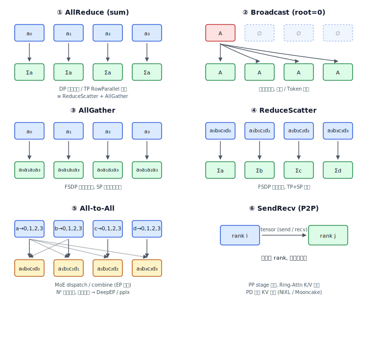
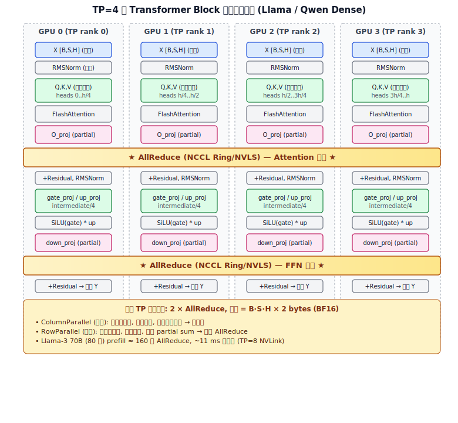
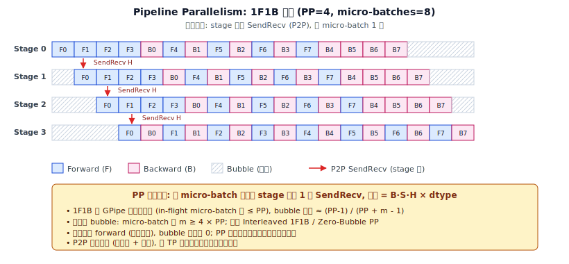
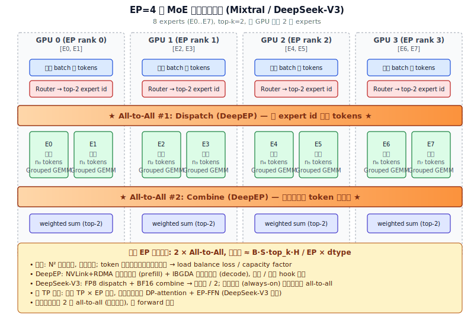
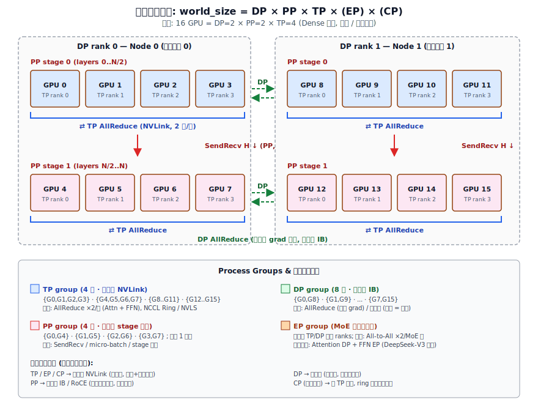

# 阶段 2｜并行策略与集合通信

> 一句话定位：把"集合通信原语 → 并行策略调用原语 → 开源模型的层级通信 → vLLM/SGLang 工程配置"打通成一条主线，让"并多少 GPU、走哪种原语、卡在哪条链路"三个问题在白板上就能答。
>
> 目标读者：需要把并行算法、NCCL/DeepEP 等通信库、以及实际推理引擎配置打通的工程师。

---

## 目录

- [2.0 为什么需要并行](#20-为什么需要并行)
- [2.1 集合通信原语基础](#21-集合通信原语基础)
- [2.2 并行策略与集合通信详解](#22-并行策略与集合通信详解)
- [2.3 开源模型 Attention / FFN / MoE 的层级通信剖析](#23-开源模型-attention--ffn--moe-的层级通信剖析)
- [2.4 多维并行组合与拓扑映射](#24-多维并行组合与拓扑映射)
- [2.5 推理 vs 训练：通信特征差异](#25-推理-vs-训练通信特征差异)
- [2.6 vLLM 的并行与通信实现](#26-vllm-的并行与通信实现)
- [2.7 SGLang 的并行与通信实现](#27-sglang-的并行与通信实现)
- [2.8 vLLM vs SGLang 对比与选型](#28-vllm-vs-sglang-对比与选型)
- [2.9 配置决策清单与常见踩坑](#29-配置决策清单与常见踩坑)
- [2.10 参考资料](#210-参考资料)

---

## 2.0 为什么需要并行

单卡显存（H100 80 GB / H200 141 GB / B200 192 GB）远不足以承载现代大模型：

| 模型规模 | 仅权重 (BF16) | 训练态 (~16×) | KV Cache (8K, batch=32) |
|---|---|---|---|
| 7 B | 14 GB | ~112 GB | ~4 GB |
| 70 B (GQA) | 140 GB | ~1.1 TB | ~10 GB |
| 405 B | 810 GB | ~6.5 TB | ~230 GB |
| 671 B MoE (DeepSeek-V3) | 1.3 TB | ~10 TB | ~50 GB |

并行的三大目标：**装得下 / 跑得快 / 省得多**。任何并行策略本质上都是在 **算力 / 显存 / 通信** 三者间换权重，而通信的实现就是底层的 **集合通信原语**。

---

## 2.1 集合通信原语基础

### 2.1.1 通信库与后端

| 库 | 适用场景 | 设备 | 关键能力 |
|---|---|---|---|
| **NCCL** (NVIDIA) | GPU 间集合通信事实标准 | NVIDIA GPU | Ring/Tree/NVLS allreduce、SHARP、PXN、IBGDA |
| **RCCL** (AMD) | NCCL 的 AMD 对应 | AMD GPU | 算法兼容 NCCL |
| **MPI** (OpenMPI / MPICH) | CPU/异构 | CPU+GPU | 经典 Bcast/Allreduce/Alltoall |
| **Gloo** (Meta) | PyTorch fallback | CPU/GPU | TCP/IB；GPU 上性能不如 NCCL |
| **NVSHMEM** | 单边显存访问 | NVIDIA GPU | OpenSHMEM 编程模型；DeepEP、CP 等高性能内核的底座 |
| **DeepEP** (DeepSeek) | MoE All-to-All | NVIDIA GPU | NVLink + RDMA + IBGDA 的 MoE 专用内核 |
| **pplx-kernels** | MoE All-to-All | NVIDIA GPU | 低延迟 decode 优化 |
| **Mooncake / NIXL** | KV 传输 | RDMA | PD 分离场景的 KV cache 跨节点传输 |

PyTorch 中的入口是 `torch.distributed`：
- `init_process_group(backend="nccl")` 在 GPU 上选 NCCL。
- `dist.all_reduce / all_gather / reduce_scatter / all_to_all / send / recv / broadcast`。

### 2.1.2 核心原语（含示意图）

下面把 7 个最常用的集合通信原语按 4 卡（rank 0/1/2/3）举例。先给出一张总览图：



> 蓝 = 输入分片，绿 = 输出，黄 = 重排后混合，红 = 单 root。
> 等价关系：**AllReduce ≡ ReduceScatter + AllGather**。

下面再用文字 / ASCII 复述一遍，便于在终端查阅。

#### Broadcast（广播）

```
rank0: [A]                    rank0: [A]
rank1: [ ]   ── Broadcast ──► rank1: [A]
rank2: [ ]    (root=0)        rank2: [A]
rank3: [ ]                    rank3: [A]
```
**用途**：参数初始化、配置同步。复杂度 O(N)。

#### Reduce / AllReduce（规约 / 全规约）

```
rank0: [a0]                       rank0: [a0+a1+a2+a3]
rank1: [a1]  ── AllReduce(SUM) ─► rank1: [a0+a1+a2+a3]
rank2: [a2]                       rank2: [a0+a1+a2+a3]
rank3: [a3]                       rank3: [a0+a1+a2+a3]
```
- **Reduce**：只在 root 上得到结果。
- **AllReduce = ReduceScatter + AllGather**（Ring 算法上）。
- **用途**：梯度聚合（DP）、TP 的 RowParallel 末尾合并部分和。
- **通信量**：Ring 算法下，每张卡发送/接收 `2(N-1)/N × M` 字节，M = 单卡张量大小。

#### AllGather（全收集）

```
rank0: [a0]                       rank0: [a0,a1,a2,a3]
rank1: [a1]  ── AllGather ──────► rank1: [a0,a1,a2,a3]
rank2: [a2]                       rank2: [a0,a1,a2,a3]
rank3: [a3]                       rank3: [a0,a1,a2,a3]
```
**用途**：FSDP/ZeRO-3 取回完整权重、SP 末尾恢复序列、CP 收集结果。

#### ReduceScatter（规约-散播）

```
rank0: [a0,b0,c0,d0]                  rank0: [a0+a1+a2+a3]
rank1: [a1,b1,c1,d1] ── ReduceScatter► rank1: [b0+b1+b2+b3]
rank2: [a2,b2,c2,d2]                  rank2: [c0+c1+c2+c3]
rank3: [a3,b3,c3,d3]                  rank3: [d0+d1+d2+d3]
```
**用途**：FSDP/ZeRO 的梯度归并、TP+SP 把 AllReduce 拆开后的前半。

> **关键等价**：`AllReduce(x) ≡ ReduceScatter(x) + AllGather(x)`。TP+SP 正是利用这个等价，把激活在 sequence 维上切分，从而摊薄激活显存。

#### All-to-All / All-to-All-v（全交换）

```
rank0: [a→0, a→1, a→2, a→3]               rank0: [a→0, b→0, c→0, d→0]
rank1: [b→0, b→1, b→2, b→3] ── All-to-All► rank1: [a→1, b→1, c→1, d→1]
rank2: [c→0, c→1, c→2, c→3]               rank2: [a→2, b→2, c→2, d→2]
rank3: [d→0, d→1, d→2, d→3]               rank3: [a→3, b→3, c→3, d→3]
```
- 等价于"全员转置"。每对 (i,j) 之间交换一个分片。
- **all-to-all-v**：每对的发送/接收长度不等（MoE token dispatch 必用）。
- **用途**：**MoE 的 token dispatch / combine**、序列并行换轴。
- **难点**：N² 对小消息，对延迟极敏感；DeepEP / pplx 就是专门优化这一原语。

#### Point-to-Point (Send / Recv)

```
rank_i: tensor ── Send ──► rank_j
rank_j: ──────── Recv ──── tensor
```
**用途**：**PP 在 stage 边界传隐状态**、Ring Attention 在 ring 上转 K/V、PD 分离传 KV cache。

#### Barrier（同步栅栏）

所有 rank 到达 barrier 后才能继续，无数据交换。调试/计时时常用，生产路径上应避免。

### 2.1.3 算法实现：Ring / Tree / NVLS

NCCL 同一个 API 背后会选择不同算法，理解算法有助于排查性能问题：

| 算法 | 适合 | 单卡通信量 | 特点 |
|---|---|---|---|
| **Ring AllReduce** | 大消息、带宽敏感 | `2(N-1)/N · M` | 节点内 NVLink 几乎线性扩展 |
| **Tree (Double Binary Tree)** | 小消息、延迟敏感 | `~2 log₂N · M` | 跨节点小张量更优 |
| **NVLS (NVLink SHARP)** | H100+ 节点内 | 接近 1×M | NVSwitch 内做"网内规约"，可省一半 |
| **CollNet / SHARP** | IB 网络支持 | 类似 NVLS | 跨节点的网内规约 |

实践经验：
- TP allreduce 在节点内一般走 NVLS/Ring；跨节点走 IB 后延迟暴涨，**TP 不要跨机**。
- 小张量（< 几十 KB）NCCL 会走 Tree，避免 Ring 的启动延迟。
- 多机训练用 `NCCL_ALGO=Tree/Ring/NVLS` 可以强制算法做对比。

### 2.1.4 通信复杂度速查表

| 原语 | NCCL Ring 单卡数据量 | 延迟项 | 典型用途 |
|---|---|---|---|
| Broadcast | M | O(log N) | 配置/参数下发 |
| Reduce | M | O(log N) | 监控/统计 |
| AllReduce | 2M(N-1)/N | O(N) Ring / O(log N) Tree | DP grad、TP act |
| AllGather | M(N-1)/N | O(N) | FSDP 权重、SP 恢复 |
| ReduceScatter | M(N-1)/N | O(N) | FSDP grad、SP 前半 |
| All-to-All | M(N-1)/N | O(N²) 消息 | MoE dispatch/combine |
| SendRecv | M | O(1) | PP、Ring-Attn |

M = 张量大小，N = 通信组规模。

---

## 2.2 并行策略与集合通信详解

下面对每种并行，列出 **前向 / 反向（如有） / 推理** 的精确通信序列。

> **阶段术语**（贯穿本章，每个子节末尾都会给出"阶段特征"）：
> - **训练 (Training)**：forward + backward + optimizer step。通信分两类——*激活相关*（TP / SP / CP / EP，每层都触发）与*梯度相关*（DP / FSDP，每 step 触发一次）。
> - **推理-prefill**：用户 prompt 一次性算 K/V，**大 batch × 长 seq**，算力受限 (compute-bound)；通信单条消息大、**带宽敏感**。
> - **推理-decode**：逐 token 自回归生成，**seq = 1**，访存与延迟受限 (memory- / latency-bound)；通信小消息密集、**启动延迟 (latency) 敏感**。
> - 推理无 backward，因此与"梯度同步"相关的通信（DP-AllReduce、ZeRO / FSDP 的 RS+AG）在推理路径 **完全消失**；只剩"激活相关"的那一组。
>
> **本章涉及的缩写**：
> - **DDP** = *Distributed Data Parallel*。PyTorch 的经典数据并行，每卡持有完整模型副本，反向后做一次 AllReduce 同步梯度。
> - **ZeRO** = *Zero Redundancy Optimizer*。DeepSpeed 提出的显存切分三阶段：ZeRO-1 切 optimizer state，ZeRO-2 再切 gradient，ZeRO-3 再切 parameter。
> - **FSDP** = *Fully Sharded Data Parallel*。PyTorch 官方实现，等价于 ZeRO-3——参数 / 梯度 / 优化器全部按 DP 维度切分；forward 前 `AllGather` 拉取本层完整权重用完即丢，backward 后 `ReduceScatter` 归并本卡负责的那一段梯度。它属于 DP 家族，**只用于训练**；推理几乎不用 FSDP（参数已能复制到每卡，没必要每层 AllGather）。

### 2.2.1 DP — Data Parallelism

每卡持有完整模型副本，batch 切 N 份。

```text
DDP:
  forward:   (no collective)
  backward:  AllReduce(grad)                ← 1 次/step
  step:      local optimizer

ZeRO-1 (optimizer 切):
  backward:  AllReduce(grad)
  step:      ReduceScatter 后本地更新自己那段 optimizer

ZeRO-2 (+gradient 切):
  backward:  ReduceScatter(grad)            ← 取代 AllReduce
  step:      local

ZeRO-3 / FSDP (+parameter 切):
  forward:   AllGather(W_layer) 进行计算，用完丢弃
  backward:  AllGather(W_layer) + ReduceScatter(grad_layer)
```

- DDP / ZeRO-1 通信量小、跨节点友好。
- ZeRO-3 / FSDP 把显存压到极致，但通信次数 ↑、对带宽敏感。

**阶段特征**：

| 阶段 | DP 组内通信 | 备注 |
|---|---|---|
| 训练 (DDP) | 每 step 1 × AllReduce(grad) | 跨节点 IB/RoCE 友好 |
| 训练 (ZeRO-2) | 每 step 1 × ReduceScatter(grad) | optimizer state 也已切分 |
| 训练 (ZeRO-3 / FSDP) | 每层 AllGather(W) + ReduceScatter(grad) | 通信次数 ∝ 层数，带宽吃紧 |
| 推理-prefill | **无通信** | DP 退化为"多副本扩容"，组间不通信 |
| 推理-decode | **无通信** | 同上；DP=N 等于 N 个独立 worker |

→ **FSDP 仅训练用**；推理基本只用最朴素的"复制副本"形态。

### 2.2.2 TP — Tensor Parallelism（Megatron 1D）

#### Attention 块（QKV/O）

```text
输入 X  shape=[B, S, H]   (在 TP 组内复制)

QKV = ColumnParallel(W_qkv):  W_qkv 按 head 维度切 (列切)
  Q,K,V_local = X @ W_qkv_local        ── 无通信
attention(Q,K,V)_local                  ── 每卡独立算自己负责的 heads
O = RowParallel(W_o): W_o 按 hidden 维切 (行切)
  partial = attn @ W_o_local
  ★ AllReduce(partial)    ← 这是 TP 在 Attention 的唯一通信
```

#### FFN 块（GLU 形式）

```text
gate = ColumnParallel(W_gate)(X)     ── 无通信
up   = ColumnParallel(W_up)(X)       ── 无通信
h    = SiLU(gate) * up               ── 本地
down = RowParallel(W_down)(h)
  ★ AllReduce(partial)    ← TP 在 FFN 的唯一通信
```

**每个 transformer block 的 TP 通信**：

| 阶段 | 通信原语 | 数据量 |
|---|---|---|
| Attention 末尾 | AllReduce | B·S·H × dtype |
| FFN 末尾 | AllReduce | B·S·H × dtype |
| 反向（训练） | 同样 2 次 AllReduce（梯度方向） | 同上 |

→ **每层 2 次 allreduce（推理）/ 4 次 allreduce（训练）**。这就是 TP 强烈要求 NVLink 域内的根本原因。

下面把"一层 forward"的通信序列画出来（TP=4，4 个 GPU 形成一个 TP 组）：



**阶段特征**：

| 阶段 | 每层 AllReduce 次数 | 单次消息大小 | 主要瓶颈 |
|---|---|---|---|
| 训练 forward | 2 | B·S·H × dtype | 带宽 |
| 训练 backward | 2 | B·S·H × dtype | 带宽 |
| 推理-prefill | 2 | B·S·H × dtype（S 较大） | **带宽**（吃满 NVLink） |
| 推理-decode | 2 | B·1·H × dtype（S=1，KB 级） | **NCCL 启动延迟** → 直接计入 TPOT |

→ 训练总共 4 次 / 层；推理只有 forward → 2 次 / 层。decode 的 AllReduce 因为消息极小，latency 主导，是大 TP 度（如 TP=8）下 decode 慢的根因；**TP 必须在 NVLink 域内**。

### 2.2.3 SP — Sequence Parallelism（与 TP 配套）

观察：LayerNorm / Dropout / Residual 这些算子在 TP 中是 **复制计算的**（全卡持有相同输入），但其激活也复制存放在每张卡上，浪费显存。

SP 把这些算子沿 sequence 维切分到 TP 组内，等价改写：

```text
原始 TP:
  X (复制 [B,S,H])  ──► LN ──► QKV(列切) ──► attn ──► O(行切, AllReduce) ──► Y(复制)

TP + SP:
  X_part [B,S/T,H]  ──► LN ──► AllGather(S 维) ──► X[B,S,H] ──► QKV ──► attn
                       ──► O(行切) ──► ReduceScatter(S 维) ──► Y_part [B,S/T,H]
```

**关键替换**：
```
AllReduce  ≡  ReduceScatter + AllGather
```
- 通信总量与纯 TP 完全一致。
- 但 LN/Dropout 的激活从 `[B,S,H]` 变成 `[B,S/T,H]`，激活显存 / T。

**阶段特征**：

| 阶段 | 是否启用 | 收益 |
|---|---|---|
| 训练（长上下文） | **必开** | 激活显存 / TP，是 32K+ 训练的前提 |
| 训练（短上下文） | 可选 | 收益不明显 |
| 推理-prefill | 偶尔开 | 长 prefill 时省激活；vLLM/SGLang 默认不开 |
| 推理-decode | 不开 | seq=1，激活本来就小，SP 反而多一对 RS+AG |

→ **训练长上下文必开 SP**；推理路径基本无收益。

### 2.2.4 PP — Pipeline Parallelism

层切到不同 stage，stage 间只走 **点对点 SendRecv**：

```text
stage k:  H_k = block_k(H_{k-1})         ── 本地计算
          send(H_k → stage k+1)          ── P2P
stage k+1: recv(H_k) → block_{k+1}(...)
```

- 每个 micro-batch 在每个 stage 边界做 1 次 SendRecv。
- 消息大小 = `B · S · H × dtype`，比 TP 的 AllReduce 小一阶。
- **跨机首选 PP**：点对点对 IB 带宽要求远低于 allreduce。

调度算法（GPipe → 1F1B → Interleaved 1F1B → Zero-Bubble PP）只影响 bubble 大小和激活峰值，**通信原语始终是 SendRecv**。

下面是 4-stage 1F1B 的调度示意（每个格子代表一个 micro-batch 的 forward / backward 计算槽位，灰色斜线区为流水线 bubble）：



**阶段特征**：

| 阶段 | 通信 | bubble | 主要价值 |
|---|---|---|---|
| 训练 | 每 micro-batch × stage 边界 1 × SendRecv（forward + backward 双向） | **必须处理**，配 1F1B / Interleaved / Zero-Bubble | "装下"超大模型 + 跨节点扩展 |
| 推理-prefill | 同上但只有 forward 方向 | ≈ 0（仅一次 forward） | 跨节点装下模型（如 Llama-3 405B） |
| 推理-decode | 每个 token 串行穿过所有 stage | ≈ 0 | **TPOT × PP 倍数放大** → 一般不用，除非配 PD 分离 / chunked-prefill |

→ PP 是"装得下"的工具，不是"跑得快"的工具：训练靠 micro-batch 摊销 bubble；推理 prefill 影响小，**decode 端会显著拉高每 token 时延**，因此生产推理一般 PP=1 或 PP=2。

### 2.2.5 EP — Expert Parallelism（MoE 核心）

MoE 层结构：

```text
X [B,S,H] ──► Router(top-k)
              │
              ▼
        每个 token 选 k 个 expert
              │
              ▼
  ★ All-to-All #1 (Dispatch): 把 token 路由到拥有目标 expert 的卡
              │
              ▼
    每张卡上：Grouped GEMM 对收到的 token 跑各自的 expert
              │
              ▼
  ★ All-to-All #2 (Combine): 把结果送回原 token 所在的卡
              │
              ▼
        加权求和得到最终输出
```

通信复杂度：每个 MoE 层 **2 次 all-to-all**，消息大小 ≈ `B · S · top_k · H / EP × dtype`。

**为什么 all-to-all 是性能杀手**：
1. N² 对消息，启动延迟随 N² 增长。
2. 单条消息小（KB 级），带宽利用率低。
3. token 在 expert 上分布不均 → 负载倾斜 → 慢卡拖整体。

**社区优化方向**：
- **DeepEP**（DeepSeek 开源）：
  - **prefill 路径**：NVLink + RDMA，吞吐优先，使用 `dispatch_async / combine_async`。
  - **decode 路径**：IBGDA（GPU 直发 IB 包绕过 CPU），延迟 < 200 µs 量级。
  - 内核与 Grouped GEMM 融合。
- **pplx-kernels**：低延迟 decode 优化，与 DeepEP 思路相近。
- **冗余专家 / Expert Replication**：热门专家复制多份缓解倾斜。

MoE 一层 forward 的通信序列：



**阶段特征**：

| 阶段 | 每 MoE 层 All-to-All 次数 | 推荐内核 | 主要瓶颈 |
|---|---|---|---|
| 训练 forward | 2 (dispatch + combine) | DeepEP normal (NVLink + RDMA) | 带宽 + 负载均衡 |
| 训练 backward | 2（路径反向，对称） | 同上 | 同上 |
| 推理-prefill | 2 | **DeepEP normal**（高吞吐） | 带宽；token 分布不均时慢卡拖累 |
| 推理-decode | 2 | **DeepEP low-latency** (IBGDA, 绕过 CPU) | **启动延迟** (~100~300 µs/次)，直接计入 TPOT |

→ 训练每 MoE 层共 4 次 All-to-All；推理只有 forward → 2 次。**prefill 和 decode 用的内核是不同的**：vLLM `VLLM_ALL2ALL_BACKEND=deepep_high_throughput` 走 prefill 路径，`=deepep_low_latency` 走 decode 路径。

### 2.2.6 CP — Context / Sequence Parallelism（长序列）

也叫 **Ring Attention**：把序列在 CP 组内切成 N 段，每卡只持有 `S/N` 的 Q/K/V。

```text
卡 i 持有 Q_i, K_i, V_i  (sequence 分片)

for step in 0..N-1:
    attn_local = FlashAttention(Q_i, K_recv, V_recv)
    accumulate to O_i
    ★ SendRecv(K, V) → 下一个 ring 邻居      ← Ring 通信
```

- 每层 1 圈 SendRecv（N-1 次），每次消息 `B·S/N·H × dtype`。
- 与 Flash Attention 配合可把单层激活从 O(S²) 压到 O(S²/N)。
- **CP 与 TP 正交**：可以同时存在，先 TP 切 head，再 CP 切序列。

下面是 CP=4 的 Ring Attention 通信示意：


**阶段特征**：

| 阶段 | 每层 SendRecv 次数 | 单次消息 | 是否常用 |
|---|---|---|---|
| 训练（长上下文） | CP-1 圈，每圈每卡 1 × SendRecv | B·S/CP·H × dtype | **标配**（Llama-3 长上下文训练、Megatron-LM） |
| 推理-prefill（长上下文） | CP-1 | B·S/CP·H × dtype | 当单卡装不下完整 K/V 时启用 |
| 推理-decode | 0（seq=1，无需切序列） | — | **不启用**；decode 阶段每 token 只对 K/V cache 做点积 |

→ CP 服务于"K/V 太长一张卡装不下"的场景：训练 / prefill 都可能触发；decode 因为新 token 只有一个，K/V 已经分散在各卡的 cache 里，**无需 ring 通信**。

### 2.2.7 总结表：每种并行的通信原语对应

| 并行 | 主要原语 | 训练（每 step / 每层） | 推理-prefill | 推理-decode |
|---|---|---|---|---|
| **DP / DDP** | AllReduce(grad) | 1 × AllReduce / step | — | — |
| **ZeRO-2** | ReduceScatter(grad) | 1 × RS / step | — | — |
| **ZeRO-3 / FSDP** | AllGather(W) + ReduceScatter(grad) | 每层 1×AG + 1×RS | — | — |
| **TP** | AllReduce ×2 / 层（激活） | forward 2 + backward 2 = 4 / 层 | 2 × AllReduce / 层（大消息，带宽敏感） | 2 × AllReduce / 层（KB 级，**延迟敏感**） |
| **TP+SP** | RS + AG（替换 TP 的 AR） | 通信量同 TP，激活显存 /T | 同 TP，激活 /T | 同 TP，激活 /T（收益小） |
| **PP** | SendRecv (P2P) | 每 micro-batch × stage 边界，含 bubble | forward 方向 1 次 / stage，bubble≈0 | 串行穿过全部 stage，**TPOT 放大** |
| **EP** | All-to-All ×2 / MoE 层 | forward 2 + backward 2 = 4 / MoE 层 | 2 × A2A（DeepEP **normal**，带宽） | 2 × A2A（DeepEP **low-latency**，~100 µs） |
| **CP / Ring-Attn** | SendRecv (ring) | (CP-1) × SendRecv / 层 | (CP-1) × SendRecv / 层 | 0（seq=1） |

> "—" 表示推理阶段该原语不触发（梯度同步只属于训练）。

---

### 2.2.8 ZeRO 与 FSDP 深入（DP 的内存分片扩展）

§2.2.1 给过 DDP / ZeRO 1/2/3 / FSDP 的通信原语对照。本节进一步回答三个工程问题：**每一档具体省了多少显存？FSDP1 与 FSDP2 API 怎么选？`FULL_SHARD` vs `HYBRID_SHARD` 在多节点上谁更稳？**

#### 2.2.8.1 ZeRO 三档：分片对象与显存账

混合精度训练（BF16 forward + FP32 主权重 + Adam 优化器）下，**每个参数**的显存开销（DDP baseline）：

| 项目 | 字节 / param | 说明 |
|---|---|---|
| BF16 参数（forward 用） | 2 | 与权重等长 |
| BF16 梯度 | 2 | backward 后 |
| FP32 主权重 | 4 | 优化器更新基准 |
| FP32 Adam momentum (m) | 4 | 一阶矩 |
| FP32 Adam variance (v) | 4 | 二阶矩 |
| **合计** | **16** | |

`16 × num_params` 加上激活就是单卡显存——LLaMA-2-70B 单卡裸需 **1.12 TB**，**完全装不下**。ZeRO 把上面这 16 字节按 DP 度 N 切分：

| 方案 | 切谁（DP 度 N 分片） | 单卡 byte/param | LLaMA-70B、N=8 | 通信代价（vs DDP） |
|---|---|---|---|---|
| **DDP** | 不切 | 16 | 1120 GB ❌ | baseline：每 step 1 × `AllReduce(grad)` |
| **ZeRO-1** | 优化器状态（m, v, FP32 主权重）= 12 字节 | `4 + 12/N` | 5.5 × 70 = **385 GB** | `AllReduce(grad)` → `ReduceScatter(grad)` |
| **ZeRO-2** | + 梯度（再 +2 字节） | `2 + 14/N` | ≈ **263 GB** | 同 ZeRO-1 |
| **ZeRO-3 / FSDP** | + 参数（再 +2 字节），全部切 | `16/N` | **140 GB** | 每层 +1 × `AllGather(W)`；backward +1 × `ReduceScatter(grad)` |

> 上面 byte/param 假设激活 / temporary buffer 不分片；实际还要叠 activation checkpointing（阶段 7 详讲）。

两条直觉：

- **ZeRO-1 / 2 通信几乎免费**——总通信量与 DDP 同数量级，只是 `AllReduce` 换成 `ReduceScatter`；
- **ZeRO-3 通信次数 ∝ 层数**——LLaMA-70B 80 层 → 每 step `80 × AllGather + 80 × ReduceScatter`，**跨节点 IB 上是性能杀手**（这是 §2.2.8.3 `HYBRID_SHARD` 出现的原因）。

#### 2.2.8.2 FSDP1 vs FSDP2：API 与性能差异

FSDP 是 PyTorch 官方实现的 ZeRO-3。**目前两套并存**：

| 维度 | FSDP1 | FSDP2 |
|---|---|---|
| **API 入口** | `from torch.distributed.fsdp import FullyShardedDataParallel`，**类包装** | `from torch.distributed.fsdp import fully_shard`，**函数式原地改 module** |
| **参数分片单位** | **Flat parameter**：把多个 `nn.Parameter` 拍平成一个大张量切分 | **Per-parameter**：每个 `nn.Parameter` 独立切分 |
| **与 TP / PP / CP 组合** | 困难——flat param 与 TP 切轴冲突 | 顺滑——per-param 直接与 `DTensor` 共存 |
| **mixed precision 配置** | `MixedPrecision(param_dtype=..., reduce_dtype=...)` | `MixedPrecisionPolicy` 显式配 |
| **checkpoint** | 必须切 `SHARDED_STATE_DICT` 才有分片 ckpt | `torch.distributed.checkpoint` 原生支持 |
| **性能** | Reshard / AllGather 串行较多 | **重叠更彻底**，~10–20% 加速 |
| **PyTorch 版本** | ≥ 1.11，稳定 | ≥ 2.4，**新项目首选** |
| **维护状态** | Legacy，仍 bug-fix | 主推方向 |

最小调用对比：

```python
# ============ FSDP1：包装类 ============
from torch.distributed.fsdp import FullyShardedDataParallel as FSDP1
from torch.distributed.fsdp import ShardingStrategy, MixedPrecision

model = FSDP1(
    model,
    sharding_strategy=ShardingStrategy.FULL_SHARD,
    mixed_precision=MixedPrecision(param_dtype=torch.bfloat16,
                                   reduce_dtype=torch.float32),
)

# ============ FSDP2：函数式原地改 ============
from torch.distributed.fsdp import fully_shard, MixedPrecisionPolicy

mp_policy = MixedPrecisionPolicy(param_dtype=torch.bfloat16,
                                 reduce_dtype=torch.float32)
for layer in model.layers:
    fully_shard(layer, mp_policy=mp_policy)        # 每层独立 shard
fully_shard(model, mp_policy=mp_policy)            # 整体 shard
```

**新项目无脑 FSDP2**——尤其是要和 TP / PP 组合时。FSDP1 仅用于维护老项目。

#### 2.2.8.3 ShardingStrategy：`FULL_SHARD` vs `HYBRID_SHARD`

`ShardingStrategy` 4 个枚举的工程含义：

| 枚举 | 等价于 | 分片范围 | 跨节点通信 | 适用 |
|---|---|---|---|---|
| `FULL_SHARD` | ZeRO-3 | 全 DP world | **高**（每层 AllGather + ReduceScatter 跨网） | 单节点 / 节点内 NVLink 充足 |
| `SHARD_GRAD_OP` | ZeRO-2 | 同上但不切参数 | 中（只 grad 跨网） | 通信吃紧但显存够 |
| `HYBRID_SHARD` | ZeRO-3 + DP 混合 | **节点内 FULL_SHARD + 节点间 DP 复制** | **低**（节点间只 `AllReduce(grad)`） | **多节点训练的实战首选** |
| `_HYBRID_SHARD_ZERO2` | ZeRO-2 混合 | 节点内 ZeRO-2 + 节点间 DP | 更低 | 极致带宽节省 |

**`HYBRID_SHARD` 的核心思想**：节点内 NVLink 900 GB/s 双向，跑 `FULL_SHARD` 的密集 AllGather 没问题；节点间 IB 50 GB/s 单链路，每层都跨网 AllGather 撑不住。**节点内分片省显存、节点间复制走 DDP 风格通信**——这是 8 节点以上 H100 训练的标准姿势。

```python
# FSDP2 + HYBRID_SHARD 示例
from torch.distributed.device_mesh import init_device_mesh

mesh = init_device_mesh(
    "cuda", (num_nodes, gpus_per_node),
    mesh_dim_names=("replicate", "shard"),
)
for layer in model.layers:
    fully_shard(layer, mesh=mesh)        # 自动按 mesh 维度做 hybrid
```

#### 2.2.8.4 工程要点（5 条）

1. **混合精度三个 dtype**：`param_dtype`（forward 用，通常 BF16）、`reduce_dtype`（梯度 reduce 用，**通常 FP32** 防数值漂移）、`buffer_dtype`。BF16 训练 `reduce_dtype=FP32` 是默认且必要——回阶段 0 §0.2.4 的 BF16 与 FP32 同指数范围讨论。
2. **与 activation checkpointing 组合**：FSDP 省的是参数 / 梯度 / 优化器；激活的显存得靠 checkpointing。两者正交，**生产配置必须同时开**。
3. **checkpoint 格式**：FSDP2 默认走 `torch.distributed.checkpoint`，每张卡保存自己负责的 shard + metadata，恢复时支持改 world size。FSDP1 必须切 `SHARDED_STATE_DICT`，否则会先 AllGather 整个模型到 rank 0（70B 直接 OOM）。
4. **与 TP / PP / CP 组合**：FSDP2 + DTensor 是 TorchTitan、Llama-3 训练栈的标准组合。FSDP 切 DP 维度、TP 切 hidden 维度、PP 切层、CP 切 sequence——**四维独立、自由组合**。详见阶段 7 训练框架章节。
5. **小模型不要上 FSDP**：< 13B 单卡装得下时，DDP 或 ZeRO-1 已足够；FSDP 的 per-layer AllGather 开销盖过显存收益。

> 推理几乎不用 FSDP（参数本来就能复制到每卡，每层 AllGather 是浪费）；**FSDP 是训练栈的事，推理走 TP / PP**。阶段 6 推理引擎不会再回到 FSDP。

---

## 2.3 开源模型 Attention / FFN / MoE 的层级通信剖析

本节用 4 个有代表性的开源模型，把"一层 forward 一次"的通信序列写清楚。

### 2.3.1 Llama-3 / Qwen2.5（Dense + GQA）

结构：`RMSNorm → GQA → Residual → RMSNorm → SwiGLU FFN → Residual`，重复 N 层。

Llama-3 70B 关键超参：`H=8192, num_heads=64, num_kv_heads=8, intermediate=28672`。

#### 仅 TP=8 的一层通信序列（推理 prefill）

```text
[Input X: B,S,H 在 TP 组内复制]

1. RMSNorm(X)                                  ── 本地
2. QKV proj (ColumnParallel, 按 head 切)
     - q_proj: [H, num_heads*head_dim]   → 切到每卡 8 个 q heads
     - k_proj: [H, num_kv_heads*head_dim] → 切到每卡 1 个 kv head
     - v_proj: [H, num_kv_heads*head_dim] → 切到每卡 1 个 kv head
   ── 无通信
3. RoPE + FlashAttention                        ── 本地
4. O proj (RowParallel)                         ── partial sum
   ★ AllReduce  ← 通信 #1, size = B·S·H·2B (BF16)
5. Residual + RMSNorm                           ── 本地
6. FFN: gate_proj/up_proj (ColumnParallel)      ── 无通信
7. SiLU(gate)*up                                 ── 本地
8. down_proj (RowParallel)
   ★ AllReduce  ← 通信 #2, size = B·S·H·2B
9. Residual                                     ── 本地
```

**80 层 Llama-70B 推理一次** = 160 次 AllReduce。
- 假设 B=1, S=2048, H=8192 → 单次 AllReduce = 32 MB。
- TP=8 节点内 NVLink (900 GB/s 双向): 单次 ≈ 70 µs。
- 80 层 × 160 次 × 70 µs ≈ 11 ms 纯通信，prefill 总时延的 20~30%。

**TP=8 + SP** 训练时通信序列：

```text
... RMSNorm 之前: X_part [B, S/8, H]
  → ★ AllGather(S 维) → X [B,S,H]
  → QKV ColumnParallel
  → Attn ... RowParallel
  → ★ ReduceScatter(S 维) → Y_part [B, S/8, H]
  → Residual + RMSNorm 都在 S/8 分片上做
```

→ 通信原语数量不变（仍 2 次/块），但激活显存 / 8。

#### GQA 对 TP 的关键约束

```
num_kv_heads = 8 (Llama-70B / Qwen-72B 大都如此)
TP_size ≤ 8 (KV head 数)
```

如果 TP=16，**KV head 不够分**，需要复制 KV（vLLM/SGLang 支持 `head_repeat`），但会降低收益。

### 2.3.2 Mixtral-8x7B（Dense Attention + Sparse MoE）

结构：Attention 部分与 Llama 完全相同；FFN 替换为 8 专家、top-2 的 MoE。

```
8 experts, top_k=2, expert_intermediate=14336
```

#### EP=8 + DP=1 配置（每张卡 1 个 expert，常见）

一层 forward 通信：

```text
[Attention 部分: 与 Llama 一致, 1 次 AllReduce(TP)]

MoE 部分:
1. Router: linear 输出 8 logits, top-2 softmax       ── 本地
2. permute: 按 expert id 排序                         ── 本地
3. ★ All-to-All #1 (dispatch)
   ranks 间互发本卡 token 中要去对方 expert 的部分
4. Grouped GEMM (本卡专家的所有 token)
5. ★ All-to-All #2 (combine)
6. 加权 (top-2 权重) + residual                       ── 本地
```

**两类 token 路径**：
- "目标 expert 就在本卡" → 走本地 fast path，不进 all-to-all。
- 跨 EP rank 的 → 进 all-to-all。

**通信量估算**（B=1, S=2048, top_k=2, H=4096, EP=8）：
- 每次 all-to-all 数据量 ≈ S·top_k·H·2B ≈ 32 MB（最坏情况均匀分布）。
- 8 卡 all-to-all 在 NVLink 域内通常 100~300 µs。

#### TP × EP 组合

Mixtral 也可以 **TP=2, EP=4**：把每个 expert 内部再做 TP 切。Attention 走 TP=2，FFN 走 TP=2 的 EP=4。这种组合下每层通信：
- 1 次 Attention AllReduce (TP=2)
- 1 次 dispatch all-to-all (EP=4)
- 1 次 expert 内 FFN AllReduce (TP=2)（如果对 expert 内做 TP）
- 1 次 combine all-to-all (EP=4)

实践中 **Attention DP + FFN EP** 的组合在推理上更优（见 2.3.4）。

### 2.3.3 Qwen2-MoE / 14B-A2B

结构：64 个细粒度专家 + 4 个共享专家（shared experts always-on）。

通信模式与 Mixtral 类似，多出一项：

```text
... router + dispatch (all-to-all)
... expert GEMM (routed) + shared expert GEMM (本地，无通信)
... combine (all-to-all)
... 加权: alpha * routed + beta * shared
```

**共享专家不进入 all-to-all**，等价于在 MoE 层里塞了一个 Dense FFN 的"垫底"，缓解 router 抖动。它的通信处理与 Llama FFN 相同（TP 下 1 次 AllReduce，DP 下 0 次）。

### 2.3.4 DeepSeek-V3（MLA + MoE + 共享专家 + 多 token 预测）

DeepSeek-V3 是当前最复杂的开源 MoE，每层的通信路径需要仔细拆。

**结构**：
- **MLA (Multi-Latent Attention)**：把 KV 压成低秩 latent，KV head 维退化。
- **MoE 部分**：256 个 routed experts，top-8；1 个 shared expert（always-on）。
- 前 3 层 Dense FFN，后面才是 MoE。

#### 推理标杆配置：Attention DP + FFN EP（8 卡机器）

```
TP=1, DP=8 (attention 部分), EP=8 (MoE 部分)
```

**一层 forward 通信序列**：

```text
[Input 在 DP rank 内本地，每卡持有自己 batch 的 X]

MLA Attention (DP, 不切)
1. RMSNorm                                    ── 本地
2. q_a_proj, kv_a_proj_with_mqa (低秩降维)    ── 本地
3. RoPE on rope 部分                          ── 本地
4. q_b_proj, kv_b_proj (升回 head 维)         ── 本地
5. FlashAttention                             ── 本地
6. o_proj                                     ── 本地
       ▶ 注意：DP 下 attention 完全本地，0 通信
7. Residual + RMSNorm                         ── 本地

MoE FFN (EP=8)
8. Shared expert FFN                          ── 本地 (相当于 Dense FFN)
9. Router → top-8 of 256
10. Permute by expert id
11. ★ All-to-All #1 (dispatch)
       使用 DeepEP, prefill 走 NVLink+RDMA, decode 走 IBGDA
12. Grouped GEMM × 本卡 32 个 experts
13. ★ All-to-All #2 (combine)
14. Unpermute + 加权 (top-8 + shared)        ── 本地
15. Residual                                  ── 本地
```

**全层通信只有 MoE 的 2 次 all-to-all**！与"纯 TP=8"方案的 2 次 AllReduce 相比：
- All-to-all 数据量随 top_k 增大，但 EP=8 时每对消息小、走 NVLink/IB 友好。
- KV cache **不被切分**（每张卡有完整 KV，DP 副本独立），单卡 KV 容量 ×8，对长上下文 / 高并发友好。

#### DeepSeek-V3 引入的关键通信原语优化

- **DeepEP normal kernel (prefill)**：NVLink-rank 通过 SM-copy，IB-rank 通过 NVSHMEM async PUT；**计算 / 通信通过 hook 重叠**。
- **DeepEP low-latency kernel (decode)**：纯 IBGDA，绕过 CPU；针对 decode 阶段单 token 派发优化到 ~100 µs 量级。
- **FP8 dispatch**：dispatch 时用 FP8，combine 时用 BF16，all-to-all 数据量 / 2。

#### DP-Attention + EP-MoE 部署拓扑图（单机 8 H100/H200）


> 这张图把 DeepSeek-V3 的"**Attention 不并行（每卡完整 + DP 复制 batch）+ MoE 走 EP（256 experts 均分 8 卡）**"组合策略在物理 GPU 上的映射完整呈现：所有跨 GPU 通信只剩 MoE 层的两次 All-to-All，attention 路径完全本地化，从而把整机 KV cache 容量推到极限。

### 2.3.5 一张大表：典型开源模型的层级通信开销

假设 BF16，batch=1，sequence=2048，节点内 8 卡 NVLink。

| 模型 | 配置 | 每层通信原语 | 每层数据量 | 备注 |
|---|---|---|---|---|
| Llama-3 8B | TP=1 | — | 0 | 单卡 |
| Llama-3 70B | TP=8 | AllReduce ×2 | 2 × 32 MB | GQA, kv_heads=8 卡到顶 |
| Llama-3 405B | TP=8, PP=2 | AllReduce ×2 + SendRecv ×1 | 2 × 64 MB + 64 MB | 跨机走 PP |
| Qwen2.5-72B | TP=8 | AllReduce ×2 | 2 × 32 MB | 与 70B 同构 |
| Mixtral-8x7B | TP=1, EP=8 | All-to-All ×2 | 2 × ~16 MB | Attention 本地 |
| Mixtral-8x7B | TP=2, EP=4 | AllReduce ×1 + All-to-All ×2 | 16+16+16 MB | TP+EP 混合 |
| DeepSeek-V3 | TP=1, DP=8, EP=8 | All-to-All ×2 | 2 × ~28 MB | MLA, attention 本地, DeepEP |
| DeepSeek-V3 | + FP8 dispatch | All-to-All ×2 | 2 × ~14 MB | combine 仍 BF16 |

可以清楚看到一个趋势：**MoE 时代主要通信成本从 AllReduce 转向 All-to-All**，这也是 DeepEP / pplx-kernels 出现的根本原因。

---

## 2.4 多维并行组合与拓扑映射

### 2.4.1 组合公式与约束

```
world_size = DP × TP × PP × EP × CP
```

每个维度都有不同的通信特征：

| 并行 | 主要原语 | 同步性 | 跨节点容忍度 | 推荐分配域 |
|---|---|---|---|---|
| TP | AllReduce | 强同步 | 差 | NVLink 内（节点内） |
| EP | All-to-All | 强同步、N² 消息 | 差 | NVLink 内 + 高速 RDMA |
| CP | SendRecv (ring) | 较强 | 中 | 节点内或同 RDMA 域 |
| SP | RS + AG | 与 TP 同步 | 跟随 TP | 同 TP |
| PP | SendRecv | 异步可重叠 | 好 | 节点间 IB/RoCE |
| DP | AllReduce | 可压缩/异步 | 最好 | 最外层 |

下面这张图把多维并行的 **GPU 拓扑映射、process group 划分、通信原语** 三者打通——这是整篇文档的核心框架视图：



### 2.4.2 典型组合（训练 + 推理）

```text
GPT-3 175B 训练       : DP × TP × PP
Llama-3 405B 训练     : FSDP × TP × PP × CP
DeepSeek-V3 训练      : DP × TP × PP × EP   (官方还用了 ZeRO-1)
DeepSeek-V3 推理      : DP × EP             (Attention DP + FFN EP)
长上下文推理 (>128K)  : TP × CP
```

### 2.4.3 拓扑感知映射经验

NVIDIA 节点内拓扑（典型 HGX H100 8 卡）：

```
        ┌───────────────────────────┐
        │    NVSwitch (900 GB/s)     │
        └──┬──┬──┬──┬──┬──┬──┬──┬──┘
           │  │  │  │  │  │  │  │
          G0 G1 G2 G3 G4 G5 G6 G7
           │              │
       NIC0 (IB 400G)  NIC1 ...
```

把 rank 映射到 GPU 时按 **(DP, PP, CP, TP, EP)** 由外到内排，让通信最重的 TP/EP 落到同一台机的 NVLink 域内。NCCL 的 `NCCL_TOPO_FILE` 与 `CUDA_VISIBLE_DEVICES` 是控制这个映射的关键。

---

## 2.5 推理 vs 训练：通信特征差异

| 维度 | 训练 | 推理 |
|---|---|---|
| 反向 | 有 → DP AllReduce 必需 | **无** → 显存 / 通信都更轻 |
| 通信主旋律 | DP AllReduce（梯度）+ TP AllReduce（激活）+ EP All-to-All | TP AllReduce + EP All-to-All（无梯度 AR） |
| Batch | 静态、大 | **动态、不均**（continuous batching） |
| 显存大头 | 优化器 + 激活 | **KV Cache** |
| 关键指标 | MFU, TGS | TTFT, TPOT, 并发数 |
| PP bubble | 必须处理 | 推理只有前向，bubble ≈ 0 |
| 并行偏好 | 多维（5D 都用上） | 倾向 TP + EP + DP（PP 主要用于"装下"） |

**关键洞察**：
- 推理的 prefill 与 decode **通信特征不同**：
  - prefill：大 batch、长 seq → all-to-all/allreduce 数据量大，带宽敏感。
  - decode：每步只 1 个 token、batch 大但 seq=1 → 小消息、**延迟敏感**。
- 这才催生了 **PD 分离**：让 prefill 集群偏 TP（吃算力），decode 集群偏 DP/EP（吃 KV 容量 + 低延迟 all-to-all 内核）。

---

## 2.6 vLLM 的并行与通信实现

### 2.6.1 并行 CLI 速查

```bash
--tensor-parallel-size N        # TP
--pipeline-parallel-size M      # PP
--data-parallel-size K          # DP（V1 引擎）
--enable-expert-parallel        # EP
```

总 GPU 数 = K × N × M（EP 与 DP/TP 复用同样的 ranks，靠 process group 切分）。

### 2.6.2 通信后端配置

vLLM 通过环境变量切换通信路径：

| 变量 | 取值 | 说明 |
|---|---|---|
| `NCCL_ALGO` | `Ring` / `Tree` / `NVLS` | NCCL 算法选择 |
| `NCCL_NVLS_ENABLE` | `1` | 开启 NVLink SHARP allreduce |
| `NCCL_IB_HCA` | `mlx5_0,mlx5_1` | 多卡 IB 绑定 |
| `VLLM_ALL2ALL_BACKEND` | `naive` / `pplx` / `deepep_high_throughput` / `deepep_low_latency` | MoE all-to-all 后端 |
| `VLLM_USE_FLASHINFER_MOE` | `1` | 走 FlashInfer 的 MoE 内核 |

### 2.6.3 典型部署示例

```bash
# Llama-3 70B：单机 8 卡 TP
vllm serve meta-llama/Llama-3.1-70B-Instruct \
  --tensor-parallel-size 8 \
  --max-model-len 8192

# Llama-3 405B：双机 16 卡，节点内 TP=8，节点间 PP=2
vllm serve meta-llama/Llama-3.1-405B-Instruct \
  --tensor-parallel-size 8 \
  --pipeline-parallel-size 2

# DeepSeek-V3：单机 8 卡，DP=8 attention + EP=8 + DeepEP
export VLLM_ALL2ALL_BACKEND=deepep_low_latency
vllm serve deepseek-ai/DeepSeek-V3 \
  --data-parallel-size 8 \
  --tensor-parallel-size 1 \
  --enable-expert-parallel
```

### 2.6.4 vLLM 通信路径源码定位（便于排查）

- `vllm/distributed/parallel_state.py`：所有 process group（tp/pp/dp/ep）的创建。
- `vllm/distributed/communication_op.py`：`tensor_model_parallel_all_reduce / all_gather / reduce_scatter` 的 wrapper。
- `vllm/model_executor/layers/fused_moe/`：MoE 层 + all-to-all 后端切换。
- `vllm/distributed/device_communicators/pynccl.py`：NCCL 直接调用。

---

## 2.7 SGLang 的并行与通信实现

### 2.7.1 并行 CLI 速查

```bash
--tp N                        # TP
--dp N                        # DP
--ep-size N                   # EP
--enable-dp-attention         # MoE: 关掉 Attention 的 TP, 走 DP
--enable-deepep-moe           # 启用 DeepEP all-to-all
--moe-dense-tp-size N         # 控制 Dense FFN 部分的 TP
--disaggregation-mode prefill|decode      # PD 分离
--disaggregation-transfer-backend nixl|mooncake
```

### 2.7.2 DeepSeek-V3 标杆配置（单机 8 H100/H200）

```bash
python -m sglang.launch_server \
  --model-path deepseek-ai/DeepSeek-V3 \
  --tp 8 \
  --enable-dp-attention \
  --ep-size 8 \
  --enable-deepep-moe
```

通信路径：
- Attention：DP=8（attention 本地，无通信）。
- MoE：每层 2 次 DeepEP all-to-all（NVLink，~100 µs/次）。
- 共享专家：本地（带 TP=8 时仍是 RowParallel + AllReduce；带 dp-attention 时通常本地）。

### 2.7.3 PD 分离部署

```bash
# Prefill 节点（偏 TP / 算力）
python -m sglang.launch_server --model-path <MoE> \
  --tp 8 \
  --disaggregation-mode prefill \
  --disaggregation-transfer-backend nixl

# Decode 节点（偏 DP / EP / KV 容量）
python -m sglang.launch_server --model-path <MoE> \
  --tp 8 --enable-dp-attention --ep-size 8 --enable-deepep-moe \
  --disaggregation-mode decode \
  --disaggregation-transfer-backend nixl
```

KV 通过 **NIXL / Mooncake** 走 RDMA 在两个集群之间传输，本质上是一次跨机 SendRecv（点对点，但用了零拷贝、IBGDA 等优化）。

### 2.7.4 SGLang 通信路径源码定位

- `python/sglang/srt/distributed/`：process group 与原语 wrapper。
- `python/sglang/srt/layers/moe/`：MoE 层、DeepEP 集成。
- `python/sglang/srt/disaggregation/`：PD 分离的 KV 传输。

---

## 2.8 vLLM vs SGLang 对比与选型

| 维度 | vLLM | SGLang |
|---|---|---|
| TP / PP | 成熟 | 成熟 |
| DP（engine 内） | V1 完善 | 早期就有 |
| EP + DeepEP | V1 集成 | 一等公民、调优更深 |
| Attention DP（MoE） | 支持 | `--enable-dp-attention` 默认推荐 |
| 通信原语切换 | `VLLM_ALL2ALL_BACKEND` | `--enable-deepep-moe` 等开关 |
| PD 分离 | KV connector 进行中 | NIXL/Mooncake 较成熟 |
| 前缀复用 | Prefix Caching | RadixAttention（更通用） |
| 生态 | 最广 | MoE 标杆 + 研究友好 |

**选型建议**：
- Dense 70B/405B → **vLLM**（成熟稳定）。
- DeepSeek-V3 / 极致 MoE 吞吐 → **SGLang**。
- 高频结构化输出（JSON / function calling）→ **SGLang**（编程 API 更顺手）。
- 长上下文 + 多并发 → 两者都行，主要看 CP 支持成熟度。

---

## 2.9 配置决策清单与常见踩坑

### 2.9.1 决策清单

按顺序回答即可定下并行拓扑：

1. **单卡能装下完整权重 + 一份 KV?** 能 → 起步 `TP=1`，副本扩。
2. **节点内 NVLink 带宽够吗?** H100 NVLink 900 GB/s → 直接吃满 TP（≤ kv_heads，≤ 8）。
3. **单机仍装不下?** 走 PP 跨机，**节点内 TP=8、节点间 PP=N**。
4. **是 MoE 模型?** → `Attention DP + FFN EP`，必开 DeepEP / pplx。
5. **上下文 ≥ 64K?** → 评估 CP / chunked prefill。
6. **同时要极致 TTFT 和极致吞吐?** → 上 PD 分离。

### 2.9.2 常见踩坑（含通信视角）

| 现象 | 根因 | 解决 |
|---|---|---|
| 启动直接报错 "num_heads % tp != 0" | TP 不能整除 head 数 | 改小 TP，或开 head 复制 |
| GQA 模型 TP=16 性能比 TP=8 差 | KV head 不够（kv_heads=8），TP 之后做复制反而增通信 | TP ≤ kv_heads |
| 跨机 TP TTFT 暴涨 | AllReduce 走 IB | 拆为节点内 TP + 节点间 PP |
| MoE decode 慢，profile 看 all-to-all 占 60%+ | 默认 NCCL all-to-all 路径 | 切换 `deepep_low_latency` / `pplx` |
| MoE 单卡 KV cache 撑不住并发 | TP 切碎了 KV | 改 `DP + EP`，开 `--enable-dp-attention` |
| PP 训练 bubble 占 30%+ | micro-batch 数太少 | m ≥ 4 × PP，或换 1F1B / Zero-Bubble |
| NCCL allreduce 偶发 hang | 不同 rank 进入 collective 顺序不同 | 检查 chunked prefill / spec decoding 的兼容性 |
| FSDP 训练带宽打不满 | 默认 `RING` 算法、小张量 | `NCCL_ALGO=Tree`，开 NVLS（`NCCL_NVLS_ENABLE=1`） |
| MoE 训练 token 分布严重不均 | Router collapse | 加 load balance loss / capacity factor / dropless |

### 2.9.3 性能排查的通信视角

通信问题排查顺序：
1. `nvidia-smi nvlink -gt` / `ibstat`：物理链路对不对。
2. `NCCL_DEBUG=INFO`：算法、拓扑、QP 选择是否合理。
3. `nsys profile`：看 NCCL kernel 名称（`ncclAllReduce_RING_LL` / `ncclAllToAll`）和占比。
4. 与理论值对比：AllReduce 理想耗时 ≈ `2(N-1)/N · M / 带宽`。
5. EP 场景下额外看 `dispatch / combine` kernel 名（`ep_dispatch_xxx`）以及 token 分布直方图。

---

## 2.10 参考资料

- Megatron-LM (Shoeybi+ 2019)：TP / SP 开山。
- GPipe / PipeDream / Zero-Bubble PP：PP 调度演进。
- DeepSpeed ZeRO 1/2/3、PyTorch FSDP：DP 维度的显存优化。
- Ring Attention (Liu+ 2023)：CP 理论基础。
- DeepSeek-V3 Technical Report + DeepEP：MoE 训练 + 推理通信内核。
- NCCL 文档与 `NCCL_DEBUG` 输出。
- vLLM 官方文档 + V1 设计文档 + `vllm/distributed/`。
- SGLang 官方文档 + DeepSeek-V3 部署指南 + PD 分离 RFC。
