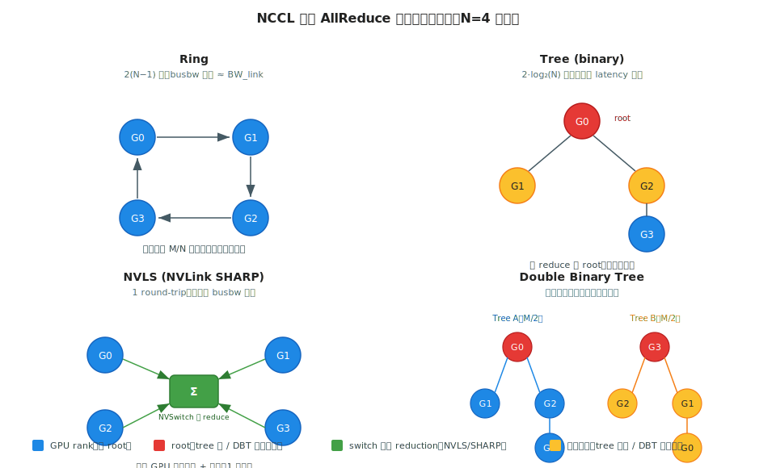
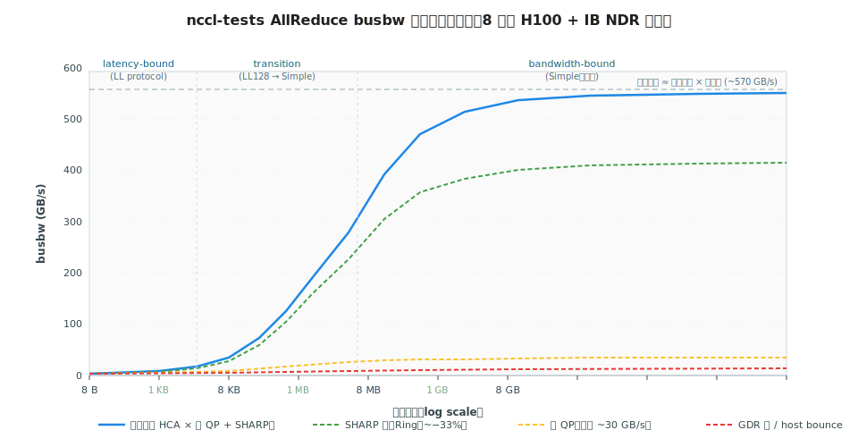

# 阶段 3｜集合通信与高性能通信库 ✓

> 一句话定位：把"七大原语 → NCCL/NVSHMEM/DeepEP 怎么实现这些原语 → 实际拓扑下怎么调 → PD 分离的 KV 走哪条物理线"打通成一条主线，让你看到一段 `NCCL_DEBUG=INFO` 输出时能立刻判断瓶颈在算法、库还是物理链路。

## 目录

- [3.0 为什么需要这一层](#30-为什么需要这一层)
- [3.1 核心概念与术语](#31-核心概念与术语)
- [3.2 原语与算法深入（A 类）](#32-原语与算法深入a-类)
- [3.3 NCCL 工程调优（A 类）](#33-nccl-工程调优a-类)
- [3.4 单边通信与 MoE 优化：NVSHMEM + DeepEP（A 类）](#34-单边通信与-moe-优化nvshmem--deepepa-类)
- [3.5 PD 分离的 KV 传输（A 类专题）](#35-pd-分离的-kv-传输a-类专题)
- [3.6 通信库横向对比与选型（B 类收尾）](#36-通信库横向对比与选型b-类收尾)
- [3.7 各通信库深度档案](#37-各通信库深度档案)
- [3.8 推理侧重点：Prefill vs Decode 通信特征](#38-推理侧重点prefill-vs-decode-通信特征)
- [3.9 下一步：通信库的发展方向](#39-下一步通信库的发展方向)
- [3.10 最小可运行示例：nccl-tests 微基准](#310-最小可运行示例nccl-tests-微基准)
- [3.11 常见坑与 FAQ](#311-常见坑与-faq)
- [3.12 延伸阅读](#312-延伸阅读)

---

## 3.0 为什么需要这一层

阶段 2 的 §2.1 已经把七大原语和 Ring/Tree/NVLS 的算法骨架讲过了。**为什么还要单独留一章？**

因为原语只是 API 形状，真正决定生产环境性能的是下面这些东西：

- 同一个 AllReduce，在 8 节点 H100 集群上：用 Ring algo 走 IB 是 ~200 GB/s busbw，开启 SHARP + Tree algo 后能到 ~320 GB/s——差 60%，但默认参数下 NCCL 不会自动切到 Tree。
- 同一个 All-to-All，MoE 推理时用 NCCL 走 normal kernel 是 ~50 μs 延迟，换 DeepEP 的 low-latency kernel 是 ~8 μs——但 DeepEP 要求 IBGDA 启用，PCIe 拓扑、HCA 数量、IB switch 配置全得对。
- PD 分离推理把 KV 从 prefill 节点传到 decode 节点：走 NCCL 单 QP 是 ~30 GB/s，走 NIXL / Mooncake 的多 QP + multi-rail 能到 ~280 GB/s——差一个数量级。
- 同样的 `nccl-tests allreduce_perf` 命令，没 `numactl` 绑核：算出来的 busbw 比真实生产低 20%——这数字一旦写进调优报告，所有后续判断都跟着歪。

这些坑都是阶段 2 不展开、但**阶段 6（推理引擎）/ 阶段 7（训练框架）/ 阶段 9（MoE 专题）/ 阶段 11（profiling）** 都会反复踩到的。这一章把它们一次性集中讲清楚。

读完之后你应当能：

1. 看到一段 `NCCL_DEBUG=INFO` 输出，立刻判断走的是 Ring / Tree / NVLS 哪种 algo、用了 NVLink 还是 IB、有没有走 SHARP；
2. 给一台机器的 `nvidia-smi topo -m` 和一段 NCCL 配置，预判 busbw 上限大致到哪；
3. 在 NCCL / NVSHMEM / DeepEP / MSCCL++ 几个库里，按场景（dense AllReduce / MoE all-to-all / KV 单向拷贝）选对工具；
4. 跑 `nccl-tests` 把 busbw 曲线测对，并能解释为什么小消息阶段 algbw 低、大消息阶段会饱和到某个具体数值。

---

## 3.1 核心概念与术语

阶段 2 §2.1.2 的原语介绍偏"原语长什么样"——本章术语表偏"NCCL 怎么把这些原语映射到硬件、怎么调"。

| 缩写 | 全称 | 一句话 |
|---|---|---|
| algbw | Algorithm Bandwidth | 消息大小 / 总耗时；用户视角带宽 |
| busbw | Bus Bandwidth | algbw × 拓扑修正系数（Ring AR 为 `2(N−1)/N`），逼近物理链路上限，**调优时只看这个** |
| QP | Queue Pair | RDMA 连接的最小单元（send queue + recv queue），多 QP 才能跑满单条 IB 链路 |
| WQE | Work Queue Element | 一次 RDMA 请求描述符，CPU 或 GPU 都可以 post |
| GDR | GPUDirect RDMA | HCA 直接 DMA 显存，bypass CPU 与 host 内存 |
| IBGDA | IB GPUDirect Async | GPU kernel 内直接 post WQE、无需 CPU 中转；DeepEP 的物理底座 |
| SHARP | Scalable Hierarchical Aggregation and Reduction Protocol | Mellanox switch 内做 reduction，少一轮跨节点往返 |
| NVLS | NVLink SHARP | NVSwitch 内做 reduction，节点内 AllReduce 用它能省一半 NVLink 流量 |
| PXN | PCIe X NUMA | NCCL 跨 NUMA 时让远端 NIC 经 NVLink 中转，避免 PCIe 跨 socket |
| DBT | Double Binary Tree | NCCL 的 tree 算法变体，小消息延迟低于 ring |
| Rail | Rail | 节点内 1 张 GPU + 它直连的那张 HCA 的组合；rail-optimal 路由要求"同 rail 不跨 hop" |
| One-sided | 单边通信 | 写入方不需要对方调用对应 recv（NVSHMEM 风格） |
| Two-sided | 双边通信 | 必须配对的 send/recv（MPI、NCCL p2p） |
| `NCCL_ALGO` | NCCL 环境变量 | 选 algo：`Ring` / `Tree` / `NVLS` / `NVLSTree` / `CollnetDirect` / `CollnetChain` |
| `NCCL_PROTO` | NCCL 环境变量 | 选 protocol：`Simple` / `LL`（低延迟）/ `LL128`（小消息超低延迟）|
| RCCL | ROCm CCL | AMD 的 NCCL 等价物，API 兼容 |
| HCCL | Huawei CCL | 昇腾的 NCCL 等价物 |
| MSCCL / MSCCL++ | Microsoft CCL | 算法可编程的 NCCL 兼容层，Azure 自用 |

> 物理传输路径记号约定（贯穿本章）：
> - 节点内：`GPU_src → NVLink → GPU_dst`
> - 节点间：`GPU_src → NIC_src → IB → NIC_dst → GPU_dst`（启用 GDR）
> - 节点间（无 GDR）：`GPU_src → PCIe → host_mem → NIC_src → IB → NIC_dst → host_mem → PCIe → GPU_dst`（多 2 次 PCIe 拷贝 + 2 次 host bounce，延迟翻倍）

---

## 3.2 原语与算法深入（A 类）

阶段 2 §2.1.3 给出了 Ring / Tree / NVLS "它们大概长什么样"的图。本节回答两个工程问题：**给定消息大小和节点数，NCCL 会自动选哪种？为什么 busbw 曲线长那个形状？**

### 3.2.1 四种算法的物理直觉



四种算法在小消息（latency 限）和大消息（bandwidth 限）两端有不同最优，**NCCL 的 algo+protocol 选择本质就是按消息大小、拓扑、节点数在这几条曲线上找上包络**。

| 算法 | 步数 | 每步通信量 | busbw 上限 | 最适合 |
|---|---|---|---|---|
| Ring | 2(N−1) | M/N | `BW_link` | 大消息、节点内 NVLink、跨节点 IB |
| Tree (binary) | 2·log₂(N) | M（root 处） | 小于 ring，但 latency 项是 log N | 小消息、跨多机 |
| NVLS | 1 round-trip via switch | M（switch 内做 reduce） | 接近 `2 × BW_link`（上下行同时跑满） | 节点内、Hopper + 第三代 NVSwitch |
| Double Binary Tree | log₂(N) | M/2 each tree | 接近 `BW_link`、且 latency 比 ring 低 | 中等消息、多机 |

### 3.2.2 Ring 的 busbw 推导（必须掌握）

Ring AllReduce 把 M 字节切成 N 份，**reduce-scatter** 阶段 N−1 步，每步每张卡发收 M/N 字节；**all-gather** 阶段同样 N−1 步。总耗时：

$$T \;=\; \frac{2(N-1)}{N} \cdot \frac{M}{BW_{\text{link}}}$$

因此 algbw = M / T = `N / (2(N−1)) · BW_link`；按 NCCL 的定义 busbw = algbw × `2(N−1)/N` = `BW_link`。

**这就是 Ring 的关键结论**：busbw 上限就是单条链路带宽，**拓扑修正系数把卡数消掉了**。实测时 busbw 达到链路带宽的 75–90% 就算正常（剩下被 launch overhead、tail latency、协议开销吃掉）。

> busbw 是调优的标尺，algbw 不是——algbw 随 N 缩小，看上去"越多卡越慢"，是误导；busbw 跟 N 无关，反映"链路用得满不满"。

### 3.2.3 Protocol：Simple / LL / LL128

algo 之下还有 protocol 选择，决定数据怎么切包、同步用什么机制：

| Protocol | 切包粒度 | 同步方式 | 适用范围 |
|---|---|---|---|
| `Simple` | 大 chunk、无 flag | 显式 barrier | 大消息（≥ ~1 MB），追求吞吐 |
| `LL` (low-latency) | 8B data + 8B flag 交错 | flag 驱动，无 barrier | 小消息（< ~16 KB），延迟敏感 |
| `LL128` | 128B data + 8B flag | flag 驱动 | 中等消息，NVLink 常用 |

直觉：LL 用 flag 同步避免 barrier 固定开销，但每 8B 数据要带 8B flag，**有效带宽减半**——只在小消息上划算。生产里 `NCCL_DEBUG=INFO` 看到 `LL128` 多半在节点内 NVLink，`Simple` 多半是节点间 IB 大消息。

### 3.2.4 NCCL 怎么自动选

NCCL 内部维护一张"消息大小 × algo × protocol → 预测耗时"的代价模型（源码 `src/graph/tuning.cc` 的 `ncclTopoTuneModel`）。简化规则：

1. **消息很小（< 几 KB）**：`Tree + LL`，延迟优先
2. **消息中等（几十 KB – MB）**：节点内 `Ring + LL128`；跨多机 `Tree + Simple`
3. **消息很大（≥ MB）**：`Ring + Simple`，吞吐优先
4. **有 NVSwitch + NVLS 支持**：节点内 AllReduce 切到 `NVLS`，吞吐翻倍
5. **有 IB SHARP**：跨节点切到 `CollnetDirect` / `CollnetChain`，省一轮跨网往返

可以用环境变量强制：`NCCL_ALGO=Tree NCCL_PROTO=LL`。但**默认选择 90% 是对的**——除非能复现一个明确 case 证明自动选错了，不要乱改，否则会在某些消息大小区间反而变慢。

> NCCL 源码导览（后续 §3.3 调优会回来）：
> - `src/graph/tuning.cc` — algo/proto 代价模型
> - `src/collectives/` — 各 collective 的 host 入口
> - `src/device/` — 实际 CUDA kernel
> - `src/transport/` — NVLink / PCIe / IB / SHM 的物理路径选择

---

## 3.3 NCCL 工程调优（A 类）

NCCL 默认配置 **90% 是对的**，但**剩下 10% 一旦踩到，性能掉一半都不止**。本节按"看懂日志 → 环境变量分类 → 三类高级特性 → 症状到旋钮"四步走。

### 3.3.1 看懂 `NCCL_DEBUG=INFO` 的输出

设 `NCCL_DEBUG=INFO`（或 `WARN` 更安静、`TRACE` 更详细）后，每个 communicator 初始化会打印一段，关键几行长这样：

```
ip-10-0-0-1:12345:12389 [0] NCCL INFO Channel 00/24 :    0   1   2   3   4   5   6   7
ip-10-0-0-1:12345:12389 [0] NCCL INFO Channel 00 :    0[1c1d0] -> 1[2d1d0] via P2P/IPC
ip-10-0-0-1:12345:12389 [0] NCCL INFO Channel 00 :    7[ad1d0] -> 8[1c1d0] via NET/IB/0/GDRDMA
ip-10-0-0-1:12345:12389 [0] NCCL INFO Connected all rings, NVLS Tree
ip-10-0-0-1:12345:12389 [0] NCCL INFO Using non-device net plugin version 0
```

关键字段速读：

| 关键字 | 含义 | 异常信号 |
|---|---|---|
| `Channel NN/MM` | 第 NN 条 channel，共 MM 条 | H100 上 MM < 16 说明拓扑分析有问题 |
| `via P2P/IPC` | 同节点 GPU 直连，走 NVLink + `cudaIpcMemHandle` | 节点内应该全是这个 |
| `via SHM` | 同节点 GPU 走 host shared memory | **不该出现**，说明 P2P 没开 |
| `via NET/IB/0/GDRDMA` | 跨节点，IB HCA 0，启用了 GPUDirect RDMA | 缺 `GDRDMA` 字样说明 GDR 没启 |
| `Connected all rings, NVLS Tree` | algo 选了 NVLS + Tree | 若是单纯 `Ring` 则 NVLS 没用上 |
| `Using non-device net plugin` | 走标准 plugin | `Using IBGDA` 才是 IBGDA |

**第一道排查纪律**：性能不对，先 `export NCCL_DEBUG=INFO` 跑一次，把上述 4 行扫一眼——80% 的问题在这里就暴露了。

### 3.3.2 环境变量分类速查

按"调试 → 拓扑 → 算法 → 网络 → 高级特性"五类整理生产最常碰的旋钮：

**调试类（必会）**

| 变量 | 默认 | 用途 |
|---|---|---|
| `NCCL_DEBUG` | `WARN` | `INFO` 看 channel / 连接；`TRACE` 看每次 collective |
| `NCCL_DEBUG_SUBSYS` | (all) | 过滤子系统，如 `INIT,COLL,TUNING` |
| `NCCL_DEBUG_FILE` | stderr | 重定向到文件，pattern 如 `nccl-%h-%p.log` |

**拓扑类**

| 变量 | 用途 |
|---|---|
| `NCCL_TOPO_FILE` | 手动塞 XML 拓扑（云上 vGPU、自动探测失败时） |
| `NCCL_TOPO_DUMP_FILE` | 让 NCCL 把探测到的拓扑写出来供检查 |
| `NCCL_P2P_LEVEL` | `LOC` / `PHB` / `PXB` / `PIX` / `NVL`，限定 P2P 走多深的桥 |
| `NCCL_P2P_DISABLE=1` | 强制关 P2P，调试用——**生产不要设** |

**算法 / 协议类**

| 变量 | 用途 |
|---|---|
| `NCCL_ALGO` | `Ring` / `Tree` / `NVLS` / `NVLSTree` / `CollnetDirect` / `CollnetChain` |
| `NCCL_PROTO` | `Simple` / `LL` / `LL128` |
| `NCCL_NCHANNELS_PER_PEER` | 增加并发 channel，跑满 NVLink |
| `NCCL_MIN_NCHANNELS` / `NCCL_MAX_NCHANNELS` | 限定 channel 上下界 |

**网络 / IB 类**

| 变量 | 用途 |
|---|---|
| `NCCL_IB_HCA` | 指定 HCA，如 `mlx5_0,mlx5_1,mlx5_2,mlx5_3`；多 HCA 用逗号 |
| `NCCL_IB_GID_INDEX` | RoCE 通常设 3 |
| `NCCL_IB_DISABLE=1` | 强制走 TCP，调试用 |
| `NCCL_IB_QPS_PER_CONNECTION` | 每条 IB 链路开几个 QP；单流跑不满时调到 4–8 |
| `NCCL_IB_SPLIT_DATA_ON_QPS` | 数据切到多 QP 上并发 |
| `NCCL_NET_GDR_LEVEL` | GDR 启用阈值：`LOC` / `PIX` / `PXB` / `PHB` / `SYS` |
| `NCCL_SOCKET_IFNAME` | 控制走哪张以太网卡，多网卡环境**必设** |

**高级特性**

| 变量 | 用途 |
|---|---|
| `NCCL_COLLNET_ENABLE=1` | 启用 IB SHARP（需 switch + HCA + SHARP daemon 全部支持） |
| `NCCL_NVLS_ENABLE=1` | 启用 NVLink SHARP（Hopper + 第三代 NVSwitch 默认已开） |
| `NCCL_IBEXT_DISABLE=0` | 启用 IBGDA（需新 NCCL + 驱动） |
| `NCCL_CROSS_NIC` | 控制 ring 是否跨 NIC，0 = rail-optimal |

> 完整列表见 NCCL 官方 [`docs/env.rst`](https://docs.nvidia.com/deeplearning/nccl/user-guide/docs/env.html)，本表只列生产最常碰的。

### 3.3.3 三类高级特性：SHARP / PXN / IBGDA

这三个名字在调优 PR 里反复出现，但很多人没真正理解它们各自解决了什么。

**SHARP（Scalable Hierarchical Aggregation Reduction Protocol）**

- **解决什么**：跨节点 AllReduce 默认要"先 reduce-scatter 跨网一遍、再 all-gather 跨网一遍"。SHARP 让 **IB switch 本身参与 reduction**——数据上行到 switch 就直接 reduce 完下发，省一遍跨网。
- **要求**：Mellanox Quantum / Quantum-2 switch + 兼容 HCA + 集群部署 SHARP daemon + `NCCL_COLLNET_ENABLE=1`。
- **收益**：8 节点 H100 AllReduce 实测 busbw **+40~60%**，节点数越多越明显。
- **NVLS = NVLink SHARP**：同思路下放到节点内 NVSwitch，Hopper + 第三代 NVSwitch 默认就开。

**PXN（PCIe × NUMA）**

- **解决什么**：跨节点通信时，如果当前 GPU 的 NIC 在另一颗 socket 上，默认会走 PCIe 跨 QPI，带宽腰斩。PXN 让流量**先经 NVLink 到本 NUMA 内一张"有近端 NIC"的 GPU**，再从那张 GPU 的 NIC 出网。
- **要求**：节点内有 NVLink 互联（NVSwitch 全互联机型自动满足）。
- **收益**：在 `NODE` / `SYS` 拓扑的机器上能把跨网带宽从 ~25 GB/s 救回到 ~45 GB/s。
- **验证**：`NCCL_DEBUG=INFO` 看到 `via P2P/PXN/IB` 字样即生效。

**IBGDA（InfiniBand GPUDirect Async）**

- **解决什么**：传统 GDR 只是"网卡直接读写显存"，但**post WQE（发起一次 RDMA 请求）这步还在 CPU 上**——每次 collective 都要往返 CPU，对小消息延迟极不友好。IBGDA 让 **GPU kernel 直接 post WQE**，CPU 彻底退出热路径。
- **要求**：MLNX\_OFED ≥ 5.6、CUDA ≥ 11.8、NCCL ≥ 2.18、HCA 支持 DCT、`NCCL_IBEXT_DISABLE=0`。
- **收益**：小消息 all-to-all 延迟从 ~50 μs 降到 ~8 μs——**这是 DeepEP（§3.4）能跑出 low-latency 的物理底座**。
- **代价**：占用 GPU SM 资源 post WQE，**大消息吞吐场景反而可能略低**——不是越开越好。

### 3.3.4 典型 case：从症状到旋钮

| 症状 | 第一步看什么 | 大概率原因 | 调整 |
|---|---|---|---|
| 节点内 AllReduce busbw 只到 ~200 GB/s（H100 期望 ~400+） | `NCCL_DEBUG=INFO` 是否出现 `via SHM` | P2P/IPC 没启（ACS 没关 / `nvidia-peermem` 没装） | 关 ACS、`modprobe nvidia-peermem`、检查 `/dev/nvidia-uvm` |
| 跨节点 AllReduce 比理论低 30% | 是否只出现 `NET/IB/0`（单 HCA） | 没用上多 HCA | `NCCL_IB_HCA=mlx5_0,mlx5_1,mlx5_2,mlx5_3` |
| 大消息 busbw OK，小消息延迟高 | protocol 是否 `Simple` | 小消息没切到 `LL` | 通常默认会切；若没切，升 NCCL 版本 |
| 出现 `via NET/IB/0` 但**无** `GDRDMA` 字样 | `nvidia-peermem` 是否装 | GDR 没启 | `modprobe nvidia-peermem`、看 `dmesg \| grep peer` |
| MoE all-to-all 延迟极高 | 是否走 IBGDA | 没启 IBGDA | 装新 NCCL + MLNX\_OFED，`NCCL_IBEXT_DISABLE=0` |
| 多节点 AllReduce 不随节点数 scale | 是否 `CollnetDirect/Chain` | SHARP 没启 | `NCCL_COLLNET_ENABLE=1`，确认 SHARP daemon 跑了 |
| 单条 IB 链路只跑到 ~30 GB/s（NDR 期望 ~45） | 看 `NCCL_IB_QPS_PER_CONNECTION` | 单 QP 跑不满 | 设 `=4` 或 `=8` + `NCCL_IB_SPLIT_DATA_ON_QPS=1` |

> 排查纪律：**先看 `NCCL_DEBUG=INFO`，再动环境变量**。乱试一通参数往往把本来好的也调坏。

---

## 3.4 单边通信与 MoE 优化：NVSHMEM + DeepEP（A 类）

§3.2–3.3 讲的都是 NCCL 提供的高层 collective。这一节走到 NCCL **下面**——介绍单边通信原语 **NVSHMEM**，以及它在 MoE 推理里的专用封装 **DeepEP**。两者其实是"原语 + 应用"的关系：DeepEP 把 NVSHMEM 的 put / IBGDA 组装成一个 MoE 专用的 all-to-all。

### 3.4.1 单边通信：从 send/recv 到 put/get

传统 send / recv 是 **双边模型**：发送方调 `send`，接收方必须**配对地**调 `recv`，两边对齐才能完成一次传输。这模型在三种场景里很别扭：

1. **接收方不知道什么时候来数据**：要么 busy-wait（浪费 SM），要么开 worker 线程轮询。
2. **每对 send/recv 有 metadata 协商开销**：who / what size / where。
3. **MoE 路由动态、各卡发送数据量参差不齐**：预先约定 recv buffer 很麻烦。

**单边模型**把"对齐"砍掉了：发送方直接 `put` 到对方显存的指定地址，接收方什么都不用做——**网络硬件 + GPU 显存就是 shared memory**。接收方需要数据时去 `get`，或由 sender 触发一个 flag 通知。

> 类比：双边像电话（必须两边同时拿起），单边像 dropbox（写进去就完事）。

### 3.4.2 NVSHMEM 编程模型

NVSHMEM = "NVIDIA SHared MEMory"——把 OpenSHMEM 单边模型搬到 GPU。核心 API 极简：

```cuda
// 所有 PE 上都用 nvshmem_malloc 分配对称缓冲
int *dest_buf = (int*) nvshmem_malloc(N * sizeof(int));

__global__ void put_and_flag(int *dest_buf, int *src_buf, int peer_pe) {
    // 把本卡 src_buf 写到 peer_pe 那张 GPU 的 dest_buf（同地址）
    nvshmem_int_put(dest_buf, src_buf, N, peer_pe);
    nvshmem_quiet();                       // 等所有写入落地
    nvshmem_int_p(&flag, 1, peer_pe);      // 触发对方读取
}
```

四个必须建立的概念：

| 概念 | 一句话 |
|---|---|
| **PE (Processing Element)** | 每张 GPU 一个 PE，编号 0..N−1 |
| **Symmetric memory** | 所有 PE 上分配同样大小、同样虚地址的缓冲（`nvshmem_malloc`）；远端写入只要给对方 PE 号 + 本地偏移 |
| **put / get / atomic** | 三种操作；put 是写远端，get 是读远端，atomic 是 fetch-and-op |
| **quiet / fence** | 完成性保证；`quiet` 等所有未完成操作落地，`fence` 是更轻的 ordering |

NVSHMEM 与 NCCL 的分工：

- **NCCL**：高层标准 collective（AllReduce、AllGather…），内部底层会选 NVLink IPC / SHM / IB；本质仍是双边模型。
- **NVSHMEM**：底层 put / get 单边原语，**适合写自定义 kernel**（如 DeepEP、distributed FlashAttention）。
- **两者并存**：标准 AllReduce 走 NCCL；自定义 P2P 路径走 NVSHMEM。

### 3.4.3 DeepEP：MoE All-to-All 专用 kernel

MoE 推理 / 训练的核心通信是两次 all-to-all：

- **Dispatch**：每张卡按 top-k 路由表把 token 发到对应 expert 所在 GPU；
- **Combine**：把 expert 输出按原路由收回到 token 所在 GPU。

NCCL 自带的 all-to-all 在 MoE 场景有两个硬伤：

1. **延迟高**：MoE 一次 forward 是 N 层 × 2 次 all-to-all，单次几十 μs，累加 ms 量级——对 decode TTPOT 是大头。
2. **变长数据浪费**：NCCL `AllToAllv` 按"最大块"对齐，token 分布不均时浪费带宽。

DeepEP 是 DeepSeek 开源的 MoE 专用 all-to-all kernel，**底层走 NVSHMEM put + IBGDA**，绕开 NCCL collective 开销。两种模式：

| 模式 | 物理路径 | 延迟（典型） | 适用场景 |
|---|---|---|---|
| **Normal** | NVLink 节点内 + NCCL 风格跨节点 | ~50 μs | 大 batch prefill、训练 |
| **Low-latency** | **IBGDA**——GPU kernel 内直接 post WQE，CPU 不参与 | **~8 μs** | decode 阶段、batch < 64 |

Low-latency 模式的 ~8 μs 直接对应 §3.3.3 讲过的 IBGDA 物理收益——**这就是为什么 §3.3 强调 IBGDA 是 DeepEP 的底座**。

DeepEP 的关键设计：

- **Dispatch / Combine 拆成两个独立 kernel**，可以与本卡 expert 计算 overlap；
- **基于 NVSHMEM 对称缓冲**，绕开 NCCL communicator 建立和拆解开销；
- **细粒度 token-level 调度**，每张卡只发自己被路由到的 expert，**不做 padding 对齐**。

最小调用骨架：

```python
import deep_ep

# group: PyTorch 进程组；预分配 NVLink + RDMA 缓冲
buffer = deep_ep.Buffer(group, num_nvl_bytes, num_rdma_bytes)

# 1) Dispatch：把本卡 hidden_states 按 topk 路由发出去
recv_hidden, recv_topk_idx, recv_topk_weights, handle = buffer.dispatch(
    hidden_states, topk_idx, topk_weights, num_experts
)

# 2) 本卡跑被分配到的 expert
expert_out = run_local_experts(recv_hidden, recv_topk_idx)

# 3) Combine：把 expert 输出按原路由收回
combined = buffer.combine(expert_out, handle)
```

源码导览：`deep_ep/buffer.py`（Python 入口）、`csrc/kernels/intranode.cu`（节点内 NVLink）、`csrc/kernels/internode.cu`（跨节点 IBGDA）。

### 3.4.4 选型直觉：NCCL / NVSHMEM / DeepEP 各自何时用

| 场景 | 工具 | 理由 |
|---|---|---|
| 标准 dense AllReduce / AllGather | NCCL | 默认就是最优，不要替换 |
| MoE 推理 dispatch / combine | **DeepEP**（normal 或 low-latency 按 batch 选） | 比 NCCL all-to-all-v 快 5–10× |
| MoE 训练 dispatch / combine | DeepEP normal 或 NCCL all-to-all-v | 训练 batch 大，normal 已够 |
| 自定义跨 GPU kernel（如 distributed FlashAttention、Ring Attention） | NVSHMEM 直接调 | 需要细粒度 put / fence 控制 |
| PD 分离的 KV 单向传输 | NIXL / Mooncake / LMCache（§3.5） | 这些库内部也基于 NVSHMEM 思路 |
| KV cache 跨节点点对点拷贝 | NVSHMEM `put` 或 NCCL `send/recv` | 看是否需要 GPU kernel 内主动触发 |

> 一句话区分：**NCCL** 是高层标准 collective，**NVSHMEM** 是底层单边原语，**DeepEP** 是 NVSHMEM 在 MoE 场景的专用化封装——三者**不冲突，分层共存**。

---

## 3.5 PD 分离的 KV 传输（A 类专题）

PD 分离（Prefill / Decode Disaggregation）是阶段 5 调度器和阶段 6 推理引擎的主线话题。本节只聚焦它的**通信侧**：**KV cache 从 prefill 节点搬到 decode 节点这条线，怎么走？谁来走？走多快？**

### 3.5.1 为什么 KV 传输变成关键路径

传统 vLLM v0 / SGLang 部署里，prefill 和 decode 跑在同一组 GPU 上，KV cache 留在原地，下一步直接读。PD 分离把它们拆到不同硬件：

- **Prefill 节点**：算力多，kernel 偏 compute-bound，跑完 prompt 后产出整段 KV
- **Decode 节点**：偏 memory-bound，持续读 KV 生成 token，追求低 TTPOT

两边分别在不同节点上跑，**KV 必须从 prefill 节点搬到 decode 节点**，decode 才能开始。这段传输直接计入用户感知的 TTFT——**是 PD 分离能否打赢非分离方案的胜负手**。

体量估算（LLaMA-3-70B GQA，prompt 8192）：

$$\text{KV} \;=\; 2 \times L \times 2 \times B \times S \times H_{kv} \times d \;=\; 2 \times 80 \times 2 \times 1 \times 8192 \times 8 \times 128 \;\approx\; 2.68 \text{ GB}$$

每次 prefill 完产生 2–3 GB KV，要在毫秒级搬完。按 IB NDR 单链路 50 GB/s 算理论 ~60 ms；**实测往往跑到 200 ms+ 才达标**——差的根因都在通信层：单 QP 跑不满、走 host bounce、协议头开销、没 multi-rail。

### 3.5.2 物理传输路径的几个选项

KV 从 prefill GPU 显存到 decode GPU 显存有 4 条线，**性能差一个数量级**：

| 路径 | 延迟级别 | 带宽（H100 + IB NDR） | 备注 |
|---|---|---|---|
| `GPU → host → object storage → host → GPU` | s 级 | < 1 GB/s | 对象存储 fallback，不可接受 |
| `GPU → host pinned → IB（无 GDR）→ host pinned → GPU` | 100 ms 级 | ~10 GB/s | PCIe + 主机内存往返两次（host bounce），传统路径 |
| `GPU → IB HCA → IB → IB HCA → GPU`（GDR + 单 QP） | 10 ms 级 | ~30 GB/s | GPUDirect RDMA 启用但只用单 QP，单流跑不满 NDR |
| `GPU → 多 HCA × 多 QP × multi-rail → GPU` | **ms 级** | **~280 GB/s** | rail-optimal + multi-QP + 多 HCA 并发 |

直觉：**多 HCA × 多 QP × multi-rail 才能榨出节点的全部出网带宽**。一个 8 卡 H100 节点有 8 张 NDR HCA，总带宽 3.2 Tb/s = 400 GB/s 单向——KV 传输的"理论上限"就在这里，差距全在工程实现上。

> 这里的 4 条线 ↔ §3.3.3 的几个旋钮一一对应：第 1→2 行差在 GDR 是否启用、第 2→3 行差在 host bounce、第 3→4 行差在 QP 数 + HCA 数。

### 3.5.3 三家主流方案剖析

| 方案 | 出处 | 关键设计 | 适配引擎 |
|---|---|---|---|
| **Mooncake** | Moonshot AI 开源 | KV pool 中心化存储 + RDMA fetch；prefill / decode / KV pool 三层解耦；支持跨请求 KV reuse | vLLM、SGLang（experimental） |
| **NIXL** | NVIDIA 官方 | 抽象的 RDMA "通信引擎"接口；多后端（UCX / NCCL / NVSHMEM / GDS）；按消息大小自动选 | vLLM v1 默认 PD 后端之一 |
| **LMCache** | UChicago + 社区 | 端到端 KV 缓存层：跨请求复用、多级存储（GPU/CPU/NVMe）、跨节点 transport | vLLM、SGLang |

**Mooncake — KV pool 抽象**

把 KV 当成集群级共享对象：prefill 节点写入 pool，decode 节点按需 fetch。pool 物理上通常分布在每张卡的"剩余显存 + host pinned + 远端 NVMe"，由全局 metadata 服务（基于 etcd 类）协调位置。优势是 **KV 可跨请求复用**——同一 prompt 前缀只算一次、所有 decode 节点共享。

**NIXL — 通信接口抽象**

不做 KV 管理（那是引擎的事），只提供一个**统一的 transport 接口**。后端实现按场景自动选：

- 节点内大块：NVSHMEM put
- 跨节点：UCX + RDMA write，多 QP 自动开
- 持久化：GDS（GPUDirect Storage）

vLLM v1 的 PD 分离默认就是 NIXL 后端。优势是**与引擎解耦**——NIXL 升级不需要动 vLLM。

**LMCache — 端到端缓存层**

最完整的方案：在 KV 之上盖一层缓存语义。除了 PD 分离的 KV 传输，还做：

- 跨请求 prefix cache
- 多级存储 spill（GPU 满了刷 CPU、CPU 满了刷 NVMe）
- KV 量化（INT8 压缩传输）
- 跨节点共享

适合**多租户长上下文**场景（RAG / agentic loop）。

### 3.5.4 性能与调优要点

无论用哪家库，KV 传输能不能跑到带宽上限，看下面 4 个旋钮：

1. **多 QP**：单 QP 在 NDR 上只跑得到 ~30 GB/s。生产值 `NCCL_IB_QPS_PER_CONNECTION=4` 或 `8`、`NCCL_IB_SPLIT_DATA_ON_QPS=1`；NIXL / Mooncake 内部参数对应。
2. **多 HCA**：一节点 8 张 HCA 必须全部用上。`NCCL_IB_HCA=mlx5_0,...,mlx5_7`；NIXL 自动探测，验证看日志。
3. **Rail-optimal**：GPU0 用 HCA0、GPU1 用 HCA1……一一对应，避免跨 PCIe switch。云上拓扑常被破坏，要 `nvidia-smi topo -m` 验证。
4. **与 decode 第一步 overlap**：KV 传输的尾段可与 decode 首层 attention kernel 计算 overlap，**省下 1–2 ms 尾延迟**。SGLang 的 PD 实现把这步显式做了。

排查纪律（与 §3.3.4 同源）：

- `NCCL_DEBUG=INFO` 或 NIXL log 里**实际启用了几张 HCA、几个 QP**——大多数 PD 性能不达标都卡在这两个数字上。
- 跑一遍 `ib_write_bw -d mlx5_0 -F` **纯 IB 微基准**，验证物理链路本身没问题（与上层引擎解耦）。再不行才往上找。

> §3.10 nccl-tests 微基准会把"理论 vs 实测"差距用一张随消息大小变化的曲线显出来——PD 的 2–3 GB 量级正好落在曲线的高带宽稳态区。

---

## 3.6 通信库横向对比与选型（B 类收尾）

§3.2–3.5 把 NCCL、NVSHMEM、DeepEP、NIXL、Mooncake、LMCache 都讲过了。本节做收尾对比——回答两个问题：**它们之间什么关系？我的场景应该选谁？**

### 3.6.1 全景：分层视角

这堆库不是相互替代关系，是**分层共存**。从下到上看：

| 层 | 抽象 | 代表库 | 一句话 |
|---|---|---|---|
| **L4 应用层** | KV 缓存语义 + 跨请求复用 | LMCache | 端到端缓存，多级存储 |
| **L3 服务层** | KV pool / 引擎集成 | Mooncake | 中心化 KV 池 + RDMA fetch |
| **L3 服务层** | Transport 接口抽象 | NIXL | 不管 KV，只管搬 |
| **L2 collective 层** | 标准 collective API | NCCL / RCCL / HCCL / MSCCL++ | AllReduce、AllGather 等 |
| **L1 原语层** | put / get / atomic | NVSHMEM、IBGDA | 单边原语 |
| **L1+ 应用化封装** | MoE 专用 all-to-all | DeepEP | 跑在 NVSHMEM + IBGDA 上 |
| **L0 物理层** | NVLink / IB / PCIe | NCCL transport、UCX | 物理路径选择 |

直觉对应：

- **L0–L1** 决定物理上能不能跑满
- **L2** 决定 dense workload 跑得好不好
- **L1+L3** 决定 MoE / PD 这种特殊 workload 跑得好不好
- **L4** 决定多租户长上下文能不能省

实际生产**多层并存**：vLLM v1 跑 dense AllReduce 走 NCCL（L2），跑 MoE 走 DeepEP（L1+），跑 PD KV 走 NIXL（L3），可能再加 LMCache（L4）做跨请求 prefix 复用。**不存在"一个库统一所有通信"的方案**——这点必须先建立直觉。

### 3.6.2 横向对比矩阵

| 维度 | NCCL | NVSHMEM | DeepEP | NIXL | Mooncake | LMCache |
|---|---|---|---|---|---|---|
| **通信模型** | 双边 collective | 单边 put/get | 单边（基于 NVSHMEM） | transport 抽象 | KV pool 抽象 | 端到端缓存层 |
| **核心 API** | ~7 collective | put / get / atomic | dispatch / combine | 统一 transport | KV put / get | 全 KV 生命周期 |
| **节点内路径** | NVLink IPC + SHM | NVLink IPC | NVLink IPC | NVSHMEM | NVSHMEM | NVSHMEM |
| **跨节点路径** | IB GDR + 可选 SHARP | IB + 可选 IBGDA | **IBGDA**（low-latency 模式） | UCX / NCCL 后端 | RDMA write | 后端可换 |
| **最适消息大小** | 中–大（MB+） | 任意 | 小–中（KB–MB） | 中–大 | 大（GB） | 大 |
| **小消息延迟** | ~50 μs | ~10 μs | **~8 μs** | 取决于后端 | — | — |
| **大消息带宽** | 接近链路上限 | 接近链路上限 | 接近链路上限 | 接近链路上限 | 接近链路上限 | 取决于后端 |
| **AMD / 国产卡** | RCCL / HCCL fork | 部分支持 | NVIDIA only | UCX 后端可适配 | NVIDIA only | NVIDIA 为主 |
| **典型 workload** | dense AllReduce | 自定义 P2P kernel | **MoE all-to-all** | PD 分离 KV | PD + KV 复用 | 多租户 RAG / agentic |
| **成熟度** | 工业级 | 工业级 | 较新（2024+） | 较新（2024+） | 较新 | 较新 |

> **MSCCL / MSCCL++** 是 NCCL 的"算法可编程"替身——同样跑 collective API，但用户可以自己写 algo schedule。Azure / 微软系工程链常用，社区其它部分不广泛。
> **RCCL** 是 AMD 的 NCCL fork、**HCCL** 是华为昇腾的对应物，API 与 NCCL 兼容，性能特性与底层硬件强绑定。

### 3.6.3 选型决策清单

按"工作负载 → 推荐 → 替代/配合 → 反模式"的格式：

| 场景 | 推荐 | 替代 / 配合 | 反模式 |
|---|---|---|---|
| 标准 dense 训练（DP / TP / PP 通信） | **NCCL** | RCCL（AMD）、HCCL（昇腾） | 自己写 NVSHMEM 重造 AllReduce |
| 标准 dense 推理（TP 通信） | **NCCL** | — | 同上 |
| **MoE 推理 dispatch / combine** | **DeepEP low-latency** | DeepEP normal（大 batch） / NCCL all-to-all-v（fallback） | 硬撑 NCCL all-to-all 走小消息延迟 |
| MoE 训练 dispatch / combine | DeepEP normal | NCCL all-to-all-v | 训练 batch 大却仍用 low-latency 模式（IBGDA 占 SM 反而拖速） |
| **PD 分离 KV 传输（vLLM v1）** | **NIXL** | Mooncake（要 KV reuse 时） / LMCache（要多级存储时） | 手写 NCCL `send/recv` 单 QP |
| PD 分离 + 跨请求 KV 复用 | **Mooncake** 或 **LMCache** | NIXL + 自管缓存层 | — |
| 多租户长上下文（RAG / agentic） | **LMCache** | Mooncake + 自管缓存 | — |
| Distributed FlashAttention / Ring Attention | **NVSHMEM** 直接调 | — | 套在 NCCL 之上模拟单边 |
| Cross-vendor 部署（NVIDIA + AMD 混部） | UCX 后端的 NIXL | — | 假设 NCCL 能跨厂商 |
| 算法实验、想换 AllReduce schedule | **MSCCL++** | NCCL 自定义 collnet plugin | fork NCCL 主线 |

三条**反向决策原则**：

1. **能用 NCCL 就用 NCCL**——它是被工业打磨最久的一层，自动 algo / proto 选择 90% 是对的。
2. **不要把 NVSHMEM 当 NCCL 替代品**——它是不同抽象层；NVSHMEM 适合写新 kernel，不适合替换 AllReduce。
3. **不要叠多层 KV cache 方案**——LMCache / Mooncake / 自管缓存只能选一家，重叠会带来一致性灾难。

---

## 3.7 各通信库深度档案

§3.6.2 的矩阵是"一行总结一个库"。**这一节给每个库一张档案卡**——出处与维护方、核心抽象、源码骨架、版本演进里程碑、已知限制。读这一节的方式：拿到一台机器要选/调一个库时，先翻到对应卡片对一遍。

### 3.7.1 NCCL — 工业默认基线

- **出处**：NVIDIA 官方，2015 年起；闭源驱动 + 开源 C++ 库（`NVIDIA/nccl`），与 CUDA 版本强绑定。
- **核心抽象**：communicator（`ncclComm_t`，对应一个 rank 集）+ stream-aware collective（与 CUDA stream 协作，不阻塞 host）。
- **源码骨架**（`src/`）：
  - `graph/` — 拓扑探测与 algo/proto 代价模型（§3.2.4 的源头）；
  - `collectives/` — 7 大 collective 的 host launch 入口；
  - `device/` — 真正的 CUDA kernel；
  - `transport/` — NVLink IPC / SHM / IB GDR / TCP 物理路径选择；
  - `proxy.cc` — host 侧 proxy 线程，传统模式下负责 post WQE；
  - `ibvwrap.cc` + `net_ib.cc` — IB Verbs 与 GDR 封装。
- **版本里程碑**（生产里"NCCL 版本对不对"是常踩坑）：
  - **2.18**：首版 IBGDA 支持（`NCCL_IBEXT_DISABLE=0`）；
  - **2.19**：NVLS 默认在 Hopper + 三代 NVSwitch 上自动启用；
  - **2.20**：多线程 communicator 支持、user buffer registration；
  - **2.21+**：与 NIXL / vLLM PD 集成的 hook 完善、对 H200 NVLink 5 适配。
- **限制**：仅支持 NVIDIA GPU；双边模型对 MoE 这种动态负载不友好（→ DeepEP）；无算法可编程接口（→ MSCCL++）；跨厂商混部不可用（→ UCC / UCX 路线）。

### 3.7.2 NVSHMEM — 单边原语层

- **出处**：NVIDIA 官方，OpenSHMEM 规范的 GPU 实现；闭源 + 头文件 API。
- **核心抽象**：PE（一个 PE ≈ 一张 GPU）+ symmetric heap（所有 PE 上同尺寸、同虚地址的缓冲区）+ put/get/atomic 三类操作。
- **API 分两侧**：
  - **host API**：`nvshmem_init`、`nvshmem_malloc`、`nvshmem_barrier_all`；
  - **device API**：`nvshmem_int_put_nbi`、`nvshmem_quiet`、`nvshmem_signal_wait_until`——**在 CUDA kernel 内直接调**，是它和 NCCL 的根本差别。
- **物理底座**：节点内 NVLink IPC；跨节点 IBGDA（GPU kernel 直接 post WQE，CPU 退出热路径）。**没有 IBGDA 的 NVSHMEM 等于"装饰品"**，跨节点延迟跟 NCCL 拉不开差距。
- **版本里程碑**：
  - **2.x**：早期主要服务 HPC，AI 用户少；
  - **3.0**（2024）：DeepEP / Triton-distributed 等 AI workload 加持下，IBGDA 路径打磨成熟；
  - **3.x**：与 Hopper TMA / DSM（Distributed Shared Memory，Hopper 集群 NVLink 直访）协同。
- **限制**：编程心智重——symmetric heap、ordering、quiet/fence 都要懂；调试比 NCCL 难得多；现成 collective 形态少，要自己拼装。
- **典型用户**：DeepEP（§3.4.3）、Triton-distributed、distributed FlashAttention（CP 实现）、SGLang DP attention 的部分路径。

### 3.7.3 DeepEP — NVSHMEM 在 MoE 上的应用化封装

- **出处**：DeepSeek 团队，2025 年伴随 V3 部署开源（`deepseek-ai/DeepEP`）。
- **定位**：**不是通用通信库**，是 MoE dispatch/combine 的专用 kernel + Python 绑定。
- **核心抽象**：`deep_ep.Buffer`——预分配的 NVLink 段 + RDMA 段，反复复用避免每次建立连接。
- **两种模式（重要）**：
  - **Normal**：NVLink 节点内 + NCCL 风格跨节点；吞吐导向；用于 prefill / 训练；
  - **Low-latency**：节点内 NVSHMEM put + 跨节点 **IBGDA**；延迟导向；用于 decode（typical batch < 64）。
- **源码骨架**：
  - `deep_ep/buffer.py` — Python 入口；
  - `csrc/kernels/intranode.cu` — NVLink IPC 路径；
  - `csrc/kernels/internode.cu` — 跨节点 RDMA / IBGDA；
  - `csrc/kernels/internode_ll.cu` — low-latency 专用 kernel（GPU 内 post WQE）。
- **使用约束**：H100 / H800 / H200 验证最充分；要求 NVSHMEM 3.x、MLNX\_OFED ≥ 5.6、CUDA ≥ 12.0；low-latency 模式占用 SM（典型 24–32 个）做 WQE post，**大 batch 训练别用**。
- **关键收益数字**：MoE all-to-all 小消息延迟 ~50 μs → **~8 μs**（low-latency 模式，§3.4.3 已述）。

### 3.7.4 NIXL — PD 分离的 transport 抽象层

- **出处**：NVIDIA 官方，`ai-dynamo/nixl`（前身是 Dynamo 团队的 PD 通信组件）。
- **定位**：**不做 KV 管理，只做"按需搬"**——给上层（vLLM、SGLang）提供一个统一 transport 接口，按消息特征自动选后端。
- **核心抽象**：
  - **`nixl_agent`**：每个节点一个，握住所有后端 plugin；
  - **后端 plugin**：UCX（跨厂商 RDMA / TCP）、NVSHMEM（节点内大块）、GDS（GPUDirect Storage，持久化）、本地 memcpy；
  - **metadata 协商**：agent 间通过控制面（gRPC）交换"哪个 KV 块在哪个 rank、走哪个 plugin"。
- **路由规则**（按消息特征）：
  - 节点内 GB 级 → NVSHMEM put（最低延迟）；
  - 跨节点 GB 级 → UCX 多 QP + 多 HCA + multi-rail；
  - 持久化大块 → GDS 直写 NVMe；
  - 小元数据 → TCP control。
- **与 vLLM 的关系**：vLLM v1 的 PD 分离默认就走 NIXL；引擎只调 `nixl_agent.transfer(buffer, dst_agent, dst_offset)`，物理路径完全黑盒。
- **限制**：年轻（2024+），文档与社区扩展不如 NCCL；与 KV 缓存语义解耦——要跨请求 reuse 仍要套 Mooncake / LMCache。

### 3.7.5 Mooncake — KV pool 中心化方案

- **出处**：Moonshot AI 开源（`kvcache-ai/Mooncake`），FAST'25 论文同名。
- **核心抽象**：**KV pool**——集群级共享对象池，物理上分布在每张卡的剩余显存 + host pinned + 远端 NVMe。
- **三层架构**：
  - **Prefill 节点** → 算完写入 pool；
  - **KV pool**（store layer）→ 持久化 + 副本管理；
  - **Decode 节点** → 按 request id 从 pool fetch。
- **关键设计**：
  - **chunk-level 存储**：KV 按层 × token chunk 切片（典型 32 token/chunk），fetch 可流式开始 decode；
  - **metadata service**：基于 etcd-like KV store，跟踪每个 chunk 的物理位置；
  - **跨请求 reuse**：同一 prompt 前缀只 prefill 一次，全集群共享——多租户 / RAG 场景的大头收益。
- **引擎集成**：vLLM、SGLang 有 connector，把 `LLMEngine.add_request` 时的 prefix 查询接进 Mooncake metadata 服务。
- **限制**：metadata 服务是单点（要 HA 部署）；chunk 大小是个旋钮，调不好会引入额外 fetch 往返。

### 3.7.6 LMCache — 端到端 KV 缓存层

- **出处**：UChicago + 社区开源（`LMCache/LMCache`）。
- **定位**：**最高层**——在 KV 之上盖完整缓存语义，不仅 PD 传输。
- **核心能力**：
  - **跨请求 prefix cache**（与 SGLang RadixAttention 互补，能跨节点）；
  - **多级存储 spill**：GPU 满刷 CPU，CPU 满刷 NVMe / 对象存储；
  - **KV 量化压缩**：INT8 / INT4 压缩传输（与阶段 5 §5.7 KV 量化协同）；
  - **transport 后端可插拔**：可走 NIXL、自带 RDMA、TCP。
- **典型 workload**：多租户长上下文（RAG / agentic loop）——一段 KV 缓存被几十次复用，缓存的省时远大于通信开销。
- **与 Mooncake 的关系**：定位重叠但 LMCache 更"端到端"（含量化、多级存储），Mooncake 更"中心 pool 化"；**两者只选一家**。

### 3.7.7 MSCCL / MSCCL++ — 可编程 collective

- **出处**：Microsoft Research + Azure，`microsoft/mscclpp`。
- **核心抽象**：用 **DSL（Python-like）** 写自定义 algorithm schedule——每步谁发给谁、走哪条 channel、怎么组合 reduction，**全部可编程**，再 JIT 编译成 CUDA kernel。
- **与 NCCL 的关系**：
  - **MSCCL**：早期项目，对接 NCCL collnet plugin 接口，作为 NCCL 算法后端；
  - **MSCCL++**：彻底重写的下一代，独立 runtime，不依赖 NCCL，但 API 兼容（`ncclAllReduce` 等签名）。
- **关键能力**：
  - 在异构拓扑（多种 NVLink 代数混部、PCIe + IB 混搭）上手写 schedule 击败 NCCL 默认；
  - 与 compute kernel 在 SM 级 fuse（async-TP 思路，§4.8）；
  - 异步 send/recv 单边语义，类似 NVSHMEM。
- **典型用户**：Azure 自研集群、追求极致 algo 调优的研究团队。
- **限制**：要会写 schedule；社区相对小；不是 drop-in 替代 NCCL（要测）。

### 3.7.8 UCX、RCCL、HCCL、gloo — 配角与跨厂商

- **UCX**（Unified Communication X，开源）：通用 RDMA / TCP transport 抽象，OpenMPI、NIXL 都用它做底层。**不是 collective 库**，是 transport 库——你不会直接调它，但你用的任何"跨厂商可移植"路径背后多半是它。
- **RCCL**（AMD）：NCCL 的 ROCm fork，API 100% 兼容；性能特性与 Infinity Fabric 强绑定；MI300X 上是默认。
- **HCCL**（华为昇腾）：API 形似 NCCL；底层走华为自研 HCCS 总线 + RoCE；与昇腾框架（MindSpore）深度耦合。
- **gloo**（Meta）：PyTorch 的 CPU fallback；GPU 路径性能远不如 NCCL；**生产 GPU workload 不该选它**——但在 CPU-only debugging、单机调试时是兜底。
- **UCC**（Unified Collective Communication）：OpenMPI 社区做的"跨厂商 NCCL"，能在同一 communicator 里跨 NVIDIA + AMD + CPU；不成熟，但代表了"开放栈"方向（§3.9 会展开）。

### 3.7.9 一张档案速查表

| 库 | 抽象层 | 维护方 | 编程模型 | 典型 workload |
|---|---|---|---|---|
| NCCL | L2 collective | NVIDIA | 双边 | dense AllReduce / AllGather |
| NVSHMEM | L1 原语 | NVIDIA | 单边 put/get | 自定义 GPU kernel |
| DeepEP | L1+ 封装 | DeepSeek | dispatch/combine | MoE all-to-all |
| NIXL | L3 transport | NVIDIA | KV transfer | PD 分离搬运 |
| Mooncake | L3 KV pool | Moonshot AI | KV pool put/get | PD + 跨请求 reuse |
| LMCache | L4 缓存语义 | 社区 | KV 全生命周期 | 多租户长上下文 |
| MSCCL++ | L2 可编程 | Microsoft | DSL schedule | 异构拓扑算法实验 |
| UCX | L0 transport | 开源社区 | 抽象 endpoint | 跨厂商、被复用 |
| RCCL / HCCL | L2 collective | AMD / 华为 | 双边（NCCL 兼容） | 非 NVIDIA 平台 |
| gloo | L2 collective | Meta | 双边 | CPU fallback |

---

## 3.8 推理侧重点：Prefill vs Decode 通信特征

阶段 5 §5.1、阶段 6 §6.2 把 prefill / decode 当成两类截然不同的计算负载讲过。**通信侧也截然不同**——同一个 vLLM 实例，prefill 阶段的通信 profile 和 decode 阶段几乎不像同一个程序。这一节专门把这层差异摊开——做 PD 分离选型、做通信库调优时，必须先建立这个心智模型。

### 3.8.1 两阶段的通信特征对比

| 维度 | Prefill | Decode |
|---|---|---|
| **主导算子** | GEMM（大）+ FlashAttention | GEMM（小）+ PagedAttention（read 多） |
| **每步通信量** | TP AllReduce 包含 `B × S × hidden`（如 B=8, S=4096, h=8192 → ~256 MB / layer） | TP AllReduce 是 `B × 1 × hidden`（同上 → ~64 KB / layer） |
| **消息大小区间** | 几十 MB ～ GB | KB ～ 几 MB |
| **NCCL protocol** | **Simple**（大消息吞吐） | **LL / LL128**（小消息低延迟） |
| **NCCL algo** | Ring（带宽优先）/ NVLS | Tree（log 步数）/ NVLS |
| **MoE all-to-all** | DeepEP **normal**（吞吐） | DeepEP **low-latency**（IBGDA，~8 μs） |
| **瓶颈类型** | **带宽-bound** | **延迟-bound** |
| **优化方向** | overlap GEMM 与 AllReduce（async-TP / flux） | 砍 launch overhead、CUDA Graph、IBGDA |
| **KV 行为** | **产生** KV（写入显存 / 跨节点送出） | **持续读** KV，不再产生大量新数据 |
| **典型 SLO 指标** | TTFT（首 token 时延） | TPOT（每 token 时延，**μs 敏感**） |

**核心反差**：prefill 通信像"大货车跑高速"——少量大块、追求满载吞吐；decode 通信像"快递摩托车"——大量小包裹、追求送达时间。**同一套通信库默认参数往往只优化一头**，要么 prefill 跑爽 decode 卡顿，要么反过来。这就是 PD 分离能跑赢非分离方案的根本原因——**把两类负载拆到两类硬件、各自用各自的通信参数**。

### 3.8.2 Prefill 侧的通信关注点

1. **TP AllReduce 是大头**——每层都来一次，消息 ~100 MB 量级（H100, B=8, h=8192）。
   - **算法**：消息大、跨多机时优先 SHARP（`NCCL_COLLNET_ENABLE=1`，§3.3.3）；节点内 NVLS 默认就开。
   - **重叠**：与 GEMM kernel overlap（async-TP、flux，§4.8）——这是 prefill 时延的最大优化点。
2. **MoE dispatch/combine**（如果是 MoE 模型）——消息几 MB-几十 MB，用 DeepEP **normal** 模式（NVLink + 跨节点 NCCL 风格，§3.4.3）。
3. **KV 写入（PD 分离时）**——prefill 结束的最后一步是把 KV 送出去（§3.5）。
   - **多 QP + 多 HCA + multi-rail**（§3.5.4）；
   - **流式发送**：KV 按层产生就开始送，不等整条 prefill 走完——可与 prefill 尾段 GEMM overlap，省 1-2 ms。

**SLO 视角**：prefill 的 TTFT 预算典型几百 ms 到秒级，通信占比通常 20-40%。这一段优化的"度量衣"是 busbw 达到链路上限的 ≥ 75%，否则一定有钱可省。

### 3.8.3 Decode 侧的通信关注点

1. **TP AllReduce 几乎退化成 latency 测试**——消息 KB 级，**每个 token 都来一次**（多层）。
   - **protocol**：必须 LL / LL128（§3.2.3）；
   - **algo**：节点内 NVLS 或 Tree；跨节点 Tree；
   - **CUDA Graph**：把 attention + AllReduce + FFN 整个 decode step 抓成一张图，砍掉 launch overhead——**没开 CUDA Graph 的 decode TPOT 至少多 10-30%**（§4.4.3、§11.7）。
2. **MoE all-to-all**——decode batch 小（< 64），消息小，**DeepEP low-latency 是必须**。
   - 这里 IBGDA 的 ~8 μs 延迟直接决定 TPOT，与 ~50 μs 的 NCCL all-to-all 差 6-7×；
   - MoE decode 不开 IBGDA 几乎没法做生产部署（DeepSeek-V3 这种 256 专家模型尤甚）。
3. **KV 读（PD 分离时）**——decode 节点从 KV pool 拉自己请求的 KV 块。
   - 关键不是带宽，是**第一字节延迟**——decode 首步要等 KV 到齐才能开始，**这段延迟直接进 TTFT**（§3.5.1）；
   - 优化：KV 按层 chunk 化、Mooncake / LMCache 的"流式 fetch"，让第一层 KV 一到就开始 decode 第一步，后续层在 decode 推进中拉。

**SLO 视角**：decode TPOT 预算典型 20-50 ms，通信占比可能高达 30-50%（小消息、多次 launch）。一帧 H100 上一次 TP=8 AllReduce 走 NVLS + LL128 ~10 μs，64 层 × 2 次（attn + FFN 各一次）= ~1.3 ms / step——这是物理下限，工程做得糟糕能膨胀到 5 ms。

### 3.8.4 不同库在两侧的最优配置

把 §3.7 各档案在 PD 两侧的最优配置归一张表：

| 通信任务 | Prefill 侧 | Decode 侧 |
|---|---|---|
| Dense TP AllReduce | NCCL `Simple` + Ring/NVLS | NCCL `LL128` + Tree/NVLS + **CUDA Graph** |
| MoE dispatch/combine | **DeepEP normal** | **DeepEP low-latency**（IBGDA） |
| KV 跨节点传输 | NIXL（多 QP × 多 HCA × multi-rail）、流式发送 | NIXL（按层 chunk 流式 fetch） |
| 跨请求 prefix reuse | Mooncake 写入 pool | Mooncake / LMCache fetch |

**反模式**：用一份"prefill 跑出来的最优参数"直接套到 decode 节点——`NCCL_PROTO=Simple`、不开 CUDA Graph、用 DeepEP normal——会让 TPOT 慢一两倍。**PD 分离场景里，两边的 NCCL 环境变量、CUDA Graph 配置、DeepEP 模式都应当不一样**。

### 3.8.5 一句话总结

- **Prefill 通信** = 大消息 + 带宽 bound + 重叠 GEMM；标杆是 busbw 占链路上限的比例；
- **Decode 通信** = 小消息 + 延迟 bound + 砍 launch overhead；标杆是 per-step μs 数；
- **PD 分离的根本理由**：让两类截然不同的通信 profile 各自优化，不互相妥协。

---

## 3.9 下一步：通信库的发展方向

写到这里的所有库——NCCL、NVSHMEM、DeepEP、NIXL、Mooncake、LMCache、MSCCL++——都是 2022-2025 这三年成型的。LLM 是把 HPC 通信栈从"算法验证"逼到"产品级"的最大推手。看 2025 年的几条趋势线，**未来 2-3 年通信层会有哪些事情发生**：

### 3.9.1 趋势 1：可编程 collective 走向主流

NCCL 黑盒选 algo/proto 的"自动 90% 对"模式，在异构拓扑（多代 NVLink 混部、NVL72 + IB 混搭、CPU + GPU + DPU 协同）下越来越力不从心。**算法可编程**是必然方向：

- **MSCCL++** 已经走通 DSL → JIT → CUDA kernel 链路；
- **Triton-distributed**（Triton 加分布式原语扩展）让 ML 工程师用 Triton 写跨 GPU 的 fused kernel；
- **NCCL collnet plugin** 是 NCCL 自己留的可编程后门，但生态远不如 MSCCL++ 活跃。

**判断**：未来 dense AllReduce 仍是 NCCL 主场，但**长尾的奇怪 workload（异构拓扑、自定义 fused 算法、跨厂商）会转向可编程栈**。

### 3.9.2 趋势 2：Kernel 级 compute/comm 融合

§4.8 讲的 async-TP、Flux、Norm + AllReduce 融合本质都是**把"通信"从一个独立 kernel 降级成 compute kernel 内的 instruction-level 操作**。这条路还远未走完：

- **同一个 kernel 内 GEMM + AllReduce + Norm**（不止 epilogue 融合，是 producer-consumer 流水）；
- **Hopper DSM** 让节点内多 GPU 的 SMEM 互相访问，blur 了"本地 vs 远程"；
- **更进一步**：MoE expert FFN + dispatch + combine 全部融成一个 mega-kernel，论文已有，工程落地还在打磨。

**判断**：未来"AllReduce kernel"作为独立概念会**逐渐消失**，被吸收进 GEMM/attention/MoE 的实现里。这对通信库的 API 提出新要求——必须能被算子库当成原语调，不能只暴露顶层 collective。

### 3.9.3 趋势 3：IBGDA 普及到所有小消息场景

§3.3.3、§3.4.3、§3.8.3 都强调了 IBGDA 在小消息 decode/MoE 上的革命性收益（~50 μs → ~8 μs）。但目前只有 NVSHMEM 与 DeepEP 把它用充分。

- **NCCL 自己的 IBGDA 路径**（`NCCL_IBEXT_DISABLE=0`）仍然小众，生产里因 HCA 兼容性常关；
- **PD 分离的小元数据控制面**（per-request KV 块查询）天然适合 IBGDA，但 NIXL/Mooncake 目前多走 TCP gRPC；
- **CXL 3.0 / NVLink C2C** 把 IBGDA 思路扩展到 CPU-GPU memory pooling。

**判断**：IBGDA 在 2026-2027 会从"MoE 专用"扩散到**所有 latency-bound 小消息场景**——decode TP AllReduce、KV 元数据查询、speculative decoding 的 draft/verify 通信。前提是 HCA 兼容性（DCT 支持）成为出厂默认。

### 3.9.4 趋势 4：跨厂商 fabric 与开放栈

NVIDIA + Mellanox 闭环（NVLink + NVSwitch + IB + NCCL + NVSHMEM）目前一家独大，但**反噬力量在聚集**：

- **Ultra Ethernet Consortium (UEC)**：AMD/Intel/Broadcom/Cisco/Meta/Microsoft 联合做的"AI 版 RoCE"，目标是替代 IB；2025 年首版规范发布；
- **UALink**：AMD/Intel/Broadcom 等做的"NVLink 替代"，节点内 GPU 互联开放协议，对标 NVLink Fabric；
- **UCC (Unified Collective Communication)**：跨厂商 NCCL 替代，能在 NVIDIA + AMD + Intel 异构集群里跑同一份 collective 代码；
- **HCCL（华为）/ XCCL（百度等）/ NCCL fork**：地缘隔离推动的国产对应物。

**判断**：训练集群短期仍是 NVIDIA + IB 主导；**推理集群（特别是云上推理）会先出现真正的跨厂商混部**——cost-sensitive 推理工作负载推动 AMD MI300X / Intel Gaudi3 进场，UEC/UALink 是它们的通信基础设施。NCCL 不会输，但会从"垄断"变成"竞争"。

### 3.9.5 趋势 5：PD 分离推动的"推理专用 fabric"

PD 分离把"prefill cluster"和"decode cluster"变成两组不同硬件，**它们之间的 KV 传输专用网络**成为一个新的设计维度：

- **KV-aware switching**：交换机感知 KV 块的 placement，自动调度 fetch；
- **专用 fabric topology**：prefill-decode 之间用"多对多 IB fat-tree"，而 decode 集群内部走"低跨距 leaf-only"，结构上区别对待；
- **DPU 介入**：把 KV 传输 offload 到 BlueField-3/Connect-X 类 DPU，GPU 完全不感知；
- **CXL.cache + 池化显存**：把 KV pool 放在跨节点 CXL 共享内存里，GPU "直接看见"。

**判断**：2026-2027 会出现**推理集群专用的 fabric / topology / 通信库 stack**——和训练集群明显不同，针对 PD 分离 + 多租户长上下文优化。NIXL / Mooncake / LMCache 是这条路的雏形。

### 3.9.6 趋势 6：KV / state 共享层标准化

每家 KV pool 方案（Mooncake、LMCache、Pliops、内部自研）都在重新发明轮子——metadata service、chunk 切分、跨节点 transport、TTL/eviction 策略。这不可持续：

- **OpenAI 的 prefix cache API**（[`/v1/responses` cache\_control](https://platform.openai.com/docs/guides/prompt-caching)）、**Anthropic 的 prompt caching**、**Google 的 Gemini context caching**——上游 API 已经把"KV cache 是产品概念"坐实；
- 下游开源栈需要**KV cache 的协议层标准**：put/get/exists/invalidate 接口、metadata schema、跨集群一致性模型；
- 类比 S3 之于对象存储——总会有一个 "S3 for KV cache" 协议出来。

**判断**：2026 会出现首个被多家引擎采纳的 KV cache 协议规范；NIXL 因背靠 NVIDIA 是最可能的载体。

### 3.9.7 趋势 7：可观测性 + 动态适应

NCCL 默认参数 90% 对——但**剩下 10% 的诊断成本极高**（§3.3.4 那张症状→旋钮表是工程师踩出来的）。下一步：

- **实时 busbw 反馈**：通信库自带 metrics，对接 Prometheus / OpenTelemetry，algo / proto 选择实时可见；
- **动态 algo 切换**：根据负载特征（请求 batch、消息分布）在 prefill / decode 间动态切 protocol；
- **拓扑漂移检测**：云上虚拟拓扑变化（迁移、维护）自动重探。

**判断**：未来一年通信库的"用户体验"提升空间最大的是可观测性——不是"再快 10%"，是"能在 5 分钟内定位问题"。阶段 11 §11.6 的 NCCL trace 是起点，但远不够。

### 3.9.8 一张趋势汇总

| 趋势 | 核心驱动 | 时间窗 | 影响最大的库 |
|---|---|---|---|
| 可编程 collective | 异构拓扑 + 自定义 fused 算法 | 已发生，2025-2026 主流化 | MSCCL++、Triton-distributed |
| Compute/Comm 融合 kernel | 极致 TPOT | 2025-2027 持续 | NCCL API 演进、NVSHMEM、Flux 类 |
| IBGDA 普及 | 小消息延迟敏感场景扩散 | 2026-2027 | NCCL、NVSHMEM、DeepEP |
| 跨厂商 fabric | 推理成本 + 反垄断 | 2025-2028 | UCC、UEC、UALink、AMD/Intel 栈 |
| 推理专用 fabric | PD 分离规模化 | 2026-2028 | NIXL、Mooncake、DPU offload |
| KV cache 协议标准化 | 多租户长上下文产品化 | 2026-2027 | NIXL（载体候选）、社区 |
| 可观测性 | 诊断成本下降 | 2025-2026 持续 | 所有 |

> 一句话：**通信层从"工业打磨好的 NCCL 一家独大"走向"分层 + 可编程 + 跨厂商 + 推理专用"**——会更复杂、更碎片化，但也更贴近 LLM 真实负载。本章学的"分层视角"（§3.6.1）+ "症状→旋钮"（§3.3.4）是穿越这些变化的不变方法论。

---

## 3.10 最小可运行示例：nccl-tests 微基准

`nccl-tests` 是 NVIDIA 官方的 NCCL 微基准——一个二进制覆盖 7 大 collective 的吞吐 / 延迟测试。**调优工作前必跑、改完任何配置后必跑**：它给你的是这台机器的"通信天花板"，后续所有调优的 baseline 都在这条曲线上。

### 3.10.1 安装与运行

```bash
git clone https://github.com/NVIDIA/nccl-tests
cd nccl-tests
make -j MPI=1 CUDA_HOME=/usr/local/cuda
```

最常用三条命令：

```bash
# 1) 单机 8 GPU AllReduce，消息从 8B 扫到 8GB（每次翻倍）
mpirun -np 8 --bind-to none \
  ./build/all_reduce_perf -b 8 -e 8G -f 2 -g 1

# 2) 2 节点 × 8 GPU AllReduce，开 INFO 日志 + 多 HCA
mpirun -np 16 -H node1:8,node2:8 \
  -x NCCL_DEBUG=INFO \
  -x NCCL_IB_HCA=mlx5_0,mlx5_1,mlx5_2,mlx5_3 \
  ./build/all_reduce_perf -b 8 -e 8G -f 2 -g 1

# 3) All-to-All（MoE 场景关键）
mpirun -np 8 --bind-to none \
  ./build/alltoall_perf -b 8 -e 1G -f 2 -g 1
```

参数解读：`-b` 起始消息大小、`-e` 终止、`-f 2` 每次翻倍、`-g 1` 每进程 1 张 GPU。

### 3.10.2 读懂输出

典型输出（8 节点 H100 + IB NDR + SHARP 启用、Out-of-Place AllReduce）：

```
       size         count   type  redop    time   algbw   busbw
        (B)    (elements)                  (us)  (GB/s)  (GB/s)
          8             2  float    sum    24.5    0.00    0.00
       1024           256  float    sum    25.1    0.04    0.07
     1048576       262144  float    sum    62.3   16.83   31.86
    16777216      4194304  float    sum     102  164.00  310.50
   268435456     67108864  float    sum     920  291.70  552.40
  4294967296   1073741824  float    sum   14210  302.30  572.50
```

读法纪律：

1. **只看 busbw 那一列**——algbw 随节点数缩，看上去"越多卡越慢"是误导；busbw 反映物理链路用得满不满（推导见 §3.2.2）。
2. **小消息（< 64 KB）busbw 很低是正常的**——latency-bound，不是带宽-bound。
3. **busbw 应该在 ~1 MB 开始爬升，~256 MB 饱和**——饱和值是这个集群的通信天花板，**后续所有调优都拿它当标尺**。
4. **饱和值低于理论 30%+ 就是有问题**——回 §3.3.4 的症状→旋钮表逐条排查。

### 3.10.3 典型曲线



把同一条命令在不同配置下跑一遍，曲线长成下面 4 种形态——**第一眼就能定性**：

| 曲线形态 | 解读 | 处方 |
|---|---|---|
| 正常 S 形，饱和值接近理论 | OK | — |
| 整体偏低 30%+，饱和值低 | 拓扑或 GDR 没启 | 检查 `via SHM` / 缺 `GDRDMA` 字样 |
| 单 QP 卡在 ~30 GB/s 直线 | QP 数不够 | `NCCL_IB_QPS_PER_CONNECTION=4` + `SPLIT_DATA_ON_QPS=1` |
| 大消息段不平、有抖动 | jitter，多半网络拥塞 | 看 IB switch counters / PFC 配置 |

### 3.10.4 必做的对比实验

调优时一次只动**一个**变量，跑同一条 nccl-tests，对比新旧曲线：

| 实验 | 命令变动 | 量化谁 |
|---|---|---|
| 不绑核 vs `numactl --cpunodebind` | 加/不加 `numactl` 包裹 | CPU↔GPU NUMA 绑定收益 |
| 单 QP vs 多 QP | `NCCL_IB_QPS_PER_CONNECTION=1/4/8` | QP 数收益（IB 单链路 ~30 → ~45 GB/s）|
| SHARP on / off | `NCCL_COLLNET_ENABLE=0/1` | SHARP 收益（多节点 +40~60%） |
| Ring vs Tree | `NCCL_ALGO=Ring/Tree` | NCCL 自动选择是否真的最优 |
| Simple vs LL128 | `NCCL_PROTO=Simple/LL128` | 不同消息大小区间的最优 protocol |

**关键纪律**：每次改 NCCL 配置或硬件后，用**完全同一条** nccl-tests 命令重跑，把新旧曲线放在一起对比——**这是阶段 11 性能分析的基础动作**。

---

## 3.11 常见坑与 FAQ

1. **`nccl-tests` busbw 跟生产 workload 对不上**：nccl-tests 是"纯通信"，生产里有 launch overhead、kernel 与通信交错、CUDA Graph 没开等因素，实测低于微基准 20% 以内是正常的；差 50%+ 才该回去查代码。
2. **`NCCL_DEBUG=INFO` 显示 `via SHM` 而不是 `via P2P/IPC`**：节点内 P2P 没启。先查 ACS（PCIe Access Control Service）有没有关、`nvidia-peermem` 内核模块有没有装、`/dev/nvidia-uvm` 有没有挂。
3. **SHARP 启用反而比 Ring 慢**：节点数 < 4 时 SHARP 的协议开销盖过 reduction 节省。生产经验：节点数 ≥ 8 才默认开 `NCCL_COLLNET_ENABLE=1`。
4. **IBGDA 启用但 DeepEP 还是慢**：HCA 不支持 DCT，或 OFED 版本太老。`ibv_devinfo` 看 `device_cap_flags` 是否含 `DC_TRANSPORT`；MLNX\_OFED ≥ 5.6。
5. **多 QP 但带宽没线性增长**：单 link 已经饱和了（NDR ~45 GB/s 上限），多 QP 只在跨多 HCA 时才能加。先确认 `NCCL_IB_HCA` 真的列了多张。
6. **PD 分离 KV 传输延迟 jitter 大**：不同请求争用同一 HCA。NIXL 的 connection pool 配大点；Mooncake 看 KV pool 的 placement 策略是否绑定到独立 HCA。
7. **`NCCL_IB_HCA` 设了多张，日志只看到一张在跑**：rail-optimal 映射在 `nvidia-smi topo -m` 里跨了 PCIe switch，NCCL 自动降级到最近的那张。改物理拓扑或 `NCCL_CROSS_NIC=1`（牺牲一点带宽换利用率）。
8. **跨容器 / k8s NCCL 跑不通**：缺 IPC namespace 共享、`SYS_PTRACE` capability 没开、`/dev/infiniband` 没挂进去。三样缺一样都过不了 communicator 建立。
9. **RoCE 上 NCCL 跑不动**：要设 `NCCL_IB_GID_INDEX=3`（IPv4 RoCEv2）、网络层 PFC 配对、ECN 启用。RoCE 比 IB 折腾，预算允许尽量上 IB。
10. **`NCCL_ALGO=NVLS` 在 A100 上无效**：A100 的 NVSwitch 不支持 NVLS，**需要 Hopper + 第三代 NVSwitch**——别在 A100 集群里强行设这个变量。

---

## 3.12 延伸阅读

- **NCCL User Guide & `docs/env.rst`** — 官方全集，所有环境变量的权威解释；§3.3 的速查表是它的工程精简版。
- **NVIDIA《NVSHMEM Developer Guide》** — 单边模型 + 对称内存的标准入门，读完能直接写小 demo。
- **DeepEP GitHub README + `csrc/kernels/`** — DeepSeek 团队的 MoE all-to-all 实现，读 normal vs low-latency 两条路径对 §3.4.3 是最好的源码佐证。
- **NIXL GitHub（`ai-dynamo/nixl`）** — NVIDIA 官方 PD transport 抽象，看 `nixl_agent` 怎么按消息大小路由到 UCX / NVSHMEM。
- **Mooncake 论文（FAST'25）+ Moonshot GitHub** — KV pool 的中心化设计、跨请求复用的工程取舍。
- **LMCache 项目主页 + 论文** — 想做多租户长上下文 KV 缓存的标准参考。
- **`nccl-tests` README** — busbw / algbw 公式推导写得最清楚的一份文档（比 NCCL 主仓更直白），微基准结果歪了先回这里对答案。
- **NVIDIA《Scalable Hierarchical Aggregation Protocol》白皮书 / Mellanox SHARP 文档** — SHARP / NVLS 的底层细节，理解 §3.3.3 那个 "+40~60%" 是怎么来的。

---


