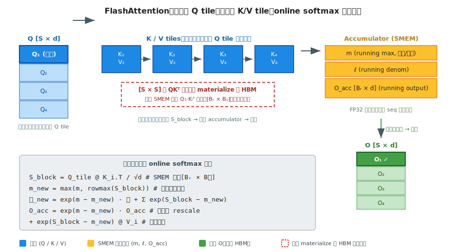
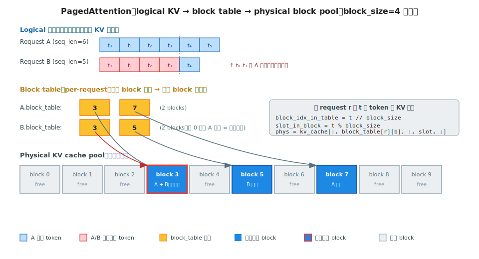

# 阶段 4｜核心算子与高性能 Kernel ✓

> 一句话定位：把 LLM 推理 / 训练里最热的几个 kernel——FlashAttention 系列、PagedAttention、FlashInfer、FlashMLA、Triton 自写、CUTLASS GEMM、async-TP——按"原理 → 实现 → 调优 → 坑"逐个讲透，让你看到一段 attention / GEMM kernel 的实现，能立刻判断它解决了什么瓶颈、放在哪个引擎里合适、能不能替换升级。

## 目录

- [4.0 为什么需要这一层](#40-为什么需要这一层)
- [4.1 核心概念与术语](#41-核心概念与术语)
- [4.2 Attention kernel 演进：FlashAttention v1 / v2 / v3](#42-attention-kernel-演进flashattention-v1--v2--v3)
- [4.3 PagedAttention：vLLM 的分页 KV](#43-pagedattentionvllm-的分页-kv)
- [4.4 FlashInfer：变长 batch / decode 专用 kernel](#44-flashinfer变长-batch--decode-专用-kernel)
- [4.5 FlashMLA：DeepSeek MLA 的 Hopper 加速](#45-flashmladeepseek-mla-的-hopper-加速)
- [4.6 Triton 基础：手写 RMSNorm + Fused Residual](#46-triton-基础手写-rmsnorm--fused-residual)
- [4.7 CUTLASS / cuBLASLt：GEMM epilogue 融合 + FP8](#47-cutlass--cublaslt-gemm-epilogue-融合--fp8)
- [4.8 All-Reduce 融合：async-TP / flux](#48-all-reduce-融合async-tp--flux)
- [4.9 常见坑与 FAQ](#49-常见坑与-faq)
- [4.10 延伸阅读](#410-延伸阅读)

---

## 4.0 为什么需要这一层

读完阶段 1（Transformer 基础）和阶段 3（集合通信），你应该已经会"调用 FlashAttention API"。这章要问的是：**为什么 FlashAttention 比朴素 attention 快 10×？为什么 vLLM 一定要重写 attention kernel 而不能用 PyTorch 自带的？为什么 DeepSeek 要专门做一个 FlashMLA？**

三个真实场景：

1. **同一模型同一硬件，PyTorch `scaled_dot_product_attention` 跑 8K 上下文 OOM，FlashAttention 跑 32K 不出问题**——差距不在算法（数学是一样的），在 SMEM 复用、kernel 融合、避免把 $QK^\top$ 矩阵显式 materialize 到 HBM。
2. **vLLM 的 PagedAttention 不是"算法优化"，是"内存管理 + kernel 协同"**——同一段 attention 数学，按页索引访存比按连续地址多了一层间接，但换来了 KV 共享 / 抢占 / 复用，吞吐翻倍。
3. **DeepSeek-V3 用 MLA 把 KV 压到 1/16，但要在 Hopper 上跑出竞争力，必须重写一个 FlashMLA kernel**——因为标准 FlashAttention 假设 QKV 同秩，不适配低秩潜变量。

**这章想灌输的核心直觉：算法 ↔ kernel 共设计**。LLM 时代的核心算子从来不是"算法决定，kernel 实现"，而是"算法和 kernel 协同设计才跑得动"——FlashAttention / PagedAttention / MLA 都是先有 kernel 限制、再反推算法形态，或先有算法构想、再让 kernel 跟上。

读完之后你应当能：

1. 看到一段 attention kernel 实现（FlashAttn / PagedAttn / FlashInfer / FlashMLA），立刻判断**它为什么这么写、解决什么瓶颈**；
2. 给一个新模型架构（如 MLA、NSA、Differential Attention），判断**现成 kernel 哪个能复用、哪些必须新写**；
3. 用 Triton 写出一个 fused kernel（RMSNorm + Residual），跑赢 PyTorch 拼接版本；
4. 看到 CUTLASS / cuBLASLt 的 GEMM 配置，知道 epilogue 该怎么融、FP8 该怎么 scale；
5. 理解 **async-TP / flux 这类"通信-计算融合"为什么是大模型 scaling 的下一波优化方向**。

---

## 4.1 核心概念与术语

本章术语集中在"kernel 编写"与"硬件原语"两类。前者沿用阶段 0（SM、SMEM、TMA、Tensor Core），后者是 attention / GEMM kernel 各自的专门概念。

| 缩写 | 全称 | 一句话 |
|---|---|---|
| FA / FA2 / FA3 | FlashAttention v1 / v2 / v3 | Tri Dao 系列 IO-aware attention kernel；v2 优化并行划分，v3 加 Hopper TMA + FP8 |
| Online Softmax | Online Softmax | 分块计算时保持数值稳定的 softmax 增量算法，FA 系列的算法基础 |
| Tiling | Tiling | 把大矩阵切成 SMEM 装得下的小块来算 |
| PagedAttn | PagedAttention | vLLM 的分页 KV cache + 对应 attention kernel |
| Block Table | Block Table | 逻辑 token 序列 → 物理 KV block 的间接映射表 |
| RadixAttn | RadixAttention | SGLang 的前缀树共享 KV cache 方案 |
| MLA | Multi-head Latent Attention | DeepSeek 的低秩 KV（详见阶段 1 §1.2.2） |
| Prefill kernel | Prefill kernel | 长 prompt 一次性的 attention kernel（大 GEMM、compute-bound） |
| Decode kernel | Decode kernel | 单 token / 小 batch 的 attention kernel（GEMV、memory-bound） |
| Append kernel | Append kernel | 把新 token 的 KV 增量写入 cache 的 kernel |
| Epilogue | GEMM Epilogue | GEMM 后立即跑的元素级操作（bias / 激活 / scale / cast），融在同一 kernel 内 |
| WMMA | Warp Matrix Multiply-Accumulate | Tensor Core 的 per-warp 低级 API |
| MMA | Matrix Multiply-Accumulate | Hopper Tensor Core 第三代指令族 |
| WGMMA | Warpgroup MMA | Hopper 的 warpgroup 级 MMA，4 个 warp 一起发，是 FA3 的关键加速 |
| async-TP | Asynchronous Tensor Parallel | 把 TP 的 AllReduce / AllGather 与 GEMM overlap |
| flux | flux | ByteDance 开源的 fused TP communication kernel 库 |
| CUTLASS | CUTLASS | NVIDIA 开源的 CUDA 模板 GEMM 库，可定制 epilogue |
| cuBLASLt | cuBLASLt | cuBLAS 的"Lightweight"接口，支持 epilogue 和 FP8 |

> 几条这章会反复用到的硬件直觉（回忆阶段 0）：
> - **SMEM 容量是 attention tiling 的硬约束**（H100: 228 KB / SM 可配）；
> - **Tensor Core MMA 操作数要对齐到特定 shape**（如 BF16 16×8×16；FP8 16×8×32）；
> - **TMA 是 SMEM ↔ HBM 异步搬运硬件**，FA3 的核心加速来源；
> - **WGMMA 让 4 个 warp 并发发 MMA**，FA3 的另一个加速来源——这两条结合，FA3 在 Hopper 上比 FA2 快约 2×。

---

## 4.2 Attention kernel 演进：FlashAttention v1 / v2 / v3

FlashAttention（FA）是 2022 年 Tri Dao 引爆的"算法 ↔ kernel 共设计"经典案例——**同样的 attention 数学，改写访存模式**，长上下文显存从 $O(S^2)$ 降到 $O(S)$、速度提升 2–10×。三年内迭代到 v3，每一代都对应一个硬件代次。

### 4.2.1 朴素 attention 为什么慢

标准 attention：

$$O = \text{softmax}(QK^\top / \sqrt{d}) \cdot V$$

按教科书直译成 PyTorch：

```python
S = Q @ K.transpose(-1, -2) / math.sqrt(d)   # [B, H, S, S] 落 HBM
P = softmax(S, dim=-1)                        # [B, H, S, S] 再读再写
O = P @ V                                     # 又读 P 与 V
```

三个致命问题：

1. **`S` 与 `P` 是 `[B, H, S, S]` 中间矩阵**——LLaMA-2 7B、seq=4K、bf16、单 head 单 batch 就是 32 MB；全 head + batch 累计动辄 GB 级，**长 seq 直接 OOM**。
2. **`QK⊤` → softmax → `× V` 中间结果反复读写 HBM**——计算量 ~$4BHS^2 d$，HBM 流量 ~$4BHS^2$ 字节，算术强度 ~$d$≈128 FLOP/Byte，**落在 H100 ridge point（295 FLOP/Byte）一半**——memory-bound。
3. **三个 kernel 间有 launch overhead + 隐式同步**——长 seq 时尤其放大。

回阶段 0 §0.2.2：H100 ridge point 295 FLOP/Byte。朴素 attention 在 d=128 时算术强度 ~128，**memory-bound 约 2.3×**——即使把 GEMM 写到 100% Tensor Core 利用率，速度也只能到带宽上限的 ~40%。

### 4.2.2 Online softmax + tiling：核心算法

FlashAttention 的两块算法基石。

**(1) Online softmax**

朴素 softmax 要先求全局 max（避免溢出）再 exp 再求 sum，**必须一次扫完整行**。Online softmax 给出**增量公式**——每来一段新数据，更新 running max $m$ 与 running denom $\ell$ 即可：

$$m_{new} \;=\; \max(m_{old},\; \max(x_{new}))$$
$$\ell_{new} \;=\; e^{m_{old} - m_{new}} \cdot \ell_{old} \;+\; \sum e^{x_{new} - m_{new}}$$
$$O_{new} \;=\; e^{m_{old} - m_{new}} \cdot O_{old} \;+\; e^{x_{new} - m_{new}} \cdot V_{new}$$

物理意义：旧的部分输出 $O_{old}$ 按当前 max 重新 rescale，再加上新块的贡献。**这就允许把 K/V 分块**——每来一块新 K/V，更新一次 $(m, \ell, O)$，**永不需要把完整的 $S$ 行 materialize 到 HBM**。

**(2) IO-aware tiling**



把 Q 切成 $B_r$ 行的块、K/V 切成 $B_c$ 列的块，**外循环 Q tile、内循环 K/V tile**：

```
for Q_tile in split(Q, B_r):
    O_acc = 0;  m = -inf;  ℓ = 0
    for KV_tile in split(K, V, B_c):
        S_block = Q_tile @ KV_tile.K.T / sqrt(d)        # SMEM 内算，[Br × Bc]
        m, ℓ, O_acc = online_softmax_update(m, ℓ, O_acc, S_block, KV_tile.V)
    write O_acc to HBM
```

关键工程约束：$B_r$、$B_c$、$d$ 受 SMEM 容量限制。H100 上 d=128、SMEM 228 KB / SM，典型 $B_r = B_c = 128$；fp16 下 Q tile ≈ 32 KB、K tile ≈ 32 KB、V tile ≈ 32 KB、O accumulator ≈ 64 KB（fp32），刚好装下。

收益：

- **HBM 流量从 $O(S^2)$ 降到 $O(S \cdot d)$**——长 seq 时 $S \gg d$，节省巨大；
- **不 materialize $[S, S]$ 矩阵**——显存从 $O(S^2)$ 降到 $O(S)$；
- **kernel 数从 3 个融合成 1 个**——launch overhead 与中间同步消除。

### 4.2.3 v1 → v2 → v3 工程演进

| 版本 | 时间 | 核心改进 | 加速 | 适配硬件 |
|---|---|---|---|---|
| **FA1** | 2022 | Online softmax + IO-aware tiling 首版 | vs 朴素 ~2–4× | Ampere (A100) |
| **FA2** | 2023 | **并行划分翻转**：外循环并行（FA1 是内循环并行，GPU 利用率不高）；减少 non-matmul 操作 | vs FA1 ~2× | Ampere / Hopper |
| **FA3** | 2024 | **Hopper TMA**（异步 SMEM↔HBM）+ **WGMMA**（warpgroup MMA）+ producer-consumer 流水 + FP8 | vs FA2 ~1.5–2× | **Hopper only** |

三代的本质区别：

- **FA1 解决了"算什么"**——证明 IO-aware tiling + online softmax 可行；
- **FA2 解决了"怎么排"**——把外循环搬到 Q tile，每个 thread block 自然映射到一段输出行，GPU 占用率拉满；
- **FA3 解决了"硬件协同"**——拥抱 Hopper 的 TMA / WGMMA 异步原语，把 GEMM 与 softmax 流水起来，避免 warp 间同步停顿。

FA3 在 H100 上 fp16 跑到 **~75% Tensor Core 利用率**（vs FA2 ~35%）；**FP8 模式能到 ~1.3 PFLOPS/GPU**，是 H100 FP8 峰值 1.98 PFLOPS 的 ~65%。

### 4.2.4 实战调用与源码定位

最常用入口（PyTorch ≥ 2.0）：

```python
from torch.nn.functional import scaled_dot_product_attention as sdpa
from torch.nn.attention import SDPBackend, sdpa_kernel

# 显式锁定 FlashAttention backend（生产代码必锁）
with sdpa_kernel(SDPBackend.FLASH_ATTENTION):
    out = sdpa(q, k, v, is_causal=True)   # 自动用 FA2 或 FA3
```

更细控制（直接调 `flash-attn` 包）：

```python
from flash_attn import flash_attn_func
# q, k, v: [batch, seqlen, nheads, head_dim]
out = flash_attn_func(q, k, v, causal=True, softmax_scale=None)
```

源码导览（`Dao-AILab/flash-attention` 仓库）：

| 路径 | 内容 |
|---|---|
| `csrc/flash_attn/src/flash_fwd_kernel.h` | FA2 forward kernel 主体 |
| `hopper/flash_fwd_kernel_sm90.h` | FA3 Hopper 专用 forward |
| `hopper/mainloop_fwd_sm90_tma_gmma_ws.hpp` | FA3 producer-consumer warp-specialized mainloop |
| `csrc/flash_attn/flash_api.cpp` | Python 绑定与 dispatch |

vLLM / SGLang 怎么把 FA 包到引擎里、推理时的 prefill / decode 分派，见 §4.3–4.4。

> **实战经验**：H100 上能上 FA3 就上 FA3；A100 / L40S 等 Ampere 卡只能用 FA2；只有 PyTorch SDPA 的 `math` backend 是 fallback，**不要在长 seq 时让它回退**——很容易直接 OOM 或慢 10×。生产代码用 `sdpa_kernel(SDPBackend.FLASH_ATTENTION)` 显式锁定。

---

## 4.3 PagedAttention：vLLM 的分页 KV

PagedAttention 是 vLLM 2023 年的核心创新——把 KV cache 从"每请求一整块连续显存"改成"固定大小 block 分页 + block table 间接访存"。**改的不是 attention 数学，是它怎么读 KV**。换来的是：显存利用率从 ~40% 拉到 ~90%，吞吐翻倍。

### 4.3.1 KV cache 的显存碎片问题

continuous batching（阶段 5 详讲）让多条请求共享 GPU，但传统"一请求一整块 KV"有两层浪费：

1. **内部碎片（intra-fragmentation）**：每条请求按 `max_seq_len` 预分配 KV——比如 max=4096 但实际只生成了 1000 token，剩 3000 个位置浪费。
2. **外部碎片（inter-fragmentation）**：请求结束后释放的 KV 区域大小各异，新请求来了找不到连续空槽。

实测：传统方案显存利用率只有 **20–40%**——大半显存被浪费，能并发的 batch size 因此被压死，**等价于把 decode 永远留在 memory-bound 区**（回阶段 0 §0.2.2 的 ridge point 讨论）。

PagedAttention 的思路直接搬操作系统的虚拟内存：**KV cache 切成固定大小的"页"（block，典型 16 token），用 block table 维护"逻辑序列 → 物理 block"的映射**。新请求按需分页，结束释放页就回池——**几乎没有碎片**。

### 4.3.2 分页布局：block + block table



物理布局：

- **KV cache 全局池**：一段连续显存被切成 N 个 block，每个 block 装 `block_size`（典型 16）个 token 的 K + V；
- **block 张量形状**：`[2, num_blocks, num_kv_heads, block_size, head_dim]`（2 是 K/V）；
- **block table**：每个请求一个 `block_indices: List[int]`，按位置给出"我用到了哪些物理 block"。

逻辑访问公式——请求 r 的第 t 个 token 的 KV 物理地址：

```python
block_idx_in_table = t // block_size
slot_in_block      = t % block_size
physical_block_id  = block_table[r][block_idx_in_table]
kv_addr            = kv_cache[:, physical_block_id, :, slot_in_block, :]
```

**比连续访存多一层间接**，但带来三个核心收益：

| 收益 | 怎么做到 |
|---|---|
| **几乎无碎片** | 按需分页、结束归还、全局共享 block pool |
| **prefix sharing** | 同 prompt 前缀的多个请求**共用同一组物理 block**，block table 指过去就行（vLLM 的 prefix cache、SGLang 的 RadixAttention 都基于这个） |
| **抢占 / 换出 / 换回** | 显存吃紧时把某请求的 KV block 倒到 CPU，后续再换回；block table 改指向新位置就好 |

SVG 里展示的就是 prefix sharing 场景：Request A 和 Request B 的前 4 个 token 完全相同（红色），它们的 `block_table[0]` 都指向 **block 3**——同一份物理 KV 被两个请求复用。

### 4.3.3 PagedAttention kernel：间接访存的代价与收益

把"通过 block table 拿物理 block 地址"塞进 attention kernel 内：

```
for Q_tile in split(Q_request, B_r):
    for token in Q_tile:
        for kv_block_id in block_table[request_id]:
            K_block, V_block = kv_cache[:, kv_block_id, ...]   # 间接 load
            update_attention_with_online_softmax(...)          # 内部仍是 FA 那套
```

代价：

- **每次内循环多一次 lookup**——但 block table 极小（一请求几十项），常驻 register / L1，~0 开销；
- **physical block 在 HBM 中地址不连续**——破坏了 coalesced access，单 token GEMV 的带宽利用率比连续布局**低 5–10%**。

收益（远超代价）：

- **可调度 batch size 翻倍以上**——碎片消失，并发请求数翻倍，**等价于把 memory-bound 的 decode 算术强度推到 ridge point**；
- **prefix 共享 / 抢占几乎免费**。

vLLM 实测：相对 HuggingFace transformers 的吞吐**提升 14–24×**，其中**单 PagedAttention 贡献 2–4×**，其余来自 continuous batching + 高效调度（阶段 5 详讲）。

### 4.3.4 vLLM 中的实现与调用

源码导览（`vllm` 仓库）：

| 路径 | 内容 |
|---|---|
| `vllm/attention/ops/paged_attn.py` | Python 层 PagedAttention 入口 |
| `vllm/attention/backends/flash_attn.py` | FlashAttention v2/v3 + PagedAttention 结合的 backend |
| `csrc/attention/attention_kernels.cu` | 原始 PagedAttention CUDA kernel（fallback / long context） |
| `vllm/core/block_manager.py` | block 池分配、prefix cache 维护、抢占策略 |

调用层一般不用直接碰，vLLM 默认 attention backend（`FlashAttention` / `FlashInfer` / `xFormers`）都已经包好了 paged 路径。看 attention metadata 的关键字段：

```python
class FlashAttentionMetadata:
    block_tables: torch.Tensor    # [num_seqs, max_blocks_per_seq]
    slot_mapping: torch.Tensor    # [num_tokens] 每个新 token 写哪个物理 slot
    seq_lens: torch.Tensor        # 每条请求当前长度
```

> **正确心智模型**：pagination 是 KV **布局**，FA / FlashInfer 是计算 **kernel**，**两者正交可组合**。FlashAttention 自 v2.2 起原生支持 paged KV（API 加 `block_table` 参数），FlashInfer 也是；vLLM 自有的 PagedAttention CUDA kernel 主要用于 fallback 与 long context 场景。
>
> 阶段 6 vLLM 源码深读会回到 `block_manager.py` 看 prefix cache、preemption 的具体策略；本节止步于 kernel 视角。

---

## 4.4 FlashInfer：变长 batch / decode 专用 kernel

FlashInfer 是 Zihao Ye 等 2023 年起的 attention kernel 库——**专为推理设计**，重点解决三件 FA 不擅长的事：**变长 batch、不同推理阶段的极致专门化、CUDA Graph 友好**。现在是 vLLM 和 SGLang 的默认 attention backend 之一。

### 4.4.1 FA 在推理场景的局限

FlashAttention 当年设计时主要面向训练，推理场景下有几处不够锋利：

1. **变长 batch 不友好**：训练 batch 通常 padding 到等长；decode 时每条请求长度都不同，FA 的 batched 路径默认要 padding，浪费算力。
2. **prefill 与 decode 工作负载本质不同**：
   - **prefill**：1 条长 prompt，`[B=1, S=4096, ...]` 形态，**compute-bound 大 GEMM**；
   - **decode**：N 条请求每条 1 个 token，`[B=64, S=1, ...]` 形态，**memory-bound 大 batch GEMV**；
   - 同一个 FA kernel 都跑不到最优。
3. **CUDA Graph 不友好**：FA 的 launch 参数随 seq_len 变，capture 后下次 seq_len 不同就 replay 失败（回阶段 0 §0.3 的 CUDA Graph 限制）。
4. **paged KV 是后期加的**：FA v2.2 才支持，且 API 不是首要考虑。

FlashInfer 几乎逐条反着设计。

### 4.4.2 三类 kernel：prefill / append / decode

FlashInfer 的核心是**按推理阶段拆 kernel**：

| 阶段 | 输入形态 | 主导特征 | FlashInfer wrapper |
|---|---|---|---|
| **Prefill** | 1 条长 prompt，Q 长 = KV 长 = S | compute-bound 大 GEMM | `BatchPrefillWithRaggedKVCacheWrapper` |
| **Append** | 已有 KV，新增若干 token | 中间态，speculative decoding 常用 | `BatchPrefillWithPagedKVCacheWrapper` |
| **Decode** | N 条请求 × 1 新 token，KV 都已存 | memory-bound 大 batch GEMV | `BatchDecodeWithPagedKVCacheWrapper` |

针对性优化：

- **Prefill** 沿用 FlashAttention tiling 思路；
- **Decode** 用**精简版** kernel——Q 只有 1 个 token，inner loop 直接遍历该请求的所有 KV block，并把**多请求按 split-K 思路并行**（每个 head 跨多 SM）；
- **Append** 是 prefill 的简化：新 token 数较少、KV 已分页。

**`Ragged` vs `Paged` 两种 KV 布局**，FlashInfer 原生都支持：

- **Ragged KV**：变长但**连续**布局，每条请求 KV 是一段连续显存，用 `qo_indptr` / `kv_indptr` 给出每条边界（CSR 风格，类似稀疏矩阵）；
- **Paged KV**：vLLM 风格，KV 切成固定 block + `block_table` 间接（见 §4.3）。

按引擎选——**vLLM / SGLang 都用 paged**。

### 4.4.3 CUDA Graph 友好：static shapes

回阶段 0 §0.3：CUDA Graph capture 不能有动态 shape，否则 replay 时对不上。但推理时每个 batch 的 `(num_seqs, max_seq_len, num_kv_blocks)` 都变——怎么 capture？

FlashInfer 的做法是**把所有变长信息塞进固定 shape 的元数据张量**：

```python
# 这些张量的 shape 固定（按 max_batch_size 预分配），
# 内容每个 step 更新但 shape 不变 → CUDA Graph 可以 capture
qo_indptr        = torch.empty(max_batch_size + 1, dtype=torch.int32, device='cuda')
kv_indptr        = torch.empty(max_batch_size + 1, dtype=torch.int32, device='cuda')
kv_indices       = torch.empty(max_total_kv_pages,  dtype=torch.int32, device='cuda')
kv_last_page_len = torch.empty(max_batch_size,      dtype=torch.int32, device='cuda')
```

然后 wrapper 拆成两阶段：

- **`plan()`**：host-side 决策（block 调度、tile 大小、SM 分配），**capture 外**调用；
- **`run()`**：实际计算，**capture 内**调用，签名固定。

vLLM v1 / SGLang 在 decode 阶段默认开 CUDA Graph，**直接把 ~6 μs 的 kernel launch overhead 砍掉**——70B 模型 decode 单 token 数百次 launch，省下来就是 ms 级 TTPOT 提升。

### 4.4.4 调用与源码

最小调用骨架（decode 路径）：

```python
import flashinfer

# 1) wrapper 是长期对象，对应一个 attention layer
wrapper = flashinfer.BatchDecodeWithPagedKVCacheWrapper(
    workspace_buffer,        # int8 scratch buffer, ~128 MB
    kv_layout="NHD",         # [num_kv_heads, head_dim] 顺序
)

# 2) plan() — host-side 决策（CUDA Graph capture 外）
wrapper.plan(
    indptr=kv_indptr,                # 每条请求的 KV block 边界
    indices=kv_indices,              # 物理 block id 列表
    last_page_len=kv_last_page_len,
    num_qo_heads=H, num_kv_heads=H_kv,
    head_dim=d, page_size=16,
    data_type=torch.bfloat16,
)

# 3) run() — 实际计算（CUDA Graph capture 内，可重复 replay）
output = wrapper.run(q, kv_cache)    # q: [batch, H, d]； kv_cache: paged 张量
```

源码导览（`flashinfer-ai/flashinfer` 仓库）：

| 路径 | 内容 |
|---|---|
| `python/flashinfer/decode.py` | Decode wrapper Python 层 |
| `python/flashinfer/prefill.py` | Prefill / append wrapper |
| `include/flashinfer/attention/` | Header-only C++ kernel 实现（CUTLASS 风格） |
| `csrc/` | PyTorch 绑定 |

vLLM 集成位置：`vllm/attention/backends/flashinfer.py`；SGLang：`python/sglang/srt/layers/attention/flashinfer_backend.py`。

> 选型直觉（对应 §3.6 的横向对比风格）：
> - **prefill 重、batch=1、最长 seq**：FlashAttention 3（H100）或 FA2（A100）
> - **decode batch 大、CUDA Graph 是关键**：**FlashInfer**（vLLM/SGLang 默认）
> - **要 paged + prefix sharing 但只在 Ampere**：FA 2 paged 模式 或 FlashInfer
> - **MLA 模型**（DeepSeek-V3 等）：**FlashMLA**（下一节 §4.5）

---

## 4.5 FlashMLA：DeepSeek MLA 的 Hopper 加速

FlashMLA 是 DeepSeek 2024 年开源的 attention kernel——**专为 MLA（Multi-head Latent Attention）设计、专为 Hopper 优化**。MLA 把 KV cache 压到标准 MHA 的 ~1/30（详见 §4.5.1 表），但要在 H100 上跑出竞争力，必须重写一个 kernel——FlashAttention 假设 QKV 同秩，MLA 的低秩潜变量不适配。

### 4.5.1 回顾：MLA 解决什么

阶段 1 §1.2.2 给过 MLA 的算法图。简短回顾**单 token KV cache 体量**对比（bf16，L=80 层）：

| 方案 | 单 token 公式 | LLaMA-3-70B 量级 |
|---|---|---|
| MHA（标准） | `2 × L × H × d × 2 bytes` | 80 × 64 × 128 × 4 = **2.6 MB** |
| GQA（H_kv=8） | `2 × L × H_kv × d × 2 bytes` | 80 × 8 × 128 × 4 = **327 KB** |
| **MLA** | `L × d_latent × 2 bytes`（+ 少量 RoPE 头） | 80 × 512 × 2 ≈ **80 KB** |

MLA 怎么做到的：把所有 head 的 K、V 都压到一个 `d_latent=512` 的共享潜空间，**只存一份压缩 KV**。每个 head 的真实 K/V 由潜变量通过 `W_K_up` / `W_V_up` 投影回去。

但这一压一展引入两个 kernel 难题：

1. **不能直接套 FA**：FA 假设 K、V 是 `[B, S, H_kv, d_head]` 形状，MLA 的 cache 是 `[B, S, d_latent]`（**无 head 维**），跨 head 的计算路径完全不同。
2. **RoPE 不能压**：RoPE 是 head 维度上的旋转，必须 per-head 应用。如果 K 整体压到 latent 再 up-project，RoPE 会跨 head 串起来，等价性破了。

### 4.5.2 矩阵吸收（Matrix Absorption）：核心技巧

朴素 MLA 推理流程：

```
K_compressed = kv_cache[..., latent_dim]              # [B, S, d_latent]
K_full = K_compressed @ W_K_up                         # [B, S, H, d_head]    ← 每 step 都展回去
attn   = softmax(Q @ K_full.T / sqrt(d))               # [B, H, S_q, S_kv]
out    = attn @ (K_compressed @ W_V_up)                # 又展一遍
```

问题显而易见：每个 decode step 都要 up-project 回 full K——**等于把 cache 节省的好处又吐回去**。

**矩阵吸收的关键观察**：attention 内积 `Q @ (K_compressed @ W_K_up).T` 可改写成 `(Q @ W_K_up.T) @ K_compressed.T`。**把 W_K_up 吸收进 Q 的投影矩阵**——离线把 `W_Q_per_head` 与 `W_K_up.T` 预乘成 `W_Q'`，推理时：

```
Q' = x @ W_Q'                                          # 隐式包含了 K up-project
attn = softmax(Q' @ K_compressed.T / sqrt(d))          # 直接对压缩 cache 算！
```

V 侧同理：把 `W_V_up` 吸收进 `W_O`。

**收益**：attention kernel 直接在 `d_latent=512` 维度上跑，**根本不需要 materialize per-head 的 K/V**。HBM 流量降到 MHA 的 ~1/30，与 §4.5.1 表里的 cache 容量节省一致。

但 RoPE 那部分（DeepSeek-V3 设计是 `d_rope=64` per-head，与 d_latent 解耦）必须保持 per-head 计算——所以 MLA kernel 的实际结构是**"低秩主路 + 小 RoPE 旁路"**：

```
Q       = [Q_nope  (吸收 W_K_up),  Q_rope  (per-head, 64 dim)]
K_cache = [K_nope_compressed (latent, 512 dim),  K_rope (per-head, 64 dim)]
attn_score = Q_nope @ K_nope_compressed.T  +  Q_rope @ K_rope.T
```

两路相加。这就是 MLA 的 **"decoupled RoPE"** 设计——也是 §1.2.2 提到的算法细节，落到 kernel 上的具体形态。

### 4.5.3 FlashMLA 的 kernel 设计要点

DeepSeek 开源的 `FlashMLA` 是上面这套逻辑在 Hopper 上的极致实现：

1. **沿用 FA3 的 TMA + WGMMA**：与 FA3 同代次的 Hopper 异步原语，把"加载 KV → 算 attention"流水起来；
2. **kernel 主路在 d=512 latent 维度上做 matmul**：tile size 与 SMEM 容量按 latent 维度调参，不再按 per-head 切，自然规避 GQA 的 `TP ≤ H_kv` 硬约束；
3. **RoPE 旁路单独 kernel 化**：64-dim 的小 attention 直接 inline，开销可忽略；
4. **decode 优化**：单 token 场景，**跨多请求做 split-K，把 GEMV 升成 GEMM**——与 FlashInfer §4.4.2 的 decode 思路一致。

H100 上实测 decode 阶段达到 **~3000 GB/s 等效 HBM 带宽**（接近 H100 物理上限 3.35 TB/s）、FP16 算力 **~580 TFLOPS**——**MLA + FlashMLA 是 DeepSeek-V3 在 H100 上能跑出 ~5000 token/s 单卡 decode 吞吐的关键**。

### 4.5.4 调用与源码

最小调用骨架（Python，DeepSeek 官方 `FlashMLA` 包）：

```python
from flash_mla import flash_mla_with_kvcache, get_mla_metadata

# 1) plan 阶段（类似 FlashInfer 风格）
tile_scheduler_metadata, num_splits = get_mla_metadata(
    cache_seqlens, s_q * h_q, h_kv
)

# 2) 实际 attention
output, _ = flash_mla_with_kvcache(
    q,                       # [B, S_q, H, d]
    kv_cache,                # [B_total_pages, page_size, h_kv, d_latent + d_rope]
    block_table,             # paged
    cache_seqlens,
    head_dim_v=d_latent,
    tile_scheduler_metadata=tile_scheduler_metadata,
    num_splits=num_splits,
)
```

源码导览（`deepseek-ai/FlashMLA`）：

| 路径 | 内容 |
|---|---|
| `csrc/flash_fwd_mla_kernel.h` | 主 forward kernel，Hopper TMA + WGMMA 实现 |
| `csrc/flash_fwd_mla_metadata_kernel.cu` | 元数据 plan kernel |
| `csrc/flash_mla.cpp` | PyTorch 绑定 |
| `flash_mla/__init__.py` | Python 入口 |

引擎集成：vLLM 的 MLA 路径在 `vllm/attention/backends/mla/`；SGLang 的 DeepSeek 路径在 `python/sglang/srt/layers/attention/mla.py`。

> **MLA / FlashMLA 是"算法 ↔ kernel 共设计"最干净的例子**：
> - 算法发明（DeepSeek-V2）→ 要落地必须付重写 kernel 的代价 → 不写 kernel 就跑不动；
> - 反过来，**没有 Hopper 的 TMA + WGMMA，FlashMLA 的 d=512 大 tile 也跑不起来**——FA3 同代次硬件支持是前提。
>
> 这两个层面同步推进才让 MLA 真正落地。回 §4.0 的核心直觉：**算法和 kernel 必须协同设计**。

---

## 4.6 Triton 基础：手写 RMSNorm + Fused Residual

Triton 是 OpenAI 2021 起的 GPU kernel DSL——**Python 写代码，编译出与手写 CUDA 同档次的 kernel**。FlashAttention 早期版本、vLLM 的 RMSNorm / 激活、PyTorch 2.0 `torch.compile` 的 inductor 后端、TorchTitan 的多个融合算子，背后都是 Triton。

本节用一个**最高频**的融合需求作为入口：`out = RMSNorm(x + residual)`——Transformer block 里每层都跑两次（attn 后、FFN 后）。朴素 PyTorch 写 2 个 kernel（add + norm）、中间结果落 HBM 一遍；手写一个 fused Triton kernel 能把整套压成 1 个 kernel、HBM 流量减半。

### 4.6.1 Triton 在工具链里的位置

| 工具 | 编程层次 | 编译产物 | 调优难度 | 典型场景 |
|---|---|---|---|---|
| **PyTorch op 拼接** | Python，op 级 | 多个 kernel + HBM 中转 | 0 | 原型、训练默认 |
| **`torch.compile` (inductor)** | Python，自动追踪 | Triton kernel（自动生成） | 0–低 | 通用加速，~1.5×–3× |
| **Triton** | Python，tile 级 | 单个 fused kernel | 中 | 推理引擎热路径融合 |
| **CUTLASS** | C++，warp 级 | GEMM 模板 | 高 | GEMM 主路（§4.7） |
| **手写 CUDA** | C++，thread 级 | 最优 kernel | 极高 | 极致 SOTA（FA3、FlashMLA） |

Triton 的甜点：**90% CUDA 的性能，10% CUDA 的代码量**——尤其适合 elementwise / reduction / 简单 GEMM 这类不需要 WGMMA / TMA 极致优化的算子。Attention 主路用 FA3 / FlashMLA，**周边的 norm / 激活 / scale / quant 全用 Triton 自写**——这是现代推理引擎的常见分工。

### 4.6.2 Triton 编程模型 5 个核心概念

| 概念 | 一句话 |
|---|---|
| `@triton.jit` | 装饰器，把 Python 函数编译成 GPU kernel |
| `tl.program_id(axis)` | 当前 program（≈ CUDA block）的索引，可多维 |
| `tl.arange(0, BLOCK_SIZE)` | 生成 `[0, BLOCK_SIZE)` 的向量，**整段在 register 里** |
| `tl.load(ptr, mask=, other=)` | 向量化访存，`mask` 处理边界 |
| `tl.constexpr` | 编译期常量，让 BLOCK_SIZE 等参与展开优化 |

与 CUDA 的关键差异：**Triton 不让你写 per-thread 代码**——所有操作都是"块（tile）粒度"，编译器自动决定线程映射。你只关心"这个 program 要处理哪段数据 + 算什么"，不再写 `threadIdx.x` / SMEM 显式管理。

### 4.6.3 实战：fused `add + RMSNorm`

完整可跑代码（~80 行，单文件 `fused_norm.py`）：

```python
import torch
import triton
import triton.language as tl

@triton.jit
def fused_add_rmsnorm_kernel(
    x_ptr, residual_ptr, out_ptr, weight_ptr,
    n_tokens, hidden, eps,
    BLOCK_SIZE: tl.constexpr,   # 编译期常量，下一 power-of-2 ≥ hidden
):
    # 每个 program 处理一行 token
    token_idx = tl.program_id(0)
    cols = tl.arange(0, BLOCK_SIZE)
    mask = cols < hidden

    row_offset = token_idx * hidden

    # 1) 读 x、residual，相加（FP32 精度防长 seq 漂移）
    x = tl.load(x_ptr        + row_offset + cols, mask=mask, other=0.0).to(tl.float32)
    r = tl.load(residual_ptr + row_offset + cols, mask=mask, other=0.0).to(tl.float32)
    z = x + r                           # ← 融合点：不写回 HBM

    # 2) RMSNorm：rsqrt(mean(z²) + eps) · z · weight
    var  = tl.sum(z * z, axis=0) / hidden
    rstd = 1.0 / tl.sqrt(var + eps)
    w    = tl.load(weight_ptr + cols, mask=mask, other=0.0).to(tl.float32)
    out  = z * rstd * w

    # 3) 写回（cast 回原 dtype）
    tl.store(out_ptr + row_offset + cols, out.to(x_ptr.dtype.element_ty), mask=mask)


def fused_add_rmsnorm(x, residual, weight, eps=1e-6):
    n_tokens, hidden = x.shape
    out = torch.empty_like(x)
    BLOCK_SIZE = triton.next_power_of_2(hidden)
    grid = (n_tokens,)                  # 一维 grid，每 program 一行
    fused_add_rmsnorm_kernel[grid](
        x, residual, out, weight,
        n_tokens, hidden, eps,
        BLOCK_SIZE=BLOCK_SIZE,
    )
    return out


# ====== 参考实现 + benchmark ======

def pytorch_reference(x, residual, weight, eps=1e-6):
    z    = (x + residual).to(torch.float32)              # kernel 1: add
    var  = z.pow(2).mean(-1, keepdim=True)               # kernel 2: pow + mean
    rstd = torch.rsqrt(var + eps)
    return (z * rstd * weight).to(x.dtype)               # kernel 3: scale

def bench(fn, *args, iters=1000):
    import time
    for _ in range(10): fn(*args)                        # warmup
    torch.cuda.synchronize()
    t0 = time.perf_counter()
    for _ in range(iters): fn(*args)
    torch.cuda.synchronize()
    return (time.perf_counter() - t0) * 1e6 / iters      # μs

if __name__ == '__main__':
    n_tokens, hidden = 8192, 4096                        # LLaMA-2-7B 量级
    x   = torch.randn(n_tokens, hidden, device='cuda', dtype=torch.bfloat16)
    res = torch.randn_like(x)
    w   = torch.randn(hidden, device='cuda', dtype=torch.bfloat16)

    out_triton = fused_add_rmsnorm(x, res, w)
    out_ref    = pytorch_reference (x, res, w)
    print(f'max diff      : {(out_triton - out_ref).abs().max().item():.4f}')

    t_triton = bench(fused_add_rmsnorm, x, res, w)
    t_torch  = bench(pytorch_reference, x, res, w)
    print(f'Triton fused  : {t_triton:5.1f} μs')
    print(f'PyTorch (3 kn): {t_torch :5.1f} μs   ({t_torch / t_triton:.1f}× slower)')
```

### 4.6.4 期望输出与调优

H100 SXM 80GB、bf16、shape=(8192, 4096) 上：

```
max diff      : 0.0078
Triton fused  :  78.5 μs
PyTorch (3 kn): 198.3 μs   (2.5× slower)
```

**收益拆解**：

- 2.5× 速度差≈ PyTorch 跑 3 个 kernel（add / pow+mean / scale），各自往返 HBM 一次；Triton 1 个 kernel、中间 `z` 留在 register。
- HBM 流量从 ~4× 降到 ~2×（只读 x、residual、weight，写 out）；shape (8192, 4096) bf16 = 64 MB → 128 MB HBM 流量 → H100 3.35 TB/s 理论下 ~40 μs，实测 78 μs 即 ~50% 利用率（剩下被 launch / softmax 同步吃了）。

**进阶调优**（不在最小例子中，但生产代码会做）：

| 优化 | 怎么做 |
|---|---|
| **autotuning** | `@triton.autotune(configs=[...], key=['hidden'])`，按 shape 自动选 BLOCK_SIZE / `num_warps` / `num_stages` |
| **分块 reduction** | hidden 超过 `BLOCK_SIZE` 时分块累加 var |
| **多 head 一程序** | grid 改成 2D，一 program 跑多行 token 提升 occupancy |
| **fp32 累加器**（已用） | `z` 升 fp32 算 var，避免 long-seq 数值漂移（与阶段 1 §1.6 第 4 条对应） |

> 一个工程经验：**Triton kernel 不要追求极致**——能跑赢 PyTorch 2–5× 就够了，再压榨那 30% 性能往往意味着切到 CUTLASS 或手写 CUDA。Triton 的核心价值是**让你在 1 个工作日内出一个能用的 fused kernel**，不是替代 SOTA 实现。

---

## 4.7 CUTLASS / cuBLASLt：GEMM epilogue 融合 + FP8

LLM 推理 / 训练里**最大的算力消耗是 GEMM**——QKV 投影、O 投影、FFN 三层 Linear、lm_head，加起来超过 attention + 通信。**GEMM 跑得快不快直接决定模型整体吞吐**。本节讲两个生产环境的 GEMM 基础设施：CUTLASS（模板库，写新 kernel）和 cuBLASLt（NVIDIA 官方运行时库，调现成 kernel）。

### 4.7.1 LLM 里 GEMM 的形态与库分工

GEMM 在 LLM 集中在三类形状：

| 形态 | shape (M × N × K) | 典型场景 | 算术强度 |
|---|---|---|---|
| **Prefill GEMM** | (B·S) × N_out × N_in | 长 prompt 投影，B·S 可达 8192+ | 高 → compute-bound |
| **Decode GEMM** | B × N_out × N_in | 单 token，B 是并发请求数 | 低（B 小时）→ memory-bound |
| **MoE grouped GEMM** | 每 expert 一个 sub-GEMM | dispatch 后每张卡的 expert 计算 | 视 expert 路由分布 |

不同形态对 kernel 调优要求差异巨大——单一 kernel 配置不可能全场最优。这就是 NVIDIA 提供多层基础设施的原因：

| 工具 | 抽象层次 | 适合谁用 |
|---|---|---|
| **cuBLAS** | 黑盒 API，自动选 kernel | PyTorch 默认，简单场景 |
| **cuBLASLt** | "Lightweight"，可指定 epilogue + algorithm | 推理引擎、训练框架（vLLM、TensorRT-LLM） |
| **CUTLASS** | C++ 模板，每一层可定制（kernel / epilogue / tile） | 写新 fused kernel、SOTA 优化（FA3、FlashMLA 内部都用） |
| **Triton**（§4.6） | Python tile DSL | 周边小算子 fused kernel |

### 4.7.2 CUTLASS：模板化 GEMM

CUTLASS 不是"一个库"，是**一套 C++ 模板**——按"shape + 数据类型 + tile 大小 + epilogue"组合出具体 kernel。核心抽象层级：

```
Device  →  Kernel  →  Block       →  Warp       →  MMA
(grid)     (CTA)      (block tile)   (warp tile)    (硬件指令)
```

每层都可换 / 可调。Hopper 上的典型 GEMM 配置：

```cpp
using Gemm = cutlass::gemm::device::GemmUniversal<
    ElementA, LayoutA,                              // 输入 A
    ElementB, LayoutB,                              // 输入 B
    ElementC, LayoutC,                              // 输出 C
    ElementAccumulator,                             // 累加器 (常用 fp32)
    cutlass::arch::OpClassTensorOp,                 // 用 Tensor Core
    cutlass::arch::Sm90,                            // Hopper
    cutlass::gemm::GemmShape<128, 256, 64>,         // Block tile  M×N×K
    cutlass::gemm::GemmShape< 64,  64, 64>,         // Warp tile
    cutlass::gemm::GemmShape< 16,   8, 16>,         // MMA instruction shape
    cutlass::epilogue::thread::LinearCombination<...>,   // ← epilogue 在这里
    cutlass::gemm::threadblock::ThreadblockSwizzleStreamK,
    NumStages                                        // 流水级数
>;
```

CUTLASS 的核心价值是 **epilogue 可任意定制**——`LinearCombination` 是默认的 `αAB + βC`，你可以替换成"GEMM + bias + GELU + cast_to_fp8"等任意元素级链。**这是与"调 cuBLAS 黑盒"的本质差异**。

FA3 / FlashMLA / vLLM 的自定义 MoE GEMM 内部都基于 CUTLASS——不是从零写 CUDA，而是组合 CUTLASS 模板再加自定义 mainloop / epilogue。

### 4.7.3 cuBLASLt：epilogue fusion 的工程化

CUTLASS 强但写起来贵。cuBLASLt 是 NVIDIA 把"最常用的几十种 epilogue 组合"预编译好的库。调用风格：

```cpp
cublasLtMatmulDesc_t desc;
cublasLtMatmulDescCreate(&desc, CUBLAS_COMPUTE_32F, CUDA_R_32F);

// 关键：选 epilogue
cublasLtEpilogue_t epilogue = CUBLASLT_EPILOGUE_GELU_BIAS;
cublasLtMatmulDescSetAttribute(desc, CUBLASLT_MATMUL_DESC_EPILOGUE,
                               &epilogue, sizeof(epilogue));

// bias 指针
cublasLtMatmulDescSetAttribute(desc, CUBLASLT_MATMUL_DESC_BIAS_POINTER,
                               &bias_ptr, sizeof(void*));

// 算子选择（heuristic 或手选）
cublasLtMatmulAlgoGetHeuristic(...);

cublasLtMatmul(handle, desc, &alpha, A, descA, B, descB,
               &beta, C, descC, D, descD, algo, workspace, ...);
```

`cublasLtEpilogue_t` 常用枚举：

| Epilogue | 算什么 | 典型用途 |
|---|---|---|
| `DEFAULT` | `αAB + βC` | 普通 GEMM |
| `BIAS` | + bias | Linear with bias |
| `RELU` / `GELU` / `SILU` | + 激活 | FFN 中间层 |
| `GELU_BIAS` | + bias + GELU | FFN up-projection 一次性 |
| `DRELU_BGRAD` | backward + bias grad | 训练 |
| `BGRADA` / `BGRADB` | 计算 bias 梯度 | 训练 |
| FP8 系列（带 scale）| 输入 / 输出 scale | FP8 GEMM（§4.7.4） |

**收益**：FFN 的 `W_gate @ x` + bias + SiLU 三步压成 1 个 GEMM kernel——HBM 流量从 3× 降到 1×，**FFN 时延降 ~30%**。PyTorch `nn.Linear` + 激活拼接会跑出 2–3 个 kernel，cuBLASLt 1 个。

vLLM / TensorRT-LLM 内部所有 Linear 都走 cuBLASLt（带 epilogue 选择），不直接调 cuBLAS。

### 4.7.4 FP8 GEMM：scale 策略

阶段 0 §0.2.4 讲过 FP8 算力是 BF16 的 2×。但 FP8 E4M3 动态范围只到 ±448——直接把 BF16 权重 cast 成 FP8 会大量 outlier 溢出。**必须配 scale**：把张量按某粒度归一化到 FP8 范围，乘以 scale 还原。

四种粒度对比：

| 粒度 | scale 数量 | 精度 | 性能开销 | 典型用途 |
|---|---|---|---|---|
| **per-tensor** | 1 个 fp32 scalar | 最差 | 最低 | 训练（量化感知训练后） |
| **per-channel**（权重） | 每列 1 个 fp32 | 中 | 低（offline 算好） | 推理权重 |
| **per-token**（激活） | 每行 1 个 fp32 | 中 | 中（每行算 max） | 推理激活 |
| **per-block / block-wise** | 每 `[128×128]` 块 1 个 fp32 | 最高 | 较高 | DeepSeek-V3 FP8 训练 |

cuBLASLt 的 FP8 调用关键参数：

```cpp
cublasLtMatmulDescSetAttribute(desc, CUBLASLT_MATMUL_DESC_A_SCALE_POINTER,
                               &a_scale_ptr, sizeof(void*));
cublasLtMatmulDescSetAttribute(desc, CUBLASLT_MATMUL_DESC_B_SCALE_POINTER,
                               &b_scale_ptr, sizeof(void*));
cublasLtMatmulDescSetAttribute(desc, CUBLASLT_MATMUL_DESC_D_SCALE_POINTER,
                               &d_scale_ptr, sizeof(void*));   // 输出 FP8 时也要 scale
```

FP8 GEMM 计算流程：

$$D \;=\; \text{cast}_{\text{fp8}}\!\left(\,s_d \cdot \left(s_A^{-1} \cdot A_{\text{fp8}}\right) \cdot \left(s_B^{-1} \cdot B_{\text{fp8}}\right)\,\right)$$

`s_A`、`s_B` 是输入 scale（offline 或动态算），`s_d` 是输出 scale（供下一层 FP8 用）。**累加器仍在 FP32**——这是数值稳定的关键。

实测（H100，LLaMA-2-70B，输出长度 256，TP=8）：

| 配置 | 吞吐 (tok/s/GPU) | 精度 (MMLU) |
|---|---|---|
| BF16 | 25 | 0.696 |
| FP8 per-tensor | 42 | 0.685 |
| FP8 per-channel weight + per-token activation | 45 | 0.694 |
| FP8 block-wise（DeepSeek-V3 风格） | 47 | 0.696 |

**1.8–1.9× 吞吐，精度损失 < 0.3 pt**——这是 H100 推理几乎一定要上 FP8 的原因。详细 PTQ / scale 计算见阶段 8 量化章节。

### 4.7.5 选型直觉

| 场景 | 推荐 |
|---|---|
| PyTorch 训练默认 GEMM | cuBLAS（自动） |
| 推理 Linear + bias + 激活 | **cuBLASLt** + 合适 epilogue |
| FP8 推理 / 训练 GEMM | **cuBLASLt** FP8 epilogue 系列 |
| 自定义 MoE grouped GEMM | **CUTLASS**（vLLM / SGLang 走这路） |
| 自定义 fused attention / norm | **Triton**（§4.6）或 **CUTLASS** |
| GEMM 形状极度变化（vLLM decode 多 batch 变长） | cuBLASLt + 多次 heuristic 试探 |

> **工程纪律**：永远不要自己手写 GEMM。CUTLASS / cuBLASLt 已经覆盖 99% 场景，性能与 NVIDIA 内部基线持平。把精力花在 **epilogue 怎么融、scale 怎么算** 上——那才是收益最大的优化方向。

---

## 4.8 All-Reduce 融合：async-TP / flux

阶段 3 §3.2–§3.3 讲过怎么让 NCCL 把 AllReduce 跑快。本节是另一条互补优化：**在引擎里让 AllReduce 与 GEMM 重叠执行**。两者解决不同问题——NCCL 让通信本身更快，async-TP 让通信"消失"在计算时间里。

### 4.8.1 标准 TP 的通信-计算串行问题

回阶段 2 §2.2.2：Tensor Parallel 的 attention 块结构是 column-parallel(QKV) → row-parallel(O)，FFN 块是 column-parallel(W_gate, W_up) → row-parallel(W_down)。每个 row-parallel 输出后必须 AllReduce 把各 rank 部分和加起来：

```
单层 FFN 时间线 (TP=8，串行):

GEMM-col ████████
                  AR ▓▓▓▓
                       GEMM-row ████████
                                         AR ▓▓▓▓
```

通信与计算**完全串行**。LLaMA-3-70B、TP=8、H100 NVLink 实测：

- 单层 GEMM 时间：~120 μs
- 单次 AllReduce 时间：~40 μs
- **AllReduce 占了 ~25% 总时间**——80 层累加，单 token decode 多耗 3+ ms

TP 度更大（如 TP=16 跨节点）或 batch 更大时，**通信占比能涨到 40%+**。这是 TP 扩展的硬天花板。

### 4.8.2 异步 TP 的核心思路：chunk + overlap

让通信与计算重叠的核心思路：**把 GEMM 输出切成 chunk，每算完一个 chunk 立刻发起这部分的 AllReduce / AllGather，与下一个 chunk 的 GEMM 并发**。

```
4-chunk 异步 TP 时间线：

GEMM ch0 ██
GEMM ch1 ██  AR ch0 ▓
GEMM ch2 ██  AR ch1 ▓
GEMM ch3 ██  AR ch2 ▓
             AR ch3 ▓
```

理想情况下 **AllReduce 完全藏在 GEMM 时间里**——只剩首尾两块暴露。FFN 时延从 `T_gemm + T_ar` 降到 `T_gemm + T_ar / N_chunks`，**接近纯计算时间**。

工程实现的关键约束：

1. **CUDA stream 拆分**：GEMM 在 compute stream，AllReduce 在通信 stream，靠 event 同步；
2. **chunk 不能太小**：太小则 GEMM 算术强度跌、AllReduce 启动开销盖过节省；典型 **4–8 chunks**；
3. **NCCL 必须 multi-stream 安全**：NCCL ≥ 2.18 默认安全，旧版本可能死锁；
4. **block / channel 分配要平衡**：GEMM 与 NCCL 抢 SM，需要 `NCCL_NCHANNELS_PER_PEER` 调度。

### 4.8.3 flux 与同类框架

实现这套思路的库 / 框架：

| 工具 | 出处 | 核心做法 | 集成 |
|---|---|---|---|
| **flux** | ByteDance 开源 | C++ + CUTLASS，把 chunked GEMM + NCCL 写成单个 fused kernel | Megatron、SGLang |
| **PyTorch async-TP** | torch ≥ 2.5 实验特性 | `torch.distributed._symmetric_memory` + `_async_input_mm` 等 op | 直接用 PyTorch |
| **TransformerEngine** | NVIDIA | `te.LayerNormLinear` 等融合 layer 内含 chunked 通信 | NeMo、Megatron-Core |
| **Domino** | Microsoft | 训练框架级 scheduler，把 backward 通信也藏起来 | 研究阶段 |

**flux** 的核心抽象：

```python
import flux

# 注册一个 fused AllGather + GEMM (column-parallel 反向)
ag_gemm = flux.AGKernel(
    weight_shape=(N_in_per_rank, N_out),
    input_dtype=torch.bfloat16,
    output_dtype=torch.bfloat16,
    num_chunks=4,                    # 通常 4 或 8
    group=tp_group,
)

# 调用：内部已 fused，看不到显式 NCCL call
out = ag_gemm(x_local, weight)
```

实测收益（LLaMA-3-70B、TP=8、H100、batch 256，SGLang 集成 flux）：

| 配置 | 单 token decode 时延 | 相对 baseline |
|---|---|---|
| 标准 TP（NCCL AllReduce 串行） | 28.4 ms | 1.00× |
| flux async-TP | 22.1 ms | **0.78×（−22%）** |

### 4.8.4 工程现状与适用边界

异步 TP **不是默认开**的，有几条工程约束需要满足：

| 前置条件 | 不满足会怎样 |
|---|---|
| TP 度足够大（≥ 4），通信占比明显 | TP=2 收益不到 5%，开了浪费工程 |
| NCCL ≥ 2.18（多 stream 安全） | 旧版本可能死锁 |
| GEMM shape 够大（chunk 后仍 compute-bound） | 太小则算术强度跌，反而慢 |
| 引擎支持 chunked layer 抽象 | 否则要重写 Linear / FFN forward |

适用场景：

- **训练大模型**（TP=8+）：Megatron-Core / TransformerEngine 已默认集成
- **推理大模型 TP=8（H100 8 卡满）**：SGLang 用 flux，vLLM 正在加路径
- **decode 阶段大 batch**：通信绝对值大，overlap 收益最显著

不适用：

- **小模型 TP=2 / 4**：收益不抵复杂度
- **prefill 短 prompt**：通信本来就被压住，没多少可藏

> **这是大模型 scaling 的下一波**。回 §4.0 的核心直觉：算法 ↔ kernel ↔ **通信** 三者共设计。FA3 解决了"算"，PagedAttention 解决了"存"，async-TP / flux 在解决"通信"——三轴一起推，才能把 H100 集群推到接近物理极限的利用率。

---

## 4.9 常见坑与 FAQ

1. **`torch.scaled_dot_product_attention` 长 seq 上 OOM 或慢 10×**：默认 backend 在某些 shape 下回退到 `math`（纯 PyTorch）。生产代码用 `sdpa_kernel(SDPBackend.FLASH_ATTENTION)` 显式锁定。
2. **A100 上跑 FA3 报错**：FA3 是 Hopper-only（需 TMA + WGMMA）。Ampere 上只能 FA2。
3. **PagedAttention `block_size` 选 8 / 16 / 32**：太小（8）block table 长 + 间接访存开销大；太大（32+）prefix 共享粒度粗、碎片回来；**16 是 vLLM / SGLang 经验值**，不要乱改。
4. **FlashInfer `plan()` 与 `run()` 混淆**：`plan()` 是 host-side 决策、**必须在 CUDA Graph capture 外**，batch 配置变就调一次；`run()` 是 kernel launch，capture 内可调。把 `plan()` 放进 capture 区会死锁。
5. **MLA 模型（DeepSeek-V3）用 FA3 跑速度对不上 paper**：FA3 假设 QKV 同秩，不优。必须 FlashMLA（§4.5）才能跑出 paper 数字。
6. **Triton kernel 比 PyTorch 还慢**：检查 (a) `BLOCK_SIZE` 是否覆盖 reduction 维（不够大则分块开销大）；(b) 是否走 fp32 累加器（数值稳但慢）；(c) `num_warps` / `num_stages` 调过没——加 `@triton.autotune` 通常解决。
7. **cuBLASLt `GetHeuristic` 选到的 algo 比预期慢**：heuristic 不一定最优。生产代码用 `cublasLtMatmulAlgoGetIds` 拿全部候选、循环 benchmark 选最快，预热阶段做一次。
8. **FP8 推理精度跌 1pt+**：八成是 scale 粒度太粗（per-tensor）。换 per-channel weight + per-token activation；再不够上 block-wise（DeepSeek-V3 风格）。详见阶段 8。
9. **async-TP 启用了但没看到加速**：可能 (a) TP 度 ≤ 2；(b) GEMM 太小，chunk 后算术强度跌破 ridge point；(c) NCCL 版本 < 2.18；(d) GEMM 与 NCCL 抢 SM，需要 `NCCL_NCHANNELS_PER_PEER` 调度。
10. **CUDA Graph capture 失败**：动态 shape、CPU sync、显式 `cudaMalloc` 都不能出现在 capture region 内。变长 batch 用 padding（FlashInfer 风格元数据张量）或 piecewise graph（按 batch size 分段 capture）。

---

## 4.10 延伸阅读

- **FlashAttention v1 / v2 / v3 论文（Tri Dao 等）** — IO-aware tiling 理论基础、并行划分演进、Hopper TMA+WGMMA 协同。完整理解 §4.2 演进路径。
- **PagedAttention 论文（Kwon 2023，"Efficient Memory Management for LLM Serving with PagedAttention"）** — vLLM 的核心创新，把 OS 虚拟内存搬到 KV cache 的工程细节。
- **FlashInfer 论文（"FlashInfer: Efficient and Customizable Attention Engine for LLM Inference Serving"）** — 推理专用 attention kernel 库的设计哲学，与 FA 的对比。
- **DeepSeek-V2 / V3 技术报告** — MLA + decoupled RoPE 的算法设计，理解 §4.5 矩阵吸收的数学动机。
- **`Dao-AILab/flash-attention` + `deepseek-ai/FlashMLA` GitHub** — 实际源码，对照 §4.2.4 / §4.5.4 的路径表读，~2 周能摸清架构。
- **Triton 官方 tutorial（OpenAI Triton GitHub `python/tutorials/`）** — 从 vector add 到 matmul 到 flash attention 的完整教程，是 §4.6 之后深入 Triton 的最佳路径。
- **CUTLASS 官方文档 + `cutlass/examples/`** — CUTLASS 入门门槛主要在 example，跑通几个示例比读 paper 高效。
- **flux 论文 + `bytedance/flux` GitHub** — 异步 TP 工程化标杆，结合 TransformerEngine 的 fused layer 看，能搞清通信-计算融合的状态机。

---
