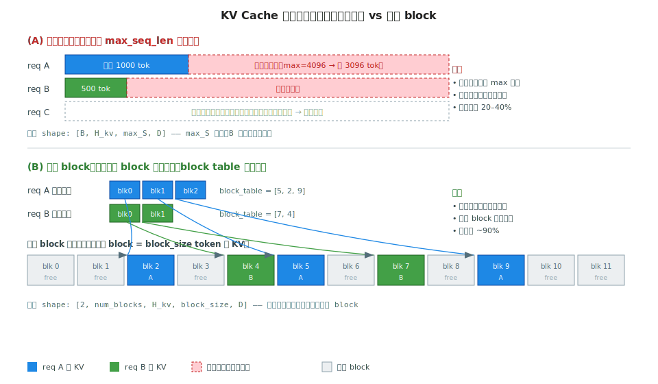
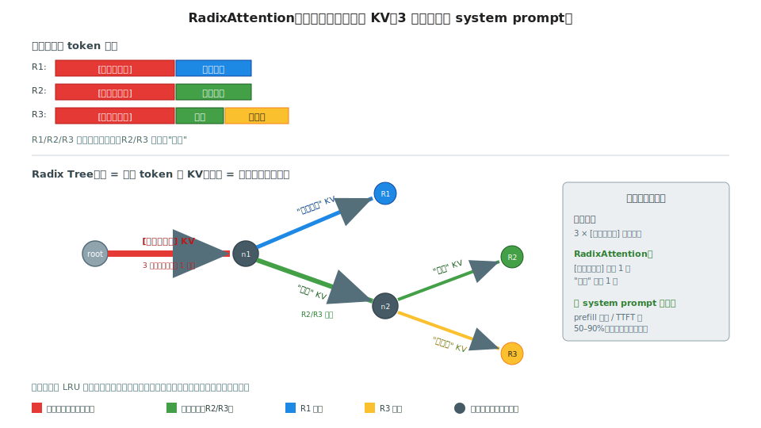

# 阶段 5｜KV Cache、调度器与显存管理 ★★★★★ ✓

> 一句话定位：把推理引擎"显存怎么排、请求怎么调、KV 怎么省"这条主线打通——从 KV cache 物理布局，到 continuous batching / chunked prefill 调度，到 prefix cache / PD 分离 / KV 量化 / offload，让你看到一个 TTFT 或吞吐不达标的线上服务时，能立刻定位是布局、调度还是 KV 容量的问题。

## 目录

- [5.0 为什么需要这一层](#50-为什么需要这一层)
- [5.1 核心概念与术语](#51-核心概念与术语)
- [5.2 KV Cache 布局：从 [B,H,S,D] 到 paged block](#52-kv-cache-布局从-bhsd-到-paged-block)
- [5.3 Continuous Batching：Orca → vLLM scheduler](#53-continuous-batchingorca--vllm-scheduler)
- [5.4 Chunked Prefill：prefill / decode 混跑](#54-chunked-prefillprefill--decode-混跑)
- [5.5 Prefix Cache 与 RadixAttention](#55-prefix-cache-与-radixattention)
- [5.6 PD 分离：Disaggregated Prefill / Decode](#56-pd-分离disaggregated-prefill--decode)
- [5.7 KV 量化：FP8 / INT8 / INT4 KV](#57-kv-量化fp8--int8--int4-kv)
- [5.8 KV offload：CPU / NVMe / 远端](#58-kv-offloadcpu--nvme--远端)
- [5.9 最小可运行示例：一个分页 KV 管理器](#59-最小可运行示例一个分页-kv-管理器)
- [5.10 性能与调优](#510-性能与调优)
- [5.11 常见坑与 FAQ](#511-常见坑与-faq)
- [自测](#自测)
- [5.12 延伸阅读](#512-延伸阅读)

---

## 5.0 为什么需要这一层

阶段 4 §4.3 讲过 PagedAttention 的 kernel 视角——KV 怎么分页、attention 怎么按 block table 间接访存。但那只是**一个 kernel**。真正决定推理服务吞吐和延迟的，是它上面那一整层：**显存怎么排、请求怎么调度、KV 容量不够时怎么办**。这一层就是本章。

四个真实场景，全都不是 kernel 能解决的：

1. **吞吐打不上去**：单请求 decode 时 GPU 利用率只有 10%——因为 batch=1 时 decode 是 memory-bound 的 GEMV（回阶段 0 §0.2.2 的 ridge point）。解法不是换 kernel，是 **continuous batching** 把几十条请求拼成一个大 batch。
2. **TTFT 抖动严重**：一条 32K 的长 prompt 进来，把后面所有请求的首 token 全卡住几秒——因为 prefill 独占了 GPU。解法是 **chunked prefill**，把长 prompt 切块、与 decode 混跑。
3. **多轮对话重复计算**：同一个 system prompt 被几千个请求重复 prefill——解法是 **prefix cache / RadixAttention**，让相同前缀的 KV 只算一次、跨请求共享。
4. **KV 把显存吃光**：长 context + 大 batch 时，KV cache 比模型权重还大——解法是 **KV 量化**（FP8/INT8）和 **KV offload**（倒到 CPU/NVMe）。

这些技术有一条共同主线：**KV cache 是推理的核心资源，调度器是分配这个资源的大脑**。阶段 4 给了"单个请求的 attention 怎么算快"，本章给"成百上千个请求怎么在有限显存里高效共享"。

读完之后你应当能：

1. 给定模型 config + 显存预算，估出能并发多少请求、KV cache 占多少、还剩多少给 batch；
2. 看到一个 TTFT / TPOT / 吞吐不达标的服务，判断瓶颈在**布局、调度、还是 KV 容量**；
3. 解释 continuous batching、chunked prefill、prefix cache、PD 分离各自解决什么、代价是什么；
4. 选对 KV 省显存的手段——量化 vs offload vs PD 分离，各自适用场景；
5. 读懂 vLLM `Scheduler` / `BlockManager` 和 SGLang `RadixCache` 的核心数据结构。

---

## 5.1 核心概念与术语

本章术语集中在"KV 资源"与"调度指标"两类。前者是被管理的对象，后者是衡量管理好坏的尺子。

| 缩写 / 术语 | 全称 | 一句话 |
|---|---|---|
| KV cache | Key/Value Cache | 历史 token 的 K/V，避免 decode 时重算前缀（阶段 1 §1.2.2） |
| block / page | KV block | 固定大小的 KV 分配单元，典型 16 token（阶段 4 §4.3） |
| block table | Block Table | 逻辑 token 序列 → 物理 block 的映射表 |
| prefill | Prefill | 处理输入 prompt、一次性算出全部 KV 的阶段，compute-bound |
| decode | Decode | 逐 token 自回归生成，memory-bound |
| **TTFT** | Time To First Token | 从请求到第一个 token 的延迟，**prefill 决定** |
| **TPOT / ITL** | Time Per Output Token / Inter-Token Latency | 相邻输出 token 间隔，**decode 决定** |
| **E2E** | End-to-End latency | 整个请求的总耗时 |
| **goodput** | Goodput | 满足 SLO 前提下的有效吞吐（不是裸 throughput） |
| continuous batching | Continuous Batching | 请求级动态拼 batch，完成就退、新来就进（Orca） |
| chunked prefill | Chunked Prefill | 把长 prompt 的 prefill 切块，与 decode 混在一个 step（SARATHI） |
| prefix cache | Prefix Cache | 相同前缀的 KV 跨请求复用 |
| RadixAttention | RadixAttention | SGLang 用基数树（radix tree）管理 prefix 共享 |
| PD 分离 | Prefill/Decode Disaggregation | prefill 与 decode 跑在不同 GPU/节点（阶段 3 §3.5 是通信侧） |
| preemption | Preemption | 显存不够时把某请求的 KV 换出（swap）或丢弃（recompute） |
| swap | Swap | 把 KV block 倒到 CPU 内存，之后换回 |
| HBM 利用率 | — | KV cache 实际占用 / 可用显存，碎片越少越高 |

> 三个核心指标的因果关系（贯穿本章）：
> - **TTFT ← prefill** ← prompt 长度、chunked prefill、prefix cache 命中
> - **TPOT ← decode** ← batch size、KV 读带宽、continuous batching
> - **吞吐 / goodput** ← 上面两者的平衡 ← 调度策略、KV 容量
>
> 优化任何一个指标，本质都是在"显存换延迟"或"延迟换吞吐"之间做取舍——没有免费的午餐，只有适配场景的 trade-off。

---

## 5.2 KV Cache 布局：从 [B,H,S,D] 到 paged block

阶段 4 §4.3 从 kernel 视角讲了 PagedAttention 怎么按 block table 间接访存。本节从**内存管理视角**补全另一半：KV cache 在显存里到底怎么排，为什么从"连续大张量"演进到"分页 block"。这是理解后面所有调度技术的物理基础。

### 5.2.1 KV cache 的体量与维度

回阶段 1 §1.2.2 的公式，KV cache 总字节数：

$$\text{KV bytes} = 2 \times L \times B \times S \times H_{kv} \times d \times \text{dtype bytes}$$

前 `2` 是 K + V。代入 LLaMA-3-70B（L=80，H\_kv=8，d=128，BF16）、B=32、S=8192：

$$2 \times 80 \times 32 \times 8192 \times 8 \times 128 \times 2 \approx 86 \text{ GB}$$

**比模型权重（140 GB BF16）的一半还多**。这就是为什么 KV cache 是推理显存的头号矛盾——长 context + 大 batch 下，它能轻松超过权重本身。

逻辑上 KV 是个五维张量 `[L, 2, B, H_kv, S, D]`，但**怎么把它摆进物理显存**有讲究——尤其是 `B` 和 `S` 这两个**运行时才确定、且不断变化**的维度。

### 5.2.2 连续布局：`[B, H_kv, max_S, D]` 的两个碎片



最直觉的做法（早期 HF transformers、FasterTransformer）：**每条请求预分配一整段连续显存**，shape `[B, H_kv, max_seq_len, D]`。

两个致命碎片（SVG 上半部分）：

1. **内部碎片（internal fragmentation）**：必须按 `max_seq_len` 预留。请求实际只生成 1000 token、但 max=4096，**剩 3096 个 slot 全程空占**。真实负载里平均利用率常低于 30%。
2. **外部碎片（external fragmentation）**：请求结束后释放的段大小不一，新请求要找一段**足够大的连续空间**——总剩余够、但凑不出连续段，只能排队。

实测：连续布局的 HBM 利用率只有 **20–40%**。剩下的显存被碎片占着，能并发的 batch size 被死死压住——**直接把 decode 锁在 memory-bound 区**（回阶段 0 §0.2.2）。

### 5.2.3 分页布局：固定 block + 间接映射

PagedAttention 的解法搬自操作系统虚拟内存（SVG 下半部分）：

- **物理池**：一段连续显存切成 N 个**固定大小 block**，每 block 装 `block_size`（典型 16）个 token 的 K+V；
- **物理张量 shape**：`[2, num_blocks, H_kv, block_size, D]`（2 = K/V）；
- **block table**：每请求一个 `List[int]`，按逻辑顺序记录用了哪些物理 block——逻辑连续、物理离散。

三个直接收益：

| 收益 | 机制 |
|---|---|
| **内部碎片几乎消失** | 按需一次分一个 block，只有最后一个 block 有少量尾部浪费（< block\_size 个 slot） |
| **外部碎片消失** | 所有 block 等大，任意空 block 都能用，不需要连续 |
| **block 可共享 / 换出** | block table 改个指针就能让多请求共享同一物理 block（prefix cache）、或把 block 换到 CPU（offload） |

代价（阶段 4 §4.3.3 已量化）：每次 attention 多一层 block table lookup（~0 开销，表常驻 L1）+ 物理地址不连续破坏 coalesced access（~5–10% 带宽损失）。**这点损失换来 batch size 翻倍以上，绝对划算。**

利用率从 20–40% 拉到 **~90%**——这是 vLLM 相对 HF transformers 吞吐提升的核心来源之一。

### 5.2.4 layer-major vs token-major：另一个布局轴

除了"连续 vs 分页"，KV 在**层（L）维度**还有一个排布选择，影响 PD 分离传输和 offload 效率：

| 布局 | 物理排列 | 优势 | 代价 |
|---|---|---|---|
| **layer-major** | 同一层所有 token 的 KV 连在一起 | attention kernel 按层读，访存连续 | 单请求的 KV 散在各层，整段传输要 gather |
| **token-major** | 同一 token 所有层的 KV 连在一起 | 单请求 KV 是一整段，PD 传输 / offload / swap 友好 | attention 读单层要跨步访存 |

vLLM 默认 **layer-major**（kernel 访存优先）；PD 分离场景下部分实现会转 token-major 或做中间 gather，让 KV 整段走 RDMA（呼应阶段 3 §3.5 的传输路径讨论）。**没有绝对最优，取决于你优化 attention 读还是整段传输。**

### 5.2.5 怎么算"还能装多少请求"

工程上最常问的问题：给定显存，能开多大 batch？vLLM 的算法（`gpu_memory_utilization` 默认 0.9）：

```
可用显存   = 总显存 × gpu_memory_utilization − 模型权重 − 激活峰值 − 其它 buffer
KV 总容量  = 可用显存 / (单 token KV 字节)
num_blocks = KV 总容量 / block_size
```

单 token KV 字节 = `2 × L × H_kv × d × dtype_bytes`。LLaMA-3-70B、BF16、H100×8 TP=8（每卡 1/8 权重 = 17.5 GB）：

```
单卡可用 = 80 × 0.9 − 17.5 − ~6 ≈ 48.5 GB
单 token KV（每卡，TP=8 后 H_kv=1）= 2 × 80 × 1 × 128 × 2 = 40 KB
KV slot 总数 = 48.5 GB / 40 KB ≈ 1.27 M token
```

这 127 万 token 在所有并发请求间共享——可以是 32 条 × 8K，也可以是 256 条 × 5K。**调度器的工作就是把这池子 slot 分配到请求上**，这是 §5.3 continuous batching 的起点。

> 心智模型：**KV cache 是一个全局 token slot 池，布局决定这个池子有多大、碎片多少；调度器决定怎么把 slot 发给请求。** 布局（本节）和调度（§5.3+）是显存管理的两条腿，缺一不可。

---

## 5.3 Continuous Batching：Orca → vLLM scheduler

§5.2 把 KV cache 拆成了一个全局 token slot 池。本节回答下一个问题：**这些 slot 怎么分给一波又一波动态到达、长度各异的请求，让 GPU 一刻不闲？** 答案是 continuous batching——现代推理引擎吞吐的第一杠杆。

### 5.3.1 Static batching 的浪费

最朴素的批处理（早期 serving 框架）：**攒够一批请求一起送进 GPU，整批跑完再收下一批**。问题出在 LLM 生成长度**高度不齐**——同一批里有的生成 4 个 token，有的生成 500 个。

SVG 上半部分：R1 生成 4 token 后**无事可做，但必须空转等到 R3 的 16 token 全部生成完**，整批才结束。这段空转是纯浪费：

- **GPU 利用率被最长请求拖死**：短请求占着 batch slot 空转，估算 ~50% 的 slot-step 在做无用功；
- **新请求进不来**：哪怕 R1 早就空出位置，新请求也得等整批结束才能上车——TTFT 暴涨。

根因：**调度粒度是"一批请求"（request-level）**，而 LLM 的自然工作单元是"一个 token step"。

### 5.3.2 Continuous batching：iteration-level scheduling

Orca（OSDI'22）的核心洞察：**把调度粒度从"一批请求"降到"一个 step"**——每个 decode step 结束后重新审视 batch，完成的请求立即退出、空出的 slot 立即补新请求。也叫 **iteration-level scheduling** 或 in-flight batching。

SVG 下半部分：R1 在第 4 步完成，**slot 1 立即被 R5 接管**；R4 完成后 slot 4 接 R8、再接 R9。同样的时间窗口，static batching 跑完 4 条，continuous batching 跑完 **9 条**。

为什么这在 LLM 上特别有效——回阶段 0 §0.2.2 的 ridge point：

- decode 单请求是 memory-bound 的 GEMV，算术强度 ~1，GPU 算力闲置；
- 把 N 条请求的 decode 拼成一个 batch，**GEMV 升级成 GEMM**，算术强度 → N，推到 compute-bound；
- batch 越满，算力利用率越高——而 continuous batching 让 batch **时刻保持满载**。

这是"调度即性能"最直接的体现：**没换任何 kernel，纯靠调度把吞吐拉高数倍**。

### 5.3.3 vLLM scheduler 的工作循环

vLLM 把上面的思想落成一个清晰的状态机。三个队列 + 一个调度循环：

| 队列 | 含义 |
|---|---|
| `waiting` | 已收到、还没开始 prefill 的请求 |
| `running` | 正在 decode 的请求（占着 KV block） |
| `swapped` | 因显存不足被换出的请求（KV 倒到 CPU 或待 recompute） |

每个 step 的调度逻辑（简化）：

```python
def schedule_step():
    # 1) 能否接纳 waiting 队列的新请求做 prefill？
    while waiting and can_allocate_kv(waiting[0]):
        req = waiting.pop(0)
        allocate_kv_blocks(req)        # 从 block 池分配
        running.append(req)

    # 2) running 里每条推进一个 token
    for req in running:
        if need_new_block(req):        # 序列变长，要新 block
            if not allocate_one_block(req):
                preempt(req)           # 显存不够 → 抢占

    # 3) 执行这一个 step（prefill + decode 混在一个 batch）
    model_step(running)

    # 4) 完成的请求退出，归还 KV block
    for req in running:
        if req.finished():
            free_kv_blocks(req)
            running.remove(req)
```

两个关键决策点：

- **何时接纳新请求（admission）**：`can_allocate_kv` 检查 block 池是否还装得下新请求的 prefill。激进接纳 → 吞吐高但可能频繁抢占；保守 → 平稳但 GPU 空。vLLM 用 `gpu_memory_utilization` 留余量。
- **显存不足怎么抢占（preemption）**：两种策略——
  - **swap**：把被抢占请求的 KV block 倒到 CPU 内存，之后换回（省重算，但占 PCIe 带宽）；
  - **recompute**：直接丢弃 KV，请求重新排队、prefill 重算（省 CPU 内存，但浪费算力）。
  - vLLM 默认 recompute（短请求重算比 swap 往返快），长请求场景可切 swap。

### 5.3.4 源码定位与配置

源码导览（`vllm` 仓库，v1 架构）：

| 路径 | 内容 |
|---|---|
| `vllm/v1/core/sched/scheduler.py` | 调度主循环、admission、preemption |
| `vllm/v1/core/kv_cache_manager.py` | block 池分配、prefix cache |
| `vllm/v1/core/sched/output.py` | 每 step 的调度结果（哪些请求、各跑多少 token） |
| `vllm/config.py` | `max_num_seqs`、`max_num_batched_tokens` 等旋钮 |

关键配置旋钮：

| 参数 | 作用 | 调优方向 |
|---|---|---|
| `max_num_seqs` | batch 里最多多少条请求 | 大 → 吞吐高、显存压力大 |
| `max_num_batched_tokens` | 一个 step 最多处理多少 token（含 prefill chunk） | 与 chunked prefill 联动，见 §5.4 |
| `gpu_memory_utilization` | KV 池占多少显存（默认 0.9） | 太高易 OOM，太低浪费 |
| `preemption_mode` | `recompute` / `swap` | 长请求多用 swap |

> 心智模型：**continuous batching = 把"批"这个静态概念拆成"每 step 动态重组的请求集合"。** 调度器是一个每个 token step 都重新决策"谁上车、谁下车、谁被挤下去"的实时分配器。它本身不算任何 attention，但决定了 GPU 的算力有没有被喂饱——这就是 §5.0 说的"调度器是分配 KV 资源的大脑"。

---

## 5.4 Chunked Prefill：prefill / decode 混跑

§5.3 的 continuous batching 把 decode 喂饱了，但留了个尾巴：**prefill 和 decode 抢同一个 GPU，谁也不让谁。** 一条长 prompt 进来做 prefill，会把所有正在 decode 的请求卡住——TTFT 和 TPOT 互相打架。chunked prefill（SARATHI，2023）是化解这个矛盾的关键调度技巧。

### 5.4.1 prefill 与 decode 的根本冲突

两个阶段的计算特征截然相反（回阶段 0 §0.2.2、阶段 1 §1.5）：

| 阶段 | 一次处理 token 数 | 计算特征 | GPU 状态 |
|---|---|---|---|
| **prefill** | 整段 prompt（可达数千~数万） | compute-bound 大 GEMM | 算力打满 |
| **decode** | 每请求 1 个 | memory-bound GEMV | 算力闲置、带宽打满 |

问题：在一个 step 里**两者只能二选一**——

- **prefill 优先**：长 prompt（如 32K）的 prefill 独占 GPU 几百毫秒，这期间所有 decode 请求**一个 token 都吐不出来**，TPOT 出现巨大毛刺；
- **decode 优先**：新请求的 prefill 一直排队，TTFT 拖长。

朴素 continuous batching 默认 prefill 优先（先把新请求的 KV 算出来才能 decode），所以**长 prompt 一来，整个服务的 TPOT 就抖动**——这是线上最常见的延迟投诉来源。

### 5.4.2 chunked prefill：把长 prefill 切成小块

SARATHI 的解法：**把一条长 prompt 的 prefill 切成固定大小的 chunk，每个 step 只做一块，剩下的 token budget 拿来和 decode 请求拼在同一个 batch 里跑。**

核心是一个 **token budget**（`max_num_batched_tokens`，§5.3.4 那个旋钮）。每个 step 按这个预算分配：

```
token_budget = max_num_batched_tokens   # 例如 2048

每个 step：
  1) 先塞所有 running 的 decode 请求       （每条 1 token，假设 60 条 → 60 token）
  2) 剩余预算 = 2048 − 60 = 1988
  3) 用剩余预算切一块 prefill              （长 prompt 取 1988 token 这一片）
  4) decode + prefill-chunk 拼成一个 batch 一起跑
```

时序对比（一条 8000-token prompt + 若干 decode 请求，budget=2048）：

```
不切块（prefill 优先）：
  step k:   [prefill 8000 tok ████████████████]  decode 全停 → TPOT 毛刺 ~400ms
  step k+1: [decode 60]
  step k+2: [decode 60] ...

chunked prefill：
  step k:   [decode 60][prefill chunk 1988 ███]   ← decode 不间断
  step k+1: [decode 60][prefill chunk 1988 ███]
  step k+2: [decode 60][prefill chunk 1988 ███]
  step k+3: [decode 60][prefill chunk 1988 ███]   ← 4 步切完 8000，每步 decode 都吐 token
```

收益：

- **TPOT 平稳**：decode 不再被长 prefill 打断，每个 step 都推进；
- **GPU 利用率更高**：decode（memory-bound）+ prefill chunk（compute-bound）**混在一个 batch，算力和带宽同时被吃满**——这是 chunked prefill 的隐藏红利，两种 workload 正好互补;
- **代价**：长 prompt 的 TTFT 略升（切块串行，总 prefill 时间稍长），但**整体延迟分布平滑得多**。

### 5.4.3 token budget 怎么调

`max_num_batched_tokens` 是 chunked prefill 的核心旋钮，权衡 TTFT 与 TPOT：

| budget 取值 | prefill chunk | 效果 |
|---|---|---|
| 小（如 512） | 切得碎 | decode 几乎不受干扰、TPOT 最稳；但 prefill 慢、长 prompt TTFT 高 |
| 大（如 8192） | 切得粗 | prefill 快、TTFT 低；但单 step 可能被一大块 prefill 主导、TPOT 抖 |
| 关闭 chunked prefill | 不切 | 回到 prefill 优先，长 prompt 必抖 |

经验起点：**`max_num_batched_tokens` 设为 2048~4096**，再按 SLO 微调——TPOT 投诉多就调小，TTFT 投诉多就调大。vLLM v1 默认开启 chunked prefill；SGLang 也有对应的 `chunked-prefill-size`。

调优纪律（呼应阶段 0 §0.5 的 Roofline 思路）：

- **TPOT 毛刺** → 监控发现某些 step 处理 token 数远超均值 → 调小 budget；
- **TTFT 偏高但 TPOT 平稳** → prefill 被切太碎 → 调大 budget 或针对短 prompt 关闭切块。

### 5.4.4 与 prefix cache / PD 分离的关系

chunked prefill 不是孤立技术，它和后面两节是互补 / 替代关系：

- **+ prefix cache（§5.5）**：prefill 前先查前缀缓存，命中的部分直接跳过，**没命中的部分才走 chunked prefill**——两者叠加，长 system prompt 场景收益最大；
- **vs PD 分离（§5.6）**：PD 分离是另一条路——干脆把 prefill 和 decode 放到**不同 GPU**，物理隔离，根本不抢。chunked prefill 是"单机混跑、软件错峰"，PD 分离是"多机分跑、硬件隔离"。小集群用 chunked prefill 够了，大规模高 SLO 服务才上 PD 分离。

> 心智模型：**chunked prefill = 用一个 token budget 把每个 step 的算力，在"新请求的 prefill"和"老请求的 decode"之间动态切分。** 它让一台 GPU 同时扮演好"快速接客"（低 TTFT）和"稳定出餐"（低 TPOT）两个角色——这是单机推理延迟调优的核心手段。

---

## 5.5 Prefix Cache 与 RadixAttention

§5.2 提到 paged 布局让 block 可以跨请求共享。本节把这个能力用到极致：**相同前缀的 KV 只算一次、所有请求共用。** 在 system prompt、few-shot、多轮对话这些"前缀高度重复"的真实负载里，prefix cache 是 TTFT 的最大杠杆——常常比换 kernel 更管用。

### 5.5.1 重复前缀无处不在

线上推理的 prompt 极少是全新的，绝大多数共享大段前缀：

| 场景 | 重复的前缀 |
|---|---|
| 同一应用的所有请求 | 几百~几千 token 的 **system prompt** |
| few-shot 推理 | 相同的 **示例集** |
| 多轮对话 | 每轮都带 **完整历史**，第 N 轮的前缀 = 前 N−1 轮 |
| Agent / 工具调用 | 固定的 **工具描述 + 角色设定** |
| RAG | 相同知识库片段被多个 query 复用 |

朴素做法：每个请求独立 prefill，**同一段 system prompt 被算几千遍**——纯浪费。回阶段 1 §1.5：prefill 是 compute-bound 大 GEMM，重复算长前缀直接吃掉 GPU 算力、推高 TTFT。

prefix cache 的核心思想：**KV cache 只跟 token 内容有关，与请求无关。** 同样的 token 前缀，算出来的 KV 完全一样——那就缓存它，下次命中直接复用,跳过这段 prefill。

### 5.5.2 vLLM 的 hash-based prefix cache

vLLM 的实现简单直接：**按 block 粒度对 token 内容做 hash,相同 hash 的 block 直接复用。**

```
每个 block（16 token）算一个 hash：
  block_hash = hash(前缀所有 token + 本 block 的 token)   # 含前缀，保证位置一致

prefill 时：
  for block in prompt_blocks:
      if block_hash in cache:        # 命中
          复用物理 block，跳过这 16 token 的 prefill
      else:                          # 未命中
          分配新 block，算 KV，存入 cache
```

关键点：hash **必须包含完整前缀**——因为 RoPE 让 KV 与绝对位置绑定（回阶段 1 §1.2.3），位置 100 和位置 200 的同一个 token，KV 不同。所以 hash 是"前缀链式"的:第 k 个 block 的 hash 依赖前 k−1 个 block。

开启方式：`--enable-prefix-caching`（vLLM v1 默认开）。命中部分**完全跳过 prefill**——长 system prompt 场景 TTFT 直接砍半甚至更多。

### 5.5.3 SGLang 的 RadixAttention



SGLang 把 prefix 共享做成一棵 **基数树（radix tree）**——比 vLLM 的扁平 hash 表更强,能自动发现**任意层级的部分共享**。

数据结构（SVG）：

- **边 = 一段连续 token 的 KV**；
- **路径 root→节点 = 一条请求的前缀**；
- **分叉点 = 前缀开始不同的位置**。

SVG 的例子：R1/R2/R3 都以 `[系统提示词]` 开头 → 这段 KV 是 root 出来的第一条边，**三者共享、只算一次**；R2/R3 还都接了"讲个" → 在 `n1` 之后又共出一条边；最后才各自分叉到"笑话""谜语吧"。

相比 hash 表的优势：

| 维度 | vLLM hash | SGLang radix tree |
|---|---|---|
| 共享粒度 | block（16 token）对齐 | **任意 token 边界**（树自动找最长公共前缀） |
| 部分共享 | 只要前缀 block 完全一致 | 自动发现多层级分叉共享 |
| 淘汰 | block 级 LRU | **叶子 LRU**：回收最久未访问的分支，被引用节点不动 |
| 实现复杂度 | 低 | 中 |

RadixAttention 是 SGLang 在多轮对话、agent、结构化生成场景吞吐领先的核心——这些场景前缀共享率极高（详见阶段 6 SGLang 源码深读）。

### 5.5.4 命中率、淘汰与代价

prefix cache 不是免费的,几个工程权衡：

1. **命中率决定收益**:前缀重复率高(同 app、固定 system prompt)→ 命中率 80%+,TTFT 砍半;前缀几乎全新(每请求独立长文档)→ 命中率低,缓存反而占显存。
2. **缓存占显存**:缓存的 block 占着 KV 池,挤压可用 batch slot。显存吃紧时按 **LRU 淘汰**——SGLang 回收最久未访问的叶子,vLLM 回收最久未用的 block。**被当前请求引用的节点不淘汰。**
3. **hash 冲突 / 失效**:token 内容变一个,后续所有 block 的 hash 全变(链式),缓存失效。所以 prefix cache 对"前缀稳定、后缀变化"的负载最友好。
4. **与 chunked prefill 叠加(§5.4.4)**:先查缓存,命中段跳过,**未命中段才走 chunked prefill**——两者正交,生产里通常同时开。

调优观测点(呼应阶段 11 profiling):

- 监控 **prefix cache 命中率**(vLLM `gpu_prefix_cache_hit_rate` 指标);
- 命中率低且 TTFT 高 → 检查前缀是否真的重复、block\_size 是否合适;
- 显存吃紧、batch 上不去 → 缓存占用过多,考虑调小缓存配额或缩短缓存 TTL。

> 心智模型:**prefix cache = 把"KV 只跟 token 内容有关"这条性质变现。** 相同前缀算一次、存起来、人人复用。它把 prefill 的重复劳动消除掉——在前缀高度重复的真实负载里,这是比任何 kernel 优化都直接的 TTFT 杠杆。

---

## 5.6 PD 分离：Disaggregated Prefill / Decode

§5.4 的 chunked prefill 在**单机**上让 prefill 和 decode 错峰共存。但当 SLO 卡得很紧、规模很大时,软件错峰也不够——干脆把两个阶段拆到**不同 GPU 集群**,物理隔离。这就是 PD 分离(Prefill/Decode Disaggregation)。阶段 3 §3.5 讲了 KV 怎么在两端之间传(通信侧);本节讲**为什么要分、怎么编排**(调度侧)。

### 5.6.1 为什么单机混跑还不够

回 §5.4.1:prefill 和 decode 计算特征相反。chunked prefill 让它们在一个 GPU 上分时复用,但有两个绕不开的问题:

1. **互相干扰仍在**:即使切了块,prefill chunk 和 decode 还是抢同一批 SM、同一份 HBM 带宽。高负载下 TTFT 和 TPOT 仍会互相拉扯,只是幅度变小。
2. **最优配置冲突**:
   - prefill 要**算力**——偏好高 TFLOPS、大 TP;
   - decode 要**显存带宽 + KV 容量**——偏好大显存、高 batch;
   - 单机一套硬件 + 一套并行配置,**没法同时对两者最优**。

PD 分离的洞察:**让 prefill 集群和 decode 集群用各自最优的硬件和并行配置,中间只传 KV。**

| 维度 | Prefill 节点 | Decode 节点 |
|---|---|---|
| 瓶颈 | 算力（compute-bound） | 带宽 + KV 容量（memory-bound） |
| 偏好硬件 | 高 TFLOPS | 大显存、高带宽 |
| 并行配置 | 偏 TP（摊算力） | 偏 DP / EP（摊 KV、提并发） |
| 优化目标 | 低 TTFT | 低 TPOT、高并发 |
| 扩缩容 | 按 prompt 长度 / QPS | 按生成长度 / 并发数 |

**独立扩缩容**是 PD 分离最被低估的好处:prefill 重的负载(长 prompt、RAG)多加 prefill 节点;decode 重的负载(长生成、高并发)多加 decode 节点——两者解耦,资源利用率更高。

### 5.6.2 一次请求在 PD 分离下的旅程

```
                    ① prompt
   client ───────────────────────────►  Prefill 节点
                                          (TP=8, 算力优先)
                                          算完整段 KV
                                              │
                    ② KV 传输 (RDMA)          │  阶段 3 §3.5:
                    2-3 GB, 走 NIXL/Mooncake  ▼  多 HCA × 多 QP
                                          Decode 节点
                                          (DP=8, KV 容量优先)
                    ③ 逐 token 生成           │
   client ◄───────────────────────────────────┘
                    token stream
```

三段时延:

- **① prefill**:决定 TTFT 的主体——但 decode 节点不被它占用;
- **② KV 传输**:新增的开销,直接计入 TTFT。2-3 GB KV 必须在毫秒级传完,否则得不偿失(阶段 3 §3.5 整节在解决这个);
- **③ decode**:决定 TPOT——独占 decode 节点,不被任何 prefill 干扰,TPOT 极稳。

**胜负手就是 ②**:KV 传输时间必须远小于 prefill 时间,PD 分离才划算。这也是为什么 PD 分离强依赖高速 RDMA 网络——没有 multi-rail IB,KV 传输能把省下的隔离收益全吐回去。

### 5.6.3 三种方案的取舍

| 方案 | 出处 | 关键设计 | 适用 |
|---|---|---|---|
| **DistServe** | 论文(OSDI'24) | 理论框架:按 TTFT/TPOT SLO 分别给 prefill/decode 算最优并行度和配比 | 理解 PD 分离的"为什么",指导配置 |
| **Mooncake** | Moonshot 开源 | KV pool 中心化 + 跨请求复用 + 以 KV 为中心的调度 | 高 KV 复用场景(长 system prompt) |
| **vLLM v1 PD** | vLLM 官方 | `KVConnector` 抽象,后端走 NIXL;1P1D / xPyD 灵活组合 | 通用生产部署 |

**DistServe** 给的是方法论:它证明了 prefill 和 decode 各自的最优 TP/PP 度不同,并给出按 SLO 反推配比(几个 prefill 节点配几个 decode 节点)的公式。读它建立"该不该上 PD 分离、上了怎么配"的判断。

**Mooncake** 把 KV pool 抬到核心(回阶段 3 §3.5.3):prefill 产出的 KV 进池,decode 按需 fetch,且**跨请求复用**——长 system prompt 算一次进池,所有 decode 节点共享。本质是把 §5.5 的 prefix cache 提升到**集群级**。

**vLLM v1** 的工程抽象 `KVConnector`:把"KV 怎么从 P 传到 D"解耦成可插拔后端(默认 NIXL),支持 1 个 prefill + 1 个 decode(1P1D)到任意 xPyD 组合。这是大多数团队实际落地的形态。

### 5.6.4 何时该上 PD 分离

PD 分离不是默认选项,它有明确的适用边界:

**该上**:

- 规模大(数十张卡以上),prefill / decode 负载能各自喂满独立集群;
- SLO 严格(TTFT 和 TPOT 都有硬指标),单机 chunked prefill 压不住抖动;
- 有高速 RDMA 网络(multi-rail IB / RoCE),KV 传输不成瓶颈;
- prefill / decode 负载比例失衡(如长 prompt 短生成,或短 prompt 长生成),需要独立扩缩容。

**别上**:

- 小集群(几张卡):分离后两边都喂不满,不如单机 chunked prefill;
- 网络差(只有 PCIe / 慢以太网):KV 传输吃掉所有收益;
- 负载均衡、prompt 和生成都不极端:chunked prefill 已经够好。

决策顺序(呼应 §5.4.4):**先上 continuous batching → 不够再加 chunked prefill → 还不够、且规模 + 网络都到位,才上 PD 分离。** 不要跳级——PD 分离的工程复杂度(双集群、KV 传输、故障处理)远高于前两者。

> 心智模型:**PD 分离 = 把推理流水线从"一台机器分时做两件事"改成"两组机器各专精一件事,中间用 RDMA 传 KV"。** 它用网络传输的代价,换来 prefill 和 decode 的彻底解耦——各自用最优硬件、独立扩缩容、互不干扰。代价是工程复杂度和对网络的强依赖,所以是大规模高 SLO 服务的"终极手段",不是起手式。

---

## 5.7 KV 量化：FP8 / INT8 / INT4 KV

§5.2–5.6 都在"怎么分配和调度 KV"上做文章。本节换个方向:**让每个 token 的 KV 本身更小。** KV 量化把 KV cache 从 BF16 压到 FP8 / INT8 / INT4,直接成倍扩大可容纳的 token 数——长 context、大 batch 场景的关键省显存手段。

注意区分:阶段 4 §4.7 讲的是**权重 + 激活的 GEMM 量化**(让矩阵乘更快),阶段 8 讲**模型整体量化**(PTQ/AWQ/GPTQ);本节是**KV cache 专属量化**,目标不是算得快,而是**装得多**。三者粒度和动机都不同。

### 5.7.1 为什么单独量化 KV

回 §5.2.1:LLaMA-3-70B、B=32、S=8K 的 KV cache 是 86 GB,比权重一半还多。在长 context 服务里,**KV 是显存头号矛盾,不是权重**。

KV 量化的收益直接而线性:

| 精度 | 字节/元素 | 相对 BF16 | 同显存可容纳 token |
|---|---|---|---|
| BF16 | 2 | 1× | 1× |
| FP8 (E4M3/E5M2) | 1 | 2× | **2×** |
| INT8 | 1 | 2× | 2× |
| INT4 | 0.5 | 4× | **4×** |

KV 翻倍即 batch 或 context 翻倍——回阶段 0 §0.2.2,更大的 batch 把 decode 从 memory-bound 往 compute-bound 推,**省显存又顺带提吞吐**,一举两得。

为什么 KV 适合单独、激进地量化:

- KV 只用于 attention 的 `Q·Kᵀ` 和 `softmax·V`,**不参与梯度**(推理态),容错比权重高;
- decode 是 memory-bound,**KV 读带宽是瓶颈**——量化后读的字节减半,带宽压力也减半,这是量化算得快之外的隐藏红利。

### 5.7.2 per-token vs per-channel:scale 粒度

量化的核心是 scale:把 BF16 值除以 scale 映射到 INT8/FP8 范围,读时乘回(回阶段 4 §4.7.4 的 scale 思想)。**KV 量化的关键决策是 scale 沿哪个维度算。**

KV 张量是 `[..., S, H_kv, D]`。两种粒度:

| 粒度 | scale 沿哪算 | 适合谁 | 原因 |
|---|---|---|---|
| **per-token** | 每个 token 一个 scale（沿 D 维归约） | **Key 和 Value 都常用** | token 间数值幅度差异大,逐 token 归一最稳 |
| **per-channel** | 每个 channel(D 维)一个 scale | 有时用于 Key | 某些 channel 是 outlier 大户,逐 channel 隔离 |

KIVI(2024)的关键发现,值得记住:

- **Key cache 适合 per-channel 量化**——Key 的 outlier 集中在**固定几个 channel**(与 RoPE 高频维相关),per-channel 能把这些 outlier 隔离,不污染其它 channel;
- **Value cache 适合 per-token 量化**——Value 没有明显的 channel 模式,outlier 随 token 分布,per-token 更稳。

这个"Key 走 per-channel、Value 走 per-token"的非对称设计,是 KV 量化能压到 INT4 还基本不掉点的关键。per-channel 对 Key 的麻烦在于:channel 维和 attention 的归约维一致,实现上要配合 kernel(FlashInfer 等已支持 KV INT8)。

### 5.7.3 各精度的精度-显存权衡

| 方案 | scale 策略 | 显存 | 精度损失 | 适用 |
|---|---|---|---|---|
| **FP8 KV** | per-token,E4M3 | 2× | 极小(< 0.1 pt) | **H100 首选**,有硬件 FP8 支持,几乎无脑开 |
| **INT8 KV** | Key per-channel + Value per-token | 2× | 很小(KIVI 风格) | 无 FP8 硬件(A100)的等效方案 |
| **INT4 KV** | 同上 + group-wise | 4× | 中等(需调 group size) | 极致长 context,可接受小幅掉点 |

实践建议:

- **H100 上直接开 FP8 KV**——有硬件支持,精度几乎无损,显存翻倍。vLLM `--kv-cache-dtype fp8`。
- **A100 上用 INT8 KV**——没 FP8 Tensor Core(回阶段 0 §0.2.4),INT8 是等效选择,配 KIVI 风格非对称 scale。
- **INT4 KV 谨慎用**——只在显存极度吃紧(超长 context)且能容忍小幅质量下降时上,务必先在自己的 eval 集上验证掉点。

### 5.7.4 工程要点

1. **量化时机**:KV 是**生成过程中动态产生**的,所以量化是 **online**——每个新 token 算完 KV 立即量化存入 cache,读时反量化。不像权重可以 offline 量化一次。这要求量化/反量化 kernel 极快,否则吃掉省下的带宽。
2. **scale 存哪**:per-token scale 跟着 KV block 存(每 block 一组 scale),per-channel scale 全局存一份。INT4 的 group-wise 还要存 group scale,**元数据本身占一点显存**,极端压缩时要算进去。
3. **与 prefix cache 兼容**(§5.5):量化后的 KV block 一样能 hash + 共享,但**量化方案必须一致**才能复用——不同 dtype 的缓存不能混。
4. **与 PD 分离兼容**(§5.6):量化后 KV **传输量也减半**——KV 量化和 PD 分离叠加,既省显存又省传输带宽,是长 context 大规模服务的常见组合。
5. **观测掉点**:量化一定要在**自己的业务 eval 集**上测精度,别信通用 benchmark 的"无损"——不同任务对 KV 精度敏感度差异大(数学/代码任务比闲聊更敏感)。

> 心智模型:**KV 量化 = 用可控的精度损失,换取成倍的 KV 容量和读带宽。** 它和调度类技术(§5.3–5.6)正交——调度优化"怎么分配 KV",量化优化"每份 KV 多大"。H100 上 FP8 KV 几乎是免费午餐(开就对了);更激进的 INT4 则需要在精度和容量间按业务校准。详细的量化算法(GPTQ/AWQ/SmoothQuant)见阶段 8。

---

## 5.8 KV offload：CPU / NVMe / 远端

§5.7 让 KV 变小,但再小也有上限。当 context 极长、或要缓存的历史 KV 远超显存时,还有最后一招:**把暂时用不到的 KV 倒到更大更慢的存储——CPU 内存、本地 NVMe、远端节点。** 这就是 KV offload,推理显存管理的"虚拟内存"层。

### 5.8.1 显存放不下时的选择

当 KV 总量超过 HBM,有三条路(回 §5.3.3 的 preemption 已埋了伏笔):

1. **recompute(丢弃重算)**:直接扔掉 KV,需要时重新 prefill。省存储,但浪费算力——长前缀重算很贵。
2. **PD 分离(搬到别的 GPU)**:§5.6,把 KV 留在 decode 集群。但 decode 集群显存也有限。
3. **offload(倒到下层存储)**:把 KV 搬到 CPU/NVMe/远端,需要时再换回 HBM。**用更大但更慢的存储换容量。**

offload 的本质是 OS 虚拟内存的"swap"搬到 KV 上——HBM 是物理内存,CPU/NVMe 是 swap 区。paged 布局(§5.2)让这件事变得自然:**block 是搬运的最小单元,block table 改个指针就完成换入换出。**

### 5.8.2 存储层级与带宽

offload 的目标存储,带宽和容量逐级 trade-off(回阶段 0 §0.2.2 的内存层级):

| 层级 | 容量 | 到 HBM 带宽 | 换回延迟 | 适用 |
|---|---|---|---|---|
| **HBM**(本层) | 80–192 GB | — | — | 活跃 KV |
| **CPU 内存** | 数 TB | PCIe Gen5 ~64 GB/s | ~ms | 短期换出、swap preemption |
| **本地 NVMe** | 数十 TB | ~7 GB/s(PCIe Gen4 SSD) | ~10ms | 长历史、prefix 库 |
| **远端节点** | ~无限 | IB ~50 GB/s 但有网络栈开销 | ~ms+ | 集群级 KV 池(Mooncake) |

关键约束:**换回带宽必须撑得住 decode 的 KV 读节奏**。decode 每个 token 都要读全部历史 KV,如果换回比读还慢,offload 就成了瓶颈。所以 offload 的黄金法则:**只 offload 暂时不读的 KV**(已完成请求的可复用前缀、被抢占请求的历史),不能 offload 正在 decode 的活跃 KV。

GPUDirect Storage(GDS)能让 NVMe 直接 DMA 到 HBM、bypass CPU(回阶段 0 §0.3 的 P2P 思路),把 NVMe offload 的延迟压下来——是 NVMe 路径能用的关键。

### 5.8.3 LMCache:offload 的工程化

LMCache(回阶段 3 §3.5.3 通信侧提过)是目前最完整的 KV offload / 缓存层。它把上面的层级做成一个**透明的多级 KV 缓存**:

```
   ┌─────────── LMCache 多级 KV 存储 ───────────┐
   │  HBM (热)  →  CPU (温)  →  NVMe (冷)  →  远端 │
   └────────────────────────────────────────────┘
        ↑                                    
   vLLM / SGLang 通过 connector 接入,KV 自动分层
```

核心能力:

| 能力 | 说明 |
|---|---|
| **多级 spill** | HBM 满 → 自动刷到 CPU,CPU 满 → 刷 NVMe,按 LRU 逐级下沉 |
| **跨请求复用** | 把 §5.5 的 prefix cache 扩展到 CPU/NVMe——长 system prompt 的 KV 存 NVMe,所有请求复用,不占 HBM |
| **跨实例共享** | 多个推理实例共享一个 KV 存储后端,集群级复用 |
| **KV 压缩** | 配合 §5.7 量化,offload 的同时压缩,进一步省下层存储 |

LMCache 最大的价值场景是**多轮对话 / RAG**:对话历史和知识库片段的 KV 太大、HBM 装不下,但又会被反复访问。offload 到 NVMe + 跨请求复用,让"几乎无限的 KV 历史"成为可能,而 HBM 只留活跃部分。

### 5.8.4 工程要点与适用边界

1. **offload ≠ 无脑省显存**:换入换出占 PCIe/NVMe 带宽,**频繁 swap 会拖慢 decode**。只在"KV 复用率高、但 HBM 装不下"时划算;一次性、不复用的 KV,offload 不如 recompute。
2. **预取(prefetch)是关键**:调度器要**提前**把下一步要用的 KV 从下层换回 HBM,藏在当前计算后面——否则 decode 会卡在 IO 等待。这和 §5.4 chunked prefill 的 overlap 思路一脉相承。
3. **分层放置策略**:活跃 decode → HBM;近期可能复用的前缀 → CPU;长尾历史 / 知识库 → NVMe。放错层会导致频繁跨层搬运。
4. **与量化叠加(§5.7)**:offload 前先量化,下层存储占用和搬运带宽都减半——长 context 服务的标准组合是 **FP8 KV + CPU/NVMe offload**。
5. **三件套的关系**:**量化(§5.7)让 KV 变小、offload(本节)把冷 KV 搬到下层、PD 分离(§5.6)把 KV 搬到别的 GPU**——三者正交,可叠加。优先级:先量化(几乎无损)→ 再 offload(复用率高时)→ 规模大才上 PD 分离。

> 心智模型:**KV offload = 给推理加一层"虚拟内存"。** HBM 是物理内存,CPU/NVMe/远端是 swap 区,paged block 是页,调度器是带预取的 MMU。它让 KV 容量突破 HBM 上限,代价是换入换出的带宽和延迟——所以核心纪律是"只 offload 冷数据、提前预取热数据"。配合量化和 prefix cache,这层让超长 context、海量历史复用的服务成为可能。

---

## 5.9 最小可运行示例：一个分页 KV 管理器

把 §5.2 的 paged 布局 + §5.3 的 continuous batching 串成一个能跑的玩具——**纯 Python、无 GPU、无外部依赖**,专注调度逻辑本身。它模拟一个 block 池 + scheduler,让你亲眼看到请求怎么动态进出、block 怎么分配回收、显存不足怎么抢占。Capstone P1(mini-vLLM)就是在它基础上接真模型 + PagedAttention kernel。

```python
# paged_scheduler.py — 分页 KV 管理 + continuous batching 的最小模拟
from collections import deque
from dataclasses import dataclass, field

BLOCK_SIZE = 4          # 每 block 装 4 个 token 的 KV（真实是 16）
NUM_BLOCKS = 12         # 物理 block 池大小（真实是几万）
MAX_RUNNING = 4         # batch 最多并发请求数（= max_num_seqs）

@dataclass
class Request:
    rid: int
    prompt_len: int                       # prefill 要占的 token 数
    gen_len: int                          # 还要生成多少 token
    cur_len: int = 0                      # 当前序列长度
    blocks: list = field(default_factory=list)   # 持有的物理 block id（= block_table）

class BlockPool:
    """物理 block 池：分配 / 回收，模拟 §5.2 的 paged 布局"""
    def __init__(self, n):
        self.free = deque(range(n))       # 空闲 block id 队列
    def alloc(self, k):
        if len(self.free) < k:
            return None                   # 不够 → 触发抢占
        return [self.free.popleft() for _ in range(k)]
    def free_blocks(self, blocks):
        self.free.extend(blocks)
    def need_blocks(self, seq_len):       # 序列要多少 block（向上取整）
        return (seq_len + BLOCK_SIZE - 1) // BLOCK_SIZE

class Scheduler:
    """continuous batching 调度器，对应 §5.3 的工作循环"""
    def __init__(self):
        self.pool = BlockPool(NUM_BLOCKS)
        self.waiting = deque()            # 未开始的请求
        self.running = []                 # 正在 decode 的请求
        self.done = []

    def add(self, req):
        self.waiting.append(req)

    def _try_admit(self):
        # admission：能装下就把 waiting 请求拉进 running（§5.3.3 决策点 1）
        while self.waiting and len(self.running) < MAX_RUNNING:
            req = self.waiting[0]
            need = self.pool.need_blocks(req.prompt_len)
            blocks = self.pool.alloc(need)
            if blocks is None:
                break                     # 显存不够，等下一轮
            req.blocks = blocks
            req.cur_len = req.prompt_len  # prefill 一次算完整段
            self.running.append(self.waiting.popleft())

    def _preempt(self, req):
        # 抢占：recompute 策略——丢弃 KV，请求回 waiting 重排（§5.3.3 决策点 2）
        self.pool.free_blocks(req.blocks)
        req.blocks, req.cur_len = [], 0
        self.running.remove(req)
        self.waiting.appendleft(req)

    def step(self):
        self._try_admit()
        # 每条 running 推进一个 token（decode）
        for req in list(self.running):
            req.cur_len += 1
            req.gen_len -= 1
            # 序列变长，可能要新 block
            if self.pool.need_blocks(req.cur_len) > len(req.blocks):
                extra = self.pool.alloc(1)
                if extra is None:
                    self._preempt(req)    # 没 block 了 → 抢占最后进来的
                    continue
                req.blocks += extra
            # 完成 → 退出并归还 block
            if req.gen_len <= 0:
                self.pool.free_blocks(req.blocks)
                self.running.remove(req)
                self.done.append(req.rid)

    def busy(self):
        return self.waiting or self.running


if __name__ == "__main__":
    sched = Scheduler()
    # 5 条请求，长度各异（模拟真实负载不齐）
    for rid, (p, g) in enumerate([(6, 4), (3, 8), (10, 3), (4, 6), (5, 5)]):
        sched.add(Request(rid, prompt_len=p, gen_len=g))

    t = 0
    while sched.busy():
        sched.step()
        used = NUM_BLOCKS - len(sched.pool.free)
        print(f"step {t:2d} | running={[r.rid for r in sched.running]} "
              f"waiting={[r.rid for r in sched.waiting]} "
              f"blocks={used}/{NUM_BLOCKS} done={sched.done}")
        t += 1
    print(f"\n全部完成，共 {t} 步，完成顺序 {sched.done}")
```

运行 `python paged_scheduler.py`,完整输出：

```
step  0 | running=[0, 1, 2, 3] waiting=[4] blocks=8/12 done=[]
step  1 | running=[0, 1, 2, 3] waiting=[4] blocks=9/12 done=[]
step  2 | running=[0, 1, 3] waiting=[4] blocks=7/12 done=[2]
step  3 | running=[1, 3, 4] waiting=[] blocks=6/12 done=[2, 0]
step  4 | running=[1, 3, 4] waiting=[] blocks=7/12 done=[2, 0]
step  5 | running=[1, 4] waiting=[] blocks=5/12 done=[2, 0, 3]
step  6 | running=[1, 4] waiting=[] blocks=6/12 done=[2, 0, 3]
step  7 | running=[] waiting=[] blocks=0/12 done=[2, 0, 3, 1, 4]

全部完成，共 8 步，完成顺序 [2, 0, 3, 1, 4]
```

三个值得盯着看的现象,正好印证前面几节:

1. **完成顺序 ≠ 到达顺序**(`[2,0,3,1,4]` vs 到达 `[0,1,2,3,4]`)——R2 生成最短(gen=3)最先退,§5.3 continuous batching 的核心:谁先生成完谁先走,不等整批。注意 R4 虽然 gen 不长,但它 step 0 时因 `MAX_RUNNING=4` 满员被挡在 waiting,直到 step 3 有 slot 释放才进来,所以完成最晚——**完成顺序由"生成长度 + 何时被接纳"共同决定**。
2. **block 数动态涨落**(8→9→7→6→7→5→6→0)——请求退出立即归还 block(§5.2),decode 变长时再按需追加;末尾归零是全部完成、block 全部回收。
3. **admission 被 `MAX_RUNNING` 卡住**——R4 在 waiting 里等到 step 3(R2、R0 先后完成、running 腾出位置)才被接纳(§5.3 决策点 1)。这正是 batch 满员时新请求排队的真实行为。

把 `NUM_BLOCKS` 调小到 6 再跑,会看到 decode 中途缺 block、触发 `_preempt` 抢占和排队——这就是显存不足时调度器的真实行为(§5.3 决策点 2)。

---

## 5.10 性能与调优

KV cache 和调度的调优,本质是在 §5.1 那三个指标(TTFT / TPOT / 吞吐)间找平衡。按"先测哪个指标不对 → 再定位是布局/调度/容量 → 最后动哪个旋钮"的顺序。

### 第一步:看指标,定方向

| 症状 | 大概率原因 | 去看哪节 |
|---|---|---|
| **吞吐低、GPU 利用率低** | batch 没喂满,decode 卡在 memory-bound | §5.3 continuous batching、`max_num_seqs` |
| **TTFT 高且抖动** | 长 prompt 独占 GPU | §5.4 chunked prefill、`max_num_batched_tokens` |
| **TTFT 高但前缀重复多** | prefix cache 没开或命中率低 | §5.5、`--enable-prefix-caching` |
| **频繁 OOM / 抢占** | KV 池太小或 batch 太激进 | §5.2 容量估算、`gpu_memory_utilization` |
| **长 context 装不下** | KV 太大 | §5.7 量化、§5.8 offload |
| **TPOT 和 TTFT 互相拖累、SLO 压不住** | 单机分时复用到极限 | §5.6 PD 分离 |

### 第二步:核心旋钮速查

| 旋钮(vLLM) | 调大 | 调小 |
|---|---|---|
| `max_num_seqs` | 吞吐↑、显存压力↑、TPOT 略↑ | 延迟稳、吞吐↓ |
| `max_num_batched_tokens` | TTFT↓、prefill 快、TPOT 可能抖 | TPOT 稳、长 prompt TTFT↑ |
| `gpu_memory_utilization` | KV 池大、batch 大、易 OOM | 安全、浪费显存 |
| `--kv-cache-dtype fp8` | KV 容量×2、带宽压力↓ | (默认 auto) |
| `--enable-prefix-caching` | 重复前缀场景 TTFT 大降 | 前缀不重复时省点显存 |

### 第三步:监控这几个量(呼应阶段 11)

- **KV cache 利用率**:太低说明碎片或 batch 不足;持续 100% 说明该扩容或量化。
- **prefix cache 命中率**(`gpu_prefix_cache_hit_rate`):低于预期就查前缀是否真重复。
- **抢占次数 / swap 量**:频繁抢占说明 `gpu_memory_utilization` 太激进或 batch 太大。
- **TTFT / TPOT 分位数(p50/p99)**:看 p99 而非均值——长尾才是 SLO 杀手。

调优纪律(贯穿全书):**先测量、定位到具体指标,再动一个旋钮、重测对比。** 一次调一个,否则分不清谁起的作用——和阶段 3 §3.10 调 NCCL、阶段 0 §0.5 调 Roofline 是同一套方法论。

---

## 5.11 常见坑与 FAQ

1. **`block_size` 改大改小都变慢**:太小(如 4)→ block table 长、间接访存开销大;太大(如 64)→ 内部碎片回来、prefix 共享粒度粗。**16 是 vLLM/SGLang 的经验最优**(阶段 4 §4.3 已强调),别乱改。
2. **开了 continuous batching 吞吐还是低**:多半是 `max_num_seqs` 太小或 `gpu_memory_utilization` 太保守,batch 根本没喂满。先确认 KV 池实际用了多少。
3. **chunked prefill 开了 TTFT 反而升**:budget 切太碎,长 prompt prefill 被拆成太多步。调大 `max_num_batched_tokens`(§5.4.3)。
4. **prefix cache 命中率为 0**:检查前缀是否**逐 token 完全一致**——system prompt 里若混入时间戳、随机 ID,会让 hash 全失效(§5.5.4)。
5. **FP8 KV 精度掉点**:某些任务(数学/代码)对 KV 精度敏感。先在业务 eval 集验证,别信通用 benchmark 的"无损"(§5.7.4)。
6. **PD 分离上了反而更慢**:KV 传输成瓶颈——多半是网络只有 PCIe/慢以太网,或没配多 HCA × 多 QP(阶段 3 §3.5)。小集群 + 慢网络不该上 PD 分离(§5.6.4)。
7. **KV offload 后 decode 卡顿**:offload 了正在用的活跃 KV,或没做预取。只 offload 冷数据、提前换回热数据(§5.8.4)。
8. **抢占(preemption)频繁导致吞吐骤降**:`gpu_memory_utilization` 太激进,decode 中途频繁缺 block。调低利用率留余量,或减小 `max_num_seqs`。
9. **多轮对话第二轮没加速**:没开 prefix cache,或对话历史的 KV 已被 LRU 淘汰。长对话场景配合 §5.8 offload 保留历史 KV。
10. **显存账算不平、莫名 OOM**:忘了激活峰值和临时 buffer(§5.2.5 公式里的减项)。`gpu_memory_utilization` 不是只留给 KV,还要覆盖激活——从 0.9 往下调试。

---

## 自测

1. **（概念）** continuous batching 相比 static batching，把调度粒度从"一批请求"降到了什么？为什么这对 decode 特别有效？
2. **（应用）** 线上偶发某些请求 TTFT p99 暴涨，和"有人发了超长 prompt"时间吻合。根因是什么？开哪个功能、调哪个旋钮能缓解？
3. **（概念）** prefix cache 为什么能跨请求复用 KV？它依赖 KV 的什么性质？为什么 hash 必须包含完整前缀（不能只 hash 当前 block）？
4. **（口算/应用）** 给定单卡可用显存 48.5 GB、单 token KV 占 40 KB，这张卡的 KV 池大约能放多少 token？这些 token 怎么在并发请求间分配？
5. **（概念）** 省 KV 显存的"三件套"——量化、offload、PD 分离——分别是怎么省的？优先级怎么排？

<br>

**参考答案**

1. 降到**一个 token step**（iteration-level scheduling）。decode 单请求是 memory-bound 的 GEMV，把多条拼成大 batch 后**算术强度上升、推向 compute-bound**，GPU 算力被喂饱。（§5.3）
2. 长 prompt 的 prefill 独占 GPU、阻塞了后续请求的 decode。开 **chunked prefill**，把长 prefill 切块与 decode 混跑；调 `max_num_batched_tokens`（小→TPOT 稳、大→TTFT 低）。（§5.4）
3. 因为 **KV 只跟 token 内容有关、与请求无关**——同样的前缀算出同样的 KV。hash 必须含完整前缀，是因为 RoPE 让 KV 与**绝对位置**绑定，同一个 token 在不同位置 KV 不同。（§5.5）
4. 48.5 GB / 40 KB ≈ **127 万 token**。这是一个**全局 slot 池**，由调度器按需分配给所有并发请求（可以是 32 条 × 8K、也可以 256 条 × 5K）。（§5.2.5）
5. **量化**让每份 KV 更小、**offload** 把冷 KV 搬到 CPU/NVMe、**PD 分离**把 KV 搬到别的 GPU。优先级：先量化（几乎无损）→ 再 offload（复用率高时）→ 规模大才上 PD 分离。（§5.7/5.8、§5.6）

> 第 1、2 题是推理服务两个最大杠杆（吞吐靠 continuous batching、延迟稳定靠 chunked prefill）——面试和实战都高频。

---

## 5.12 延伸阅读

- **Orca 论文(OSDI'22,"Orca: A Distributed Serving System for Transformer-Based Generative Models")** — continuous batching / iteration-level scheduling 的原始出处,理解 §5.3 的根。
- **PagedAttention 论文(SOSP'23) + vLLM 文档** — KV 分页布局 + block manager,§5.2 的工程基础;配合阶段 4 §4.3 的 kernel 视角读。
- **SARATHI 论文("SARATHI: Efficient LLM Inference by Piggybacking Decodes with Chunked Prefills")** — chunked prefill 的来源,§5.4 的理论依据。
- **SGLang RadixAttention 论文 + 源码(`python/sglang/srt/mem_cache/`)** — 基数树 prefix 共享,§5.5 的核心实现。
- **DistServe(OSDI'24) + Mooncake 论文** — PD 分离的方法论与工程化,§5.6 的两个代表;DistServe 教你"怎么配比",Mooncake 教你"KV pool 怎么做"。
- **KIVI 论文("KIVI: A Tuning-Free Asymmetric 2bit Quantization for KV Cache")** — Key per-channel / Value per-token 的非对称量化,§5.7 的关键依据。
- **LMCache 项目主页 + 文档** — 多级 KV offload 与跨请求复用,§5.8 的标准实现;多轮对话 / RAG 场景必读。
- **vLLM `vllm/v1/core/sched/` 源码** — 把本章所有调度概念落到真实代码,是阶段 6 推理引擎深读的入口。

---
