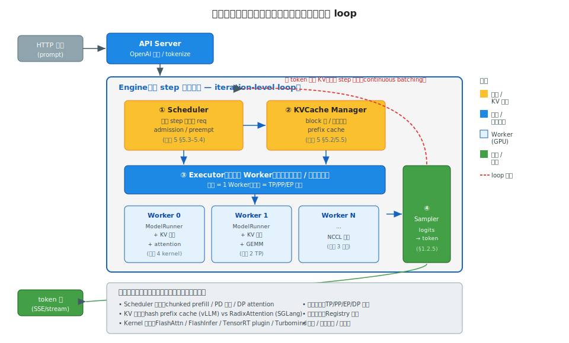

# 阶段 6｜推理引擎深读 ✓

> 一句话定位：把主流 LLM 推理引擎放在一张图上对比——深读 vLLM 和 SGLang 的源码架构,对照阅读 TensorRT-LLM / LMDeploy / llama.cpp,让你面对一个推理选型或源码改造任务时,知道每家的架构骨架在哪、强在哪、该改哪个文件。

## 目录

- [6.0 为什么需要这一层](#60-为什么需要这一层)
- [6.1 核心概念与术语](#61-核心概念与术语)
- [6.2 全景图与共同骨架](#62-全景图与共同骨架)
- [6.3 vLLM 深读](#63-vllm-深读)
- [6.4 SGLang 深读](#64-sglang-深读)
- [6.5 TensorRT-LLM(对照)](#65-tensorrt-llm对照)
- [6.6 LMDeploy / Turbomind(对照)](#66-lmdeploy--turbomind对照)
- [6.7 llama.cpp / MLX / Ollama(对照)](#67-llamacpp--mlx--ollama对照)
- [6.8 横向对比矩阵](#68-横向对比矩阵)
- [6.9 选型决策清单](#69-选型决策清单)
- [6.10 常见坑与 FAQ](#610-常见坑与-faq)
- [6.11 延伸阅读](#611-延伸阅读)

---

## 6.0 为什么需要这一层

阶段 1–5 把推理引擎的**零件**讲透了:Transformer 结构(阶段 1)、并行(阶段 2)、通信(阶段 3)、kernel(阶段 4)、KV cache 与调度(阶段 5)。本章是**整机组装**——这些零件在真实引擎里怎么拼起来、各家怎么取舍。

为什么必须读源码,而不是只会用 API:

1. **接一个自定义模型**:HuggingFace 上的新架构,vLLM 还没支持。你得知道 `model_executor/models/` 怎么注册、`QKVParallelLinear` 怎么用——这是改源码,不是调参。
2. **排一个诡异的性能问题**:吞吐只有预期一半,profiler 指向调度器。你得能读懂 `Scheduler` 的 admission / preemption 逻辑,才知道是 `max_num_seqs` 设小了还是 prefix cache 没命中。
3. **选型决策**:DeepSeek-V3 部署该用 vLLM 还是 SGLang?长 system prompt 的 agent 服务呢?边缘端 7B 呢?答案取决于每家的架构强项,不读源码只能猜。
4. **跟上演进**:vLLM v0 → v1 重构了整个执行模型,SGLang 的 RadixAttention 是它独有的。不理解架构,版本一升级就懵。

本章的方法论(对应 CLAUDE.md 类型 B):**选 vLLM 和 SGLang 两家深读源码**——它们是开源推理的事实标准,架构最完整、社区最活跃;**其余(TensorRT-LLM / LMDeploy / llama.cpp / MLX / Ollama)对照阅读**——只点出它们与 vLLM/SGLang 的关键差异点和适用场景,不逐行剖析。

为什么是这两家:

- **vLLM**:PagedAttention 的发源地,生态最广,模型支持最全,v1 架构是当前开源推理的设计标杆;
- **SGLang**:RadixAttention + DP attention 的发源地,在前缀复用密集(agent、多轮)和 DeepSeek-V3 部署上领先。

两家覆盖了"通用最优"和"特定场景极致"两个方向,读完它们,其它引擎都能快速类比理解。

读完之后你应当能:

1. 画出 vLLM 和 SGLang 的核心组件图,说清一个请求从进到出经过哪些模块;
2. 给一个自定义模型,知道在 vLLM 里该加哪几个文件、改哪几个类;
3. 看到吞吐/延迟问题,定位到是调度、KV、还是 kernel 层;
4. 按场景(通用/DeepSeek/长前缀/边缘/企业)选对引擎,并说清替换成本;
5. 把 TensorRT-LLM / llama.cpp 等快速归类到"它跟 vLLM 差在哪"。

---

## 6.1 核心概念与术语

本章术语集中在"引擎架构组件"上。很多概念在阶段 4/5 出现过(PagedAttention、continuous batching、prefix cache),这里补的是**引擎层的组织结构**。

| 术语 | 含义 |
|---|---|
| Engine | 推理引擎顶层对象,持有调度器 + 执行器,驱动整个 loop(vLLM `LLMEngine`) |
| Scheduler | 决定每 step 跑哪些请求、各跑多少 token(阶段 5 §5.3) |
| BlockManager / KVCacheManager | 管理 KV block 池的分配、释放、prefix cache(阶段 5 §5.2) |
| ModelRunner | 准备输入张量、调模型 forward、采样,一个 step 的执行体 |
| Worker | 一个 GPU 进程/角色,持有模型分片 + KV cache,执行 ModelRunner |
| Executor | 协调多个 Worker(多卡/多机),广播调度结果、收集输出 |
| Registry | 模型注册表,把 HF config 的 `architectures` 映射到引擎内实现类 |
| TokenizerManager | tokenize / detokenize 的独立组件(SGLang 显式拆出) |
| **TP / PP / EP / DP** | 张量/流水/专家/数据并行(阶段 2),引擎里通过 CLI 配置 |
| in-flight batching | TensorRT-LLM 对 continuous batching 的叫法 |
| graph capture | CUDA Graph 捕获(阶段 0 §0.3、阶段 4 §4.4),decode 阶段消除 launch overhead |
| speculative decoding | 投机解码,draft 模型先猜、主模型验证(阶段 8 详讲) |
| structured output | 结构化输出,约束生成为 JSON/正则(xgrammar/outlines,阶段 10 详讲) |
| EAGLE / MTP | 投机解码的具体方案 / DeepSeek 的 Multi-Token Prediction |
| v0 / v1 | vLLM 的两代架构,v1 是 2024 重构版(单进程 + 异步执行) |

> 阅读源码的心智准备:**所有引擎本质都在做同一件事**——一个 loop,每轮"调度器选请求 → 执行器跑一个 step → 采样 → 更新 KV → 输出 token"。各家的差异只在**这个 loop 怎么组织、KV 怎么管、kernel 怎么调**。抓住这条主线,再多的类名也不会迷路。

---

## 6.2 全景图与共同骨架

类型 B 章节的起手式:先给一张总图,让你看清所有引擎的**共同骨架**和**差异轴**。读完本节,后面逐家剖析时你只需关注"它在哪个轴上做了什么不一样",不会被各家的类名淹没。

### 6.2.1 所有推理引擎都是同一个 loop



不管 vLLM、SGLang 还是 TensorRT-LLM,剥开外壳,核心都是一个 **iteration-level loop**(阶段 5 §5.3):

```
while 有未完成请求:
    ① Scheduler   选这个 step 跑哪些请求、各跑多少 token
    ② KVCache     给新请求分配 block / 查 prefix cache 命中
    ③ Executor    驱动 Worker 跑一个 forward step（prefill chunk + decode 混批）
    ④ Sampler     logits → 下一个 token
    ⑤ 回写         新 token 的 KV 入 cache，完成的请求出队，输出 token
```

五个角色对应阶段 1–5 的知识:

| 角色 | 做什么 | 对应阶段 |
|---|---|---|
| **Scheduler** | 请求级动态调度、chunked prefill | 阶段 5 §5.3–5.4 |
| **KVCache Manager** | block 池、prefix cache | 阶段 5 §5.2/5.5 |
| **Executor + Worker** | 模型分片 forward、并行通信 | 阶段 2/3 |
| **attention / GEMM kernel** | Worker 里的实际计算 | 阶段 4 |
| **Sampler** | 采样解码 | 阶段 1 §1.2.5 |

**这就是本章的核心洞察**:你已经学过所有零件,引擎只是把它们按这个 loop 组装起来。各家引擎的全部差异,都落在这张图标出的"差异轴"上。

### 6.2.2 六条差异轴

骨架相同,差异集中在六个维度——这也是后面对比矩阵(§6.8)的列:

| 轴 | 选项空间 | 谁强 |
|---|---|---|
| **调度策略** | continuous batching / chunked prefill / PD 分离 / DP attention | SGLang 的 DP attention 对 MoE 友好 |
| **KV 管理** | hash prefix cache vs RadixAttention(树) | SGLang RadixAttention 在前缀密集场景领先 |
| **Kernel 后端** | FlashAttn / FlashInfer / TensorRT plugin / Turbomind | TensorRT-LLM kernel 最优但封闭 |
| **并行支持** | TP / PP / EP / DP 组合的完整度 | vLLM/SGLang 都全,llama.cpp 弱 |
| **模型接入** | Registry 机制、自定义模型成本 | vLLM 生态最广、模型最全 |
| **附加能力** | 量化 / 投机解码 / 多模态 / 结构化输出 | 各有侧重 |

### 6.2.3 引擎分类:三个生态位

把主流引擎按"目标场景"分成三类,选型时先定生态位,再在类内挑:

| 生态位 | 引擎 | 特征 | 典型部署 |
|---|---|---|---|
| **数据中心通用** | **vLLM**、**SGLang** | Python 为主、模型全、并行全、社区活跃 | 云上 GPU 集群,通用大规模 serving |
| **数据中心极致性能** | **TensorRT-LLM**、LMDeploy/Turbomind | C++ kernel、编译优化、吞吐/延迟最优但封闭、上手重 | 固定模型、追求极致 SLO 的生产线 |
| **本地 / 边缘** | **llama.cpp**、MLX、Ollama | CPU/消费级 GPU/Apple Silicon、量化生态、单机易用 | 个人设备、隐私场景、原型 |

本章方法论(回 §6.0):**深读** vLLM(§6.3)和 SGLang(§6.4)——它们是第一类的标杆,架构最值得学;**对照阅读** TensorRT-LLM(§6.5)、LMDeploy(§6.6)、llama.cpp/MLX/Ollama(§6.7)——只点出它们相对 vLLM 的关键差异。

> 心智模型:**推理引擎 = 同一个 loop 骨架 + 六条差异轴上的不同取舍。** 先把骨架刻进脑子,再逐家看它在哪条轴上做了什么特别的事。这样读源码不会迷路,选型不会凭感觉——所有问题都能落到"哪个角色、哪条轴"上。

---

## 6.3 vLLM 深读

**定位**:开源推理的事实标准。PagedAttention 发源地,模型支持最全(HuggingFace 上几乎所有主流架构都能跑),生态最广,v1 架构是当前开源推理引擎的设计标杆。**不知道选什么时,默认选 vLLM。**

### 6.3.1 架构总览:一个请求的旅程

把 §6.2 的通用 loop 落到 vLLM 的具体类(v1 架构):

```
LLM / AsyncLLM            # 用户入口（offline / online）
  └─ EngineCore           # 引擎核心，独立进程，跑调度+执行 loop
       ├─ Scheduler        # 每 step 选请求、chunked prefill、preempt
       ├─ KVCacheManager   # block 池、prefix cache（hash 链式）
       └─ Executor         # 协调 Worker（单卡/多卡/多机）
            └─ Worker × N   # 每 GPU 一个进程
                 └─ ModelRunner   # 准备输入、跑 forward、采样
                      └─ Model    # 实际模型（LlamaForCausalLM 等）
                           └─ Attention backend（FlashAttn/FlashInfer）
```

一个请求的完整旅程:

1. `AsyncLLM` 收到请求,tokenize,丢进 `EngineCore` 的 waiting 队列;
2. `Scheduler` 每 step 决定它何时开始 prefill(查 `KVCacheManager` 是否有 block);
3. `Executor` 把调度结果广播给所有 `Worker`;
4. 每个 `Worker` 的 `ModelRunner` 准备输入张量、跑模型 forward、调 attention kernel(读 KV block)、采样出 token;
5. token 写回 KV cache,流式返回;完成的请求出队、归还 block。

源码定位(v1,`vllm/v1/`):

| 路径 | 类 | 职责 |
|---|---|---|
| `vllm/v1/engine/core.py` | `EngineCore` | 引擎核心 loop,独立进程 |
| `vllm/v1/engine/async_llm.py` | `AsyncLLM` | 在线服务异步入口 |
| `vllm/v1/core/sched/scheduler.py` | `Scheduler` | 调度主循环(阶段 5 §5.3) |
| `vllm/v1/core/kv_cache_manager.py` | `KVCacheManager` | block 池 + prefix cache |
| `vllm/v1/executor/` | `Executor` | 多 Worker 协调 |
| `vllm/v1/worker/gpu_worker.py` | `Worker` | GPU 进程 |
| `vllm/v1/worker/gpu_model_runner.py` | `GPUModelRunner` | 一个 step 的执行体 |
| `vllm/model_executor/models/llama.py` | `LlamaForCausalLM` | 模型实现(阶段 1 §1.3 看过) |

### 6.3.2 v0 → v1 重构:为什么重要

vLLM 2024 年的 v1 重构不是小修小补,是**执行模型的根本改变**。理解它才能看懂当前 vLLM 的性能特征。

| 维度 | v0 | v1 |
|---|---|---|
| **进程模型** | 调度 + 执行在同一进程,Python GIL 成瓶颈 | `EngineCore` **独立进程**,调度与 API/tokenize 解耦,CPU 开销大降 |
| **调度** | request 级 + 隐式 chunked prefill | 原生 chunked prefill(阶段 5 §5.4),prefill/decode 统一调度 |
| **prefix cache** | 可选,默认关 | **默认开**,"zero-overhead" 设计 |
| **CUDA Graph** | full graph,变长 batch 受限 | **piecewise graph**(分段捕获,兼容变长,呼应阶段 4 §4.4) |
| **多模态 / 投机** | 后期补丁式加入 | 一等公民,统一抽象 |
| **代码复杂度** | 历史包袱重 | 清晰分层,易扩展 |

核心收益:**CPU 开销大降 + 调度统一**。v0 的调度器和 Python API 抢 GIL,decode 高并发时 CPU 成瓶颈;v1 把 `EngineCore` 拆成独立进程,CPU 不再卡执行。**升级 v1 后吞吐普遍提升 20–50%,尤其高并发小 batch 场景。**

并行配置(v1 统一 CLI):

```bash
# TP=8 单机
vllm serve meta-llama/Llama-3-70B --tensor-parallel-size 8

# TP=8 + PP=2 双机
vllm serve meta-llama/Llama-3-405B --tensor-parallel-size 8 --pipeline-parallel-size 2

# DeepSeek-V3：EP + DP attention
vllm serve deepseek-ai/DeepSeek-V3 --tensor-parallel-size 8 --enable-expert-parallel
```

### 6.3.3 自定义模型接入

vLLM 模型支持最全的根源:**一套清晰的模型接入机制**。接一个新架构,本质是写一个类 + 注册。

三步:

**(1) 写模型类**——放 `vllm/model_executor/models/`,所有 `nn.Linear` 换成 **TP-aware 版本**(阶段 1 §1.3 看过骨架,阶段 2 §2.2.2 是其并行原理):

```python
from vllm.model_executor.layers.linear import (
    QKVParallelLinear,         # QKV 合并 + column 并行（每卡持有部分 head）
    RowParallelLinear,         # O_proj：row 并行 + AllReduce
    MergedColumnParallelLinear # gate+up 合并 + column 并行
)

class MyModelAttention(nn.Module):
    def __init__(self, config):
        self.qkv_proj = QKVParallelLinear(
            hidden_size, head_dim,
            total_num_heads, total_num_kv_heads,   # vLLM 自动按 TP 度切分
        )
        self.o_proj = RowParallelLinear(num_heads * head_dim, hidden_size)
        self.attn = Attention(num_heads, head_dim, scale, num_kv_heads)
        # ↑ attn 内部分派到 FlashAttn / FlashInfer + PagedAttention
```

关键:**TP 切分对模型作者透明**——`QKVParallelLinear` 内部根据 TP 度自动决定每卡持有哪些 head(阶段 2 §2.2.2 的 column-parallel),你只填"总共多少 head"。

**(2) 实现权重加载**——`load_weights()` 把 HF checkpoint 的权重名映射到 vLLM 的并行 layer,合并的 QKV/gate-up 要做拆分映射。

**(3) 注册**——`vllm/model_executor/models/registry.py` 把 HF config 的 `architectures` 字段映射到你的类:

```python
# registry.py 的 _TEXT_GENERATION_MODELS
"MyModelForCausalLM": ("my_model", "MyModelForCausalLM"),
```

源码定位:

| 路径 | 内容 |
|---|---|
| `vllm/model_executor/models/registry.py` | 模型注册表,HF arch → 实现类 |
| `vllm/model_executor/layers/linear.py` | `ColumnParallelLinear` / `RowParallelLinear` / `QKVParallelLinear` |
| `vllm/model_executor/models/llama.py` | 最佳模仿模板,新模型照着改 |
| `vllm/attention/layer.py` | `Attention` 统一接口,自动分派 backend |

### 6.3.4 投机解码与结构化输出

两个 vLLM 的进阶能力,这里点出架构位置,细节留对应阶段。

**投机解码(speculative decoding)**——draft 模型先猜 k 个 token,主模型一次性并行验证(阶段 8 详讲算法)。vLLM 支持 draft model / EAGLE / Medusa / n-gram 多种 draft 方式:

```bash
vllm serve meta-llama/Llama-3-70B \
  --speculative-config '{"model": "meta-llama/Llama-3-8B", "num_speculative_tokens": 5}'
```

架构上,投机解码改的是 **ModelRunner 的 forward + Sampler 的验证逻辑**——一个 step 跑多个候选 token、验证后回滚未命中的。源码 `vllm/v1/spec_decode/`。

**结构化输出(structured output)**——把生成约束成合法 JSON / 正则 / CFG(阶段 10 详讲)。原理是在 Sampler **softmax 之前对 logits 做 mask**(回阶段 1 §1.2.5),屏蔽所有不合法 token:

```python
from vllm import SamplingParams
params = SamplingParams(
    guided_decoding=GuidedDecodingParams(json=my_json_schema)
)
```

后端是 xgrammar(默认)/ outlines / lm-format-enforcer。源码 `vllm/v1/structured_output/`。

### 6.3.5 适用场景与限制

**适用**:

- 通用大规模 serving——模型全、并行全、生态广,90% 场景的默认选择;
- 需要接自定义模型——接入机制最成熟,文档和参考实现最多;
- 快速跟进新模型/新技术——社区最活跃,新架构通常 vLLM 首发支持。

**限制**:

- **极致性能略逊 TensorRT-LLM**——Python 调度有开销,固定模型追求极致 SLO 时 TensorRT-LLM 的编译优化更狠;
- **前缀复用密集场景略逊 SGLang**——hash prefix cache 不如 RadixAttention 的树结构灵活(§6.4 对比);
- **边缘/CPU 部署不是强项**——为数据中心 GPU 设计,本地轻量部署用 llama.cpp/Ollama 更合适。

> vLLM 一句话总结:**功能最全、生态最广、最稳的"默认引擎"。** 它在每条差异轴上都不是绝对最强,但综合最均衡——选型时把它当 baseline,只有当某个轴(极致性能/前缀复用/边缘)成为硬约束时,才考虑换专门的引擎。

---

## 6.4 SGLang 深读

**定位**:前缀复用密集场景和 DeepSeek-V3 部署的最优选择。RadixAttention 发源地,DP attention + EP 的工程标杆。在 agent / 多轮对话 / 结构化生成(前缀共享率高)和大 MoE 模型上,吞吐领先 vLLM。

### 6.4.1 架构总览:与 vLLM 的异同

SGLang 的 loop 骨架和 vLLM 一致(§6.2),但组件命名和拆分不同,尤其**把 tokenizer 拆成独立进程**:

```
Server (FastAPI)              # HTTP 入口
  └─ TokenizerManager         # 独立进程：tokenize / detokenize
       └─ Scheduler           # 调度核心 loop（对应 vLLM EngineCore+Scheduler）
            ├─ RadixCache      # 基数树 prefix cache（SGLang 招牌）
            ├─ Policy          # 调度策略（LPM 最长前缀匹配优先等）
            └─ TpModelWorker   # TP 分片的模型执行（对应 vLLM Worker+ModelRunner）
                 └─ ModelRunner + attention backend（FlashInfer 默认）
```

与 vLLM 的关键架构差异:

| 维度 | vLLM | SGLang |
|---|---|---|
| **tokenizer** | 在 engine 内 | **独立进程** `TokenizerManager`,与调度解耦 |
| **prefix cache** | hash 链式(扁平) | **RadixCache** 基数树(层级共享) |
| **调度策略** | FCFS + chunked | 可插拔 `Policy`,默认 **LPM**(最长前缀匹配优先,提高 cache 命中) |
| **默认 attention** | FlashAttn(可换 FlashInfer) | **FlashInfer**(阶段 4 §4.4) |
| **DP attention** | 较新加入 | **原生强项**,MoE 推理标配 |

源码定位(`python/sglang/srt/`):

| 路径 | 类 | 职责 |
|---|---|---|
| `managers/tokenizer_manager.py` | `TokenizerManager` | 独立 tokenize 进程 |
| `managers/scheduler.py` | `Scheduler` | 调度主循环 |
| `mem_cache/radix_cache.py` | `RadixCache` | 基数树 prefix cache |
| `managers/schedule_policy.py` | `SchedulePolicy` | LPM 等调度策略 |
| `managers/tp_worker.py` | `TpModelWorker` | TP 分片执行 |
| `model_executor/model_runner.py` | `ModelRunner` | forward 执行体 |

### 6.4.2 RadixAttention:招牌机制

回阶段 5 §5.5.3 和 [svg/16](../svg/16-radix-tree-prefix.svg):RadixAttention 用基数树管理 prefix 共享,比 vLLM 的扁平 hash 表能发现**任意层级、任意 token 边界**的共享。

SGLang 把它做成调度的**一等公民**——不只是缓存,还驱动调度决策:

1. **RadixCache 存所有活跃前缀的 KV**,树的边是 token 段、节点是分叉点;
2. **LPM 调度策略**:新请求来了,优先调度**与现有缓存前缀匹配最长**的——最大化 cache 命中,最小化重复 prefill;
3. **LRU 淘汰叶子**:显存吃紧时回收最久未访问的叶子分支,被引用的节点不动。

为什么这在 agent / 多轮场景碾压:这些负载的前缀重复率极高(固定 system prompt + 工具描述 + 对话历史),RadixAttention 让相同前缀**只算一次**,prefill 算量和 TTFT 大幅下降。**前缀共享率越高,SGLang 相对 vLLM 的优势越大。**

核心代码骨架(`radix_cache.py` 简化):

```python
class RadixCache:
    def match_prefix(self, token_ids):
        # 沿树匹配最长公共前缀，返回命中的 KV 和匹配长度
        node, matched_len = self._walk(self.root, token_ids)
        return node.kv_indices[:matched_len], matched_len

    def insert(self, token_ids, kv_indices):
        # 把新序列插入树，自动在分叉点 split 节点
        ...

    def evict(self, num_tokens):
        # LRU：从最久未访问的叶子开始回收，被引用节点跳过
        ...
```

### 6.4.3 DeepSeek-V3 全套优化

SGLang 是 DeepSeek-V3 部署的参考实现,把阶段 1–5 的 DeepSeek 专属技术全栈打通:

| 技术 | 是什么 | 对应阶段 |
|---|---|---|
| **MLA** | 低秩 KV,压到 1/30 | 阶段 1 §1.2.2、阶段 4 §4.5(FlashMLA) |
| **DP attention** | attention 用 DP(每卡完整 KV)、FFN 用 EP——避免 MLA 的 KV 被 TP 切碎 | 阶段 2 §2.3.4 |
| **EP(专家并行)** | 256 个 expert 分散到多卡,All-to-All dispatch | 阶段 2 §2.2.5、阶段 3 §3.4(DeepEP) |
| **MTP(Multi-Token Prediction)** | DeepSeek 的原生投机解码,一次预测多 token | 阶段 8 |

**DP attention 是关键洞察**:MLA 的 KV 已经压到很小(每 token ~70KB),如果再用 TP 切 KV head,反而引入通信开销且 KV 太小切不动。SGLang 改用 **attention DP(每卡持完整 KV、按请求分)+ FFN EP(专家分散)**——这个非对称并行配置是 DeepSeek-V3 高效推理的核心(回阶段 2 §2.3.4 的部署拓扑图)。

标杆配置(单机 8×H100/H200):

```bash
python -m sglang.launch_server \
  --model deepseek-ai/DeepSeek-V3 \
  --tp 8 --enable-dp-attention \
  --enable-deepep-moe          # DeepEP 的 MoE all-to-all（阶段 3 §3.4）
```

### 6.4.4 适用场景与限制

**适用**:

- **DeepSeek-V3 / 大 MoE 部署**——DP attention + EP + DeepEP 全栈最成熟,参考实现级别;
- **前缀复用密集**——agent、多轮对话、结构化生成,RadixAttention 碾压;
- **SGLang 前端 DSL**——它还提供一套生成控制 DSL(`gen`/`select`/并行调用),复杂生成流程友好。

**限制**:

- **模型覆盖不如 vLLM**——新架构支持通常晚于 vLLM,长尾模型可能没有;
- **生态/文档不如 vLLM 厚**——社区规模小一些,踩坑资料相对少;
- **通用场景优势不明显**——前缀共享率低的负载(每请求独立长文档),相对 vLLM 没有明显领先,反而可能因架构较新遇到更多边角 bug。

> SGLang 一句话总结:**前缀复用和 DeepSeek/MoE 的"专科冠军"。** 它不追求 vLLM 那样的全覆盖,而是在 RadixAttention 和 DP attention 两个点上做到极致。选型时:DeepSeek-V3 或前缀密集 → SGLang;通用全场景 → vLLM。两者是开源推理的"双子星",覆盖了通用与专精两个方向。

---

## 6.5 TensorRT-LLM(对照)

**定位**:NVIDIA 官方的极致性能引擎。固定模型、追求最低延迟/最高吞吐时,它的编译优化比 Python 引擎更狠。代价是上手重、灵活性差。

相对 vLLM/SGLang 的关键差异:

| 维度 | vLLM/SGLang | TensorRT-LLM |
|---|---|---|
| **执行层** | Python 调度 + PyTorch 模型 | **编译成 TensorRT engine**(C++/CUDA),离线 build |
| **kernel** | FlashAttn/FlashInfer | **plugin 机制**,NVIDIA 手调 kernel,FP8 recipe 最成熟 |
| **batching** | continuous batching | **in-flight batching**(同一概念,§6.1 术语) |
| **上手成本** | `pip install` 即用 | 需 **build engine**(指定 batch/seq 上限、量化),改配置要重 build |
| **灵活性** | 改模型/参数即时生效 | engine 固化,换 batch 上限要重新编译 |

核心机制——**离线编译**:把模型 + 并行配置 + 量化方案编译成一个固化的 TensorRT engine。编译期做 kernel 融合、layout 优化、FP8 校准,运行期零 Python 开销。这是它延迟最优的根源,也是它不灵活的根源(engine 一旦 build,batch/seq 上限就定死)。

源码/工具:`tensorrt_llm` Python API 构建网络 → `trtllm-build` 编译 → `trtllm-serve` 部署。FP8 recipe 在 `tensorrt_llm/quantization/`,是 Hopper FP8 推理(阶段 4 §4.7.4)落地最成熟的一家。

**适用**:固定模型、长期稳定的生产线,追求极致 SLO,且团队能承受编译工作流。**别用**:模型频繁换、要接新架构、快速实验——重 build 流程会拖死迭代速度。

> 一句话:**性能天花板最高,但灵活性地板最低。** vLLM 的吞吐够用就别碰它的编译流程;只有当 SLO 卡到 vLLM 满足不了、且模型固定时,才值得付 TensorRT-LLM 的上手成本。

---

## 6.6 LMDeploy / Turbomind(对照)

**定位**:上海 AI Lab 的推理引擎,核心是 **Turbomind** 后端——一套 C++ 手写 kernel,在中小模型和特定场景上 kernel 效率高,中文社区生态好。

相对 vLLM 的关键差异:

| 维度 | vLLM | LMDeploy / Turbomind |
|---|---|---|
| **后端** | PyTorch + FlashAttn | **Turbomind**(C++/CUDA 手写)或 PyTorch 后端二选一 |
| **kernel 风格** | 通用 backend | 针对常见模型(LLaMA/Qwen/InternLM)**手调 kernel**,小 batch 延迟低 |
| **强项** | 全场景 | **InternLM/Qwen 系**优化深,中文模型生态 |
| **量化** | 通用量化后端 | **AWQ/W4A16 集成成熟**,4bit 部署体验好 |

Turbomind 的思路接近 TensorRT-LLM(C++ 手写 kernel)但更轻量,不需要离线 build engine。在它优化过的模型(LLaMA/Qwen/InternLM)上,小 batch decode 延迟优于 vLLM;模型覆盖面则窄得多。

源码:`lmdeploy/turbomind/`(C++ 后端)、`lmdeploy/pytorch/`(PyTorch 后端,覆盖更多模型)。

**适用**:主力跑 InternLM/Qwen 系、要 AWQ 4bit 部署、中文场景。**别用**:需要广模型覆盖或最新架构——不如 vLLM 全。

> 一句话:**InternLM/Qwen + 4bit 量化的"区域强队"。** 在它的主场(特定模型 + AWQ)体验很好,出了主场不如 vLLM 通用。

---

## 6.7 llama.cpp / MLX / Ollama(对照)

前面五家都是**数据中心 GPU**引擎。这三家是另一个生态位:**本地 / 边缘 / 个人设备**——CPU、消费级 GPU、Apple Silicon 上跑量化模型。

| 引擎 | 平台 | 核心 | 定位 |
|---|---|---|---|
| **llama.cpp** | CPU / 各类 GPU / 跨平台 | C++,GGUF 量化格式,极致可移植 | 本地推理事实标准,什么硬件都能跑 |
| **MLX** | Apple Silicon | Apple 官方框架,统一内存 | Mac 上跑 LLM 的最优解 |
| **Ollama** | 跨平台(封装 llama.cpp) | 一行命令拉模型即跑 | 最易用的本地体验,开发者原型首选 |

与数据中心引擎的根本差异:

| 维度 | vLLM/SGLang | llama.cpp 系 |
|---|---|---|
| **目标硬件** | 数据中心 GPU(H100 等) | **CPU / 消费 GPU / Apple Silicon** |
| **量化** | FP8/INT8(GPU Tensor Core) | **GGUF**(2–8bit,CPU 友好,k-quant) |
| **并发** | 高并发 continuous batching | 单用户 / 低并发为主 |
| **并行** | TP/PP/EP 全套 | 弱(单机为主,有限多 GPU split) |
| **易用性** | 需配 GPU 环境 | **开箱即用**,Ollama 一行命令 |

核心价值——**可移植性和易用性**,不是吞吐。llama.cpp 的 GGUF 量化(k-quant 系列)让 7B 模型在笔记本 CPU 上能跑;Ollama 把它包成 `ollama run llama3` 一行命令;MLX 利用 Apple 统一内存在 Mac 上高效跑。**它们和 vLLM 不是竞争关系,是不同生态位**——数据中心 serving 用 vLLM,本地/隐私/原型用这三家。

**适用**:个人设备、隐私敏感(数据不出本地)、离线、快速原型、Mac 开发。**别用**:生产级高并发 serving——没有 continuous batching 和分布式并行,扛不住吞吐。

> 一句话:**本地推理三件套,核心是"能跑"和"好用",不是"快"。** 数据中心引擎追求吞吐和 SLO,这三家追求"在任何设备上、用最少配置跑起来"。选型时先问:数据中心还是本地?这一刀切开两个完全不同的世界。

---

## 6.8 横向对比矩阵

把全部引擎按 §6.2.2 的差异轴 + TODO 关心的维度(吞吐/TTFT/长ctx/MoE/PD/多模态)汇成一张表。**这是本章的核心交付物——选型时直接查。**

### 6.8.1 能力矩阵

| 维度 | vLLM | SGLang | TensorRT-LLM | LMDeploy | llama.cpp 系 |
|---|---|---|---|---|---|
| **生态位** | 数据中心通用 | 数据中心通用 | 数据中心极致 | 数据中心(区域) | 本地/边缘 |
| **吞吐(大 batch)** | 高 | 高 | **最高** | 高(特定模型) | 低 |
| **TTFT** | 低 | **最低**(前缀密集时) | **最低**(编译优化) | 低 | 高 |
| **长 context** | 好 | 好 | 好 | 中 | 中(受内存限) |
| **MoE 支持** | 好 | **最好**(DP attn+EP) | 中 | 中 | 弱 |
| **PD 分离** | **支持**(v1 NIXL) | 支持 | 实验 | 否 | 否 |
| **多模态** | **最广** | 好 | 中 | 中(特定) | 有限(GGUF VLM) |
| **prefix cache** | hash | **RadixAttention** | 有 | 有 | 部分 |
| **量化** | 全(GPTQ/AWQ/FP8) | 全 | **FP8 最成熟** | **AWQ 最成熟** | **GGUF k-quant** |
| **投机解码** | 全(EAGLE/Medusa/MTP) | 全(含 MTP) | 支持 | 有限 | 有限 |
| **模型覆盖** | **最广** | 广 | 中(需适配) | 中(InternLM/Qwen) | 广(GGUF 转换) |
| **上手成本** | 低 | 低 | **高**(编译) | 中 | **最低**(Ollama) |
| **并行** | TP/PP/EP/DP | TP/PP/EP/**DP attn** | TP/PP | TP | 弱 |

> 注:所有"高/低"是相对量级,不带绝对数字——精确吞吐严重依赖硬件/模型/负载,任何脱离 "H100 80GB, batch=X, seq=Y, 精度=Z" 的吞吐数字都没意义(回 CLAUDE.md §4 的硬性约束)。真实选型务必在自己的硬件 + 负载上跑 benchmark。

### 6.8.2 一句话定性

| 引擎 | 一句话 |
|---|---|
| **vLLM** | 功能最全、生态最广、最稳的"默认引擎",选型 baseline |
| **SGLang** | 前缀复用 + DeepSeek/MoE 的"专科冠军" |
| **TensorRT-LLM** | 性能天花板最高、灵活性地板最低 |
| **LMDeploy** | InternLM/Qwen + 4bit 的"区域强队" |
| **llama.cpp 系** | 本地推理"能跑 + 好用",不为吞吐 |

---

## 6.9 选型决策清单

按场景给出"选谁 / 为什么 / 替换成本",直接套用。

| 场景 | 首选 | 备选 | 为什么 / 替换成本 |
|---|---|---|---|
| **通用大规模 serving** | **vLLM** | SGLang | vLLM 全场景均衡,生态最广;换 SGLang 仅当前缀复用率高 |
| **DeepSeek-V3 / 大 MoE** | **SGLang** | vLLM | DP attention + EP + DeepEP 全栈最成熟(§6.4.3);vLLM 也支持但优化稍晚 |
| **agent / 多轮对话(前缀密集)** | **SGLang** | vLLM(开 prefix cache) | RadixAttention 树结构碾压(§6.4.2);前缀共享率越高差距越大 |
| **固定模型 + 极致 SLO** | **TensorRT-LLM** | vLLM | 编译优化延迟最低;代价是 build 工作流,模型固定才划算 |
| **InternLM/Qwen + 4bit** | **LMDeploy** | vLLM | Turbomind + AWQ 主场体验好;出主场不如 vLLM |
| **接自定义/最新模型** | **vLLM** | — | Registry 机制最成熟、社区首发支持(§6.3.3) |
| **本地 / Mac / 隐私** | **llama.cpp / Ollama / MLX** | — | 数据中心引擎跑不动消费硬件;这是另一个世界 |
| **快速原型 / demo** | **Ollama** | vLLM | 一行命令;要上量再迁 vLLM |

三条选型原则:

1. **先定生态位**(数据中心 vs 本地),这一刀切开两个世界,别跨界比较;
2. **数据中心默认 vLLM**,只有硬约束(极致 SLO / 前缀密集 / DeepSeek)成立才换专门引擎;
3. **替换成本要算进去**——TensorRT-LLM 的 build 流程、SGLang 的模型覆盖风险,都是隐性成本,不能只看 benchmark 数字。

---

## 6.10 常见坑与 FAQ

1. **vLLM 升级 v1 后行为变了**:v1 默认开 prefix cache、chunked prefill,调度行为和 v0 不同。性能对比务必同版本;老脚本的 `enforce_eager` 等参数语义也可能变。
2. **吞吐 benchmark 对不上官方数字**:官方数字是特定硬件 + 负载 + 并发下的最优。务必在**自己的硬件 + 真实负载**上测,别信脱离上下文的吞吐数(回 §6.8.1 注)。
3. **SGLang 跑某新模型报不支持**:SGLang 模型覆盖晚于 vLLM,长尾/最新架构可能没有。先查支持列表,没有就用 vLLM。
4. **TensorRT-LLM 改 batch 上限要重 build**:engine 编译期固化了 max_batch/max_seq。线上要扩容量得重新 build + 重启,不能热改——这是它灵活性差的具体体现。
5. **prefix cache 没命中、TTFT 没降**:检查前缀是否真的逐 token 一致(空格/换行差异都会让 hash 失效,回阶段 5 §5.5.4);SGLang 用 LPM 策略命中率通常更高。
6. **DeepSeek-V3 用 TP 切 attention 反而慢**:MLA 的 KV 太小,TP 切 KV head 引入通信且切不动。要用 SGLang 的 `--enable-dp-attention`(§6.4.3),attention 走 DP 而非 TP。
7. **多模态模型在 LMDeploy/llama.cpp 上跑不了**:多模态支持 vLLM 最广,其它家覆盖有限。VLM 部署优先 vLLM。
8. **本地 llama.cpp 比 GPU 慢很多很正常**:它跑 CPU/消费 GPU,没有 continuous batching 和 Tensor Core 优化。别拿它和数据中心 vLLM 比吞吐——生态位不同(§6.7)。
9. **量化模型精度掉点**:不同引擎的量化实现/默认 scale 粒度不同(回阶段 5 §5.7)。换引擎跑量化模型,务必在自己的 eval 集上重新验证精度。
10. **多卡 vLLM/SGLang 启动卡住或 NCCL 报错**:多半是通信层问题——回阶段 3 §3.3.4 的症状→旋钮表排查(P2P/IB/拓扑),不是引擎本身的 bug。

---

## 6.11 延伸阅读

- **vLLM 官方文档 `docs/` + `vllm/v1/` 源码** — 从 `EngineCore` 入手,对照 §6.3.1 的旅程读,是理解现代推理引擎架构的最佳起点。
- **PagedAttention 论文(Kwon 2023)** — vLLM 的奠基之作,阶段 4 §4.3 已引,这里再读架构动机部分。
- **SGLang 论文(《SGLang: Efficient Execution of Structured Language Model Programs》)** — RadixAttention + 前端 DSL 的设计,对照 §6.4 读。
- **SGLang `python/sglang/srt/` 源码** — `radix_cache.py` 和 `scheduler.py` 是精华,看 RadixAttention 怎么驱动调度。
- **DeepSeek-V3 技术报告 + SGLang DeepSeek 部署博客** — DP attention + EP + MTP 的工程落地,§6.4.3 的源头。
- **TensorRT-LLM 官方 examples** — 跑通一个 `trtllm-build` 流程,亲身体会编译式引擎与 Python 引擎的差异(§6.5)。
- **llama.cpp README + GGUF 量化文档** — 理解 k-quant 系列和本地推理生态,§6.7 的延伸。
- **各引擎的 benchmark 仓库(vLLM `benchmarks/`、SGLang `bench_serving`)** — 学会自己跑选型 benchmark,比信任任何第三方数字都可靠。

---
