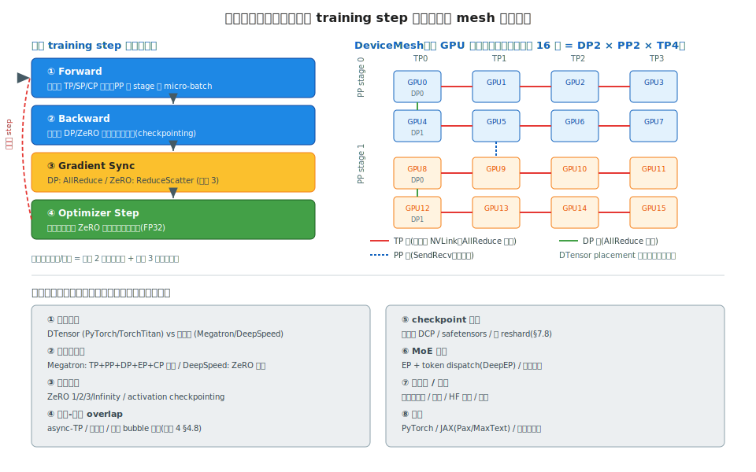

# 阶段 7｜训练框架深读 ✓

> 一句话定位：把主流大模型训练框架放在一张图上对比——先打通 PyTorch 原生分布式底座(DTensor / DeviceMesh),再深读 Megatron-Core 和 DeepSpeed 的源码架构,对照 TorchTitan / Colossal-AI / JAX 系,让你面对一个训练框架选型或多维并行配置任务时,知道每家把阶段 2 的并行策略落成了什么、该配哪个旋钮、checkpoint 怎么存。

## 目录

- [7.0 为什么需要这一层](#70-为什么需要这一层)
- [7.1 核心概念与术语](#71-核心概念与术语)
- [7.2 全景图与共同骨架](#72-全景图与共同骨架)
- [7.3 PyTorch 原生分布式底座](#73-pytorch-原生分布式底座)
- [7.4 Megatron-Core 深读](#74-megatron-core-深读)
- [7.5 DeepSpeed 深读](#75-deepspeed-深读)
- [7.6 TorchTitan(对照)](#76-torchtitan对照)
- [7.7 Colossal-AI / JAX 系(对照)](#77-colossal-ai--jax-系对照)
- [7.8 Checkpoint 格式与分布式存储](#78-checkpoint-格式与分布式存储)
- [7.9 横向对比矩阵](#79-横向对比矩阵)
- [7.10 选型决策清单](#710-选型决策清单)
- [7.11 常见坑与 FAQ](#711-常见坑与-faq)
- [自测](#自测)
- [7.12 延伸阅读](#712-延伸阅读)

---

## 7.0 为什么需要这一层

阶段 2 把并行策略(DP/TP/PP/EP/CP)的**原理**讲透了——每种并行调用什么通信原语、省什么显存。本章是**把这些原理落成可跑的训练框架**:Megatron 怎么把 TP 写进 Linear,DeepSpeed 怎么把 ZeRO-3 做成一行配置,PyTorch 怎么用 DTensor 统一表达所有并行。

和阶段 6 推理引擎对称——推理引擎管"调度 / KV / kernel",训练框架管"分片 / 通信 / checkpoint",但底层并行知识同源(阶段 2/3)。

为什么必须读源码,而不是只会 `torchrun`:

1. **配一个多维并行**:训练 DeepSeek-V3 量级要 TP×PP×EP×DP 四维并行。每个框架的配置方式、rank 映射、组合约束都不同——配错一个 mesh 维度,要么 OOM 要么死锁。
2. **排一个 loss 异常 / 显存爆炸**:训练比推理状态多得多(梯度、优化器、激活)。loss 突然 NaN、某张卡 OOM,得能读懂框架怎么切分这些状态,才知道是 ZeRO stage 选错了还是 activation checkpointing 没开。
3. **存取超大 checkpoint**:70B 模型的分布式 checkpoint 几百 GB,跨不同并行配置恢复要 reshard。不懂分布式 ckpt 格式,换个 TP 度就加载失败。
4. **选型决策**:从头训大模型用 Megatron 还是 TorchTitan?微调用 DeepSpeed 还是 FSDP?这取决于每家的并行完整度和工程成熟度。

本章方法论(类型 B):**深读 Megatron-Core 和 DeepSpeed 两家源码**——它们是工业级大模型训练的事实标准,前者并行最全、后者 ZeRO 生态最广;**其余(TorchTitan / Colossal-AI / JAX 系)对照阅读**。PyTorch 原生分布式(DTensor/DeviceMesh)作为所有框架的**共同底座**先单独讲(§7.3),因为现代框架都在往它上面收敛。

为什么深读这两家:

- **Megatron-Core**:NVIDIA 官方,TP+PP+DP+EP+CP 五维并行的标准实现,大模型从头训练的首选,几乎所有大厂训练栈的底层;
- **DeepSpeed**:微软出品,ZeRO 系列(1/2/3/Infinity)发源地,在显存优化、MoE 训练、微调场景生态最广。

读完之后你应当能:

1. 画出训练框架的组件分层,说清一个 training step 里梯度/优化器/激活怎么在多维并行下流转;
2. 给定模型规模 + 硬件,配出合理的 TP×PP×DP×EP 组合,并解释每维为什么这么选;
3. 看到 loss/显存异常,定位到是分片策略、通信、还是 checkpointing;
4. 按场景(从头训 / 微调 / MoE / 国产卡)选对框架,说清替换成本;
5. 读懂 Megatron 的 `ColumnParallelLinear` 和 DeepSpeed 的 ZeRO 配置,把它们对应回阶段 2 的原理。

---

## 7.1 核心概念与术语

本章术语集中在"训练态资源"和"框架组件"两类。并行策略本身(TP/PP/EP/CP)的术语见阶段 2 §2.2,这里补训练框架层的概念。

| 术语 | 含义 |
|---|---|
| **DTensor** | Distributed Tensor,PyTorch 原生分布式张量,用 `placement` 描述分片方式 |
| **DeviceMesh** | 设备网格,把 N 个 GPU 组织成多维网格(如 `[dp, tp]`),并行维度的载体 |
| **placement** | DTensor 的分布规格:`Shard(dim)` 切分 / `Replicate` 复制 / `Partial` 待规约 |
| Sharding | 分片,把张量/状态切到多个 rank(阶段 2 §2.2.8 的 ZeRO) |
| **ZeRO** | Zero Redundancy Optimizer,DeepSpeed 的显存优化,1/2/3 三级(阶段 2 §2.2.8) |
| **ZeRO-Infinity** | ZeRO-3 + offload 到 CPU/NVMe,训超大模型 |
| activation checkpointing | 激活重计算,forward 丢激活、backward 重算,省激活显存 |
| **Megatron-Core** | NVIDIA 的并行训练库,Megatron-LM 的模块化内核 |
| **mcore** | Megatron-Core 的简称 |
| micro-batch / global-batch | 流水并行的微批 / 梯度累积后的全局批(阶段 2 §2.2.4) |
| **TorchTitan** | PyTorch 官方的原生并行训练参考实现,纯 DTensor |
| **gradient accumulation** | 梯度累积,多个 micro-batch 累积梯度再更新 |
| **distributed checkpoint (DCP)** | `torch.distributed.checkpoint`,分片保存 + 可 reshard 加载 |
| **safetensors** | 安全的张量序列化格式,零拷贝、防代码注入,HF 标准 |
| **resharding** | 换并行配置加载 checkpoint(如 TP=8 存、TP=4 载) |
| 3D / 4D parallelism | TP×PP×DP(×EP/CP)的多维并行组合 |

> 训练框架的统一心智模型:**一个 training step = forward(切分激活) → backward(切分梯度) → optimizer step(切分优化器状态),每一步都在多维并行的 mesh 上做对应的集合通信。** 各框架的差异只在:用什么抽象表达分片(DTensor vs 自定义)、把哪些状态切到哪一维、通信怎么和计算 overlap。抓住"分片 + 通信 + 状态"这条主线,再多的配置项都有归属。

---

## 7.2 全景图与共同骨架

类型 B 章节的起手式:先给一张总图,让你看清所有训练框架的**共同骨架**和**差异轴**。和阶段 6 §6.2 是对称的——推理引擎的骨架是"调度 loop",训练框架的骨架是"training step loop"。

### 7.2.1 所有训练框架都是同一个 step loop



不管 Megatron、DeepSpeed 还是 TorchTitan,剥开外壳,核心都是一个 **training step**,每步四个阶段(SVG 左侧):

```
for batch in dataloader:
    ① Forward         激活按 TP/SP/CP 切分；PP 跨 stage 传 micro-batch
    ② Backward        梯度按 DP/ZeRO 切分；激活重算(checkpointing)
    ③ Gradient Sync   DP: AllReduce / ZeRO: ReduceScatter（阶段 3）
    ④ Optimizer Step  优化器状态按 ZeRO 切分；更新 FP32 主权重
```

四个阶段的每一步切分和通信,**全都是阶段 2(并行)+ 阶段 3(集合通信)的直接应用**:

| 阶段 | 切什么 | 通信原语 | 对应阶段 |
|---|---|---|---|
| Forward | 激活(TP/SP/CP) | AllReduce / AllGather / SendRecv | 阶段 2 §2.2.2–2.2.6 |
| Backward | 梯度 + 激活重算 | (同 forward 反向) | 阶段 2 + activation checkpointing |
| Gradient Sync | 梯度(DP/ZeRO) | AllReduce / ReduceScatter | 阶段 2 §2.2.1/2.2.8 |
| Optimizer Step | 优化器状态(ZeRO) | (本地更新 + AllGather 参数) | 阶段 2 §2.2.8 |

**这就是本章的核心洞察**:你在阶段 2 学的并行原理,训练框架只是把它们组织进这个 step loop。各家差异都落在"怎么组织"上。

### 7.2.2 DeviceMesh:多维并行的载体

现代训练框架的并行配置,本质是把 N 个 GPU 组织成一个**多维网格(DeviceMesh)**,每一维对应一种并行(SVG 右侧:16 卡 = DP2 × PP2 × TP4)。

- **TP 维**(红线):节点内 NVLink 互联,forward/backward 高频 AllReduce 激活——必须放最快的链路(回阶段 0 §0.2.3、阶段 2 §2.4.3 拓扑映射);
- **DP 维**(绿线):每 step 一次梯度 AllReduce,跨节点也能容忍;
- **PP 维**(蓝虚线):stage 间 SendRecv 点对点,通信量小,放最慢的链路。

每个张量怎么在这个 mesh 上切分,用 **DTensor 的 placement** 描述(`Shard(dim)` / `Replicate` / `Partial`)——这是 §7.3 PyTorch 底座的核心,也是现代框架(TorchTitan、FSDP2)收敛的方向。

rank 到 mesh 的映射不是随意的:**把通信最频繁的维度放最快的物理链路**——TP 放节点内 NVLink、DP/PP 跨节点。配错(比如 TP 跨节点)直接让训练慢几倍,这是阶段 2 §2.4.3 拓扑感知映射在训练框架里的落地。

### 7.2.3 八条差异轴

骨架相同,差异集中在八个维度(SVG 底部)——也是对比矩阵(§7.9)的列:

| 轴 | 选项空间 | 谁强 |
|---|---|---|
| **① 分片抽象** | DTensor vs 自定义切分 | TorchTitan 纯 DTensor 最干净 |
| **② 并行完整度** | TP/PP/DP/EP/CP 覆盖度 | **Megatron 五维最全** |
| **③ 显存优化** | ZeRO 1/2/3/Infinity、checkpointing | **DeepSpeed ZeRO 最成熟** |
| **④ 通信-计算 overlap** | async-TP、梯度桶、bubble 优化 | Megatron + 阶段 4 §4.8 |
| **⑤ checkpoint** | 分布式 DCP、reshard、safetensors | PyTorch DCP 最通用(§7.8) |
| **⑥ MoE 支持** | EP + token dispatch、负载均衡 | Megatron / DeepSpeed 都强 |
| **⑦ 易用性/生态** | 配置复杂度、HF 集成、文档 | DeepSpeed 微调生态最广 |
| **⑧ 后端** | PyTorch / JAX / 国产卡 | JAX 系(Pax/MaxText)在 TPU |

### 7.2.4 框架分类:三个生态位

| 生态位 | 框架 | 特征 | 典型场景 |
|---|---|---|---|
| **工业级从头训练** | **Megatron-Core**、**DeepSpeed** | 并行最全 / ZeRO 最成熟,大厂训练栈底层 | 百亿~万亿参数从头训 |
| **PyTorch 原生范式** | **TorchTitan**、FSDP2 | 纯 DTensor、官方维护、代码最干净 | 学习并行、中等规模、想读懂原理 |
| **特定生态** | Colossal-AI、Pax/MaxText(JAX) | 国产卡适配 / TPU 生态 | 特定硬件或云平台 |

本章方法论(回 §7.0):**深读** Megatron-Core(§7.4)和 DeepSpeed(§7.5);PyTorch 底座(§7.3)作为共同地基先讲;**对照** TorchTitan(§7.6)、Colossal-AI/JAX(§7.7)。

> 心智模型:**训练框架 = 同一个 step loop 骨架 + DeviceMesh 多维并行 + 八条差异轴上的不同取舍。** 和阶段 6 推理引擎完全对称:那里是"调度 loop + 六轴",这里是"step loop + 八轴"。把骨架刻进脑子,再逐家看它在哪条轴上做了什么特别的事——读源码不迷路,配并行不靠猜。

---

## 7.3 PyTorch 原生分布式底座

在深读 Megatron 和 DeepSpeed 之前,先讲它们脚下的**共同地基**:PyTorch 原生分布式。早期各框架各造轮子(Megatron 自己切张量、DeepSpeed 自己管 ZeRO),但 2023 年起 PyTorch 用 **DTensor + DeviceMesh** 把"分布式张量"做成一等公民,**现代框架都在往它上面收敛**——TorchTitan、FSDP2、甚至 Megatron-Core 的新路径都基于它。理解这层,再看各框架就是"在同一地基上盖不同的楼"。

### 7.3.1 从 ProcessGroup 到 DeviceMesh

PyTorch 分布式的底层是 `torch.distributed`——`init_process_group` 建立通信组,`all_reduce` / `all_gather` 等原语直接对应阶段 3 的集合通信。但裸用 ProcessGroup 写多维并行极其痛苦:你要手动管理"哪些 rank 是 TP 组、哪些是 DP 组",rank 算错就死锁。

`DeviceMesh` 是这层之上的抽象——**把一维的 rank 列表组织成多维网格**:

```python
from torch.distributed.device_mesh import init_device_mesh

# 16 GPU 组织成 DP=2 × PP=2 × TP=4 的三维网格
mesh = init_device_mesh(
    "cuda", (2, 2, 4),
    mesh_dim_names=("dp", "pp", "tp"),
)

tp_group = mesh["tp"]      # 当前 rank 所在的 TP 通信组（4 张卡）
dp_group = mesh["dp"]      # 当前 rank 所在的 DP 通信组（2 张卡）
```

`mesh["tp"]` 自动算出当前 rank 属于哪个 TP 组,不用手动算 rank 映射(回 §7.2.2、阶段 2 §2.4.3)。这把"多维并行的 rank 拓扑"从易错的手工活变成声明式配置。

### 7.3.2 DTensor:分布式张量

`DTensor`(Distributed Tensor)是核心创新——**一个看起来像普通 tensor、但物理上分布在 mesh 多个 rank 上的张量**。它用 `placement` 描述"这个张量怎么切":

| placement | 含义 | 对应阶段 2 |
|---|---|---|
| `Shard(dim)` | 沿 `dim` 维切分到各 rank | TP 切权重、ZeRO 切状态 |
| `Replicate()` | 每个 rank 持完整副本 | DP 的权重 |
| `Partial()` | 各 rank 持部分和,待 AllReduce | TP 行并行的中间结果 |

例:把一个 Linear 权重做 TP 列并行(回阶段 2 §2.2.2):

```python
from torch.distributed.tensor import distribute_tensor, Shard, Replicate

# W: [hidden, 4*hidden]，沿输出维（dim=1）切到 TP 组 → column parallel
W_dtensor = distribute_tensor(W, mesh["tp"], placements=[Shard(1)])

# DTensor 的算子自动插入通信：
# 输入 Replicate × 权重 Shard(1) → 输出 Shard(1)，无需手写 AllGather/AllReduce
Y = X @ W_dtensor
```

**关键价值**:DTensor 把"什么时候该插 AllReduce / AllGather"从程序员手里接管过去——你只声明每个张量的 placement,框架自动推导通信。这正是 Megatron 当年要手写 `f`/`g` 算子(阶段 2 §2.2.2 的 AllReduce 位置)做的事,现在变成 placement 推导。

### 7.3.3 FSDP2 与 pipeline\_parallel

PyTorch 在 DTensor 之上提供了两个高层并行 API:

**FSDP2(`fully_shard`)**——ZeRO-3 的 PyTorch 原生实现,阶段 2 §2.2.8.2 已详讲(per-parameter sharding、与 DTensor 共存、`HYBRID_SHARD`)。它就是建立在 DeviceMesh + DTensor 上的:

```python
from torch.distributed.fsdp import fully_shard

mesh = init_device_mesh("cuda", (num_nodes, gpus_per_node),
                        mesh_dim_names=("replicate", "shard"))
for layer in model.layers:
    fully_shard(layer, mesh=mesh)     # 每层参数变成 Shard 的 DTensor
```

**pipeline\_parallel(`torch.distributed.pipelining`)**——把模型按 stage 切分、自动做 1F1B 调度(阶段 2 §2.2.4):

```python
from torch.distributed.pipelining import pipeline, ScheduleGPipe

pipe = pipeline(model, mb_args=(example_input,),
                split_spec={"layers.16": SplitPoint.BEGINNING})  # 在第16层切两段
schedule = ScheduleGPipe(pipe.get_stage(stage_idx), n_microbatches=8)
schedule.step(input_batch)            # 自动跑 micro-batch 流水
```

TP 则用 `parallelize_module` + `ColwiseParallel`/`RowwiseParallel` 把 DTensor 的 placement 套到模型 layer 上。四种并行(TP/PP/DP/FSDP)都能基于同一个 DeviceMesh 组合——这是 §7.2.2 多维网格的代码落地。

### 7.3.4 为什么这是"共同地基"

这层的意义在于**收敛**:

| 框架 | 与 PyTorch 底座的关系 |
|---|---|
| **TorchTitan** | 纯 DTensor + DeviceMesh,是这套 API 的官方参考实现(§7.6) |
| **FSDP2** | 直接是 PyTorch 原生 API(本节) |
| **Megatron-Core** | 经典路径自定义切分,新路径逐步接入 DTensor |
| **DeepSpeed** | ZeRO 自管,但也在适配 DTensor 互操作 |

趋势很明确:**自定义切分逻辑正在被 DTensor 取代**。理由是互操作——DTensor 是统一标准,checkpoint(§7.8 的 DCP)、可视化、调试工具都围绕它建,各框架接入后能共享生态。

> 心智模型:**PyTorch 原生分布式 = DeviceMesh(组织 rank)+ DTensor(描述张量怎么切,自动推通信)。** 它把阶段 2 里需要手写的并行逻辑(rank 映射、AllReduce 位置)变成声明式配置。Megatron/DeepSpeed 是这套思想成熟前的"自造轮子"产物,功能更全更久经考验;但新框架都在往 DTensor 收敛。读懂这层,再看任何框架的并行实现都是"它怎么表达 placement"。

---

## 7.4 Megatron-Core 深读

**定位**:工业级大模型从头训练的事实标准。NVIDIA 官方,TP+PP+DP+EP+CP **五维并行最全最成熟**,几乎所有大厂的训练栈底层(含很多开源大模型的训练代码)。要训百亿~万亿参数,默认选 Megatron。

### 7.4.1 架构总览:从 Megatron-LM 到 Megatron-Core

历史要分清:

- **Megatron-LM**:原始训练脚本仓库(2019 起),包含模型 + 训练 loop + 数据,偏"端到端示例";
- **Megatron-Core(mcore)**:从 Megatron-LM 抽出的**模块化内核库**,只提供并行化的 building block(parallel layer、通信、调度),可被其它框架(NeMo、TorchTitan 部分路径)复用。

现在的标准是用 **Megatron-Core** 当库。它的分层:

```
training loop (用户/NeMo)
  └─ GPTModel / 自定义模型           # 用 mcore 的 parallel layer 拼
       ├─ ColumnParallelLinear        # TP 列并行（阶段 2 §2.2.2）
       ├─ RowParallelLinear           # TP 行并行 + AllReduce
       ├─ ParallelAttention           # 含 TP + CP 切分
       └─ MoELayer                    # EP 专家并行（阶段 2 §2.2.5）
  └─ 并行基础设施
       ├─ parallel_state              # 全局 rank/group 管理（TP/PP/DP/EP/CP group）
       ├─ pipeline schedules          # 1F1B / interleaved（阶段 2 §2.2.4）
       └─ distributed optimizer       # ZeRO-1 风格优化器分片
```

源码定位(`megatron/core/`):

| 路径 | 内容 |
|---|---|
| `megatron/core/parallel_state.py` | **五维 group 管理**,所有 rank 映射的核心 |
| `megatron/core/tensor_parallel/layers.py` | `ColumnParallelLinear` / `RowParallelLinear` |
| `megatron/core/transformer/` | `TransformerBlock` / `ParallelAttention` / `MLP` |
| `megatron/core/pipeline_parallel/schedules.py` | 1F1B / interleaved 流水调度 |
| `megatron/core/distributed/` | 梯度 reduce、distributed optimizer |
| `megatron/core/transformer/moe/` | MoE + EP + token dispatch |

### 7.4.2 五维并行:每一维落在哪

Megatron 的招牌是把阶段 2 的五种并行**全部工程化、且能任意组合**。`parallel_state.py` 维护所有维度的通信组:

| 并行 | Megatron 实现 | 关键文件/类 | 阶段 2 出处 |
|---|---|---|---|
| **TP** | column/row parallel linear,`f`/`g` 算子插 AllReduce | `tensor_parallel/layers.py` | §2.2.2 |
| **SP** | 与 TP 配套,LayerNorm/Dropout 处切序列 | `tensor_parallel/` + SP flag | §2.2.3 |
| **PP** | 1F1B / interleaved 1F1B,virtual pipeline | `pipeline_parallel/schedules.py` | §2.2.4 |
| **EP** | MoE expert 分散 + All-to-All dispatch | `transformer/moe/` | §2.2.5 |
| **CP** | context parallel,Ring Attention 切序列 | `transformer/` + CP group | §2.2.6 |
| **DP** | distributed optimizer(ZeRO-1 风格) | `distributed/` | §2.2.1/2.2.8 |

配置就是设各维的 size(`world_size = TP × PP × DP × EP × CP`):

```bash
torchrun --nproc_per_node=8 --nnodes=N pretrain_gpt.py \
  --tensor-model-parallel-size 8 \
  --pipeline-model-parallel-size 2 \
  --expert-model-parallel-size 8 \
  --context-parallel-size 1 \
  --sequence-parallel \
  --use-distributed-optimizer
```

rank 映射由 `parallel_state` 自动算,但**维度顺序影响拓扑**——TP 放最内层(节点内 NVLink)、PP 放最外层(跨节点),呼应 §7.2.2 和阶段 2 §2.4.3。

### 7.4.3 核心代码:ColumnParallelLinear

把阶段 2 §2.2.2 的 TP 列并行原理,落到 Megatron 的实际实现(`tensor_parallel/layers.py` 简化):

```python
class ColumnParallelLinear(nn.Module):
    def __init__(self, input_size, output_size, ...):
        world = get_tensor_model_parallel_world_size()
        self.output_size_per_partition = output_size // world   # 输出维切 TP 份
        # 每个 rank 只持有 [input_size, output_size/world] 的权重分片
        self.weight = Parameter(torch.empty(
            self.output_size_per_partition, input_size, ...))

    def forward(self, input_):
        # f 算子：forward 恒等，backward 时 AllReduce 梯度（阶段 2 §2.2.2 的 g/f）
        input_parallel = copy_to_tensor_model_parallel_region(input_)
        output_parallel = F.linear(input_parallel, self.weight)
        # 列并行输出保持 Shard 状态，不在这里 AllGather（交给下游 RowParallel）
        return output_parallel
```

两个工程要点:

1. **`copy_to_tensor_model_parallel_region`** 是阶段 2 §2.2.2 那个 `f` 算子——forward 什么都不做,backward 自动 AllReduce 梯度。Megatron 用 autograd function 把通信藏进反向图。
2. **column 之后接 row 不 AllGather**:`ColumnParallelLinear`(QKV/gate-up)输出保持切分态,直接喂给 `RowParallelLinear`(O/down),后者 forward 做一次 AllReduce 合并。**一对 column+row 全程只一次 AllReduce**——这是阶段 2 §2.2.2 配对设计的源码体现。

### 7.4.4 DualPipe 与最新进展

Megatron 跟进了最新的流水优化:

- **interleaved 1F1B**(virtual pipeline):一个 PP rank 持多个不连续 stage,减小 bubble(阶段 2 §2.2.4);
- **DualPipe**(DeepSeek-V3 提出):双向流水,把 bubble 进一步压到接近零,Megatron 和 DeepSeek 的开源训练代码都有实现;
- **与 async-TP overlap**:TP 的 AllReduce 与 GEMM 重叠(阶段 4 §4.8),Megatron-Core 集成了 NVIDIA 的 TransformerEngine 做这件事。

### 7.4.5 适用场景与限制

**适用**:

- **从头训练大模型**(百亿~万亿)——五维并行最全,大规模扩展性最好;
- **MoE 大模型**——EP + token dispatch 成熟,DeepSeek/Mixtral 量级训练首选;
- **需要极致 MFU**(Model FLOPs Utilization)——NVIDIA 亲自调优,集成 TransformerEngine + FP8 训练。

**限制**:

- **上手陡**——配置项极多,五维并行组合容易配错;新手没有 NeMo 这类上层封装会很痛苦;
- **代码偏重**——为大规模训练设计,中小规模/微调用它是杀鸡用牛刀;
- **HF 生态衔接弱**——模型定义是 Megatron 自己的格式,与 HuggingFace 互转要写转换脚本(checkpoint 格式见 §7.8)。

> Megatron-Core 一句话总结:**五维并行最全、大规模训练 MFU 最高的"工业重器"。** 它在并行完整度和扩展性上无可替代,但上手成本和工程重量也最高。从头训大模型选它,微调/中小规模用 §7.5 DeepSpeed 或 §7.6 TorchTitan 更轻。

---

## 7.5 DeepSpeed 深读

**定位**:ZeRO 系列的发源地,显存优化和易用性的标杆。微软出品。和 Megatron 走"切张量(TP/PP)"路线不同,DeepSpeed 主打 **ZeRO——切状态(优化器/梯度/参数)沿 DP 维**,配置极简(一个 JSON),在微调、显存吃紧、HuggingFace 集成场景生态最广。

### 7.5.1 与 Megatron 的路线分野

这是理解 DeepSpeed 的关键——它和 Megatron 解决同一个问题(单卡装不下大模型)但思路不同:

| 维度 | Megatron | DeepSpeed |
|---|---|---|
| **核心手段** | 切**张量**(TP/PP):把每层权重切到多卡 | 切**状态**(ZeRO):把优化器/梯度/参数沿 DP 切 |
| **改不改模型代码** | **要**:Linear 换成 ParallelLinear | **不要**:模型代码原样,ZeRO 包在外面 |
| **配置方式** | CLI 一堆并行 size | **一个 JSON**(`ds_config.json`) |
| **强项** | 从头训、极致 MFU、五维并行 | 微调、显存优化、易用、HF 集成 |
| **TP/PP 支持** | 原生最全 | 有,但弱于 Megatron(常借 Megatron 做 TP) |

一句话:**Megatron 切模型,DeepSpeed 切状态**。两者甚至能联合(Megatron-DeepSpeed:Megatron 做 TP/PP + DeepSpeed 做 ZeRO-DP),这是很多大模型训练栈的真实形态。

### 7.5.2 ZeRO 1/2/3:回顾与源码

ZeRO 的三级分片在阶段 2 §2.2.8.1 已用显存账讲透(DDP 16 byte/param → ZeRO-3 的 16/N)。这里补**源码视角**——DeepSpeed 怎么实现:

| Stage | 切什么 | DeepSpeed 实现 |
|---|---|---|
| **ZeRO-1** | 优化器状态 | `ZeroRedundancyOptimizer`,step 时 ReduceScatter 梯度、本地更新自己那段、AllGather 参数 |
| **ZeRO-2** | + 梯度 | 梯度在 backward 中即时 ReduceScatter,不留完整副本 |
| **ZeRO-3** | + 参数 | **参数按需 AllGather**:forward/backward 用到某层才拉完整权重,用完立即释放 |

ZeRO-3 的核心机制是 **参数 hook**——在每个 module 的 forward pre-hook 里 AllGather 参数、post-hook 里释放:

```python
# 概念骨架（DeepSpeed 实际在 deepspeed/runtime/zero/ 实现）
def pre_forward_hook(module, input):
    all_gather(module.parameters())      # 拉本层完整权重（阶段 3 §3.2）

def post_forward_hook(module, output):
    release(module.parameters())         # 立即释放，只留自己那 1/N 分片
```

这正是 §2.2.8 说的"ZeRO-3 通信次数 ∝ 层数"的来源——每层都要 AllGather。配置极简:

```json
{
  "zero_optimization": {
    "stage": 3,
    "offload_optimizer": {"device": "cpu"},
    "offload_param": {"device": "cpu"}
  },
  "bf16": {"enabled": true},
  "gradient_accumulation_steps": 4
}
```

源码定位(`deepspeed/`):

| 路径 | 内容 |
|---|---|
| `deepspeed/runtime/zero/stage3.py` | ZeRO-3 参数分片 + hook |
| `deepspeed/runtime/zero/stage_1_and_2.py` | ZeRO-1/2 |
| `deepspeed/runtime/engine.py` | `DeepSpeedEngine`,包住模型的主入口 |
| `deepspeed/moe/` | MoE 层 + EP |

### 7.5.3 ZeRO-Infinity:offload 到 CPU/NVMe

ZeRO-3 把状态切到 N 卡,但 N 卡总显存仍有限。**ZeRO-Infinity** 再进一步:把分片后的状态 **offload 到 CPU 内存甚至 NVMe**——和阶段 5 §5.8 的 KV offload 同思路,只是对象是训练状态(优化器/梯度/参数)。

```json
{
  "zero_optimization": {
    "stage": 3,
    "offload_optimizer": {"device": "nvme", "nvme_path": "/local_nvme"},
    "offload_param":     {"device": "nvme", "nvme_path": "/local_nvme"}
  }
}
```

收益:**单卡也能训超大模型**——用 NVMe 当"虚拟显存",几张卡训百亿参数。代价:NVMe 带宽远低于 HBM(回阶段 0 §0.2.2 的内存层级),训练慢得多。**ZeRO-Infinity 是"宁可慢也要训得动"的兜底手段**——显存极度受限(消费级卡、单机训大模型)时用,有足够卡时不碰。

### 7.5.4 MoE 与 Ulysses

DeepSpeed 还有两个专项能力:

**DeepSpeed-MoE**——EP 专家并行 + 推理优化。和 Megatron 的 MoE 类似(阶段 2 §2.2.5),expert 分散到多卡、All-to-All dispatch。DeepSpeed 额外做了 MoE 推理的 expert 并行优化。

**Ulysses(DeepSpeed-Ulysses)**——长序列训练的序列并行,是阶段 2 §2.2.6 CP 的一种实现。它沿 **attention head 维**切序列做 All-to-All(区别于 Ring Attention 沿序列维),在超长上下文训练里通信效率高。回阶段 2 §2.2.6:Ulysses 和 Ring Attention 是 CP 的两条技术路线,DeepSpeed 主推 Ulysses。

### 7.5.5 适用场景与限制

**适用**:

- **微调 / 中小规模训练**——配置一个 JSON 就跑,不改模型代码,上手最快;
- **显存吃紧**——ZeRO-3 + Infinity offload,少卡训大模型的最强兜底;
- **HuggingFace 集成**——`transformers` 的 `Trainer` 原生支持 DeepSpeed,生态最广;
- **快速实验**——改 ZeRO stage / offload 只是改 JSON,不重写代码。

**限制**:

- **TP/PP 弱于 Megatron**——纯 ZeRO 在超大规模(万亿参数、长流水)的 MFU 不如 Megatron 的 TP/PP;要极致性能常需 Megatron-DeepSpeed 联合;
- **ZeRO-3 通信开销大**——每层 AllGather,带宽不足时(跨节点)成瓶颈,要靠 `HYBRID_SHARD` 类策略(阶段 2 §2.2.8.3)缓解;
- **offload 慢**——ZeRO-Infinity 是兜底不是常态,有卡别用。

> DeepSpeed 一句话总结:**ZeRO 切状态、配置极简、微调和显存优化的"易用之王"。** 它和 Megatron 是互补的两条路线——Megatron 切模型追极致,DeepSpeed 切状态追易用。从头训超大模型用 Megatron(或联合);微调、少卡、HF 生态用 DeepSpeed。

---

## 7.6 TorchTitan(对照)

**定位**:PyTorch 官方的原生并行训练参考实现。纯 DTensor + DeviceMesh(§7.3),代码最干净,是**学习多维并行、读懂原理的最佳范本**,也代表 PyTorch 训练栈的未来方向。

相对 Megatron/DeepSpeed 的关键差异:

| 维度 | Megatron/DeepSpeed | TorchTitan |
|---|---|---|
| **分片抽象** | 自定义切分逻辑 | **纯 DTensor**,placement 描述一切(§7.3.2) |
| **代码量** | 大、历史包袱重 | **极简**,核心训练 loop 几百行可读完 |
| **并行组合** | 配置项多 | **FSDP2 + TP + PP + CP 用统一 DeviceMesh 拼**,声明式 |
| **定位** | 生产训练 | 参考实现 + 中等规模生产,**教学价值最高** |
| **成熟度** | 久经考验 | 较新,大规模生产案例少于 Megatron |

核心价值——**它是 §7.3 那套 PyTorch 原生 API 的"标准答案"**。Llama-3 量级的训练,TorchTitan 用几百行展示了 FSDP2(DP)× TP × PP × CP 怎么基于同一个 DeviceMesh 干净地组合(回 §7.2.2)。想理解多维并行到底怎么落地、又不想被 Megatron 的工程复杂度淹没,读 TorchTitan 源码是最快的路径。

源码:`torchtitan/` 仓库,`train.py` 是主 loop,`parallelize_llama.py` 展示四维并行怎么套到模型上——**对照 §7.3 的 API 读,半天能通**。

**适用**:学习并行原理、中等规模训练(几十卡)、想用纯 PyTorch 栈、跟进 PyTorch 最新并行特性。**别用**:万亿参数极致 MFU(成熟度和调优深度还不及 Megatron)、需要 ZeRO-Infinity 这类 offload 兜底(用 DeepSpeed)。

> 一句话:**PyTorch 原生并行的"标准答案",教学价值最高。** 它不追求 Megatron 的功能广度,而是用最干净的 DTensor 代码展示多维并行该怎么写。读懂它,再回头看 Megatron/DeepSpeed 就知道它们在 DTensor 之前是怎么"手工"做这些事的。

---

## 7.7 Colossal-AI / JAX 系(对照)

剩下两类框架,各占一个特定生态位,简短带过。

**Colossal-AI**——国产开源训练框架(潞晨科技)。特点:

- 整合了 TP/PP/ZeRO/序列并行等多种并行,提供相对统一的 API;
- **国产卡适配**较好(昇腾等),中文社区生态;
- 提供一些开箱即用的大模型训练/微调方案(如低成本复现)。

定位类似"DeepSpeed + Megatron 的整合 + 国产化",在需要国产硬件适配或中文生态支持时是选项,但并行的极致性能和成熟度不及 Megatron。

**JAX 系(Pax / MaxText / T5X)**——Google 生态,基于 JAX 而非 PyTorch:

| 维度 | PyTorch 系 | JAX 系 |
|---|---|---|
| **后端** | PyTorch + CUDA | **JAX + XLA 编译** |
| **并行抽象** | DTensor/DeviceMesh | **GSPMD / `jax.sharding`**,编译器自动分片 |
| **主力硬件** | NVIDIA GPU | **Google TPU**(也支持 GPU) |
| **代表** | Megatron/DeepSpeed/TorchTitan | **MaxText**(LLM)、Pax、T5X |

JAX 的并行哲学不同:**用 `jax.sharding` 标注张量分片,XLA 编译器自动推导所有通信**(GSPMD)——比 DTensor 更彻底的"声明式 + 编译器接管"。在 TPU 上 MaxText 能跑出极高 MFU。**用 TPU、或在 Google Cloud 训练时,JAX 系是首选**;NVIDIA GPU 集群则 PyTorch 系生态更顺。

> 一句话:**Colossal-AI 是国产生态选项,JAX 系是 TPU/Google 生态选项。** 都不在主流 NVIDIA GPU 训练的默认路径上,但在各自的硬件/生态绑定场景里是合理甚至最优的选择。选型先问"什么硬件、什么云",这一刀决定了 PyTorch 系还是 JAX 系。

---

## 7.8 Checkpoint 格式与分布式存储

训练框架最容易被低估、却最容易在生产里翻车的一环:**checkpoint 怎么存、怎么读、换并行配置还能不能读**。70B 模型的 checkpoint 几百 GB,分散在几十张卡上——存取策略错了,要么存半天阻塞训练,要么换个 TP 度就加载失败。

### 7.8.1 三种 checkpoint 的定位

先分清三个不同层次的"checkpoint":

| 类型 | 存什么 | 用途 | 格式 |
|---|---|---|---|
| **训练态 ckpt** | 权重 + 优化器状态 + 调度器 + step | **断点续训**,必须能恢复完整训练状态 | 分布式 DCP / 框架自有 |
| **推理态 ckpt** | 只有权重 | 部署推理,丢弃优化器状态 | **safetensors** / HF 格式 |
| **发布权重** | 权重 + config + tokenizer | 上传 HuggingFace 分享 | safetensors + config.json |

关键区别:训练态 ckpt 比推理态**大 3–4 倍**(优化器状态占大头,回阶段 2 §2.2.8.1 的 16 byte/param 账)。断点续训要存全套;部署只需权重。**别把训练态 ckpt 直接拿去部署**——优化器状态白占几百 GB。

### 7.8.2 safetensors:为什么取代 pickle

`safetensors`(HuggingFace 标准)是当前权重序列化的事实标准,取代了 PyTorch 默认的 `torch.save`(基于 pickle):

| 维度 | `torch.save`(pickle) | safetensors |
|---|---|---|
| **安全** | **可执行任意代码**(pickle 反序列化漏洞) | **纯数据**,不含代码,杜绝注入 |
| **加载速度** | 反序列化慢 | **零拷贝 mmap**,加载快 |
| **部分加载** | 要全读 | 可只读某几个张量(按需 mmap) |
| **跨语言** | Python only | 跨语言(Rust/JS 等有实现) |
| **布局** | 不透明 | header(JSON)+ 连续张量数据,可解析 |

格式极简:文件头是一段 JSON(记录每个张量的 name/dtype/shape/offset),后面是紧凑的张量字节。**零拷贝**——加载时直接 mmap 内存映射,不反序列化,这是它快的根源。发布和部署权重一律用 safetensors。

### 7.8.3 分布式 checkpoint(DCP):分片存 + reshard 读

训练态 ckpt 的难点:权重和优化器状态**分散在 N 张卡上**(被 TP/PP/ZeRO 切了)。怎么存怎么读?

**朴素做法**:每张卡把自己的分片单独存一个文件。问题:**加载时并行配置必须完全一致**——TP=8 存的,只能 TP=8 读。换成 TP=4 推理、或扩容到 TP=16,直接加载失败。这是生产里最常见的 ckpt 翻车。

**`torch.distributed.checkpoint`(DCP)** 的解法:**分片存储 + 元数据描述 + 加载时自动 reshard**。

```python
import torch.distributed.checkpoint as dcp

# 存：每张卡存自己的 DTensor 分片，DCP 自动记录全局 layout 元数据
dcp.save(state_dict, checkpoint_id="step_1000")

# 读：即使并行配置变了，DCP 按新 mesh 重新分配分片
dcp.load(state_dict, checkpoint_id="step_1000")    # TP=8 存，TP=4 读也行
```

核心机制:DCP 存的不是"rank i 的字节",而是"**全局张量的哪一块**"——配 metadata 描述每个分片对应全局张量的哪个范围。加载时,新的并行配置按自己的 mesh 去**重新拼**需要的范围(resharding)。这让 checkpoint 与并行配置**解耦**:

- 训练用 TP=8 + PP=2 存;
- 推理换 TP=4 直接读;
- 扩容到更多卡续训也能读。

DCP 是基于 DTensor 的(§7.3)——这也是各框架往 DTensor 收敛的一个实际动力:**统一的分布式 checkpoint 生态**。Megatron/DeepSpeed 有自己的分布式 ckpt 格式,但都在向 DCP 互操作靠拢。

### 7.8.4 工程要点

1. **异步 checkpoint**:存几百 GB 会阻塞训练。现代框架(DCP、Megatron)支持 **async save**——把 ckpt 先拷到 CPU、后台异步落盘,训练继续。否则每次存 ckpt 都是几分钟的训练停顿。
2. **存频率权衡**:存太频繁浪费 IO + 拖慢训练;太稀疏则故障后回滚损失大。经验:按 **每 N 小时或每 N step** 存,N 让"重训一次的损失 ≈ 存一次的开销"。
3. **训练态 vs 部署态分离**:断点续训存全套(权重+优化器),定期单独导出 safetensors 权重供评估/部署——别混用。
4. **reshard 验证**:换并行配置加载前,在小规模上验证 reshard 正确(数值对得上),别等大规模训练崩了才发现 ckpt 读错。
5. **与 HF 格式互转**:Megatron/DeepSpeed 的内部 ckpt 格式 ≠ HuggingFace 格式,发布前要跑转换脚本(权重名映射、合并的 QKV 拆分)。这是 §7.4.5 说的"HF 生态衔接弱"的具体体现。

> 心智模型:**checkpoint 有两个正交维度——存什么(训练态全套 vs 部署态纯权重)、怎么存(分片 + 可 reshard vs 单文件)。** safetensors 解决"部署态怎么安全快速存权重",DCP 解决"训练态怎么分片存且换配置能读"。这两个一旦搞混(拿训练 ckpt 部署、或 ckpt 绑死并行配置),就是生产事故。分布式 checkpoint 的终极目标是**让 checkpoint 与并行配置解耦**——这是 DTensor 生态最实际的价值之一。

---

## 7.9 横向对比矩阵

把全部框架按 §7.2.3 的八条差异轴汇成一张表。**选型时直接查。**

### 7.9.1 能力矩阵

| 维度 | Megatron-Core | DeepSpeed | TorchTitan | Colossal-AI | JAX 系(MaxText) |
|---|---|---|---|---|---|
| **生态位** | 工业从头训 | 微调/显存优化 | PyTorch 原生范例 | 国产生态 | TPU/Google |
| **核心手段** | 切张量(TP/PP) | 切状态(ZeRO) | DTensor 多维 | 整合多种 | GSPMD 编译分片 |
| **分片抽象** | 自定义 | 自定义 | **纯 DTensor** | 自定义 | `jax.sharding` |
| **TP** | **最强** | 弱(借 Megatron) | 好 | 中 | 好(编译器) |
| **PP** | **最强**(DualPipe) | 中 | 好 | 中 | 好 |
| **DP/ZeRO** | distributed opt(ZeRO-1) | **ZeRO 1/2/3/Infinity** | FSDP2 | ZeRO | 好 |
| **EP/MoE** | **最强** | 强(DeepSpeed-MoE) | 支持 | 中 | 好 |
| **CP/长序列** | Ring/CP | **Ulysses** | CP | 中 | 好 |
| **offload** | 有限 | **ZeRO-Infinity 最强** | 有限 | 有 | 有限 |
| **checkpoint** | 自有 + 转 HF | 自有 | **DCP(可 reshard)** | 自有 | Orbax |
| **易用性** | 低(配置陡) | **高**(一个 JSON) | **高**(代码简) | 中 | 中(JAX 门槛) |
| **HF 集成** | 弱(需转换) | **最好**(Trainer 原生) | 好 | 中 | 弱 |
| **极致 MFU** | **最高** | 中 | 中 | 中 | 高(TPU) |
| **后端** | PyTorch | PyTorch | PyTorch | PyTorch | **JAX/XLA** |

> 注:"最强/中/弱"是相对量级,精确 MFU 严重依赖硬件/模型/并行配置/seq 长度,任何脱离硬件上下文的训练吞吐数字都没意义(回 CLAUDE.md §4)。真实选型务必在自己的集群上跑。

### 7.9.2 一句话定性

| 框架 | 一句话 |
|---|---|
| **Megatron-Core** | 五维并行最全、MFU 最高的"工业重器",从头训大模型首选 |
| **DeepSpeed** | ZeRO 切状态、配置极简的"易用之王",微调和少卡训练首选 |
| **TorchTitan** | PyTorch 原生并行"标准答案",教学价值最高 |
| **Colossal-AI** | 国产生态 + 多并行整合的选项 |
| **JAX 系** | TPU/Google 生态的最优解 |

> 一个真实形态值得单独提:**Megatron-DeepSpeed 联合**——Megatron 做 TP/PP(切模型)+ DeepSpeed 做 ZeRO-DP(切状态),取两家所长,是很多大模型训练栈的实际选择。不是非此即彼。

---

## 7.10 选型决策清单

按场景给"选谁 / 为什么 / 替换成本"。

| 场景 | 首选 | 备选 | 为什么 / 替换成本 |
|---|---|---|---|
| **从头训百亿~万亿参数** | **Megatron-Core** | Megatron-DeepSpeed | 五维并行 + MFU 最高(§7.4);上手陡,常配 NeMo 上层 |
| **从头训 + 要 ZeRO 显存优化** | **Megatron-DeepSpeed** | Megatron-Core | Megatron 切模型 + DeepSpeed 切状态,取两家所长 |
| **微调 / SFT / 中小规模** | **DeepSpeed** | FSDP2 | 一个 JSON 上手、HF Trainer 原生(§7.5);换 FSDP2 仅当要纯 PyTorch 栈 |
| **少卡训大模型(显存极限)** | **DeepSpeed ZeRO-Infinity** | — | NVMe offload 兜底(§7.5.3);慢但训得动 |
| **学习并行 / 中等规模 / 纯 PyTorch** | **TorchTitan** | FSDP2 | 代码最干净、DTensor 标准答案(§7.6) |
| **MoE 大模型从头训** | **Megatron-Core** | DeepSpeed-MoE | EP + dispatch 最成熟 |
| **国产卡** | **Colossal-AI** | — | 国产硬件适配 + 中文生态(§7.7) |
| **TPU / Google Cloud** | **MaxText(JAX)** | — | TPU 上 MFU 最高(§7.7) |

三条选型原则:

1. **先定硬件/生态**——NVIDIA GPU(PyTorch 系)vs TPU(JAX 系)vs 国产卡(Colossal-AI),这一刀切开候选;
2. **再定规模/目的**——从头训大模型 → Megatron;微调/少卡 → DeepSpeed;学原理/中等规模 → TorchTitan;
3. **不要忽视 checkpoint 与 HF 衔接成本**(§7.8)——Megatron 训完转 HF 部署要写转换脚本,这是隐性成本。

---

## 7.11 常见坑与 FAQ

1. **多维并行 OOM**:先确认每维 size 对不对(`world_size = TP×PP×DP×EP×CP`),再查 activation checkpointing 开没开。激活显存常是被忽略的大头(回阶段 1 §1.5)。
2. **TP 跨节点导致训练奇慢**:TP 通信最频繁,必须放节点内 NVLink。检查 DeviceMesh 维度顺序——TP 放最内层(§7.2.2、阶段 2 §2.4.3)。
3. **ZeRO-3 比 ZeRO-2 还慢**:ZeRO-3 每层 AllGather,跨节点带宽不足时通信成瓶颈。试 `HYBRID_SHARD`(节点内全分片 + 节点间 DP,阶段 2 §2.2.8.3)。
4. **loss 突然 NaN**:八成混合精度问题——FP16 没开 loss scaling,或梯度溢出。换 BF16(回阶段 0 §0.2.4);也查 `reduce_dtype` 是否 FP32(阶段 2 §2.2.8.4)。
5. **换 TP 度加载 checkpoint 失败**:朴素分片 ckpt 绑死并行配置。用 DCP(§7.8.3)存,它支持 reshard;或跑离线 reshard 脚本。
6. **存 checkpoint 时训练卡几分钟**:没开 async save。现代框架支持异步落盘(§7.8.4),开了训练不停顿。
7. **Megatron 训完的模型 HF 加载不了**:Megatron 内部格式 ≠ HF。跑官方转换脚本,注意合并的 QKV/gate-up 要拆分映射(§7.4.5、§7.8.4)。
8. **MoE 训练负载不均**:expert 路由倾斜,部分 expert 过载。查负载均衡 loss / DeepSeek 的 loss-free balance(阶段 1 §1.2.4、阶段 9);EP 通信用 DeepEP(阶段 3 §3.4)。
9. **DeepSpeed 和 Megatron 的 TP 冲突**:联合使用时,TP 由 Megatron 管、ZeRO-DP 由 DeepSpeed 管,别让两边都试图切同一维——用 Megatron-DeepSpeed 集成分支,不要自己拼。
10. **多机训练 NCCL 超时/卡住**:通信层问题,回阶段 3 §3.3.4 的症状→旋钮表排查(IB/拓扑/`NCCL_DEBUG`),不是框架 bug。

---

## 自测

1. **（概念）** 一句话说清 Megatron 和 DeepSeed 的路线区别——它们各"切"什么来让单卡装下大模型？
2. **（概念）** DTensor 的 `placement`（`Shard`/`Replicate`/`Partial`）解决了过去手写并行的什么痛点？为什么各框架都在往它收敛？
3. **（应用）** 你用 TP=8 存了一个 checkpoint，现在想用 TP=4 部署推理却加载失败。根因是什么？什么机制能解决？
4. **（判读）** 一个 training step 里有四个阶段（forward/backward/grad sync/optimizer），每个阶段的切分和通信分别对应前面哪些阶段的知识？
5. **（应用）** 你要从头训一个 671B MoE，追求极致 MFU；另一个团队只是微调一个 13B、想最快上手。各推荐什么框架？

<br>

**参考答案**

1. **Megatron 切张量**（TP/PP：把每层权重切到多卡，要改模型代码）；**DeepSpeed 切状态**（ZeRO：把优化器/梯度/参数沿 DP 维切，不改模型代码、配一个 JSON）。（§7.5.1）
2. 它把"什么时候插 AllReduce/AllGather、rank 怎么映射"从程序员手里接管——只声明张量怎么切，框架自动推导通信。收敛是为了**互操作**（统一的 checkpoint/工具生态）。（§7.3.2、§7.3.4）
3. 朴素分片 ckpt **绑死并行配置**（每卡存自己的字节）。用 **分布式 checkpoint（DCP）**——它存"全局张量的哪一块"+ 元数据，加载时按新 mesh **reshard**，与并行配置解耦。（§7.8.3）
4. forward 切激活（TP/SP/CP，阶段 2）；backward 切梯度 + 激活重算；grad sync 走 AllReduce/ReduceScatter（阶段 3）；optimizer 切优化器状态（ZeRO，阶段 2 §2.2.8）。（§7.2.1）
5. 从头训 671B → **Megatron-Core**（五维并行最全、MFU 最高），或 Megatron-DeepSpeed 联合；微调 13B → **DeepSpeed**（一个 JSON、HF Trainer 原生、上手最快）。（§7.10）

> 第 1、3 题是训练栈最容易混/最容易翻车的两点（路线分野、ckpt reshard）。

---

## 7.12 延伸阅读

- **Megatron-LM 论文(《Megatron-LM: Training Multi-Billion Parameter Language Models》)+ `megatron/core/` 源码** — 从 `parallel_state.py` 入手,对照 §7.4 读五维并行实现。
- **ZeRO 论文(《ZeRO: Memory Optimizations Toward Training Trillion Parameter Models》)** — DeepSpeed 的理论基础,阶段 2 §2.2.8 + §7.5 的源头。
- **ZeRO-Infinity 论文** — offload 到 CPU/NVMe 训超大模型,§7.5.3 的细节。
- **PyTorch DTensor / DeviceMesh 官方文档** — §7.3 的权威参考,理解现代框架收敛方向。
- **TorchTitan GitHub(`pytorch/torchtitan`)** — `train.py` + `parallelize_llama.py`,对照 §7.3/§7.6 读,是学多维并行最快的源码。
- **DeepSpeed 官方文档 + `ds_config` 教程** — ZeRO stage / offload 配置实操,§7.5 的落地。
- **`torch.distributed.checkpoint` 文档** — 分布式 ckpt + reshard,§7.8 的实现细节。
- **DeepSeek-V3 技术报告(训练部分)+ DualPipe** — 五维并行 + DualPipe + FP8 训练的工业实践,把阶段 2/4/7 串起来的最佳案例。

---
