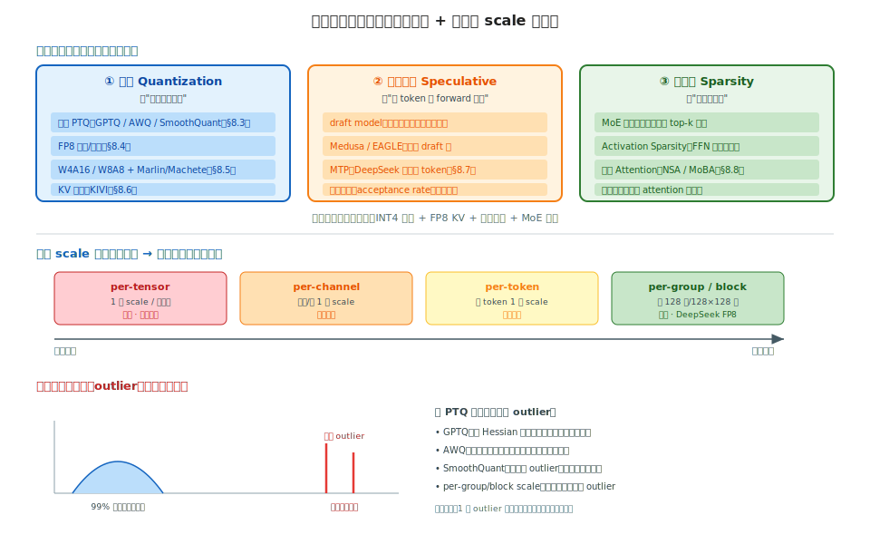
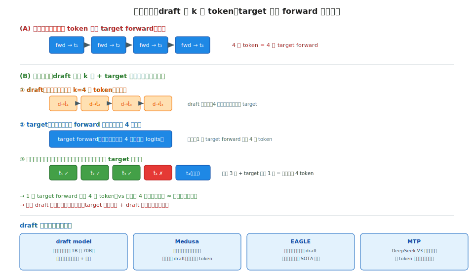

# 阶段 8｜量化、蒸馏与加速 ✓

> 一句话定位：把"让模型更小更快"的三类手段——权重/激活量化、投机解码、稀疏化——放在一张图上对比。讲清每种方案压什么、省什么、掉多少点、配哪个 kernel，让你面对一个"显存不够 / 吞吐不达标"的部署任务时，知道该上 GPTQ 还是 AWQ、该不该开 FP8、投机解码值不值。

## 目录

- [8.0 为什么需要这一层](#80-为什么需要这一层)
- [8.1 核心概念与术语](#81-核心概念与术语)
- [8.2 全景图与共同骨架](#82-全景图与共同骨架)
- [8.3 PTQ 权重量化：GPTQ / AWQ / SmoothQuant / HQQ](#83-ptq-权重量化gptq--awq--smoothquant--hqq)
- [8.4 FP8 训练与推理](#84-fp8-训练与推理)
- [8.5 量化部署：W4A16 / W8A8 / W4A8 与 kernel](#85-量化部署w4a16--w8a8--w4a8-与-kernel)
- [8.6 KV 量化算法：KIVI 与 INT8 KV](#86-kv-量化算法kivi-与-int8-kv)
- [8.7 投机解码：draft / Medusa / EAGLE / MTP](#87-投机解码draft--medusa--eagle--mtp)
- [8.8 稀疏化：MoE / Activation / 稀疏 Attention](#88-稀疏化moe--activation--稀疏-attention)
- [8.9 横向对比矩阵](#89-横向对比矩阵)
- [8.10 选型决策清单](#810-选型决策清单)
- [8.11 常见坑与 FAQ](#811-常见坑与-faq)
- [自测](#自测)
- [8.12 延伸阅读](#812-延伸阅读)

---

## 8.0 为什么需要这一层

前面的章节把"把模型跑起来"讲透了：硬件(0)、结构(1)、并行(2)、通信(3)、kernel(4)、KV 调度(5)、推理引擎(6)、训练框架(7)。本章解决一个正交的问题——**在不重训的前提下，让同一个模型更省显存、更快、更便宜**。

这不是锦上添花，而是生产部署的硬约束：

1. **显存不够**：一张 H100 80GB 装不下 LLaMA-3-70B 的 BF16 权重(140 GB)。量化到 INT4 后只要 ~35 GB，单卡能跑——量化是把大模型塞进小卡的**第一手段**。
2. **吞吐不达标**：decode 是 memory-bound(回阶段 0 §0.2.2)，瓶颈在权重和 KV 的读带宽。量化让每次读的字节减半甚至减到 1/4，**带宽压力直接下降**——量化既省显存又提速。
3. **延迟卡 SLO**：TPOT 降不下来。投机解码让一次 forward 吐多个 token，**用算力换延迟**——在 batch 不大时能把 decode 加速 2–3×。
4. **算力浪费在无效计算**：MoE 只激活部分专家、长序列里大部分 attention 接近零。稀疏化**跳过无效计算**，省算力。

本章把这些手段归成三类（也是 §8.2 的分类轴）：

- **量化(quantization)**：降低数值精度——权重量化(§8.3/8.5)、FP8(§8.4)、KV 量化(§8.6)；
- **投机解码(speculative decoding)**：一次 forward 多吐 token(§8.7)；
- **稀疏化(sparsity)**：跳过无效计算(§8.8)。

和前面章节的衔接点很多——这章是把散落的量化知识收拢成体系：

- 阶段 0 §0.2.4 讲过 FP8/INT8/INT4 的**硬件**精度阶梯，本章讲怎么**用**；
- 阶段 4 §4.7.4 讲过 FP8 **GEMM kernel**，本章讲 FP8 的**量化方案**(scale 策略)；
- 阶段 5 §5.7 讲过 KV 量化的**显存视角**，本章 §8.6 讲**算法**(KIVI)；
- 阶段 6 §6.3.4 提过投机解码的**引擎位置**，本章 §8.7 讲**算法**。

读完之后你应当能：

1. 给一个模型 + 显存预算，选对量化方案(GPTQ vs AWQ vs FP8)并估出显存/精度;
2. 解释 PTQ 各方案怎么处理 outlier、为什么 AWQ 对激活敏感层更友好;
3. 判断 FP8 该用 per-tensor / per-token / per-block 哪种 scale;
4. 评估投机解码在你的负载(batch 大小、draft 命中率)下值不值;
5. 把量化 + 投机 + 稀疏组合起来，并说清各自的精度风险。

---

## 8.1 核心概念与术语

本章术语集中在"量化方案"和"加速机制"两类。硬件精度(FP8/INT8/INT4)的基础见阶段 0 §0.2.4，这里补算法层。

| 术语 | 含义 |
|---|---|
| **PTQ** | Post-Training Quantization，训练后量化，不重训、用少量校准数据定 scale |
| **QAT** | Quantization-Aware Training，量化感知训练，训练时模拟量化(本章略，偏训练) |
| **WxAy** | 权重 x bit、激活 y bit，如 W4A16=4bit 权重+16bit 激活 |
| **scale / zero-point** | 量化参数：`q = round(x/scale) + zp`，还原 `x ≈ (q-zp)·scale` |
| **per-tensor / channel / token / group** | scale 粒度：整张量 / 每通道 / 每 token / 每 group(如 128 列) |
| **outlier** | 离群值，激活里少数远大于均值的元素，量化的头号敌人 |
| **GPTQ** | 基于二阶 Hessian 信息逐层量化权重的 PTQ 方法 |
| **AWQ** | Activation-aware Weight Quantization，按激活重要性保护权重 |
| **SmoothQuant** | 把激活的 outlier"迁移"到权重，让两边都好量化 |
| **GGUF / k-quant** | llama.cpp 的量化格式 / 分块混合精度量化(阶段 6 §6.7) |
| **Marlin / Machete** | vLLM 的高性能量化 GEMM kernel(W4A16 / FP8) |
| **draft model** | 投机解码里先猜 token 的小模型 |
| **Medusa / EAGLE** | 投机解码方案：多头并行预测 / 特征级自回归 draft |
| **MTP** | Multi-Token Prediction，DeepSeek-V3 原生多 token 预测(阶段 6 §6.4.3) |
| **acceptance rate** | 投机解码里 draft token 被主模型接受的比例，决定加速比 |
| **Activation Sparsity** | 激活稀疏，FFN 中大量神经元输出接近零 |
| **NSA / MoBA** | 原生稀疏 attention(DeepSeek) / 块状混合 attention |

> 三类加速手段的统一直觉：**它们都在"省掉不必要的成本"。** 量化省的是"每个数的比特"，投机解码省的是"每个 token 的 forward 次数"，稀疏化省的是"无效的乘加"。三者正交，可叠加——一个生产部署常常同时用 INT4 权重 + FP8 KV + 投机解码。但每一种都在拿**某种精度/正确性的余量**换效率，核心是判断这个余量在你的任务上够不够。

---

## 8.2 全景图与共同骨架

类型 B 章节的起手式:先给一张总图,看清三类加速手段的关系和量化的核心矛盾。

### 8.2.1 三类手段,一个共同目标



本章的三类手段(SVG 顶部)看似无关,但都在做同一件事——**省掉不必要的成本**:

| 类别 | 省什么 | 代价 | 本章小节 |
|---|---|---|---|
| **① 量化** | 每个数的比特数 | 数值精度 | §8.3–8.6 |
| **② 投机解码** | 每个 token 的 forward 次数 | 额外 draft 算力 + 复杂度 | §8.7 |
| **③ 稀疏化** | 无效的乘加 | 可能漏掉有用计算 | §8.8 |

三者**正交、可叠加**:一个激进的生产部署常同时用 INT4 权重 + FP8 KV + 投机解码 + MoE 稀疏。但每一种都在拿**某种余量**(精度/正确性/召回)换效率——选型的本质是判断这个余量在你的任务上够不够花。

### 8.2.2 量化的核心矛盾:scale 粒度

量化(三类里最常用)的全部技术,几乎都围绕一个权衡:**scale 粒度**(SVG 中部)。

量化就是把 BF16 的数映射到低比特整数:`q = round(x / scale)`,还原 `x ≈ q · scale`。**scale 怎么定、按多大范围共享一个 scale**,决定了精度和开销:

| 粒度 | 一个 scale 管多大 | 精度 | 开销 | 典型用途 |
|---|---|---|---|---|
| **per-tensor** | 整个张量 | 最差 | 最低 | 早期方案、QAT 后 |
| **per-channel** | 每列/行 | 中 | 低(offline 算好) | **权重** |
| **per-token** | 每个 token | 中 | 中(在线算 max) | **激活** |
| **per-group/block** | 每 128 列 / 128×128 块 | 最高 | 较高 | INT4 权重、DeepSeek FP8 |

直觉:**粒度越细,越能把数值差异大的部分隔开,精度越高,但 scale 数量越多、kernel 越复杂**。整本章的量化方法(GPTQ/AWQ/FP8/KIVI)本质都是在这条谱上选一个点,再加各自的 outlier 处理技巧。

### 8.2.3 头号敌人:outlier

为什么量化会掉点?核心是 **outlier(激活离群值)**(SVG 底部)。

LLM 的激活分布极不均匀:**99% 的元素挤在一个小范围,但少数 outlier 比均值大几十上百倍**。量化范围必须覆盖最大值——一个 outlier 就能把整段量化范围"撑大",导致 99% 的正常元素被挤进很少几个量化格子里,精度崩塌。

各 PTQ 方法的差异,本质就是**怎么对付 outlier**(SVG 右下,§8.3 详讲):

- **GPTQ**:用 Hessian 二阶信息逐列补偿量化误差;
- **AWQ**:识别重要权重通道,按激活幅度缩放保护;
- **SmoothQuant**:把激活的 outlier"迁移"到权重侧,让两边都好量化;
- **更细的 scale 粒度**:用 per-group/block 把 outlier 隔离在小范围里。

### 8.2.4 分类:训练态 vs 推理态

最后一个分类轴——这些手段作用在哪个阶段:

| 阶段 | 手段 | 说明 |
|---|---|---|
| **训练态** | FP8 训练(§8.4)、QAT | 训练时就用低精度,省训练显存/算力 |
| **推理态(PTQ)** | GPTQ/AWQ/SmoothQuant、KV 量化、投机解码、稀疏 | 不重训,部署前/部署时处理 |

本章**主体是推理态 PTQ**——因为它不需要重训、落地成本低、是绝大多数部署的选择。FP8 训练(§8.4)单独讲,因为它横跨训练和推理。

> 心智模型:**加速 = 在三个正交维度(比特/forward 次数/有效计算)上各砍一刀,每刀都用精度余量换效率。** 量化是最常用的一刀,它的全部技巧围绕"scale 粒度"和"outlier 处理"两个点。读后面每个方法时,都先问:它在 scale 谱上选哪个点?怎么对付 outlier?作用在训练还是推理?——三个问题定位清楚,再多方法也不乱。

---

## 8.3 PTQ 权重量化：GPTQ / AWQ / SmoothQuant / HQQ

PTQ(训练后量化)是部署量化的主力——**不重训,用少量校准数据定 scale**。本节逐个剖析四个主流方法。回 §8.2.3:它们的核心差异都在**怎么对付 outlier**。

先建立一个共识:**为什么是"权重"量化优先**。权重是固定的(offline 算好 scale,零运行时开销),激活是动态的(要在线算 scale)。所以 **W4A16(4bit 权重 + 16bit 激活)是最甜的点**——权重压到 1/4 省显存,激活保持 16bit 避免 outlier 麻烦。下面四个方法主要解决"权重怎么压到 4bit 还不掉点"。

### 8.3.1 GPTQ：用二阶信息逐列补偿

**定位**:最早被广泛采用的 4bit 权重 PTQ,精度稳,生态最全。

**原理**:逐层量化,核心是**用 Hessian 二阶信息补偿误差**。量化一列权重会引入误差,GPTQ 不是"量化完拉倒",而是**把这一列的量化误差,按 Hessian 信息分摊补偿到还没量化的列上**——后量化的列调整自己来抵消前面的误差。

```
对每一层 W：
  H = 2 X Xᵀ              # 校准数据算的 Hessian（X 是该层激活）
  for 每一列 j（按某顺序）：
      q_j = quantize(W[:, j])           # 量化这一列
      err = (W[:, j] - q_j) / H[j,j]    # 量化误差
      W[:, j+1:] -= err · H[j, j+1:]    # 把误差补偿到后续列
```

**对付 outlier 的方式**:不直接处理 outlier,而是**让量化误差在层内被后续列吸收**,整层的输出误差最小化。

**示例**(用 `gptqmodel` / `auto-gptq`):

```python
from gptqmodel import GPTQModel, QuantizeConfig

cfg = QuantizeConfig(bits=4, group_size=128)   # 4bit + per-group(128) scale
model = GPTQModel.load("meta-llama/Llama-3-8B", cfg)
model.quantize(calibration_dataset)            # 需要少量校准数据（~128 条）
model.save("Llama-3-8B-gptq-4bit")
```

**适用**:通用 4bit 部署,vLLM/SGLang 原生支持,模型覆盖最全。**限制**:量化过程要跑校准(几分钟~几十分钟),且对校准集有一定依赖。

### 8.3.2 AWQ：保护重要权重通道

**定位**:Activation-aware Weight Quantization,精度常优于 GPTQ,量化更快,当前最流行的 4bit 方案之一。

**原理**:核心观察——**不是所有权重一样重要,重要性由激活决定**。某些权重通道对应的激活幅度大,它们的量化误差对输出影响也大。AWQ **按激活幅度给权重通道乘一个缩放因子**:重要通道放大(量化时相对误差变小)、对应激活缩小(数学上等价),从而**保护重要通道的精度**。

$$W' = W \cdot \text{diag}(s), \quad X' = \text{diag}(s)^{-1} \cdot X, \quad W'X' = WX$$

`s` 按激活幅度选:激活大的通道 `s` 大,权重被放大后量化相对误差小。**等价变换**——不改变数学结果,只改变量化友好度。

**对付 outlier 的方式**:不动激活的 outlier(激活保持 16bit),而是**保护那些会被 outlier 激活放大的权重通道**。

**示例**(用 `llm-compressor` / `autoawq`):

```python
from awq import AutoAWQForCausalLM

model = AutoAWQForCausalLM.from_pretrained("meta-llama/Llama-3-8B")
model.quantize(tokenizer, quant_config={
    "w_bit": 4, "q_group_size": 128, "version": "GEMM"
})
model.save_quantized("Llama-3-8B-awq-4bit")
```

**适用**:4bit 部署首选之一,精度好、量化快,vLLM 用 AWQ + Marlin kernel(§8.5)跑得很快。**限制**:主要针对权重,激活量化不是它的强项。

### 8.3.3 SmoothQuant：把 outlier 从激活迁移到权重

**定位**:针对 **W8A8(权重激活都量化)** 的方案,解决"激活有 outlier、没法量化"的难题。

**原理**:W8A8 的难点在激活——激活有 outlier,直接量化崩。但**权重分布很均匀、好量化**。SmoothQuant 的洞察:**把激活的 outlier"迁移"一部分到权重侧**,让两边都变得好量化。

$$X' = X \cdot \text{diag}(s)^{-1}, \quad W' = \text{diag}(s) \cdot W, \quad X'W' = XW$$

和 AWQ 形式相似(都是等价缩放),但目的相反:AWQ 为了**保护权重通道**(激活保持高精度),SmoothQuant 为了**让激活变平缓**(从而激活也能 8bit 量化)。`s` 按激活/权重的幅度平衡选取,把 outlier 的"压力"在两边分摊。

**对付 outlier 的方式**:直接**搬运** outlier——从难量化的激活搬到好量化的权重。

**适用**:要 **W8A8**(激活也量化,吃 INT8 Tensor Core 算力,回阶段 0 §0.2.4)、追求吞吐的场景。**限制**:8bit 精度损失比 4bit 权重小,但显存省得少(8bit vs 4bit)。

### 8.3.4 HQQ：免校准的快速量化

**定位**:Half-Quadratic Quantization,**不需要校准数据**,量化极快(秒级),适合快速迭代。

**原理**:GPTQ/AWQ 都要跑校准数据。HQQ 换思路——**不用校准,纯靠优化权重本身的量化误差**。它把量化误差最小化建模成一个 half-quadratic 优化问题,对每层权重直接求解最优 scale/zero-point,**只看权重、不看激活**。

**对付 outlier 的方式**:用稀疏化的误差建模容忍权重里的 outlier,但**不利用激活信息**——所以激进 4bit 下精度略逊 AWQ。

**适用**:要快速量化大量模型、没有合适校准集、或在线动态量化。**限制**:不用激活信息,极低 bit(2–3bit)下精度不如 GPTQ/AWQ。

### 8.3.5 四方法速览

| 方法 | 用激活信息 | 要校准 | 典型配置 | outlier 策略 | 最适场景 |
|---|---|---|---|---|---|
| **GPTQ** | Hessian(间接) | 要 | W4A16 g128 | 误差逐列补偿 | 通用 4bit,生态全 |
| **AWQ** | 是(选通道) | 要(轻) | W4A16 g128 | 保护重要权重通道 | 4bit 首选,精度好 |
| **SmoothQuant** | 是(迁移) | 要 | W8A8 | outlier 迁移到权重 | W8A8 高吞吐 |
| **HQQ** | 否 | **不要** | W4A16 | 纯权重误差优化 | 快速量化、无校准集 |

> 选型直觉:**4bit 权重 + 16bit 激活(W4A16)是最甜的点,AWQ/GPTQ 二选一**(AWQ 精度略好且快,GPTQ 生态更全);要激活也量化吃 INT8 算力 → **SmoothQuant W8A8**;要秒级量化、没校准集 → **HQQ**。下一节 §8.4 讲 FP8——它是另一条路:不压到 4bit,但用硬件原生 8bit 浮点,精度几乎无损。

---

## 8.4 FP8 训练与推理

FP8 是和 §8.3 的 INT4 不同的一条路:**不压到 4bit,而是用硬件原生的 8bit 浮点**。精度几乎无损、训练推理都能用、Hopper 起有专门 Tensor Core——是 H100 时代最重要的量化方案。本节讲 FP8 的**量化方案**(scale 策略 + recipe),硬件基础见阶段 0 §0.2.4,GEMM kernel 见阶段 4 §4.7.4。

### 8.4.1 为什么 FP8 比 INT8 更适合 LLM

INT8 和 FP8 都是 8bit,算力一样(回阶段 0 §0.2.4)。但 **FP8 是浮点**,有指数位,**动态范围远大于 INT8**:

| 格式 | 位分配 | 动态范围 | 精度特点 |
|---|---|---|---|
| INT8 | — | 固定 [−127, 127] | 均匀间隔,大值小值精度一样 |
| **FP8 E4M3** | 4 指数 + 3 尾数 | ±448 | 浮点:小值密、大值疏,**符合激活分布** |
| **FP8 E5M2** | 5 指数 + 2 尾数 | ±57344 | 范围更大、精度更低,适合梯度 |

关键:**LLM 的激活/权重接近正态分布——小值多、大值少**。FP8 的浮点特性(小值附近精度高)天然贴合这个分布,所以**FP8 量化常常几乎无损,而 INT8 需要 SmoothQuant 这类技巧才行**(§8.3.3)。这是 FP8 在 LLM 上流行的根本原因。

### 8.4.2 E4M3 vs E5M2:怎么选

两种 FP8 格式分工明确(回阶段 0 §0.2.4):

- **E4M3**(范围 ±448,精度高):**前向用**——权重、激活,要精度;
- **E5M2**(范围 ±57344,精度低):**反向用**——梯度,动态范围大(梯度可能很小或很大),要范围。

直觉:前向的量值范围可控,优先精度选 E4M3;反向的梯度范围跨度大,优先范围选 E5M2。这是 Hopper FP8 训练 recipe 的基础约定。

### 8.4.3 scale 策略:per-tensor → per-block

FP8 E4M3 范围只到 ±448,**必须配 scale 把张量归一化进这个范围**(回 §8.2.2 的 scale 粒度谱、阶段 4 §4.7.4)。粒度选择是 FP8 的核心权衡:

| scale 粒度 | 精度 | 开销 | 代表 |
|---|---|---|---|
| **per-tensor** | 最差(1 个 outlier 撑大整张量) | 最低 | 早期 FP8 推理 |
| **per-token(激活) + per-channel(权重)** | 好 | 中 | 主流 FP8 推理 |
| **per-block(128×128)** | 最好 | 较高 | **DeepSeek-V3 FP8 训练** |

DeepSeek-V3 的 **block-wise FP8** 是工程标杆:权重按 128×128 块、激活按 1×128 块各自一个 scale。**细粒度把 outlier 隔离在小块里**,让 FP8 训练(不只是推理)也能稳定收敛——这是 DeepSeek-V3 能用 FP8 训出万亿参数的关键之一(回阶段 4 §4.7.4 的实测表)。

### 8.4.4 FP8 训练 recipe

FP8 训练比推理难——反向、梯度、数值稳定都要处理。Hopper FP8 训练的标准 recipe(NVIDIA TransformerEngine):

1. **前向 GEMM 用 E4M3**,反向 GEMM 的梯度用 E5M2;
2. **累加器保持 FP32**——FP8 只用于 GEMM 输入,累加在 FP32 做(回阶段 4 §4.7.4),这是数值稳定的关键;
3. **主权重保持 BF16/FP32**——优化器更新在高精度做,只在 GEMM 时 cast 成 FP8;
4. **动态 scale(delayed scaling)**——用历史几个 step 的 amax(最大绝对值)推算当前 scale,避免每步重算的开销;
5. **敏感层保持高精度**——embedding、lm\_head、norm 不量化。

代码层面用 TransformerEngine 几乎透明:

```python
import transformer_engine.pytorch as te
from transformer_engine.common.recipe import DelayedScaling, Format

fp8_recipe = DelayedScaling(fp8_format=Format.HYBRID)  # 前向E4M3+反向E5M2
with te.fp8_autocast(enabled=True, fp8_recipe=fp8_recipe):
    out = te_linear(x)        # GEMM 自动走 FP8，累加 FP32
```

收益:**训练吞吐 ~1.3–1.5×**(FP8 算力是 BF16 的 2×,但受限于非 GEMM 部分和通信),显存也降。代价:工程复杂度高,数值调试比 BF16 难。

### 8.4.5 FP8 推理

推理比训练简单得多——**只有前向,没有梯度**。流程:

1. **权重 offline 量化成 FP8 E4M3** + per-channel scale;
2. **激活在线量化成 FP8** + per-token scale;
3. GEMM 走 FP8 Tensor Core,累加 FP32,输出 BF16 给下一层(回阶段 4 §4.7.4 的公式)。

vLLM 一行开启:

```bash
vllm serve meta-llama/Llama-3-70B --quantization fp8
# 或加载已量化的 FP8 checkpoint（如 neuralmagic 的 FP8 模型）
```

实测(回阶段 4 §4.7.4 表):H100 上 FP8 推理 **~1.8–1.9× 吞吐、精度损失 < 0.3 pt**——这是 H100 推理几乎一定要开 FP8 的原因。

### 8.4.6 FP8 vs INT4:怎么选

两条量化路线的取舍:

| 维度 | FP8 | INT4(GPTQ/AWQ) |
|---|---|---|
| **显存** | 1/2(8bit) | **1/4(4bit)** |
| **精度** | **几乎无损(< 0.3pt)** | 小幅损失(0.5–2pt) |
| **硬件** | **需 Hopper+(FP8 Tensor Core)** | 任意(INT4 更通用) |
| **训练** | **支持** | 仅推理 |
| **kernel** | cuBLASLt FP8 | Marlin/Machete(§8.5) |

选型直觉:**有 H100、要精度、显存够 → FP8**;**显存极度吃紧、能容忍小掉点、或没 Hopper → INT4**。两者也能组合:**W4A8(4bit 权重 + FP8 激活)** 取两者之长,下节 §8.5 讲。

> 心智模型:**FP8 是"用浮点特性贴合 LLM 分布"的量化——8bit 但几乎无损,代价是只在 Hopper+ 有硬件。** 它和 INT4 是两条互补的路:FP8 求精度无损、能训练;INT4 求极致省显存。block-wise scale 是 FP8 能用于训练的关键工程突破(DeepSeek-V3)。

---

## 8.5 量化部署：W4A16 / W8A8 / W4A8 与 kernel

§8.3/8.4 讲了"怎么量化",本节讲"量化完怎么跑得快"。**量化省了显存,但低 bit GEMM 要专门的 kernel 才能省时间**——否则反量化开销会吃掉收益。这一节是量化算法和阶段 4 kernel 的交汇点。

### 8.5.1 WxAy 组合:权重和激活各几 bit

部署量化的命名是 **WxAy**(权重 x bit、激活 y bit),不同组合吃不同硬件、解决不同瓶颈:

| 方案 | 权重 | 激活 | 瓶颈优化 | 适用 |
|---|---|---|---|---|
| **W4A16** | 4bit | 16bit(BF16) | **省显存 + decode 带宽** | decode 为主、batch 小 |
| **W8A8** | 8bit | 8bit | **吃 INT8/FP8 算力** | prefill 重、batch 大 |
| **W4A8** | 4bit | 8bit | 省显存 + 部分算力 | 两者兼顾,较新 |
| **FP8(W8A8)** | FP8 | FP8 | 算力 + 精度无损 | H100,§8.4 |

关键直觉——**为什么 W4A16 最常用**:回阶段 0 §0.2.2,decode 是 memory-bound,瓶颈是**权重读带宽**。W4A16 把权重压到 1/4,decode 时读的字节减 4 倍,**直接提速**;激活保持 16bit 避免 outlier 麻烦(§8.2.3)。**对 batch 小的 decode,W4A16 既省显存又提速,是最甜的点。**

但 W4A16 有个反直觉的坑:**batch 大时它反而可能变慢**。因为 batch 大时 GEMM 变 compute-bound(回阶段 1 §1.5),此时瓶颈是算力不是带宽,而 4bit 权重要**反量化成 16bit 才能算**——反量化开销在大 batch 下盖过省下的带宽。所以:

- **小 batch / decode** → W4A16(带宽受益);
- **大 batch / prefill** → W8A8 / FP8(算力受益,8bit 直接算不用反量化回 16bit)。

### 8.5.2 为什么需要专门 kernel:Marlin / Machete

W4A16 的核心难点:**权重是 4bit 存的,但 Tensor Core 不能直接算 4bit×16bit**。朴素做法是"反量化 4bit→16bit,再用 16bit GEMM"——但反量化要读写显存,把省下的带宽又吐回去。

**Marlin**(vLLM 的 W4A16 kernel)的解法:**把反量化融合进 GEMM kernel**。权重以 4bit 留在显存(省带宽),在 kernel 内部、寄存器/SMEM 里即时反量化成 16bit 喂给 Tensor Core,**反量化不落显存**(回阶段 4 §4.6 的融合思想)。这样:

- 显存里权重是 4bit(省 4 倍带宽);
- Tensor Core 算的是 16bit(用满算力);
- 反量化在片上完成(零额外显存流量)。

Marlin 在中等 batch 下能跑到接近 FP16 GEMM 的算力利用率,同时享受 4bit 的带宽优势。

**Machete** 是 Marlin 的 Hopper 升级版,用上阶段 4 §4.2 的 TMA + WGMMA,在 H100 上更快。两者都是 vLLM 的内置 kernel,选 AWQ/GPTQ 模型时自动调用。

kernel 选择对照:

| 量化方案 | kernel | 硬件 |
|---|---|---|
| W4A16(GPTQ/AWQ) | **Marlin** | Ampere+ |
| W4A16(GPTQ/AWQ) | **Machete** | Hopper(更快) |
| FP8 W8A8 | cuBLASLt FP8(§4.7.4) | Hopper+ |
| INT8 W8A8 | CUTLASS INT8 | Ampere+ |

### 8.5.3 vLLM quantization 后端

vLLM 把量化做成可插拔后端,部署时一个 flag:

```bash
# AWQ 4bit（自动用 Marlin/Machete kernel）
vllm serve TheBloke/Llama-3-70B-AWQ --quantization awq_marlin

# GPTQ 4bit
vllm serve model-gptq --quantization gptq_marlin

# FP8（在线量化或加载 FP8 ckpt）
vllm serve meta-llama/Llama-3-70B --quantization fp8

# compressed-tensors（llm-compressor 产出的统一格式，支持 W4A16/W8A8/FP8）
vllm serve model-quant --quantization compressed-tensors
```

`compressed-tensors` 是 vLLM/neuralmagic 推的**统一量化格式**——一个格式囊括 W4A16/W8A8/FP8/W4A8,用 `llm-compressor` 工具产出,正在成为部署量化的标准。

源码定位(`vllm/model_executor/layers/quantization/`):各方案一个文件(`awq_marlin.py` / `gptq_marlin.py` / `fp8.py` / `compressed_tensors/`),都实现统一的 `QuantizationConfig` 接口——加自定义量化方案照着改。

### 8.5.4 部署量化的实测权衡

一个典型决策表(H100,LLaMA-3-70B 量级,**量级估算供方向参考**):

| 方案 | 显存 | 小 batch 吞吐 | 大 batch 吞吐 | 精度损失 |
|---|---|---|---|---|
| BF16 | 140 GB(需 2 卡) | 1.0× | 1.0× | 0 |
| **W4A16(AWQ+Marlin)** | ~35 GB(单卡) | **~1.5–2×** | ~1.0×(反量化抵消) | ~0.5–1 pt |
| **FP8** | ~70 GB | ~1.3× | **~1.8×** | < 0.3 pt |
| **W8A8(INT8)** | ~70 GB | ~1.2× | ~1.6× | ~0.5 pt(需 SmoothQuant) |

> 数字是量级估算(标注硬件 H100、待实测校准,守 CLAUDE.md §4)。决策逻辑清楚:**显存吃紧、单卡部署、小 batch → W4A16**(还能把 70B 塞进单卡);**大 batch、高吞吐、有 H100 → FP8**;两者都要可上 **W4A8**。

> 心智模型:**量化部署 = 选对 WxAy 组合 + 用对融合 kernel。** 算法(§8.3/8.4)决定精度,kernel(Marlin/Machete)决定能不能真的跑快。核心权衡是 batch 大小:小 batch 选 W4A16 省带宽,大 batch 选 W8A8/FP8 用算力——选错了量化反而变慢。

---

## 8.6 KV 量化算法：KIVI 与 INT8 KV

KV 量化的**显存视角**(为什么省、省多少、per-token vs per-channel 的结论)阶段 5 §5.7 已经讲透。本节补**算法视角**——KIVI 为什么得出"Key 走 per-channel、Value 走 per-token"这个非对称结论,以及它怎么和 attention kernel 结合。和 §5.7 是同一主题的两面,不重复。

### 8.6.1 KV 量化与权重量化的不同

KV 量化不能照搬 §8.3 的权重量化方法,有两个本质区别:

1. **在线、动态**:权重是固定的,可以 offline 慢慢量化(GPTQ 跑校准)。KV 是 decode 过程中**逐 token 动态产生**的(回阶段 5 §5.7.4),量化必须在线、极快,否则吃掉省下的带宽。
2. **K 和 V 性质不同**:权重是一坨;KV 里 **Key 和 Value 在 attention 里的角色不同**(Key 进 `QKᵀ` 算 score,Value 进 `score·V` 算输出),它们的数值分布也不同——这是 KIVI 非对称设计的根源。

### 8.6.2 KIVI:Key per-channel + Value per-token

KIVI(2024)的核心发现,值得记牢:**Key 适合 per-channel 量化,Value 适合 per-token 量化**(回阶段 5 §5.7.2 的结论,这里讲为什么)。

**为什么 Key 走 per-channel**:Key cache 的 outlier **集中在固定的几个 channel**(与 RoPE 高频维、某些特定 hidden 维相关)。这些 outlier channel 在所有 token 上都大。如果用 per-token 量化(一个 token 一个 scale,跨 channel 归约),outlier channel 会把同 token 其它正常 channel 的精度毁掉。改用 **per-channel(一个 channel 一个 scale,跨 token 归约)**,就能把 outlier channel 隔离——它自己用大 scale,不污染别的 channel。

**为什么 Value 走 per-token**:Value cache 没有明显的 channel 模式,outlier 随 token 随机分布。per-token(每 token 一个 scale)更稳。

直觉总结(对照 §8.2.2 的 scale 谱):

| | outlier 模式 | 最优 scale 粒度 | 原因 |
|---|---|---|---|
| **Key** | 集中在固定 channel | **per-channel** | 隔离 outlier channel |
| **Value** | 随 token 随机 | **per-token** | 随分布走 |

这个非对称设计让 KV 能压到 **INT4 还基本不掉点**——是长 context 推理的关键省显存手段(回阶段 5 §5.7.3)。

### 8.6.3 实现难点:per-channel 与 attention 的冲突

KIVI 有个工程难点:**Key 的 per-channel 量化和 attention 的计算方向冲突**。

回阶段 4 §4.2:attention 的 `QKᵀ` 沿 head\_dim(channel)维归约。Key per-channel scale 意味着每个 channel 一个 scale——但 attention 要把所有 channel 加起来算 score。这要求反量化和 `QKᵀ` 必须**在 kernel 里协同**:每个 channel 先乘自己的 scale 再参与点积。

所以 KV INT8 量化离不开**专门的 attention kernel**:

- **FlashInfer** 原生支持 KV INT8(回阶段 4 §4.4):attention kernel 内部处理 per-channel/per-token 的反量化,与 `QKᵀ`/`score·V` 融合,不额外落显存;
- vLLM 的 FP8 KV(`--kv-cache-dtype fp8`)更简单——FP8 有硬件支持,scale 处理比 INT8 轻。

这就是为什么 §5.7 说"FP8 KV 在 H100 上几乎是免费午餐,INT4 KV 要谨慎":FP8 有硬件和 kernel 支持,INT4/INT8 KV 需要 KIVI 式的精细 scale + 专门 kernel,工程复杂度高。

### 8.6.4 实战选择

| 方案 | scale 策略 | kernel | 适用 |
|---|---|---|---|
| **FP8 KV** | per-token | vLLM 原生、FlashInfer | **H100 首选**,几乎无损,一行开 |
| **INT8 KV(KIVI 式)** | Key per-channel + Value per-token | FlashInfer INT8 | 无 FP8 硬件(A100) |
| **INT4 KV** | 同上 + group-wise | 专门 kernel | 极致长 context,可接受小掉点 |

实战建议(和 §5.7.3 一致):**H100 直接 `--kv-cache-dtype fp8`**;A100 用 INT8 KV;INT4 KV 务必在自己的 eval 集验证掉点。

> 心智模型:**KV 量化是"在线 + 非对称"的特殊量化——Key 和 Value 因为 attention 里角色不同,要用不同的 scale 粒度。** KIVI 的洞察(Key per-channel、Value per-token)是核心,但它依赖专门的 attention kernel(FlashInfer)把反量化融进计算。这是量化(本章)和 kernel(阶段 4)、KV 管理(阶段 5)三者的交汇点。

---

## 8.7 投机解码：draft / Medusa / EAGLE / MTP

前面的量化(§8.3–8.6)省的是"每个数的比特"。投机解码(speculative decoding)是另一类加速——**省"每个 token 的 forward 次数"**。阶段 6 §6.3.4 提过它在引擎里的位置,本节讲算法。

### 8.7.1 核心思想:猜测 + 并行验证

decode 慢的根源回阶段 0 §0.2.2:**单 token decode 是 memory-bound,GPU 算力大量闲置**。每次 forward 只产出 1 个 token,却要把整个模型权重读一遍——带宽用满了,算力没用上。

投机解码的洞察:**既然算力闲着,何不一次验证多个候选 token?**



三步(SVG):

1. **draft 猜**:用一个**便宜**的方式连续猜 k 个 token(SVG 橙色)——可以是小模型、或主模型的额外预测头;
2. **target 验证**:用大模型(target)**一次 forward 并行算出 k 个位置的 logits**(SVG 蓝色)。关键:**一次 forward 验证 k 个 token**,而不是 k 次 forward;
3. **接受/回滚**:逐个比对 draft 的猜测和 target 的真值,**接受匹配的前缀,第一个不匹配处用 target 真值替换、丢弃后面**(SVG 绿/红)。

为什么这一定正确:第一个不匹配处用的是 target 自己的输出,**最终序列和普通解码完全一致**(用 rejection sampling 还能保证采样分布也一致)——投机解码**不损失任何精度**,这是它和量化的关键区别。

### 8.7.2 为什么能加速:接受率是关键

加速比 ≈ **平均接受长度**(每轮 target forward 产出几个 token)。SVG 的例子:draft 猜 4 个,接受 3 个 + target 真值 1 个 = 一轮产出 4 token,**1 次 target forward 顶 4 次**。

但有个致命前提——**接受率(acceptance rate)**:

- draft 猜得准(接受率高)→ 平均接受长度长 → 加速明显;
- draft 猜得差(接受率低)→ target 验证白跑 + draft 的开销 → **反而变慢**(SVG 红字)。

所以投机解码不是免费的,它**用额外算力(draft + 验证)赌接受率**。两个决定成败的因素:

1. **draft 质量**:draft 越接近 target,接受率越高;
2. **batch 大小**:**batch 小时 GPU 算力闲置最多,投机收益最大;batch 大时 GPU 已被喂饱(回阶段 0 ridge point),没有闲置算力可用,投机反而增加开销**。所以投机解码主要用在**低并发、低延迟敏感**场景(如本地、单用户、agent)。

### 8.7.3 四种方案:draft 从哪来

四种方案的核心差异是 **draft 怎么产生**(SVG 底部):

| 方案 | draft 来源 | 优点 | 缺点 |
|---|---|---|---|
| **draft model** | 独立小模型(如 1B 配 70B) | 通用,任意模型可配 | 要额外模型 + 显存,小模型对齐难 |
| **Medusa** | 主模型加多个预测头 | 无需独立 draft,省显存 | 接受率中等,要训练头 |
| **EAGLE** | 在**特征层**做自回归 draft | **接受率高**,当前 SOTA 之一 | 实现较复杂 |
| **MTP** | DeepSeek-V3 训练时内建 | 原生、对齐好 | 仅 DeepSeek 系 |

**draft model** 最直观:拿同系列小模型(LLaMA-3-8B 给 70B 当 draft)猜,大模型验证。难点是小模型和大模型的"口味"要接近,否则接受率低。

**Medusa** 不用独立模型,在主模型最后一层接**多个预测头**,每个头预测未来第 i 个 token,并行出 draft。省显存,但头是额外训练的、接受率不如 EAGLE。

**EAGLE** 是目前接受率最高的方案之一:它不在 token 层猜,而是在**特征(hidden state)层做自回归**——用主模型倒数第二层的特征预测下一个特征,再解码成 token。特征比 token 信息丰富,draft 质量高,接受率显著优于 Medusa。

**MTP(Multi-Token Prediction)** 是 DeepSeek-V3 的原生方案(回阶段 6 §6.4.3):训练时就加了多 token 预测目标,推理时直接用这些头做投机,对齐天然好。

### 8.7.4 工程落地

vLLM/SGLang 都支持投机解码,配置示例(回阶段 6 §6.3.4):

```bash
# draft model 方式
vllm serve meta-llama/Llama-3-70B \
  --speculative-config '{"model": "meta-llama/Llama-3-8B", "num_speculative_tokens": 5}'

# EAGLE 方式
vllm serve meta-llama/Llama-3-70B \
  --speculative-config '{"method": "eagle", "model": "<eagle-head>", "num_speculative_tokens": 5}'
```

`num_speculative_tokens`(k)是核心旋钮:**k 越大,猜得越多、潜在加速越大,但接受率随 k 衰减**(猜得越远越容易错)。典型 k=3–5。

落地纪律:

- **先测接受率**:用自己的负载测平均接受长度,< 2 基本不值得开;
- **只在低并发开**:batch 大时关掉(§8.7.2);vLLM 可按负载动态决定;
- **draft 要对齐**:draft model 选同系列、同 tokenizer,否则接受率崩。

> 心智模型:**投机解码 = 用闲置算力赌"猜得准"。** 它和量化正交——量化省比特、投机省 forward 次数,**且投机不损失精度**(target 验证保证正确)。但它只在 GPU 算力闲置(小 batch)时划算,且成败全看接受率。EAGLE/MTP 这类高接受率方案是当前主流。

---

## 8.8 稀疏化：MoE / Activation / 稀疏 Attention

三类加速的最后一类。量化省比特、投机省 forward 次数,**稀疏化省"无效的乘加"**——LLM 里大量计算结果接近零或对输出无贡献,跳过它们就省算力。本节讲三种稀疏:MoE 路由、激活、attention。

### 8.8.1 稀疏的共同逻辑:跳过无贡献计算

稀疏化的前提是 **LLM 计算里有大量冗余**:

- **MoE**:一个 token 只需要少数几个专家,激活全部专家是浪费;
- **FFN 激活**:SwiGLU 的中间激活里,大量神经元输出接近零(SiLU 门控的效果);
- **Attention**:长序列里,一个 query 真正关注的 key 只有少数,大部分 attention 权重接近零。

稀疏化就是**识别并跳过这些无贡献的部分**。代价:识别本身有开销,且可能漏掉有用计算(召回损失)——这是稀疏化的精度风险(回 §8.2.1)。

### 8.8.2 MoE 路由稀疏:最成功的稀疏

MoE 是**当前最成功、最主流的稀疏化**——已经是 DeepSeek-V3、Mixtral、Qwen-MoE 等大模型的标准结构(回阶段 1 §1.2.4、阶段 2 §2.2.5)。

原理:把一个大 FFN 拆成 N 个专家,每个 token 经 router 只激活 **top-k 个**(如 256 选 8)。**参数量大(全部专家)、但每 token 的计算量小(只激活 k 个)**——用大容量换表达力,用稀疏激活控制算力。

| 模型 | 专家数 | top-k | 激活比例 |
|---|---|---|---|
| Mixtral-8x7B | 8 | 2 | 25% |
| DeepSeek-V3 | 256 routed + 1 shared | 8 | ~3.6% |
| Qwen3-MoE | 128 | 8 | ~6% |

DeepSeek-V3 的极致:256 个专家只激活 8 个,**每 token 只算 3.6% 的 FFN 参数**——这是它能做到 671B 总参数、但推理算力接近 37B 激活参数的关键。MoE 的工程(EP 并行、All-to-All、负载均衡)已在阶段 2 §2.2.5、阶段 3 §3.4、阶段 9 详讲,这里只点出它的稀疏本质。

### 8.8.3 Activation Sparsity:FFN 的天然稀疏

**激活稀疏**利用一个观察:**FFN(尤其 ReLU 系)的中间激活里,大量神经元输出是零或接近零**。

- ReLU FFN:负输入直接归零,天然稀疏(早期发现 ~90% 激活为零);
- SwiGLU(现代 LLM 主流):SiLU 门控让很多中间值接近零,但不是硬零,稀疏度低一些。

如果能**预测哪些神经元会是零,跳过对应的权重列计算**,就省算力。代表工作:

- **基于阈值的动态稀疏**:运行时判断哪些激活小于阈值,跳过;
- **预测稀疏模式**:用小网络预测激活稀疏 mask(如 PowerInfer 的 hot/cold neuron)。

难点:**SwiGLU 的稀疏不如 ReLU 干净**——现代 LLM 用 SwiGLU,激活稀疏的收益不如 ReLU 时代明显。所以激活稀疏目前更多用在**特定场景**(如 CPU/边缘推理的 PowerInfer:把高频激活的"热"神经元放 GPU、低频"冷"的放 CPU),不是数据中心的主流。

### 8.8.4 稀疏 Attention:长序列的关键

attention 的 $O(S^2)$ 复杂度是长序列的瓶颈(回阶段 4 §4.2、阶段 9)。稀疏 attention 的洞察:**长序列里,一个 query 真正关注的 key 只有少数**——大部分 attention 权重接近零,算它们是浪费。

两个代表方案:

- **NSA(Native Sparse Attention,DeepSeek)**:**原生**稀疏——不是事后裁剪,而是训练时就用稀疏结构。它把 attention 分成三路:压缩的粗粒度全局 + 精选的细粒度局部 + 滑动窗口,**训练和推理都稀疏**,硬件友好(为现代 GPU 的访存特性设计);
- **MoBA(Mixture of Block Attention,Moonshot)**:把序列分块,**用类似 MoE 路由的方式选哪些块参与 attention**——query 只 attend 到 router 选出的少数块,把 MoE 的稀疏思想搬到 attention。

| 方案 | 思路 | 稀疏时机 | 特点 |
|---|---|---|---|
| **NSA** | 三路混合(全局压缩+局部精选+窗口) | 训练即稀疏 | 硬件友好,DeepSeek 体系 |
| **MoBA** | 块级路由(MoE 式) | 训练即稀疏 | 与 full attention 可切换 |

共同点:**都是"原生稀疏"**——训练时就用稀疏结构,而不是给稠密模型事后加稀疏(事后加往往掉点)。这是稀疏 attention 近年的趋势,详细工程在阶段 9 长上下文专题展开。

### 8.8.5 三种稀疏速览

| 稀疏类型 | 跳过什么 | 成熟度 | 主流程度 |
|---|---|---|---|
| **MoE 路由** | 未选中的专家 | **最成熟** | 大模型标准结构 |
| **Activation** | 零激活的神经元 | 中(SwiGLU 后收益降) | 边缘/特定场景 |
| **稀疏 Attention** | 无关的 key/block | 上升中(NSA/MoBA) | 长序列前沿 |

> 心智模型:**稀疏化 = 跳过不贡献的计算,但要先付"识别"的开销。** 三种里 **MoE 路由稀疏是唯一成为主流结构的**——它的稀疏是设计出来的(router + top-k),识别开销小、收益确定。激活稀疏和稀疏 attention 更多是前沿/特定场景。和量化(省比特)、投机(省 forward)正交,可叠加——DeepSeek-V3 就是 MoE 稀疏 + FP8 量化 + MTP 投机的集大成者(阶段 9 详讲)。

---

## 8.9 横向对比矩阵

把本章所有加速手段汇成一张表。**选型时直接查。**

### 8.9.1 加速手段全表

| 手段 | 省什么 | 显存收益 | 速度收益 | 精度损失 | 硬件要求 | 阶段/小节 |
|---|---|---|---|---|---|---|
| **GPTQ W4A16** | 比特 | 4× | 小 batch ~1.5–2× | 0.5–1 pt | 任意 | §8.3.1 |
| **AWQ W4A16** | 比特 | 4× | 小 batch ~1.5–2× | 0.5–1 pt | 任意 | §8.3.2 |
| **SmoothQuant W8A8** | 比特 | 2× | 大 batch ~1.6× | ~0.5 pt | INT8 算力 | §8.3.3 |
| **HQQ W4A16** | 比特 | 4× | 同 GPTQ | 中(无校准) | 任意 | §8.3.4 |
| **FP8** | 比特 | 2× | 大 batch ~1.8× | **< 0.3 pt** | **Hopper+** | §8.4 |
| **FP8 KV** | KV 比特 | KV 2× | decode 带宽 | < 0.1 pt | Hopper+ | §8.6 |
| **INT8 KV(KIVI)** | KV 比特 | KV 2× | decode 带宽 | 小 | FlashInfer | §8.6 |
| **投机解码(EAGLE)** | forward 次数 | — | **小 batch ~2–3×** | **0**(无损) | 任意 | §8.7 |
| **MoE 路由稀疏** | 无效专家 | — | 设计层面 | 0(原生) | EP 支持 | §8.8.2 |
| **稀疏 Attention** | 无关 key | 长 ctx KV | 长序列 | 小(原生) | 专门 kernel | §8.8.4 |

> 速度收益标注了 batch 依赖——这是本章最容易被忽略、却最影响实际效果的维度。所有数字是量级估算(标注硬件待校准,守 CLAUDE.md §4)。

### 8.9.2 按瓶颈选手段

不同瓶颈对应不同手段——**先确定瓶颈,再选手段**(回阶段 0 Roofline、阶段 11 profiling):

| 你的瓶颈 | 根因 | 首选手段 |
|---|---|---|
| **显存装不下** | 权重/KV 太大 | INT4 权重(§8.5) + FP8/INT8 KV(§8.6) |
| **decode 慢(小 batch)** | 权重读带宽(memory-bound) | W4A16(§8.5)+ 投机解码(§8.7) |
| **prefill/大 batch 慢** | 算力(compute-bound) | FP8/W8A8(§8.4/8.5) |
| **长 context KV 爆炸** | KV 随 seq 线性增长 | KV 量化(§8.6)+ 稀疏 attention(§8.8) |
| **MoE 训练/推理成本高** | 全专家激活 | MoE 路由稀疏(§8.8.2,本来就该用) |

核心直觉(贯穿全章):**batch 大小决定瓶颈,瓶颈决定手段**。小 batch decode → memory-bound → 省带宽的手段(W4A16、投机);大 batch prefill → compute-bound → 省算力的手段(FP8、W8A8)。选错方向,手段会失效甚至变慢(如 W4A16 在大 batch、投机在大 batch)。

### 8.9.3 可叠加性

三类手段正交,生产部署常叠加:

```
DeepSeek-V3 满血部署 ≈ MoE 稀疏(结构) + FP8 量化(§8.4) + MTP 投机(§8.7) + FP8 KV(§8.6)
单卡塞 70B        ≈ INT4 权重(§8.5) + FP8 KV(§8.6)
低延迟 agent      ≈ W4A16(§8.5) + EAGLE 投机(§8.7)
```

叠加注意:**每加一种都叠加精度风险**——INT4 权重(−1pt)+ INT8 KV(−0.5pt)可能累积到 −2pt,务必在自己的 eval 集上验证组合效果,不能假设各自损失独立可加。

---

## 8.10 选型决策清单

按场景给"选什么 / 为什么 / 注意什么"。

| 场景 | 首选组合 | 为什么 | 注意 |
|---|---|---|---|
| **70B 塞进单卡 H100** | INT4(AWQ)+ FP8 KV | 权重 140→35 GB,KV 减半 | 验证 INT4 掉点;大 batch 会变慢 |
| **H100 高吞吐 serving** | FP8(权重+激活+KV) | 算力翻倍、精度无损、一行开 | 仅 Hopper+;A100 退回 INT8 |
| **A100 部署** | AWQ W4A16 + INT8 KV | 无 FP8 硬件,INT4 省显存 | INT8 KV 需 KIVI 式 scale |
| **低延迟 agent(小 batch)** | W4A16 + EAGLE 投机 | 小 batch 省带宽 + 投机省 forward | 投机大 batch 关掉 |
| **长 context(128K+)** | FP8 KV + 稀疏 attention | KV 是瓶颈,稀疏降 $O(S^2)$ | 稀疏 attn 要原生训练 |
| **快速量化大量模型** | HQQ | 免校准、秒级 | 极低 bit 精度略逊 |
| **从头训省成本** | FP8 训练 + MoE | 算力翻倍 + 稀疏激活 | 工程复杂,需 block-wise scale |

四条选型原则:

1. **先 profile 定瓶颈**(§8.9.2)——显存 / decode 带宽 / prefill 算力 / 长 ctx KV,瓶颈不同手段完全不同;
2. **batch 大小是分水岭**——小 batch 省带宽(W4A16/投机)、大 batch 省算力(FP8/W8A8),选错方向会变慢;
3. **有 H100 优先 FP8**——精度几乎无损、训推都能用,是最省心的一刀;
4. **叠加必验证**——组合的精度损失不是各自简单相加,务必在业务 eval 集测。

---

## 8.11 常见坑与 FAQ

1. **W4A16 在大 batch 反而变慢**:大 batch 是 compute-bound,4bit 权重要反量化成 16bit 才能算,反量化开销盖过省下的带宽(§8.5.1)。大 batch 改用 FP8/W8A8。
2. **量化后精度暴跌**:八成是 outlier 没处理好(§8.2.3)。权重量化换 AWQ(保护重要通道);要 W8A8 上 SmoothQuant;或用更细的 group/block scale。
3. **FP8 在 A100 上跑不了/很慢**:A100 没有 FP8 Tensor Core(阶段 0 §0.2.4),会回退。A100 用 INT8/INT4。
4. **GPTQ/AWQ 量化结果依赖校准集**:校准集和实际负载分布差太远会掉点。用接近业务分布的数据校准(~128 条通常够)。
5. **KV INT4 掉点严重**:KV 量化比权重敏感,INT4 KV 要 KIVI 式非对称 scale(Key per-channel)+ 专门 kernel(§8.6),且务必验证;保守用 FP8 KV。
6. **投机解码没加速甚至变慢**:接受率太低(< 2 平均接受长度)或 batch 太大(§8.7.2)。先测接受率,只在小 batch 开,draft 选同系列对齐。
7. **draft model 和 target tokenizer 不一致**:直接崩或接受率为零。draft 必须同 tokenizer、最好同系列。
8. **稀疏 attention 给稠密模型事后加 → 掉点**:NSA/MoBA 要训练时就用稀疏结构(§8.8.4),事后裁剪稠密模型的 attention 往往掉点明显。
9. **量化模型 benchmark 分数和实际体验对不上**:通用 benchmark(如 MMLU)可能测不出你任务的退化。数学/代码/长文等敏感任务务必单独测。
10. **多种量化叠加后精度崩**:精度损失会累积(§8.9.3)。逐个加、逐个验证,别一次全开。

---

## 自测

1. **（概念）** 量化掉点的头号原因是什么？GPTQ、AWQ、SmoothQuant 三种 PTQ 各用什么思路对付它？
2. **（选型）** 有 H100、要精度几乎无损 + 能训练 → 选 FP8 还是 INT4？显存极度吃紧、能容忍小掉点、且没有 Hopper → 选哪个？
3. **（概念）** 投机解码为什么"不损失精度"？它的加速比约等于什么指标？什么情况下反而会变慢？
4. **（判读）** 三类加速手段（量化/投机/稀疏）里，哪一类已经成为大模型的标准结构、而不只是"可选优化"？
5. **（应用）** 你把 INT4 权重 + INT8 KV + 投机解码三个一起开，精度掉了 2pt。哪里出了判断错误？

<br>

**参考答案**

1. **outlier（激活离群值）**——少数元素比均值大几十上百倍，撑大量化范围、挤垮正常值。GPTQ 用 Hessian 逐列补偿误差；AWQ 按激活幅度保护重要权重通道；SmoothQuant 把 outlier 从激活"迁移"到权重侧。（§8.2.3、§8.3）
2. 第一个选 **FP8**（8bit、精度 < 0.3pt 损失、训推都能用，但需 Hopper）；第二个选 **INT4**（4bit 省显存最多、硬件通用）。（§8.4.6）
3. 因为第一个不匹配处用的是 **target 自己的输出**，最终序列与普通解码完全一致。加速比 ≈ **平均接受长度**。**batch 大时**（GPU 已喂饱、无闲置算力）或 **draft 接受率低时**反而变慢。（§8.7.1/8.7.2）
4. **MoE 路由稀疏**——它是设计出来的稀疏（router + top-k），已是 DeepSeek/Mixtral/Qwen-MoE 的标准结构；激活稀疏和稀疏 attention 还更多是前沿/特定场景。（§8.8.2/8.8.5）
5. 错在**假设各自的精度损失独立可加**。组合量化的掉点会累积，必须在自己的 eval 集上验证组合效果，逐个加、逐个测。（§8.9.3、§8.11 第 10 条）

> 第 2、3 题是部署量化最常做的两个决策（FP8 vs INT4、要不要开投机）——选错方向轻则没收益、重则变慢。

---

## 8.12 延伸阅读

- **GPTQ 论文(《GPTQ: Accurate Post-Training Quantization》)** — Hessian 逐列补偿的理论,§8.3.1 的源头。
- **AWQ 论文(《AWQ: Activation-aware Weight Quantization》)** — 激活感知保护权重通道,§8.3.2 的核心。
- **SmoothQuant 论文** — outlier 从激活迁移到权重的等价变换,§8.3.3。
- **FP8-LM / DeepSeek-V3 技术报告(FP8 训练部分)** — block-wise FP8 训练 recipe,§8.4 的工程标杆。
- **KIVI 论文(《KIVI: A Tuning-Free Asymmetric 2bit Quantization for KV Cache》)** — Key per-channel + Value per-token 的实证,§8.6。
- **EAGLE / Medusa 论文** — 投机解码两个代表方案,对照 §8.7 读接受率提升的来源。
- **NSA(《Native Sparse Attention》)+ MoBA 论文** — 原生稀疏 attention 的设计,§8.8.4,与阶段 9 长上下文衔接。
- **vLLM `quantization/` 源码 + `llm-compressor` 文档** — 把上面的算法落到部署的工程入口,§8.5 的实操。

---
