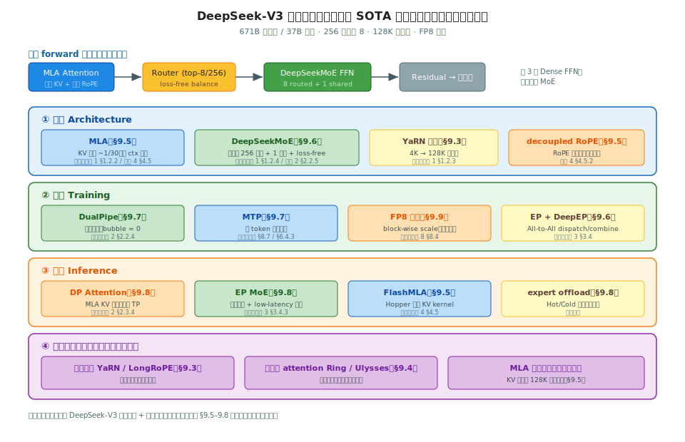
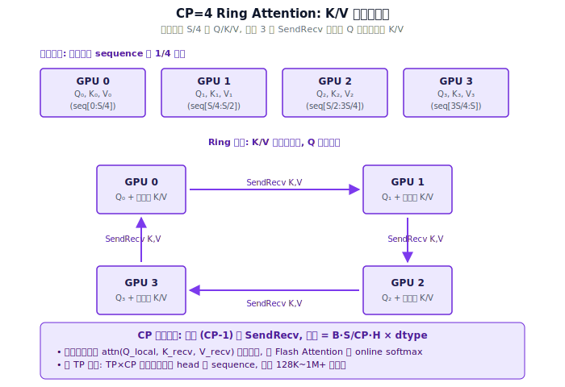
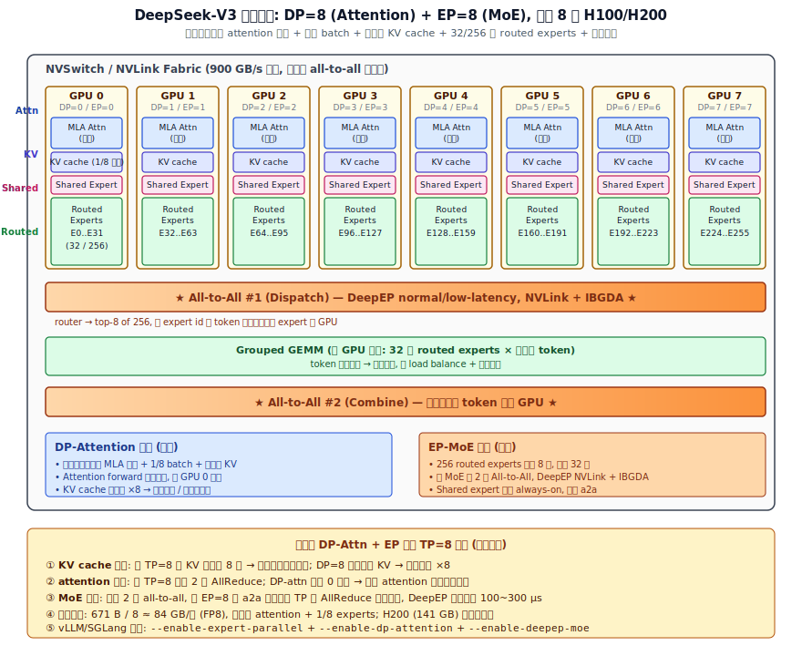

# 阶段 9｜长上下文与 MoE 专题 ★★★★ ✓

> 一句话定位：以 DeepSeek-V3 为核心案例，把"长上下文"和"大 MoE"两条主线串起来——位置外推、长序列 attention、MLA、DeepSeekMoE、DualPipe、MTP 不再是孤立技术点，而是一个能训能跑的完整系统的各个侧面。读完能看懂一个 SOTA 开源大模型从结构到部署的全栈设计。

## 目录

- [9.0 为什么需要这一层](#90-为什么需要这一层)
- [9.1 核心概念与术语](#91-核心概念与术语)
- [9.2 案例全景：DeepSeek-V3 的全栈设计](#92-案例全景deepseek-v3-的全栈设计)
- [9.3 长上下文之一：位置外推（YaRN / LongRoPE / PI）](#93-长上下文之一位置外推yarn--longrope--pi)
- [9.4 长上下文之二：长序列 attention（Ring / Ulysses）](#94-长上下文之二长序列-attentionring--ulysses)
- [9.5 MLA：把 KV 压到极致](#95-mla把-kv-压到极致)
- [9.6 DeepSeekMoE：细粒度 + 共享专家 + 负载均衡](#96-deepseekmoe细粒度--共享专家--负载均衡)
- [9.7 DualPipe 与 MTP：训练侧的两个创新](#97-dualpipe-与-mtp训练侧的两个创新)
- [9.8 MoE 推理：expert 并行与 offload](#98-moe-推理expert-并行与-offload)
- [9.9 端到端复现路径](#99-端到端复现路径)
- [9.10 性能与调优](#910-性能与调优)
- [9.11 常见坑与 FAQ（含 Mixture-of-Depths 选读）](#911-常见坑与-faq含-mixture-of-depths-选读)
- [自测](#自测)
- [9.12 延伸阅读](#912-延伸阅读)

---

## 9.0 为什么需要这一层

前八个阶段是"横向铺开"——硬件、结构、并行、通信、kernel、KV、引擎、训练、量化，每章讲一类技术。本章是"纵向打穿"：**拿一个真实的 SOTA 模型，看这些技术怎么协同成一个能训能跑的系统**。

选 DeepSeek-V3 作案例，因为它是**当前把长上下文和大 MoE 两条线都做到极致、且全栈开源的代表**：

- **671B 总参数、37B 激活**——大 MoE 的极致（256 专家选 8）；
- **128K 上下文**——长上下文的实战规模；
- **MLA**——把 KV cache 压到 1/30，长上下文才跑得动；
- **FP8 训练 + DualPipe + MTP**——训练侧的三个工程创新；
- **从技术报告到推理引擎（SGLang）全开源**——能对照源码读。

更重要的是，DeepSeek-V3 的每个技术点**前面章节都已铺垫**，本章是收口：

| DeepSeek 技术 | 前面在哪铺垫 | 本章补什么 |
|---|---|---|
| MLA | 阶段 1 §1.2.2（结构）、阶段 4 §4.5（kernel） | §9.5 在体系中的角色 |
| DeepSeekMoE | 阶段 1 §1.2.4（路由）、阶段 2 §2.2.5（EP） | §9.6 完整设计 |
| DualPipe | 阶段 2 §2.2.4（流水） | §9.7 怎么压 bubble |
| MTP | 阶段 6 §6.4.3、阶段 8 §8.7（投机） | §9.7 训练侧动机 |
| FP8 训练 | 阶段 8 §8.4 | §9.9 复现路径 |
| 长上下文 | 阶段 1 §1.2.3（RoPE） | §9.3/9.4 外推 + attention |

**为什么把"长上下文"和"MoE"放一章**：它们看似两个主题，但在 DeepSeek-V3 里深度耦合——MLA 既是 MoE 模型的 attention，又是长上下文能跑动的前提（KV 压缩）；长序列训练又依赖 MoE 的并行（EP）和 DualPipe。把它们拆开讲会丢掉这种耦合，合在一个案例里才看得清。

读完之后你应当能：

1. 画出 DeepSeek-V3 一层的完整数据流（MLA attention + DeepSeekMoE FFN），说清每步通信；
2. 解释 YaRN 怎么把 4K 训练的模型外推到 128K，代价是什么；
3. 说清 MLA 在"长上下文 + MoE"体系里同时解决了哪两个问题；
4. 理解 DualPipe 和 MTP 各自解决训练的什么瓶颈；
5. 按 DeepSeek-V3 的配方，给出端到端的训练/推理部署路径。

---

## 9.1 核心概念与术语

本章术语集中在"长上下文"和"DeepSeek 体系"两类。很多基础概念前面已出现（MLA、MoE、EP、RoPE），这里补专题层。

| 术语 | 含义 |
|---|---|
| **位置外推** | 训练时 seq 短、推理时跑更长，让位置编码泛化到没见过的长度 |
| **PI** | Position Interpolation，把位置线性压缩进训练范围 |
| **NTK-aware** | 按频率调 RoPE base，高频少压、低频多压 |
| **YaRN** | Yet another RoPE extensioN，分频段策略，当前主流外推 |
| **LongRoPE** | 每维独立搜索缩放，Phi 系用，可外推到 2M+ |
| **Ring Attention** | 序列切分到多卡，K/V 在环上轮转（阶段 2 §2.2.6 CP） |
| **Ulysses** | DeepSpeed 的序列并行，沿 head 维 All-to-All（阶段 7 §7.5.4） |
| **MLA** | Multi-head Latent Attention，低秩 KV（阶段 1 §1.2.2、阶段 4 §4.5） |
| **latent / 低秩 KV** | MLA 把 KV 压到一个共享的低维潜空间 |
| **decoupled RoPE** | MLA 里 RoPE 走单独的小维度旁路（阶段 4 §4.5.2） |
| **DeepSeekMoE** | 细粒度专家 + 共享专家 + 无辅助 loss 负载均衡 |
| **细粒度专家** | 把专家切更小更多（256 个），提高组合灵活性 |
| **共享专家** | always-on 的专家，承接通用知识（阶段 2 §2.3.3） |
| **Loss-Free Balance** | 靠可学习偏置动态平衡负载，无需辅助 loss（阶段 1 §1.2.4） |
| **DualPipe** | 双向流水并行，把 bubble 压到接近零（阶段 2 §2.2.4） |
| **MTP** | Multi-Token Prediction，训练时多 token 预测目标 |
| **expert offload** | 把冷门专家放 CPU/低速存储，省显存 |
| **Hot/Cold expert** | 高频/低频激活的专家，分层放置 |

> 本章的阅读方式和前面不同：**不是"逐个对比方案选型"，而是"逐个拆解一个系统的零件"。** 每讲一个技术点（MLA、DeepSeekMoE、DualPipe…），都回答三个问题：它在 DeepSeek-V3 里扮演什么角色？单独的原理是什么？和其它点怎么耦合？把这三条线串起来，就看懂了一个 SOTA 系统是怎么设计的。

---

## 9.2 案例全景：DeepSeek-V3 的全栈设计

类型 C 章节的起手式：先给一张**案例全景图**，把后面要逐项拆解的技术点全标出来，看清它们怎么分布在"结构/训练/推理/长上下文"四层、怎么协同。

### 9.2.1 一张全栈技术地图



DeepSeek-V3 的关键参数：**671B 总参数 / 37B 激活、256 专家选 8、128K 上下文、FP8 训练**。它的技术栈分四层（SVG）：

- **① 结构**：MLA（attention）+ DeepSeekMoE（FFN）+ YaRN（外推）+ decoupled RoPE；
- **② 训练**：DualPipe（流水）+ MTP（多 token 预测）+ FP8 + EP/DeepEP；
- **③ 推理**：DP attention + EP MoE + FlashMLA + expert offload；
- **④ 长上下文**：位置外推 + 长序列 attention + MLA（贯穿训练和推理）。

图顶部的**一层 forward 数据流**是结构主线：`MLA Attention → Router(top-8/256) → DeepSeekMoE FFN → Residual`，前 3 层是 Dense FFN、之后才是 MoE。本章 §9.5–9.8 就是沿这条数据流逐个拆解。

### 9.2.2 技术点总表

把所有技术点列成一张表，标出**它解决什么问题、前面哪章铺垫、本章哪节细讲**——这是本章的导航图：

| 技术点 | 解决什么 | 前置铺垫 | 本章 |
|---|---|---|---|
| **MLA** | KV cache 太大（长 ctx + 大 batch 跑不动） | 阶段 1 §1.2.2、阶段 4 §4.5 | §9.5 |
| **DeepSeekMoE** | 大容量 + 低激活算力 | 阶段 1 §1.2.4、阶段 2 §2.2.5 | §9.6 |
| **loss-free balance** | MoE 负载不均又不想加辅助 loss | 阶段 1 §1.2.4 | §9.6 |
| **YaRN** | 短训练泛化到长推理 | 阶段 1 §1.2.3 | §9.3 |
| **长序列 attention** | 序列太长单卡 KV 装不下 | 阶段 2 §2.2.6 | §9.4 |
| **DualPipe** | 流水 bubble 浪费算力 | 阶段 2 §2.2.4 | §9.7 |
| **MTP** | 训练信号稀疏 + 推理可投机 | 阶段 8 §8.7、阶段 6 §6.4.3 | §9.7 |
| **FP8 训练** | 训练算力/显存成本 | 阶段 8 §8.4 | §9.9 |
| **DP attention** | MLA KV 太小不宜 TP 切 | 阶段 2 §2.3.4 | §9.8 |
| **EP + DeepEP** | 256 专家分散 + 高效 All-to-All | 阶段 3 §3.4 | §9.6/9.8 |
| **expert offload** | 推理时专家太多占显存 | — | §9.8 |

### 9.2.3 三条耦合主线

DeepSeek-V3 的精妙不在单个技术，而在**技术之间的耦合**。三条主线把它们串起来：

**主线 1：MLA 是"长上下文 × MoE"的交汇点。**
MLA 把 KV 压到 ~1/30——这同时解决了两个问题：① 长上下文（128K）的 KV 显存可控；② MoE 模型本来就大，attention 的 KV 不能再吃显存。**一个技术点同时服务两条主线**，这是 DeepSeek-V3 设计的核心。但 MLA 的代价（§9.5）是 attention 计算更复杂、且 KV 太小反而不适合 TP 切（引出 §9.8 的 DP attention）。

**主线 2：MoE 的稀疏性贯穿训练和推理。**
256 专家选 8（§9.6）让模型容量大但激活算力小。训练侧要 EP + DeepEP（All-to-All）+ loss-free balance（负载均衡）；推理侧要 DP attention + EP + expert offload。**同一个稀疏结构，训练和推理用不同的并行配方**（§9.7 训练、§9.8 推理）。

**主线 3：训练侧的工程优化（DualPipe + MTP + FP8）让"训得动 + 训得快"。**
671B 模型训练，光有结构不够——DualPipe 压 bubble、FP8 翻倍算力、MTP 加密训练信号。这三个是"让这么大的模型在可接受成本内训出来"的工程支撑（§9.7、§9.9）。而 MTP 还有个副作用：训出的多 token 预测头**推理时直接当投机解码用**（回阶段 8 §8.7）——训练优化顺带给了推理加速。

> 心智模型（类型 C 的核心）：**DeepSeek-V3 不是一堆技术的堆砌，而是围绕"长上下文 + 大 MoE 要能训能跑"这个目标的协同设计。** MLA 是交汇点，MoE 稀疏是贯穿线，训练工程是支撑。读后面每个技术点时，都回到这三条主线问：它在解决哪条线上的什么问题？和别的点怎么咬合？——这就是把一个 SOTA 系统"读透"的方式。

---

## 9.3 长上下文之一：位置外推（YaRN / LongRoPE / PI）

长上下文的第一个问题：**训练时 seq 短（如 4K），推理时想跑 128K，位置编码怎么泛化到没见过的长度？** 这就是位置外推。本节承接阶段 1 §1.2.3 的 RoPE，讲怎么把它"拉长"。

### 9.3.1 为什么 RoPE 不能直接外推

回阶段 1 §1.2.3：RoPE 把位置 m 编码成旋转角度 $m\theta_i$，$\theta_i = \text{base}^{-2i/d}$。问题在于——**模型只在训练长度内见过这些旋转角度**。推理超出训练长度时，出现两类没见过的情况：

1. **绝对位置 m 超出范围**：position 8000 的旋转角度，4K 训练时从没出现过；
2. **高频维度旋转太快**：$\theta_i$ 大的维度（高频）旋转快，长序列时相邻 token 的相位差累积到模型没见过的区域。

直接外推的后果：**注意力崩塌**——超出训练长度后 perplexity 暴涨，模型基本失效。所以必须用某种方式"调整"RoPE，让长位置落回模型熟悉的范围。

### 9.3.2 三代方案：PI → NTK-aware → YaRN

外推方案的演进，核心都是**调整 $\theta_i$ 或位置 m，让长序列的旋转角度落回训练分布**：

**PI（Position Interpolation）—— 全局线性压缩**

最简单：把推理位置 m **线性压缩**回训练范围。训练 L\_train、推理 L\_infer，所有位置乘 `L_train/L_infer`：

$$m' = m \cdot \frac{L_{train}}{L_{infer}}$$

直觉：把 128K 的位置"挤"进 4K 的旋转范围。问题：**所有频率统一压缩**——高频维度（负责局部、相邻 token 区分）被压得太狠，丢失短距离分辨率，质量明显下降。

**NTK-aware —— 按频率差异化**

观察：高频维度负责局部信息（不该压），低频维度负责全局位置（可以压）。NTK-aware **不动位置 m，而是调 base**，让高频维度少压、低频维度多压：

$$\theta_i' = (\text{base} \cdot s)^{-2i/d}, \quad s = \left(\frac{L_{infer}}{L_{train}}\right)^{d/(d-2)}$$

效果比 PI 好——保住了高频的局部分辨率。社区早期广泛用，但仍是启发式。

**YaRN —— 分频段 + 温度修正（当前主流）**

YaRN 把频率分成三段，**差异化处理**：

- **高频维度**（旋转快、管局部）：**不插值**，保持原样，留住局部分辨率；
- **低频维度**（旋转慢、管全局）：**用 PI 插值**，压回训练范围；
- **中间频段**：**平滑过渡**（按一个 ramp 函数混合）。

另外 YaRN 加了 **attention 温度修正**——长序列下 attention logits 的分布会变，乘一个温度因子补偿。

YaRN 的效果当前最好，**LLaMA-3.1、Qwen2.5、DeepSeek-V3 都用它**。代价：需要少量长文本**继续训练（continued pretraining）几百 step**让模型适应，不是纯零样本外推。

### 9.3.3 LongRoPE：每维独立搜索

**LongRoPE**（Phi 系用）更激进：不按频段分组，而是**对每一维独立搜索最优缩放系数**，用进化算法（evolutionary search）找。能外推到 **2M+ token**，是目前外推倍率最高的方案之一。代价：搜索成本高、实现复杂。

### 9.3.4 四方法速览与 DeepSeek-V3 的选择

| 方法 | 思路 | 质量 | 是否要继续训练 | 用者 |
|---|---|---|---|---|
| **PI** | 全局线性压缩 | 差（高频损失） | 要 | 早期 |
| **NTK-aware** | 按频率调 base | 中 | 可零样本 | 社区早期 |
| **YaRN** | 分频段 + 温度修正 | **好** | 要（少量） | **主流（DeepSeek-V3）** |
| **LongRoPE** | 每维独立搜索 | 好、倍率最高 | 要 | Phi、超长 ctx |

DeepSeek-V3 用 **YaRN** 把上下文从 4K 训练扩到 **128K**：先在短序列上预训练大部分，再用 YaRN + 少量长文本继续训练，让模型适应长位置。这是当前"训得起的长上下文"标准配方——**不需要全程用 128K 训练（太贵），而是短训练 + 外推 + 少量长文本微调**。

> 心智模型：**位置外推 = 把长序列的旋转角度"调"回模型训练时熟悉的分布。** PI 全局压（粗暴）、NTK 按频率压（改进）、YaRN 分频段精细压 + 温度修正（主流）、LongRoPE 每维搜索（极致）。它解决的是长上下文的"位置"问题——但位置对了，KV 显存还是会爆（128K 的 KV 巨大），这就要 §9.5 的 MLA 和 §9.4 的序列并行。位置外推 + KV 压缩 + 序列并行，三者合起来才让长上下文真正可用。

---

## 9.4 长上下文之二：长序列 attention（Ring / Ulysses）

位置外推（§9.3）解决了"位置对不对"，但还有个物理问题：**128K 序列的 attention 计算和激活，一张卡装不下**。本节讲怎么把序列切到多卡——序列并行（CP，回阶段 2 §2.2.6）的两条技术路线。

### 9.4.1 长序列的两个爆炸点

序列 S 变长，两样东西爆炸（回阶段 1 §1.5、阶段 4 §4.2）：

1. **attention 计算 $O(S^2)$**：S=128K 时 $S^2$ 是 4K 的 1000 倍——单卡算不过来；
2. **激活显存 $O(S)$**：即使有 FlashAttention（不 materialize $S^2$ 矩阵，阶段 4 §4.2），每层的激活、KV 仍随 S 线性增长，长序列单卡显存装不下。

解法：**把序列切成 N 段，分到 N 张卡**，每卡只持有 S/N 个 token。但 attention 是"全局"的——每个 query 要看所有 key，切了序列后，**query 在卡 A、key 在卡 B 怎么算？** 这就是长序列 attention 的核心难题，两条路线给出不同答案。

### 9.4.2 Ring Attention：K/V 在环上轮转



**Ring Attention**（回阶段 2 §2.2.6）的思路：每卡持有自己那段 Q、K、V。要算全局 attention，就让 **K/V 在卡之间组成的环上轮转**——

1. 每卡先用本地 Q 和本地 K/V 算一块 attention（online softmax，阶段 4 §4.2.2）；
2. 把本地 K/V **发给环上下一张卡**，同时从上一张卡收 K/V；
3. 用本地 Q 和收到的 K/V 再算一块，更新 online softmax 累加器；
4. 转 N-1 步，每卡的 Q 就和所有卡的 K/V 都算过了。

关键：**用 online softmax 增量累加**——不需要把所有 K/V 收集到一张卡，边转边算。通信（K/V 轮转）和计算可以重叠（回阶段 4 §4.8 的思想）。

**Striped Attention** 是 Ring 的改进：causal mask 下，Ring 的简单切分会让各卡负载不均（后面的卡要算的有效部分多）。Striped 用**交错切分**（每卡持有不连续的 token）让负载均衡。

### 9.4.3 Ulysses：沿 head 维 All-to-All

**Ulysses**（DeepSpeed，回阶段 7 §7.5.4）走完全不同的路：不轮转 K/V，而是**用 All-to-All 重排数据**。

核心洞察：attention 在 head 维度是独立的（每个 head 各算各的）。Ulysses：

1. 输入按**序列**切分（每卡持 S/N 个 token 的全部 head）；
2. 一次 **All-to-All**，把数据重排成按 **head** 切分（每卡持全部 token 的 H/N 个 head）；
3. 此时每卡有完整序列的若干 head，**本地算完整 attention**（不需要跨卡）；
4. 再一次 All-to-All 重排回序列切分。

直觉：**用两次 All-to-All 把"序列切分"临时转成"head 切分"**，让 attention 在本地完成。

### 9.4.4 Ring vs Ulysses：怎么选

| 维度 | Ring Attention | Ulysses |
|---|---|---|
| **通信原语** | SendRecv（K/V 环轮转） | All-to-All ×2 |
| **通信量** | 与 S 成正比，可与计算重叠 | 与激活成正比，2 次集中通信 |
| **并行度上限** | 不受 head 数限制 | **≤ head 数**（要能均分 head） |
| **GQA/MLA 友好度** | 好 | KV head 少时受限 |
| **长序列扩展** | **更好**（可叠加更多卡） | 中（受 head 数限） |
| **实现复杂度** | 中（online softmax 累加） | 低（复用现成 attention） |

选型直觉：

- **超长序列、要切很多卡** → **Ring/Striped**（并行度不受 head 限制）；
- **中等长度、head 数够分** → **Ulysses**（实现简单、复用现成 kernel）；
- **两者可组合**（2D：Ring × Ulysses）——Megatron-Core 和一些长上下文框架支持，应对极端长序列。

DeepSeek-V3 的长上下文训练用了 **context parallel**（Ring 系），配合 MLA 的 KV 压缩——**序列并行解决"算不下"，MLA 解决"存不下"，两者互补**。

> 心智模型：**长序列 attention = 把序列切到多卡，再想办法让"全局 attention"在切分后还能算。** Ring 让 K/V 环轮转、边转边用 online softmax 累加；Ulysses 用 All-to-All 把序列切分临时转成 head 切分。前者并行度高适合超长，后者简单适合中等。它和位置外推（§9.3）、MLA（§9.5）是长上下文的三条腿：位置对、存得下、算得动，缺一不可。

---

## 9.5 MLA：把 KV 压到极致

MLA（Multi-head Latent Attention）是 DeepSeek-V3 的 attention，也是 §9.2.3 说的**三条耦合主线的交汇点**。它的结构原理在阶段 1 §1.2.2、kernel 实现在阶段 4 §4.5 已讲透——本节不重复推导，聚焦一个问题：**MLA 在"长上下文 × 大 MoE"这个体系里，为什么是关键枢纽？代价是什么？**

### 9.5.1 一个技术点，两条主线

回阶段 1 §1.2.2：MLA 把所有 head 的 K/V 压到一个低秩潜空间（latent，典型 512 维），每 token 的 KV cache 从 MHA 的 ~2.6 MB 压到 ~80 KB（约 1/30，回阶段 4 §4.5.1）。这个压缩**同时砸中了两个痛点**：

**主线 A（长上下文）**：128K 上下文的 KV cache 巨大。按标准 MHA 算，128K × 单 token KV 直接撑爆显存。MLA 压到 1/30，**让 128K 的 KV 显存可控**——这是长上下文能跑动的前提。

**主线 B（大 MoE）**：DeepSeek-V3 是 671B 的大模型，权重已经吃掉大量显存。如果 attention 的 KV 再占很多，留给 batch 的空间就没了（回阶段 5 §5.2 的 KV slot 池）。MLA 把 KV 压小，**给大 MoE 模型腾出 KV 显存**，让并发 batch 上得去。

这就是 §9.2.3 主线 1 的具体含义：**MLA 不是单独为长上下文或为 MoE，而是同时服务两者**——一个结构创新解决两条线的同一个症结（KV 太大）。DeepSeek 把"长上下文模型"和"大 MoE 模型"合二为一，MLA 是让这个合并可行的关键。

### 9.5.2 MLA 的代价：不是免费的压缩

MLA 把 KV 压到 1/30，但天下没有免费午餐，代价有三处：

1. **attention 计算更复杂**：标准 attention 直接 `QKᵀ`，MLA 要先把压缩的 latent 升回（或用矩阵吸收，阶段 4 §4.5.2）。计算路径比 MHA 长，**必须配专门 kernel（FlashMLA）才能跑出竞争力**（回阶段 4 §4.5）。

2. **decoupled RoPE 的额外设计**：RoPE 不能压（阶段 4 §4.5.1），MLA 要把 RoPE 拆成单独的小维度旁路（decoupled RoPE，阶段 4 §4.5.2）。结构更绕，实现更复杂。

3. **KV 太小反而不适合 TP 切**：这是最反直觉的代价。MLA 的 KV 已经压到很小（每 token ~80 KB），如果推理时再用张量并行（TP）去切 KV head，会发现**KV 太小切不动、且引入通信开销**。所以 MLA 模型推理**不能用常规的 TP attention**——这直接引出 §9.8 的 **DP attention**（attention 走数据并行、每卡持完整 KV，回阶段 2 §2.3.4）。

第 3 点是个精彩的连锁反应：**MLA 为了省 KV 显存 → KV 变得很小 → 小到不适合 TP 切 → 推理必须改用 DP attention → 而 MoE 部分仍用 EP**。这就是 DeepSeek-V3 那个标志性的"**Attention DP + FFN EP**"非对称并行配置的来由（§9.8 详讲）。MLA 的设计决策一路传导到了部署架构。

### 9.5.3 训练 vs 推理：MLA 的两副面孔

| 阶段 | MLA 怎么用 | 关注点 |
|---|---|---|
| **训练** | 完整的低秩降维 + 升维，反向要算梯度 | 数值稳定、与 MoE/DualPipe 配合 |
| **推理 prefill** | 算整段 prompt 的 latent KV，存进 cache | compute-bound，FlashMLA prefill 路径 |
| **推理 decode** | 矩阵吸收（§4.5.2），直接在 latent 维度算 | memory-bound，FlashMLA decode 路径 + DP attention |

推理时的**矩阵吸收**是关键优化（阶段 4 §4.5.2）：把升维矩阵吸收进 Q/O 投影，decode 时**直接在 512 维的压缩 latent 上算 attention**，根本不展开回 per-head——这才真正兑现了 KV 压缩的好处（如果每步都展开回去，省的显存又通过计算吐回来了）。

### 9.5.4 MLA 在体系中的位置小结

把 MLA 放回全栈地图（§9.2.1）：

- **结构层**：MLA 是 DeepSeek-V3 每一层的 attention（数据流 `MLA → Router → MoE`）；
- **长上下文层**：MLA 是 128K 上下文的显存前提（主线 A）；
- **推理层**：MLA 的小 KV 决定了用 DP attention（主线 B 的部署后果）；
- **kernel 层**：MLA 必须配 FlashMLA（阶段 4 §4.5）。

> 心智模型：**MLA 是 DeepSeek-V3 设计的"中心枢纽"——它一个决策（压缩 KV）同时解决长上下文和大 MoE 的显存问题，但也一路传导出 FlashMLA kernel、decoupled RoPE、DP attention 这一串配套设计。** 读 DeepSeek-V3 时，MLA 是理解整个体系的钥匙：从它出发，能解释为什么有 FlashMLA、为什么推理用 DP attention、为什么长上下文跑得动。这就是类型 C 章节"拆解系统零件"的意义——一个零件牵动一串。

---

## 9.6 DeepSeekMoE：细粒度 + 共享专家 + 负载均衡

MoE 是 DeepSeek-V3 的 FFN（§9.2.3 主线 2 的核心）。基础 MoE 在阶段 1 §1.2.4（路由）、阶段 2 §2.2.5（EP 并行）、阶段 3 §3.4（DeepEP 通信）已讲。本节讲 **DeepSeekMoE 相对标准 MoE（如 Mixtral）的三个创新**——它们一起让 MoE 既高效又均衡。

### 9.6.1 创新一：细粒度专家

标准 MoE（Mixtral）：8 个专家、选 2。DeepSeekMoE：**256 个 routed 专家、选 8**——专家**更小更多**。

为什么细粒度更好？关键是**组合数**。每个专家承载一种"知识/技能"，token 需要的往往是多种技能的组合：

- Mixtral 8 选 2：组合数 $\binom{8}{2}=28$ 种；
- DeepSeek 256 选 8：组合数 $\binom{256}{8} \approx 4\times10^{14}$ 种。

**更多更小的专家 → 指数级更多的组合 → 每个 token 能得到更精准的"技能配方"**。同时，把专家切小后，每个专家参数少，激活 8 个的总算力反而可控（256 选 8 = 激活 3.6%，回阶段 8 §8.8.2）。这是"用组合灵活性换表达力，用稀疏激活控算力"。

代价：专家多 → router 要在 256 个里选 → All-to-All 的通信对象多（引出 DeepEP 的必要性，§3.4）。

### 9.6.2 创新二：共享专家

DeepSeek-V3 在 256 个 routed 专家之外，加了 **1 个 shared 专家（always-on）**——所有 token 都过它（回阶段 2 §2.3.3）。

动机：routed 专家各自专精，但**有些"通用知识"是所有 token 都需要的**（如基础语法、常识）。如果让每个 routed 专家都学一遍通用知识，是冗余浪费。**抽出一个共享专家承接通用知识，routed 专家就能专注各自的专精领域**——分工更清晰。

工程上，共享专家是个 Dense FFN，**不进 All-to-All**（本地算，回阶段 2 §2.3.3），等价于在 MoE 层垫了个稠密底。它还有个副作用：**缓解 router 抖动**——即使 router 选得不好，共享专家保底，输出不会太差。

### 9.6.3 创新三：Loss-Free 负载均衡

MoE 的老大难问题：**负载不均**。router 可能把大量 token 都路由到少数几个热门专家，导致这些专家过载、其它专家闲置——EP 并行下（阶段 2 §2.2.5），过载专家所在的卡成瓶颈，整体吞吐被拖死。

传统解法（GShard/Switch）：加一个**辅助 loss（auxiliary loss）**惩罚不均衡，逼 router 均匀分配。问题：辅助 loss 和主任务 loss **打架**——为了均衡牺牲了模型质量。

DeepSeek-V3 的 **Loss-Free Balance**（回阶段 1 §1.2.4）：**不加辅助 loss，而是给每个专家加一个可学习的偏置（bias）**。router 打分时加上这个 bias：

```
score_i = router_logit_i + bias_i      # bias 动态调整
选 top-8(score)
```

- 某专家**过载** → 训练中**调低**它的 bias → 后续少选它；
- 某专家**闲置** → **调高** bias → 后续多选它。

bias **只影响"选谁"（路由），不进入实际计算的加权**——所以**不干扰主 loss**，负载均衡和模型质量不再打架。这是 DeepSeek-V3 能把 256 专家训得又均衡又高质量的关键。

### 9.6.4 三创新如何协同

把三个创新放回 MoE 层的数据流（§9.2.1 顶部）：

```
token → Router(加 bias 打分, top-8 of 256)    ← 创新三：loss-free 均衡
      ├→ Shared Expert (本地, always-on)       ← 创新二：通用知识
      └→ 8 个 routed experts (细粒度)           ← 创新一：组合灵活
            ↑ All-to-All dispatch/combine (DeepEP, §3.4)
      → 加权合并 (routed + shared)
```

三者各司其职：**细粒度**给表达力、**共享专家**抽通用知识、**loss-free balance**保证 EP 下不偏载。缺一个都会出问题——只细粒度不均衡会偏载，不要共享专家 router 抖动大，加辅助 loss 又掉质量。

DeepSeek-V3 的 MoE 配置：

| 项 | 值 |
|---|---|
| routed 专家 | 256 |
| 共享专家 | 1 |
| 每 token 选 | 8 routed + 1 shared |
| 激活比例 | ~3.6% routed + 共享 |
| 前 N 层 | Dense FFN（前 3 层不用 MoE） |

> 心智模型：**DeepSeekMoE = 把 MoE 的三个老问题（表达力不够、通用知识冗余、负载不均）分别用三个创新解决。** 细粒度专家换组合灵活、共享专家抽通用知识、loss-free balance 解决"均衡 vs 质量"的两难。这三个创新 + 阶段 2/3 的 EP 并行和 DeepEP 通信，共同构成了 DeepSeek-V3 的 MoE——大容量、低激活、高质量、能并行。下一节 §9.7 讲让这么大的 MoE "训得动训得快"的训练侧工程（DualPipe + MTP）。

---

## 9.7 DualPipe 与 MTP：训练侧的两个创新

§9.5/9.6 讲了 DeepSeek-V3 的结构（MLA + MoE）。但 671B 模型**光有好结构不够，还得训得动、训得快**。本节讲两个训练侧工程创新（§9.2.3 主线 3）：DualPipe 压流水 bubble、MTP 加密训练信号。

### 9.7.1 DualPipe：把流水 bubble 压到接近零

回阶段 2 §2.2.4：流水并行（PP）有 **bubble**——流水启动和排空时，部分 stage 空等，浪费算力。1F1B、interleaved 1F1B 逐步减小 bubble，但消不掉。

DeepSeek-V3 的规模下，bubble 问题被放大：PP 跨多节点，加上 MoE 的 All-to-All 通信（§9.6），通信和流水气泡叠加，算力利用率受拖累。

**DualPipe** 的核心思想：**双向流水**。普通 PP 是单向的（micro-batch 从 stage 0 流到 stage N）。DualPipe 让 **forward 和 backward 两个方向的流水同时跑、相互填空**——一个方向的 bubble 被另一个方向的计算填上。

更关键的是它**把 MoE 的 All-to-All 通信塞进 bubble**：流水气泡里 GPU 算力闲着，正好用来跑 EP 的 dispatch/combine 通信（回阶段 4 §4.8 的通信-计算 overlap 思想，放大到流水级）。结果：

- bubble 占比从 1F1B 的 ~(PP-1)/micro-batch **压到接近零**；
- MoE 通信被计算掩盖，几乎不额外占时间。

代价：**显存翻倍**——双向流水要同时保留两个方向的激活，显存压力大。DeepSeek-V3 靠 MLA（KV 小，§9.5）+ FP8（激活小，§8.4）+ ZeRO 腾出的显存来承受这个代价。**这又是一处耦合**：DualPipe 的显存代价，靠 MLA/FP8 省下的显存来填。

### 9.7.2 MTP：多 token 预测

标准 LLM 训练：每个位置只预测**下一个** token（next-token prediction）。**MTP（Multi-Token Prediction）** 让每个位置**同时预测未来多个** token。

DeepSeek-V3 在主模型后接**额外的 MTP 模块**（轻量的 transformer 层 + 输出头），训练时：

- 主模型预测 token t+1（主 loss）；
- MTP 模块预测 token t+2（额外 loss）；
- 两个 loss 一起训。

为什么有用——**加密训练信号**：

1. **每个 token 提供更多监督信号**：不只学"下一个是什么"，还学"再下一个是什么"，迫使模型对未来有更长远的规划，表示学习更充分；
2. **训练效率提升**：同样的数据，更密的监督，收敛更好。

### 9.7.3 MTP 的副作用：推理变投机解码

MTP 最妙的地方是**训练优化顺带给了推理加速**（回阶段 8 §8.7、阶段 6 §6.4.3）。

MTP 模块训练时学会了"预测未来第 2 个 token"——**推理时，这个模块就是天然的 draft**！它预测的 t+2，可以作为投机解码（§8.7）的候选 token，主模型一次 forward 验证。因为 MTP 模块是和主模型**一起训练的**，它和主模型的"口味"天然对齐，**接受率比外挂 draft model 高**（回阶段 8 §8.7.3 的 draft 对齐难题）。

所以 MTP 是"一鱼两吃"：

| 阶段 | MTP 的作用 |
|---|---|
| **训练** | 额外监督信号，提升表示学习和收敛（§9.7.2） |
| **推理** | 现成的对齐 draft，做投机解码加速 decode（§8.7） |

这正是 §9.2.3 主线 3 说的"训练优化顺带给了推理加速"——一个设计同时优化两端。

### 9.7.4 训练侧创新小结

把 DualPipe + MTP + FP8（§8.4）放回全栈地图（§9.2.1 训练层）：

| 创新 | 解决什么 | 代价 | 靠什么填代价 |
|---|---|---|---|
| **DualPipe** | 流水 bubble + MoE 通信 | 显存翻倍 | MLA + FP8 省的显存 |
| **MTP** | 训练信号稀疏 | 额外模块算力 | 推理时变投机，赚回来 |
| **FP8** | 算力/显存成本 | 数值复杂度 | block-wise scale（§8.4.3） |

三者加上 §9.5/9.6 的结构，构成 DeepSeek-V3 "能训能跑" 的完整工程。

> 心智模型：**训练侧创新都在解决"671B 怎么训得起"——DualPipe 榨干算力（压 bubble + 藏通信）、MTP 榨干数据（加密监督）、FP8 榨干硬件（翻倍算力）。** 而且这些优化彼此咬合：DualPipe 的显存代价靠 MLA/FP8 填，MTP 的训练投入靠推理投机赚回。这就是 DeepSeek-V3 全栈协同的极致——没有一个技术是孤立的，每个都在和别的技术做"代价/收益"的交换。至此 DeepSeek 体系的四个核心（MLA + DeepSeekMoE + DualPipe + MTP）讲完，§9.8 转到推理部署。

---

## 9.8 MoE 推理：expert 并行与 offload

DeepSeek-V3 的结构（§9.5/9.6）和训练（§9.7）讲完，本节转到**推理部署**——一个 671B / 256 专家的模型怎么高效跑起来。核心是两个问题：并行配置怎么排（§9.8.1–9.8.2）、专家太多显存不够怎么办（§9.8.3）。

### 9.8.1 为什么是 "Attention DP + FFN EP"

回 §9.5.2 那个连锁反应：**MLA 的 KV 太小，不适合 TP 切**。这直接决定了 DeepSeek-V3 推理的非对称并行配置（回阶段 2 §2.3.4）：



**Attention 部分走 DP（数据并行）**：

- 每张卡持有**完整的 MLA 权重 + 完整 KV**，按 batch 切分（每卡处理一部分请求）；
- attention 完全本地，**0 通信**（回阶段 2 §2.3.4 的逐层通信分析）；
- 为什么能这么做？因为 MLA 的 KV 已经压到很小（§9.5），每卡存完整 KV 也吃得消——**MLA 的小 KV 是 DP attention 可行的前提**。

**FFN（MoE）部分走 EP（专家并行）**：

- 256 个专家分散到多卡（如 8 卡，每卡 32 个专家）；
- token 经 router 后 **All-to-All dispatch** 到目标专家所在卡，算完 **All-to-All combine** 回来（回阶段 3 §3.4 的 DeepEP）。

这个 "**Attention DP + FFN EP**" 是 DeepSeek-V3 推理的标志性配置——**同一个模型，attention 和 FFN 用完全不同的并行策略**。原因全在 MLA：它让 attention 的 KV 小到可以每卡复制（DP），而 MoE 的专家大到必须分散（EP）。

### 9.8.2 EP + DP + TP 的组合

实际部署常是多维组合，按规模选：

| 配置 | 适用规模 | 说明 |
|---|---|---|
| **DP attn + EP（单机 8 卡）** | 单节点 | 最常见，attention DP=8 + MoE EP=8 |
| **+ TP** | 专家很大、单卡放不下一个专家 | 专家内部再 TP 切 |
| **+ 多节点 EP** | 专家数 > 单机卡数 | EP 跨节点，靠 DeepEP 的 RDMA 路径（§3.4.3） |
| **PD 分离叠加** | 高 SLO 大规模 | prefill/decode 分离（阶段 5 §5.6），各自配 DP+EP |

关键约束（回阶段 2 §2.4.1）：

- **EP 的 All-to-All 最重** → 优先放节点内 NVLink，跨节点要 DeepEP 的 IBGDA low-latency（§3.4.3）；
- **decode 阶段用 DeepEP low-latency 模式**（~8 μs，§3.4.3）——MoE decode 的 All-to-All 延迟是 TPOT 大头，必须用低延迟内核。

SGLang 是 DeepSeek-V3 推理的参考实现（回阶段 6 §6.4.3），一行开启这套配置：

```bash
python -m sglang.launch_server --model deepseek-ai/DeepSeek-V3 \
  --tp 8 --enable-dp-attention --enable-deepep-moe
```

### 9.8.3 expert offload：Hot/Cold 专家分层

256 个专家即使 EP 分散，**每张卡仍要存 32 个专家的权重**——显存压力大。如果显存不够（如想用更少的卡部署），就要 **expert offload**（本章新增的技术点，思路同阶段 5 §5.8 的 KV offload）。

核心观察：**专家的激活频率不均匀**（即使有 loss-free balance，§9.6.3 也只是相对均衡）。有些专家高频激活（hot），有些低频（cold）：

- **Hot expert**（高频）→ 留在 **GPU 显存**，随时可用；
- **Cold expert**（低频）→ offload 到 **CPU 内存 / NVMe**，需要时换入。

策略和阶段 5 §5.8 的 KV offload 一脉相承：

| 要点 | 做法 |
|---|---|
| **分层放置** | hot 留 HBM、cold 放 CPU/NVMe，按激活统计动态调整 |
| **预取** | 提前把可能用到的 cold expert 换入，藏在计算后面（回 §5.8.4） |
| **代价** | 换入占 PCIe 带宽，cold expert 命中时增加延迟 |

适用场景：**显存受限的部署**（用更少卡跑大 MoE）。代价是 cold expert 命中时的延迟抖动——所以**高吞吐/低延迟生产环境更倾向于多堆卡（全 GPU）**，offload 是"卡不够时的妥协"，不是首选。

PowerInfer、KTransformers 等项目把这个思路做到极致——**在消费级硬件上跑大 MoE**，靠 hot expert 在 GPU、cold 在 CPU 的分层。

### 9.8.4 MoE 推理小结

| 问题 | 解法 | 出处 |
|---|---|---|
| MLA KV 小不宜 TP | **Attention DP** | §9.5.2、阶段 2 §2.3.4 |
| 256 专家分散 | **FFN EP** | 阶段 2 §2.2.5 |
| EP All-to-All 慢 | **DeepEP low-latency** | 阶段 3 §3.4.3 |
| 专家太多占显存 | **expert offload（Hot/Cold）** | 本节、阶段 5 §5.8 |

> 心智模型：**MoE 推理的并行配置是被结构"逼"出来的——MLA 逼出 DP attention，256 专家逼出 EP，EP 的通信逼出 DeepEP，显存不够逼出 expert offload。** 每一层配置都能追溯到结构决策（§9.5/9.6）。这就是为什么读懂结构才能读懂部署：DeepSeek-V3 的 "Attention DP + FFN EP" 不是随便选的，是 MLA + 细粒度 MoE 这两个结构创新的必然部署后果。下一节 §9.9 把训练和推理的完整复现路径串起来。

---

## 9.9 端到端复现路径

类型 C 章节的落地节——把前面拆散的技术点串成**完整的训练和推理路径**。注意：DeepSeek-V3 满血训练需要数千张 H800、几个月，个人无法复现；这里给的是**路径和配方**（怎么搭、关键配置、预期指标），并标注哪些可亲手跑、哪些只能看官方。

> 所有性能数字是**依据公开技术报告的量级**，标注硬件以待校准（守 CLAUDE.md §4）。

### 9.9.1 训练路径（看官方配方）

DeepSeek-V3 训练的关键配置（来自官方技术报告）：

| 项 | 配置 |
|---|---|
| 硬件 | 2048 × H800（96 GB），多节点 IB |
| 并行 | TP + PP（DualPipe）+ EP + ZeRO-1 DP（回 §9.7、阶段 2 §2.4.2） |
| 精度 | **FP8 训练**（block-wise scale，§8.4.3） |
| 上下文 | 4K 预训练 → **YaRN 扩到 128K**（§9.3.4） |
| MoE | 256 routed + 1 shared，loss-free balance（§9.6） |
| 训练目标 | next-token + **MTP**（§9.7.2） |
| 报告 MFU/成本 | 官方称 ~2.788M H800 GPU 小时（远低于同规模 dense） |

复现层次（按可行性）：

- **完全复现**：不现实（算力门槛）；
- **小规模搭同款栈**：可行——用 Megatron-Core 或 DeepSeek 开源训练代码，在几张卡上训一个小号 MoE（如 16 专家），验证 MLA + DeepSeekMoE + MTP 的流程能跑通；
- **读官方配方**：必做——技术报告 + 开源训练代码是理解全栈的最佳材料。

### 9.9.2 推理路径（可亲手跑）

推理比训练可及得多——**有 8×H100/H200 就能跑满血 DeepSeek-V3**，或用量化版在更少卡上跑。

**满血 BF16/FP8（单机 8 卡 H200）**：

```bash
# SGLang（DeepSeek-V3 参考实现，§6.4.3）
python -m sglang.launch_server --model deepseek-ai/DeepSeek-V3 \
  --tp 8 --enable-dp-attention --enable-deepep-moe \
  --context-length 128000
```

这一条命令把本章的技术全用上了：`--enable-dp-attention`（§9.8.1 MLA 逼出的 DP attn）+ `--enable-deepep-moe`（§9.6 的 EP + §3.4 DeepEP）+ `--context-length 128000`（§9.3 YaRN 外推）。

**量化版（更少卡）**：

```bash
# FP8 量化（§8.4），或社区的 AWQ/INT4 版本
vllm serve deepseek-ai/DeepSeek-V3 --quantization fp8 \
  --tensor-parallel-size 8 --enable-expert-parallel
```

**预期指标**（8×H200，量级估算）：

| 指标 | 量级 | 说明 |
|---|---|---|
| 单卡 decode 吞吐 | ~数千 token/s | MLA + FlashMLA + DP attn 的合力（§9.5、阶段 4 §4.5.3） |
| TTFT（短 prompt） | 百毫秒级 | prefill compute-bound |
| 128K 上下文 KV | MLA 压到可控 | 否则按 MHA 直接爆显存（§9.5.1） |

### 9.9.3 复现路径检查清单

按依赖顺序，跑通 DeepSeek-V3 推理要确认：

1. **硬件**：Hopper（FP8 + FlashMLA 需要，阶段 0 §0.2.4、阶段 4 §4.5）；显存够放 671B（满血需 8×H200，或量化降卡）；
2. **通信**：节点内 NVLink（EP All-to-All）、多节点要 IB + DeepEP（§3.4.3）；
3. **引擎**：SGLang（参考实现）或 vLLM（FP8/量化）；版本要够新（DeepSeek-V3 支持较晚，回阶段 6 §6.4.4）；
4. **配置**：DP attention + EP + DeepEP + YaRN 上下文，缺一个性能就掉；
5. **验证**：先短上下文跑通，再上 128K；先小 batch，再压并发。

---

## 9.10 性能与调优

DeepSeek-V3 部署的调优旋钮，按本章技术点归类：

| 症状 | 可能原因 | 调优方向 | 出处 |
|---|---|---|---|
| **decode TPOT 高** | MoE All-to-All 延迟 | 确认 DeepEP **low-latency** 模式启用 | §3.4.3 |
| **MoE 某卡成瓶颈** | 专家负载不均 | 检查 loss-free balance；EP rank 映射 | §9.6.3、§2.4.3 |
| **长上下文 OOM** | KV 没压住 / 没切序列 | 确认 MLA 生效；超长上 context parallel | §9.5、§9.4 |
| **128K 质量下降** | YaRN 外推没调好 | 检查 YaRN 参数 + 是否做了长文本继续训练 | §9.3.4 |
| **跨节点 EP 慢** | All-to-All 跨 IB | DeepEP IBGDA；确认 `NCCL_IB_HCA` | §3.4.3、§3.3 |
| **FP8 精度异常** | scale 粒度太粗 | 用 block-wise scale | §8.4.3 |
| **投机加速不明显** | MTP draft 没用上 | 确认引擎启用 MTP 投机 | §9.7.3、§8.7 |

调优总纲（回阶段 11 思路）：**先 profile 定位在哪一层**（attention / MoE 通信 / 长上下文 KV / FP8），再回对应小节找旋钮。DeepSeek-V3 的复杂在于技术点多、耦合深——一个性能问题可能横跨结构、通信、kernel 三层，必须按"全栈地图"（§9.2.1）系统排查，不能头痛医头。

---

## 9.11 常见坑与 FAQ（含 Mixture-of-Depths 选读）

1. **以为 MLA 只是省显存**：MLA 还连锁决定了 DP attention（§9.5.2）、需要 FlashMLA（§4.5）、decoupled RoPE（§4.5.2）。它是结构枢纽，不是孤立优化。
2. **MLA 模型强行用 TP attention**：KV 太小切不动还引入通信，慢。必须 DP attention（§9.8.1）。
3. **YaRN 零样本外推到 128K 直接用**：YaRN 需要少量长文本继续训练才稳（§9.3.2），纯零样本质量差。
4. **细粒度 MoE 不配 DeepEP**：256 专家的 All-to-All 用 NCCL 朴素实现会很慢，必须 DeepEP（§3.4.3、§9.6.1）。
5. **加辅助 loss 做负载均衡**：会和主 loss 打架掉质量。用 loss-free balance（§9.6.3）。
6. **DualPipe 显存爆**：双向流水显存翻倍（§9.7.1），要靠 MLA + FP8 省的显存填，没这两个撑不住。
7. **MTP 模块训练后推理没用上**：MTP 是现成的对齐 draft，记得在引擎里启用投机解码（§9.7.3）。
8. **长上下文只想着外推，忘了 KV 和序列并行**：长上下文是"位置对（§9.3）+ 存得下（§9.5 MLA）+ 算得动（§9.4 序列并行）"三条腿，缺一不可。
9. **expert offload 当常规手段**：它是显存不够时的妥协，有延迟抖动（§9.8.3）；卡够就全 GPU。

**选读：Mixture-of-Depths（MoD）/ 早退**

本章主要讲 MoE（专家维度的稀疏）和稀疏 attention（序列维度的稀疏）。还有一类**深度维度的稀疏**值得一提：

- **Mixture-of-Depths（MoD）**：不是每个 token 都过所有层——router 决定**哪些 token 跳过哪些层**。简单 token 走捷径（少过几层），难 token 走全程。把 MoE 的"选专家"思想搬到"选层"。
- **早退（early exit）**：token 在中间层就"足够确定"时提前输出，不跑完所有层。

两者都在**深度维度省算力**（MoE 省宽度、稀疏 attn 省序列、MoD/早退省深度），是三类稀疏（阶段 8 §8.8）的补充维度。目前 MoD/早退还不是主流大模型的标准配置（工程复杂、收益不稳定），但作为"稀疏的第三个维度"值得了解。

---

## 自测

1. **（概念）** 长上下文要"跑得动"靠三条腿，分别是什么？各对应本章哪一节？
2. **（概念）** MLA 被称为 DeepSeek 体系的"交汇点"——它一个决策（压缩 KV）同时解决了哪两条主线上的什么问题？
3. **（应用）** YaRN 是怎么把 4K 训练的模型外推到 128K 的？纯零样本套上去就能用吗？
4. **（概念）** DeepSeekMoE 相比 Mixtral 的朴素 MoE 有哪三个创新？loss-free balance 解决了传统辅助 loss 的什么矛盾？
5. **（判读）** R1 和 V3 在"架构选读"这个语境里是同一个还是不同架构？R1 的创新在哪条线上？

<br>

**参考答案**

1. **位置对了**（位置外推 YaRN，§9.3）+ **存得下**（MLA 压 KV，§9.5）+ **算得动**（序列并行 Ring/Ulysses，§9.4）。（§9.4.4）
2. MLA 把 KV 压到 ~1/30，同时解决：① **长上下文**——128K 的 KV 显存可控；② **大 MoE**——给 671B 大模型腾出 KV 显存让并发上得去。一个结构创新服务两条线。（§9.5.1）
3. 把长序列的 RoPE 旋转角度"调"回训练分布——**分频段**处理（高频不插值保局部、低频插值压回、中间平滑）+ 温度修正。**不能纯零样本**，需要少量长文本继续训练几百 step。（§9.3.2/9.3.4）
4. **细粒度专家**（256 选 8，组合更灵活）+ **共享专家**（抽通用知识）+ **loss-free balance**（可学习偏置动态平衡）。loss-free 解决了传统辅助 loss 与主任务 loss **打架、为均衡牺牲质量**的矛盾。（§9.6）
5. **同一个架构**（R1 与 V3 都是 MLA + MoE）。R1 的创新不在架构、在**训练**（大规模 RL 训练推理能力）。本章只管架构线。（§9.5.1、§12.5.1）

> 第 1、2 题串起了"长上下文 × 大 MoE"的全局——MLA 是那把钥匙，从它出发能解释整个 DeepSeek 体系。

---

## 9.12 延伸阅读

- **DeepSeek-V3 技术报告** — 本章的源头，MLA + DeepSeekMoE + DualPipe + MTP + FP8 训练的一手资料，必读。
- **DeepSeek-V2 报告（MLA 部分）** — MLA 首次提出，比 V3 讲得更细，理解 §9.5 的最佳材料。
- **YaRN 论文（《YaRN: Efficient Context Window Extension》）** — 分频段外推，§9.3.2 的核心。
- **Ring Attention / Striped Attention 论文** — 序列并行 attention，§9.4.2。
- **DeepSeek-MoE 论文** — 细粒度 + 共享专家的设计动机，§9.6.1/9.6.2。
- **Auxiliary-Loss-Free Load Balancing 论文（DeepSeek）** — loss-free balance 的实证，§9.6.3。
- **DualPipe / DeepEP GitHub（deepseek-ai）** — 训练流水和 MoE 通信的开源实现，§9.7.1、§3.4。
- **SGLang DeepSeek-V3 部署文档** — 把本章技术落到一条命令的工程入口，§9.8.2、§9.9.2。

---
