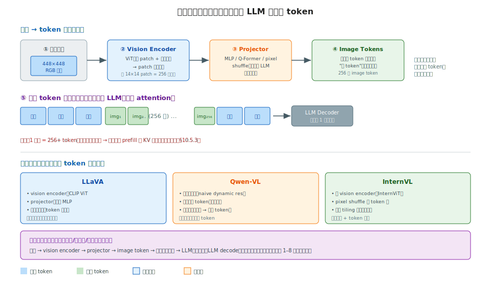

# 阶段 10｜生产化服务与多模态 ✓

> 一句话定位：把推理引擎"包装成一个生产服务"——对外的 API 协议、结构化输出、多 LoRA、多模态输入，对内的网关路由、可观测性。让你能把一个能跑的模型，变成一个能上线、能扩容、能排障的服务。本章前半偏原理（A 类），后半偏运维 cookbook（D 类）。

## 目录

**API 与模型能力（A 类）**
- [10.0 为什么需要这一层](#100-为什么需要这一层)
- [10.1 核心概念与术语](#101-核心概念与术语)
- [10.2 OpenAI 兼容 API（A 类）](#102-openai-兼容-apia-类)
- [10.3 结构化输出（A 类）](#103-结构化输出a-类)
- [10.4 多 LoRA serving（A 类）](#104-多-lora-servinga-类)
- [10.5 多模态推理（A 类）](#105-多模态推理a-类)

**部署运维（D 类）**
- [10.6 路由与网关：任务式 cookbook（D 类）](#106-路由与网关任务式-cookbookd-类)
- [10.7 可观测性：指标、tracing、SLO（D 类）](#107-可观测性指标tracingslod-类)

**收尾**
- [10.8 常见坑与 FAQ](#108-常见坑与-faq)
- [10.9 延伸阅读](#109-延伸阅读)

---

## 10.0 为什么需要这一层

阶段 6 让你能把模型跑起来（推理引擎），但**"能跑"和"能上线"之间还差一层**。一个真实的生产 LLM 服务，除了引擎本身，还要解决：

1. **接口协议**：客户端怎么调？现实是**全世界都按 OpenAI API 的格式来**——你的服务得兼容 `/v1/chat/completions`，否则接不进现有生态（§10.2）。
2. **输出可控**：下游要解析模型输出。如果模型吐的 JSON 格式不对，整个 pipeline 崩。**结构化输出**保证模型只生成合法 JSON/正则（§10.3）。
3. **一个引擎服务多个微调**：几十个业务各有 LoRA 微调，不可能每个起一个服务。**多 LoRA serving** 让一个基座模型同时服务多个 LoRA（§10.4）。
4. **不只是文本**：要处理图像、视频。**多模态**把图像/视频转成 token 喂给 LLM（§10.5）。
5. **多副本怎么调度**：流量大要多副本，得有**网关**做路由、限流、failover（§10.6）。
6. **线上怎么排障**：延迟突然涨了、某副本挂了，得有**可观测性**——metrics、tracing、SLO 监控（§10.7）。

这一层的知识形态很杂——前四个偏"机制原理"（API 怎么设计、结构化输出怎么 mask logits、多模态怎么对齐 token），后两个偏"运维操作"（怎么配网关、怎么读监控）。所以本章**前半用 A 类写法**（原理 + 实现），**后半用 D 类写法**（任务 → 命令 → 判读 cookbook），小节标题标注了类型。

和前面章节的衔接：

- 结构化输出的 logits mask 原理在阶段 1 §1.2.5、引擎位置在阶段 6 §6.3.4 提过，本章 §10.3 讲完整工程；
- SLO 指标（TTFT/TPOT）在阶段 5 §5.1 定义过，本章 §10.7 讲怎么监控；
- 多模态的引擎支持在阶段 6 §6.8 对比过，本章 §10.5 讲 token 路径。

读完之后你应当能：

1. 实现/对接一个 OpenAI 兼容 API，说清 chat/completions 和 responses 的区别；
2. 用 xgrammar/outlines 约束模型输出合法 JSON，并解释它的原理和性能代价；
3. 配置多 LoRA serving，理解它为什么几乎不增加显存；
4. 说清一张图怎么变成 LLM 能吃的 token；
5. 搭一个带网关 + 可观测性的生产部署，并按 cookbook 排查常见故障。

---

## 10.1 核心概念与术语

本章术语分"API/能力"和"运维"两类。

| 术语 | 含义 |
|---|---|
| **OpenAI 兼容 API** | 按 OpenAI 的请求/响应格式实现的 HTTP 接口，事实标准 |
| `/v1/chat/completions` | 对话补全接口，输入 messages 列表 |
| `/v1/responses` | OpenAI 较新的有状态接口，支持工具/多轮编排 |
| **tool use / function calling** | 模型输出结构化的工具调用请求 |
| **structured output** | 约束生成为合法 JSON/正则/语法（§1.2.5、§6.3.4） |
| **xgrammar / outlines / lm-format-enforcer** | 三个结构化输出后端 |
| **constrained decoding** | 约束解码，在采样时屏蔽不合法 token |
| **FSM / CFG** | 有限状态机 / 上下文无关文法，约束的形式化表示 |
| **LoRA** | Low-Rank Adaptation，低秩微调，只训练小的增量矩阵 |
| **multi-LoRA serving** | 一个基座 + 多个 LoRA 同时服务 |
| **vision encoder** | 视觉编码器（如 ViT），把图像转成特征 |
| **image token / visual token** | 图像经编码 + 投影后变成的"伪 token" |
| **projector / connector** | 把视觉特征投影到 LLM 词向量空间的模块 |
| **AI Gateway** | LLM 网关，做路由/限流/鉴权/failover |
| **LiteLLM / Envoy AI Gateway** | 两个主流网关方案 |
| **SLO / SLI** | 服务等级目标 / 指标（TTFT、TPOT、E2E、可用性） |
| **metrics / tracing** | 监控指标 / 分布式调用链追踪 |
| **TTFT / TPOT / E2E** | 首 token / 每 token / 端到端延迟（§5.1） |

> 这一层的心智模型：**推理引擎是"发动机"，本章是把发动机装成"一辆能上路的车"**——API 是方向盘和踏板（统一的操作接口）、结构化输出是安全带（保证输出可控）、网关是变速箱（调度多个引擎）、可观测性是仪表盘（知道车况）。引擎再强，缺了这层也上不了生产。

---

## 10.2 OpenAI 兼容 API（A 类）

LLM 服务的第一道门面是 API。现实很简单：**全世界都按 OpenAI 的格式来**。本节讲为什么、以及这套协议的核心结构。

### 10.2.1 为什么是 OpenAI 兼容

OpenAI API 成为事实标准，是**生态网络效应**的结果：

- 所有 LLM 应用框架（LangChain、LlamaIndex、各种 agent 库）默认按 OpenAI 格式调用；
- 所有客户端 SDK（`openai` Python/JS 包）已经普及；
- 切换模型只改 `base_url` 和 `api_key`，应用代码不动。

所以 vLLM、SGLang、TGI、llama.cpp 全都提供 **OpenAI 兼容的 HTTP 接口**——`vllm serve` 起来就是一个 `/v1/chat/completions` 端点，客户端用 `openai` 包直接连，无感切换。**兼容这套协议是 LLM 服务接入生态的入场券**，不是可选项。

### 10.2.2 `/v1/chat/completions` 的结构

最核心的端点。请求体：

```json
{
  "model": "llama-3-70b",
  "messages": [
    {"role": "system", "content": "你是助手"},
    {"role": "user", "content": "你好"}
  ],
  "temperature": 0.7,
  "max_tokens": 512,
  "stream": true
}
```

关键字段对应前面章节的概念：

- **`messages`**：多轮对话历史，`role` 是 system/user/assistant。引擎内部把它拼成模型的 prompt（套 chat template），前缀重复的部分正好被 prefix cache 复用（回阶段 5 §5.5）；
- **`temperature` / `top_p` / `max_tokens`**：采样参数，直接对应阶段 1 §1.2.5 的采样管线；
- **`stream`**：是否流式返回。

响应（非流式）：

```json
{
  "choices": [{"message": {"role": "assistant", "content": "你好！"},
               "finish_reason": "stop"}],
  "usage": {"prompt_tokens": 20, "completion_tokens": 5, "total_tokens": 25}
}
```

`finish_reason`（stop/length/tool\_calls）告诉客户端为什么停；`usage` 是计费和监控的依据（回 §10.7）。

### 10.2.3 streaming：SSE 流式

生产服务几乎都开 streaming——否则用户要等整个回答生成完才看到第一个字（TTFT 体验差）。OpenAI 用 **SSE（Server-Sent Events）**：每生成一个 token（或几个），推一个 `data:` chunk：

```
data: {"choices":[{"delta":{"content":"你"}}]}
data: {"choices":[{"delta":{"content":"好"}}]}
data: {"choices":[{"delta":{},"finish_reason":"stop"}]}
data: [DONE]
```

`delta` 是增量内容。流式让 **TTFT（首 token 延迟，§5.1）成为用户的真实体验指标**——第一个 chunk 到达就是 TTFT，后续 chunk 间隔就是 TPOT。这就是为什么阶段 5 的调度优化（continuous batching、chunked prefill）直接影响用户体验。

### 10.2.4 tool use（function calling）

让模型调用外部工具（搜索、计算、API）。请求里声明可用工具：

```json
{
  "messages": [{"role": "user", "content": "北京天气？"}],
  "tools": [{"type": "function", "function": {
    "name": "get_weather",
    "parameters": {"type": "object", "properties": {"city": {"type": "string"}}}
  }}]
}
```

模型不直接答，而是**输出一个结构化的工具调用请求**：

```json
{"choices": [{"message": {"tool_calls": [
  {"function": {"name": "get_weather", "arguments": "{\"city\": \"北京\"}"}}
]}, "finish_reason": "tool_calls"}]}
```

客户端执行工具、把结果作为新 message 喂回，模型再生成最终答案。**关键：工具调用的 `arguments` 必须是合法 JSON**——这正是 §10.3 结构化输出要保证的（tool use 底层就是受约束的结构化生成）。

### 10.2.5 `/v1/responses`：有状态的新接口

`/v1/chat/completions` 是**无状态**的——每次请求要带上全部历史 messages。OpenAI 较新的 **`/v1/responses`** 是**有状态**的：服务端保存对话状态，客户端只发增量，还内建了工具编排、多步推理的支持。

| 维度 | `/v1/chat/completions` | `/v1/responses` |
|---|---|---|
| 状态 | 无状态（每次带全历史） | **有状态**（服务端存） |
| 工具编排 | 客户端手动多轮 | **内建** |
| 适用 | 通用、简单 | agent、复杂编排 |
| 普及度 | **事实标准** | 较新，逐步铺开 |

开源引擎对 `/v1/chat/completions` 支持成熟，`/v1/responses` 还在跟进。**当前生产首选仍是 chat/completions**——它的无状态特性也更适合多副本水平扩展（任何副本都能处理任何请求，回 §10.6 网关路由）。

> 心智模型：**OpenAI 兼容 API 是 LLM 服务的"标准插座"——兼容它才能接进整个生态。** 它的字段不是凭空设计的，每个都对应前面的机制：messages → prompt 拼接 + prefix cache（§5.5）、采样参数 → §1.2.5、stream → TTFT/TPOT 体验（§5.1）、tool use → 结构化输出（§10.3）。把 API 字段和底层机制对应起来，就理解了"一个请求进来引擎做了什么"。

---

## 10.3 结构化输出（A 类）

§10.2.4 说 tool use 的 `arguments` 必须是合法 JSON。更一般地：**生产 pipeline 经常要解析模型输出**，模型吐错一个括号整个流程就崩。结构化输出（structured output / constrained decoding）保证模型**只能生成合法的 JSON / 正则 / 语法**。本节承接阶段 1 §1.2.5 的 logits mask 原理、阶段 6 §6.3.4 的引擎位置，讲完整工程。

### 10.3.1 为什么 prompt 里"请输出 JSON"不够

最朴素的做法是 prompt 里写"请输出 JSON 格式"。问题：**模型不保证听话**——它可能多个逗号、漏个引号、在 JSON 前后加解释文字。下游 `json.loads()` 直接抛异常。重试能缓解但不可靠、且浪费算力。

结构化输出换思路：**不是请求模型守规矩，而是从机制上让它无法违规**。回阶段 1 §1.2.5——采样是从 logits 里选 token。结构化输出在 **softmax 之前，把所有"会导致不合法"的 token 的 logit 设成 −∞**，模型只能从合法 token 里选。**违法在数学上不可能发生**。

### 10.3.2 原理：用 FSM/CFG 驱动 logits mask

核心是一个**状态机**：当前已生成的部分，决定了下一个 token 只能是哪些。

以生成 JSON `{"age": 25}` 为例，简化的状态约束：

```
已生成 `{`          → 下一个只能是 `"`（key 开始）或 `}`（空对象）
已生成 `{"age"`     → 下一个只能是 `:`
已生成 `{"age":`    → 下一个只能是数字 / `"` / `{` / `[` / true/false/null
已生成 `{"age": 25` → 下一个只能是数字 / `,` / `}`
```

这套"当前状态 → 合法 next token 集合"的规则，用两种形式表示：

- **FSM（有限状态机）**：正则表达式和简单 JSON schema 可以编译成 FSM。每个状态对应一组合法 token，转移确定。**快**，但表达力有限（处理不了任意嵌套）。
- **CFG（上下文无关文法）**：完整的 JSON、代码、复杂语法用 CFG 表示。表达力强（能处理任意嵌套括号），但**每步要做文法分析，开销大**。

每生成一个 token，约束引擎：① 根据当前状态算出合法 token 集合（mask）；② 把非法 token 的 logit 设 −∞；③ 正常采样（只会选到合法的）；④ 更新状态机。

### 10.3.3 三个后端：xgrammar / outlines / lm-format-enforcer

| 后端 | 核心技术 | 特点 |
|---|---|---|
| **xgrammar** | 优化的 CFG，预编译 + 缓存 + 并行 mask | **最快**，vLLM/SGLang 默认，支持完整 CFG |
| **outlines** | 正则/JSON schema 编译成 FSM | 成熟、生态广，FSM 路径快 |
| **lm-format-enforcer** | token-level 强制格式 | 灵活，与多种引擎集成 |

**xgrammar** 是当前主流——它把"算合法 token 集合"这步做了大量优化：预编译文法、缓存状态转移、用位掩码（bitmask）并行算 mask，把约束的开销压到很低。vLLM v1、SGLang 默认用它。

调用（vLLM）：

```python
from vllm import SamplingParams
from vllm.sampling_params import GuidedDecodingParams

# JSON schema 约束
params = SamplingParams(
    guided_decoding=GuidedDecodingParams(json={
        "type": "object",
        "properties": {"name": {"type": "string"}, "age": {"type": "integer"}},
        "required": ["name", "age"]
    })
)
# 也支持 regex= / choice= / grammar=（完整 CFG）
```

### 10.3.4 性能代价与工程权衡

结构化输出不是免费的，开销在**每步算 mask**：

- **FSM 路径（outlines 正则）**：开销小，状态转移是查表，几乎不影响吞吐；
- **CFG 路径（xgrammar 完整文法）**：开销大些，但 xgrammar 的优化（预编译 + bitmask）把它压到通常 **< 5% 吞吐损失**；
- **首次编译开销**：复杂 schema 第一次要编译成状态机（几十 ms ~ 几百 ms），但**会缓存**——相同 schema 后续请求零编译开销。

工程权衡：

1. **能用 FSM 别用 CFG**：简单格式（枚举、固定字段 JSON）用正则/简单 schema 走 FSM 路径，更快；
2. **复用 schema**：相同 schema 缓存命中，别每次动态生成不同 schema；
3. **约束 ≠ 内容正确**：结构化输出只保证**格式合法**，不保证**内容对**——模型仍可能填错值（age 填成 999）。格式和语义是两回事。

与 tool use 的关系（§10.2.4）：**tool use 底层就是结构化输出**——工具的 `parameters` schema 就是约束，引擎用结构化输出保证 `arguments` 是合法 JSON。所以支持 tool use 的引擎，内部一定有结构化输出。

> 心智模型：**结构化输出 = 用状态机驱动 logits mask，让"生成非法格式"在数学上不可能。** 它不是"请模型守规矩"，而是"从机制上堵死违规"（回阶段 1 §1.2.5 的 mask）。FSM 快但表达力弱、CFG 强但开销大，xgrammar 用工程优化把 CFG 的开销压到可接受。它是 tool use、agent、数据抽取等所有"需要可解析输出"场景的底层保证。

---

## 10.4 多 LoRA serving（A 类）

真实业务里，一个基座模型常被微调出几十个版本——客服、代码、翻译各一个 LoRA。**不可能每个 LoRA 起一个服务**（几十张卡全占了）。多 LoRA serving 让**一个基座 + 多个 LoRA 同时跑在一个服务里**，且几乎不增显存。本节讲它为什么可行。

### 10.4.1 LoRA 回顾：为什么省

LoRA（Low-Rank Adaptation）的核心：**不改原权重，只加一个低秩增量**。原权重 $W$（如 4096×4096），LoRA 加 $\Delta W = BA$，其中 $B$ 是 4096×r、$A$ 是 r×4096，秩 r 很小（典型 8/16/64）：

$$W' = W + BA, \quad \text{前向}: y = Wx + B(Ax)$$

参数量对比：$W$ 是 $4096^2 \approx 16M$，LoRA（r=16）只有 $2 \times 4096 \times 16 \approx 130K$——**约 0.8%**。所以一个 LoRA adapter 只有几 MB ~ 几十 MB，相比基座几十上百 GB 微不足道。

这就是多 LoRA 省显存的根基：**基座权重只存一份（所有 LoRA 共享），每个 LoRA 只额外占几十 MB**。100 个 LoRA 也就额外几个 GB，远小于再起 100 个服务。

### 10.4.2 难点：一个 batch 里混了不同 LoRA

省显存好理解，难点在**计算**。continuous batching（阶段 5 §5.3）把多个请求拼成一个 batch 一起算。但**多 LoRA 场景下，同一个 batch 里的请求可能用不同的 LoRA**：

```
batch 里的请求：
  req1 → LoRA-客服    (B₁A₁)
  req2 → LoRA-代码    (B₂A₂)
  req3 → 基座(无 LoRA)
  req4 → LoRA-客服    (B₁A₁)
```

基座部分 $Wx$ 好办——所有请求共享 $W$，一个大 GEMM 算完。麻烦的是 LoRA 部分 $B(Ax)$——**每个请求要用自己的 $A_i$、$B_i$**，不能用一个统一的矩阵乘。

朴素做法：把 batch 按 LoRA 拆开，每个 LoRA 单独算——但这破坏了 batching，退回低效（回阶段 5 §5.3.1 的 static batching 浪费）。

### 10.4.3 解法：batched 异构 LoRA kernel

vLLM/SGLang 用专门的 kernel 解决——**SGMV（Segmented Gather Matrix-Vector）/ Punica 风格**。思路：

1. **基座 GEMM**：所有请求共享 $W$，一个大 GEMM 算 $Wx$（batched，高效）；
2. **LoRA 部分**：用一个**分段 kernel**，按每个请求的 LoRA id，从一组 adapter 里 gather 对应的 $A_i$/$B_i$，分段算 $B_i(A_i x_i)$，再加回基座输出。

关键：**把"不同请求用不同 LoRA"编码成 kernel 的分段索引**（类似 PagedAttention 用 block table 间接访存，阶段 4 §4.3）。一个 kernel 处理整个混合 batch，不用拆开。这样多 LoRA 和 continuous batching **兼容**——既保持高 batch 利用率，又支持异构 LoRA。

代价：LoRA 部分的 kernel 比纯基座多一点开销（gather + 分段），但因为 r 小（LoRA 计算量只有基座的 ~1%），**总体开销很小**。

### 10.4.4 配置与动态加载

vLLM：

```bash
vllm serve meta-llama/Llama-3-8B --enable-lora \
  --lora-modules customer=/path/lora-customer code=/path/lora-code \
  --max-loras 8 --max-lora-rank 64
```

请求时指定用哪个 LoRA（`model` 字段填 LoRA 名）：

```json
{"model": "customer", "messages": [...]}   # 用客服 LoRA
{"model": "meta-llama/Llama-3-8B", "messages": [...]}   # 用基座
```

SGLang 类似（`--lora-paths`）。两个关键旋钮：

- **`--max-loras`**：一个 batch 里最多几个不同 LoRA（影响 kernel 分段数）；
- **动态加载**：支持运行时加载/卸载 LoRA（`/v1/load_lora_adapter`），不用重启服务——这对"几十个业务 LoRA 按需上下线"很关键。

LoRA 也可以放 CPU、按需换入 GPU（类似 §5.8 / §9.8.3 的 offload 思路），进一步支持超大量 LoRA。

> 心智模型：**多 LoRA serving = 基座共享一份 + 每个 LoRA 几十 MB 增量 + 一个能处理混合 batch 的分段 kernel。** 省显存来自 LoRA 的低秩本质（§10.4.1），高效来自把"异构 LoRA"编码成 kernel 分段索引（§10.4.3，和 PagedAttention 的间接访存同思想）。它让"一个服务托管几十个微调"成为可能——这是 LLM 多租户/多业务部署的关键能力。

---

## 10.5 多模态推理（A 类）

到这里模型还只吃文本。但生产需求常包含图像、视频。多模态推理的核心问题：**一张图怎么变成 LLM 能吃的东西？** 答案出奇地简单——**把图像也变成 token**。本节讲这条 token 路径（阶段 6 §6.8 对比过引擎支持，这里讲机制）。

### 10.5.1 核心思想：图像也是 token



LLM 的本质是处理 token 序列（阶段 1）。多模态的关键洞察：**只要把图像也转成"和文本 token 同维度的向量"，就能和文本 token 拼在一起，丢给同一个 LLM**。

四步流水（SVG 上半）：

1. **原始图像**：如 448×448 RGB 像素；
2. **Vision Encoder（ViT）**：把图像切成 patch（如 14×14），每个 patch 过自注意力，输出 patch 特征序列——这是视觉版的"tokenize"；
3. **Projector（投影器）**：把视觉特征**投影到 LLM 的词向量空间**——这是关键的"翻译"，让视觉特征和文本 token 在同一个语义空间；
4. **Image Token**：投影后的向量就是"伪 token"，和文本 token 同维度，可直接拼接。

然后（SVG 中部）：**image token 插进文本序列**，比如 `[描述][这张][图：][img₁]...[img₂₅₆][里有][什么]`，整个序列丢给 LLM decoder——**后半段和纯文本推理完全一样**，复用阶段 1–8 的全部技术（attention、KV cache、调度、量化…）。

这就是多模态的精妙：**没有"专门的多模态推理引擎"，只是在 LLM 前面加了个"把图变成 token"的前处理**。vLLM/SGLang 支持多模态，主要是支持这个前处理 + image token 的拼接，decode 部分原样复用。

### 10.5.2 三个模型的 token 路径差异

主流多模态模型骨架相同（图→encoder→projector→token），差异在编码器/投影器/分辨率策略（SVG 下半）：

| 模型 | vision encoder | projector | 分辨率策略 | 特点 |
|---|---|---|---|---|
| **LLaVA** | CLIP ViT | 简单 MLP | 固定分辨率 | 最简洁，多模态入门 |
| **Qwen-VL** | ViT | MLP | **动态分辨率** | 大图多 token、小图少 token；支持视频 |
| **InternVL** | InternViT（大） | pixel shuffle | 切图 tiling | 高分辨率 + token 压缩 |

三个关键的工程差异：

- **动态分辨率（Qwen-VL）**：固定分辨率会浪费——小图也按大图 token 数算。Qwen-VL 按图像实际大小动态决定 token 数，省 token；
- **token 压缩（InternVL 的 pixel shuffle）**：高分辨率图 patch 多、token 爆炸。pixel shuffle 把相邻 patch 特征合并，减少 token 数；
- **切图 tiling**：超高分辨率图切成多块分别编码，再拼接，兼顾分辨率和 token 数。

这些差异本质都在解决同一个矛盾：**分辨率越高视觉信息越全，但 token 越多、成本越高**——在"看得清"和"token 省"之间权衡。

### 10.5.3 视频与多模态的成本

**视频**就是多帧图像：每帧过同样的 encoder→projector，变成多组 image token 拼起来。一个视频轻松上千甚至上万 token。

这引出多模态的核心成本问题：**图像/视频 token 数远多于文本**：

- 1 张图 = 256+ token（≈ 一段话）；
- 高分辨率图 = 上千 token；
- 1 段视频 = 上万 token。

后果（回阶段 5）：

- **prefill 成本高**：图像 token 全要 prefill，compute 量大；
- **KV cache 大**：这么多 image token 的 KV 占显存（长视频尤其）；
- **长上下文压力**：多图/视频直接把上下文撑到很长——这就和阶段 9 的长上下文技术接上了（MLA 压 KV、序列并行）。

所以**多模态放大了所有推理成本问题**——它本质是"超长 token 序列"的推理，阶段 4/5/9 的所有优化（FlashAttention、KV 量化、长上下文)在多模态场景更重要。

### 10.5.4 工程落地

vLLM 多模态调用（OpenAI 兼容，§10.2 的图像扩展）：

```python
# OpenAI 格式的多模态消息
messages = [{"role": "user", "content": [
    {"type": "text", "text": "这张图里有什么？"},
    {"type": "image_url", "image_url": {"url": "data:image/jpeg;base64,..."}}
]}]
```

```bash
vllm serve Qwen/Qwen2-VL-7B-Instruct --limit-mm-per-prompt image=4
```

`--limit-mm-per-prompt` 限制每请求最多几张图——防止单请求图太多撑爆 KV。引擎内部：收到图 → 跑 vision encoder + projector → 生成 image token → 插进序列 → 正常 decode。

> 心智模型：**多模态 = "把图变成 token"的前处理 + 复用纯文本 LLM 的后半段。** 没有魔法——vision encoder 给图像 tokenize、projector 翻译到文本语义空间、image token 和文本拼接、LLM 照常 decode。各模型的差异只在前处理（编码器/投影器/分辨率）。代价是 token 数暴涨，让多模态本质成为"长序列推理"，把阶段 4/5/9 的优化需求放大。理解了 token 路径，就理解了多模态推理的全部。

---

## 10.6 路由与网关：任务式 cookbook（D 类）

**（本节起转入 D 类写法——以"任务 → 配置/命令 → 怎么判读 → 下一步"组织，当工具书查。）**

§10.2–10.5 讲的是"一个引擎"对外的能力。但生产环境不会只有一个引擎实例——流量大要多副本、多模型要分流、要限流鉴权。这些不该塞进引擎，而是放在引擎前面的一层 **AI Gateway（网关）**。本节按任务给配方。

### 10.6.1 工具速览

| 工具 | 定位 | 适合 |
|---|---|---|
| **LiteLLM** | Python 网关/代理，统一多家 LLM（含闭源 API）的 OpenAI 接口 | 多模型混合（自建 + OpenAI/Claude）、快速起步 |
| **Envoy AI Gateway** | 基于 Envoy 的生产级网关，云原生 | 大规模、K8s 环境、要 Envoy 生态 |
| **vLLM Production Stack** | vLLM 官方的 K8s 部署栈（路由 + 多副本 + 监控） | 纯 vLLM 大规模部署 |

网关的核心职责：**路由、限流、鉴权、failover、聚合监控**——把这些横切关注点从引擎里剥离。

### 10.6.2 任务：多副本负载均衡

**场景**：一个模型起了 4 个 vLLM 副本，要把请求均匀分发，且某副本挂了自动摘除。

**配置**（LiteLLM）：

```yaml
# litellm_config.yaml
model_list:
  - model_name: llama-3-70b          # 对外统一名字
    litellm_params:
      model: openai/llama-3-70b
      api_base: http://vllm-replica-1:8000/v1
  - model_name: llama-3-70b          # 同名 = 同一组，自动负载均衡
    litellm_params:
      model: openai/llama-3-70b
      api_base: http://vllm-replica-2:8000/v1
  # ... replica-3, replica-4
router_settings:
  routing_strategy: least-busy        # 按负载选副本
  num_retries: 2                       # 失败重试（failover）
```

```bash
litellm --config litellm_config.yaml --port 4000
```

**怎么判读**：客户端连网关的 4000 端口（而非直连副本）。`routing_strategy` 选项：

- `simple-shuffle`：随机；
- `least-busy`：选当前请求数最少的（**推荐**，避免某副本过载）；
- `usage-based`：按 token 用量。

**下一步**：副本挂了 `num_retries` 会自动转到其它副本；配合 §10.7 的健康检查摘除死副本。

### 10.6.3 任务：多模型分流

**场景**：小请求走 8B（便宜快），复杂请求走 70B（贵但强）。

**配置思路**：网关按 `model` 字段路由到不同后端组。客户端请求 `model: llama-3-8b` 或 `llama-3-70b`，网关分发到对应的副本组。进阶可做**语义路由**（按请求复杂度自动选模型），但那需要额外的分类器，多数场景手动指定 model 就够。

**怎么判读**：检查网关日志的路由记录，确认请求落到了预期的后端组。

### 10.6.4 任务：限流与鉴权

**场景**：多租户，每个 API key 限速，防止单个用户打爆服务。

**配置**（LiteLLM 虚拟 key）：

```yaml
litellm_settings:
  max_budget: 100                  # 总预算
general_settings:
  master_key: sk-master-xxx
# 通过 API 给每个租户发虚拟 key，各自设 tpm/rpm 限制
```

```bash
# 给租户发限流 key（tpm=每分钟 token，rpm=每分钟请求）
curl http://localhost:4000/key/generate \
  -H "Authorization: Bearer sk-master-xxx" \
  -d '{"models": ["llama-3-70b"], "tpm_limit": 100000, "rpm_limit": 100}'
```

**怎么判读**：超限的请求会收到 429（Too Many Requests）。客户端应实现指数退避重试。

**下一步**：限流数据接入监控（§10.7），看哪个租户在打满配额。

### 10.6.5 任务：PD 分离 / 多实例编排

**场景**：用 PD 分离（阶段 5 §5.6）——prefill 节点和 decode 节点分开，网关要协调。

**配方**：这是 **vLLM Production Stack** 的强项——它内建了 PD 分离的路由逻辑（prefill 请求和 decode 请求分发到不同 pod，KV 走 §3.5 的传输）。手动用 LiteLLM 拼 PD 分离很麻烦，大规模 PD 部署直接用 Production Stack 或 Envoy AI Gateway 的相应组件。

**怎么判读**：看 prefill 池和 decode 池的负载是否均衡（§10.7 的 per-pool 指标）；KV 传输延迟是否正常（回 §3.5 排查）。

### 10.6.6 网关层常见决策

| 问题 | 选择 |
|---|---|
| 混合自建 + 闭源 API | LiteLLM（统一接口最方便） |
| 纯 vLLM 大规模 K8s | vLLM Production Stack |
| 已有 Envoy/Istio 生态 | Envoy AI Gateway |
| 要不要网关 | 单副本不需要；≥2 副本或多租户就要 |

> 网关层心智模型（D 类视角）：**网关是引擎前面的"交通指挥"——把路由、限流、鉴权、failover 这些和"模型怎么算"无关的横切关注点，从引擎里剥出来集中处理。** 引擎专注推理，网关专注调度。排障时先分清：问题在引擎（延迟/OOM）还是网关（路由/限流）——看请求是否到达了引擎（引擎有无日志），就能定位在哪一层。

---

## 10.7 可观测性：指标、tracing、SLO（D 类）

**（D 类写法续。）**

线上服务一定会出问题——延迟突然涨、某副本挂、显存爆。**可观测性**让你"看得见"这些问题：metrics（指标）告诉你"出没出问题"、tracing（追踪）告诉你"问题在哪一步"、SLO（目标）定义"什么算问题"。本节承接阶段 5 §5.1 的指标定义，讲怎么监控和排障。

### 10.7.1 三类信号速览

| 信号 | 回答什么 | 工具 |
|---|---|---|
| **Metrics** | 出没出问题？（聚合数值） | Prometheus + Grafana |
| **Tracing** | 问题在哪一步？（单请求调用链） | OpenTelemetry + Jaeger |
| **Logging** | 具体发生了什么？（事件详情） | 结构化日志 |

LLM 服务的可观测性建在这三者上，重点是 metrics——它直接对应 SLO。

### 10.7.2 关键指标：盯这几个

vLLM/SGLang 自带 Prometheus metrics 端点（`/metrics`）。LLM 服务必盯的指标，按 §5.1 的延迟分解：

| 指标 | 含义 | 健康信号 |
|---|---|---|
| **TTFT**（首 token 延迟） | prefill 快不快 | 看 p50/p95/p99，p99 暴涨 = prefill 排队 |
| **TPOT / ITL**（每 token 延迟） | decode 稳不稳 | 抖动 = batch 波动或长 prompt 干扰（§5.4） |
| **E2E 延迟** | 端到端 | TTFT + TPOT × 生成长度 |
| **吞吐**（token/s、req/s） | 整体产能 | 对比硬件上限（阶段 0 Roofline） |
| **running / waiting 请求数** | 调度器状态（§5.3） | waiting 持续高 = 容量不足 |
| **KV cache 使用率** | 显存压力（§5.2） | 接近 100% = 要抢占（§5.3.3） |
| **GPU 利用率 / 显存** | 硬件 | 利用率低 = 没喂饱（§5.3） |

**关键纪律**：**看分位数（p50/p95/p99）不看平均**。平均延迟正常不代表没问题——p99 暴涨意味着部分用户体验极差，而平均值掩盖了它。SLO 通常定在 p95/p99。

### 10.7.3 任务：定 SLO 并告警

**场景**：定服务等级目标，违反时告警。

**SLO 示例**：

```
TTFT  p95 < 500ms
TPOT  p95 < 50ms
可用性  > 99.9%
```

**配置思路**（Prometheus 告警规则）：

```yaml
# alert.yaml
groups:
  - name: llm-slo
    rules:
      - alert: HighTTFT
        expr: histogram_quantile(0.95, vllm:time_to_first_token_seconds) > 0.5
        for: 5m                    # 持续 5 分钟才告警，避免抖动误报
        annotations:
          summary: "TTFT p95 超过 500ms"
```

**怎么判读 → 下一步**：

- **TTFT p95 高** → prefill 瓶颈 → 看 waiting 队列长不长、有没有长 prompt 没切 chunk（§5.4）→ 调 `max_num_batched_tokens` 或加副本；
- **TPOT p95 高** → decode 瓶颈 → 看 batch 大小、KV 使用率 → 可能要减并发或扩容；
- **可用性掉** → 看健康检查、有无副本 OOM → 网关摘除死副本（§10.6.2）+ 查 OOM 根因。

### 10.7.4 任务：排查"延迟突然变高"

**场景**：监控告警 TTFT p99 突然翻倍，定位原因。

**排查 cookbook**（从外到内）：

1. **看 metrics 面板**：是 TTFT 还是 TPOT 涨？涨的是 p99 还是全部？
   - 全部涨 → 系统性问题（流量激增 / 副本挂了导致其余过载）；
   - 只 p99 涨 → 长尾问题（个别长 prompt / 抢占）。
2. **看 waiting 队列**：持续高 → 容量不足，请求在排队 → 加副本或限流（§10.6.4）。
3. **看 KV 使用率**：接近 100% → 频繁抢占（§5.3.3）→ 减并发或减 `max_num_seqs`。
4. **看单请求 trace**：用 tracing 看一个慢请求卡在哪——tokenize？prefill？排队？通信（多卡，回阶段 3 §3.3.4）？
5. **看 GPU**：`nvidia-smi` 看利用率/显存/有无掉卡（回阶段 0 §0.5、阶段 11）。

**判读逻辑**：**从聚合（metrics）缩小到单点（trace）再到硬件（nvidia-smi）**——逐层往下，直到找到瓶颈那一层。

### 10.7.5 tracing：看单请求的旅程

metrics 是聚合的，看不到"某个慢请求到底卡在哪"。**Tracing**（OpenTelemetry）给每个请求打 trace，记录它经过的每一步耗时：

```
请求 trace（一个慢请求的例子）：
  gateway 路由      2ms
  tokenize          5ms
  排队等待        450ms   ← 瓶颈在这！排队太久
  prefill          80ms
  decode（120 tok）600ms
  detokenize        3ms
```

一眼看出瓶颈是"排队等待 450ms"——说明容量不足或调度积压，不是模型算得慢。**tracing 是从"系统有问题"定位到"哪一步有问题"的关键**，尤其多副本、PD 分离、多模态（多个处理阶段）等复杂部署。

### 10.7.6 可观测性建设清单

| 层次 | 建什么 |
|---|---|
| 基础 | Prometheus 抓引擎 `/metrics` + Grafana 面板（TTFT/TPOT/吞吐/KV） |
| 告警 | 按 SLO（p95/p99）配告警规则 + 持续时间防抖 |
| 追踪 | OpenTelemetry trace 关键路径（排队/prefill/decode） |
| 日志 | 结构化日志（含 request\_id，能和 trace 关联） |
| 关联 | request\_id 串起 metrics / trace / log，一个请求全链路可查 |

> 可观测性心智模型（D 类视角）：**metrics 报警（出没出问题）→ trace 定位（哪一步）→ log/nvidia-smi 查根因（为什么）——三级下钻。** LLM 服务的指标都对应前面章节的机制：TTFT↔prefill（§5.4）、TPOT↔decode（§5.3）、KV 使用率↔显存管理（§5.2）、waiting↔调度（§5.3）。所以排障不是黑盒猜——看到哪个指标异常，就知道是哪一层的机制出了问题，回对应章节找旋钮。这就是为什么前面九个阶段的原理，最终都在这张监控面板上"显形"。

---

## 10.8 常见坑与 FAQ

1. **自建模型接不进现有应用**：没实现 OpenAI 兼容接口。用 vLLM/SGLang 的 `serve` 自带兼容端点，或用 LiteLLM 包一层（§10.2.1）。
2. **结构化输出后吞吐暴跌**：用了复杂 CFG 且 schema 每次都变（没缓存）。复用 schema、能用 FSM（正则/简单 schema）就别用完整 CFG（§10.3.4）。
3. **结构化输出格式对了但内容错**：约束只保证格式合法，不保证语义对（§10.3.4）。内容正确性靠 prompt + 模型能力，不是约束能解决的。
4. **多 LoRA 显存爆**：`--max-loras` 设太大，或 LoRA rank 太高。LoRA 本身小，爆多半是同时加载的 adapter 太多——用 CPU offload 或调小 max-loras（§10.4.4）。
5. **多模态请求特别慢/OOM**：图像 token 数暴涨（§10.5.3）。限制 `--limit-mm-per-prompt`，高分辨率图考虑 token 压缩的模型（InternVL pixel shuffle）。
6. **视频推理直接撑爆上下文**：视频 = 上万 token（§10.5.3）。要么抽帧降密度，要么上长上下文技术（阶段 9 的 MLA / 序列并行）。
7. **多副本负载不均**：用了 `simple-shuffle`（随机）。换 `least-busy`，避免某副本堆积（§10.6.2）。
8. **限流不生效**：客户端直连了引擎副本，绕过网关。生产要强制流量走网关，副本不暴露公网（§10.6.4）。
9. **延迟告警频繁误报**：告警没设持续时间，抖动一下就报。加 `for: 5m`（§10.7.3）。
10. **只看平均延迟，用户却投诉慢**：平均掩盖长尾。盯 p95/p99，SLO 定在分位数（§10.7.2）。
11. **排障无从下手**：没有 tracing，只能猜。建 OpenTelemetry trace，从聚合 metrics 下钻到单请求（§10.7.4/10.7.5）。
12. **`/v1/responses` 接口报不支持**：开源引擎对它支持还不全。当前生产用 `/v1/chat/completions`（§10.2.5）。

---

## 10.9 延伸阅读

- **OpenAI API 官方文档（chat/completions + responses + function calling）** — API 字段的权威定义，§10.2 的基准。
- **xgrammar 论文 + GitHub** — 高性能结构化输出的工程优化（预编译 + bitmask），§10.3.3 的核心。
- **outlines 文档** — FSM-based 约束解码的代表实现，理解 §10.3.2 的状态机。
- **Punica / S-LoRA 论文** — 多 LoRA serving 的分段 kernel 设计，§10.4.3 的来源。
- **Qwen-VL / InternVL / LLaVA 技术报告** — 三种多模态 token 路径，对照 §10.5.2 读编码器/投影器差异。
- **LiteLLM 文档** — 网关配置实操（路由/限流/虚拟 key），§10.6 的工具书。
- **vLLM Production Stack（GitHub）** — vLLM 官方 K8s 部署栈，§10.6.5 大规模部署参考。
- **vLLM metrics 文档 + Grafana dashboard 模板** — 现成的可观测性面板，§10.7 直接用。

---
