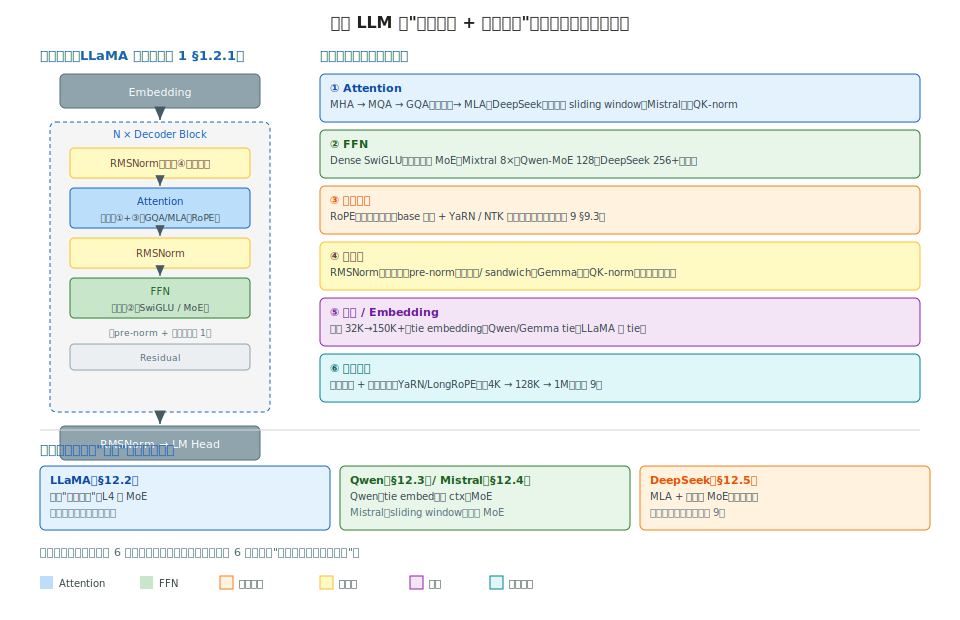

# 阶段 12｜代表模型架构选读 ✓

> 一句话定位：把主流开源大模型按架构横向对照——它们共享同一个 decoder-only 骨架（阶段 1），差异只在 attention、FFN、归一化、位置编码、词表这几个"旋钮"上。本章每个模型一节、简短、对照 HuggingFace 源码，让你拿到一个新模型的 config 就能快速看懂它"在标准架构上改了什么、为什么改"。

## 目录

- [12.0 为什么需要这一层](#120-为什么需要这一层)
- [12.1 核心概念：一张"架构旋钮"对照表](#121-核心概念一张架构旋钮对照表)
- [12.2 LLaMA 1/2/3/4](#122-llama-1234)
- [12.3 Qwen 2/2.5/3](#123-qwen-2253)
- [12.4 Mistral / Mixtral](#124-mistral--mixtral)
- [12.5 DeepSeek V2/V3/R1](#125-deepseek-v2v3r1)
- [12.6 GLM / Yi / Gemma / Phi](#126-glm--yi--gemma--phi)
- [12.7 多模态架构](#127-多模态架构)
- [12.8 横向对比矩阵](#128-横向对比矩阵)
- [12.9 常见坑与 FAQ](#129-常见坑与-faq)
- [12.10 延伸阅读](#1210-延伸阅读)

---

## 12.0 为什么需要这一层

读完前 11 个阶段，你已经掌握了所有"零件"——attention 家族（阶段 1）、MoE（阶段 1/9）、位置编码（阶段 1/9）、归一化、FFN。本章是**收尾的横向扫描**：把主流模型摆在一起，看它们各自怎么组合这些零件。

为什么需要这一章——**拿到一个新模型时，你需要快速判断它是什么**：

1. **接入推理引擎**：vLLM 支持这个模型吗？没有的话，它和哪个已支持的模型最像，能照着改吗（回阶段 6 §6.3.3）？
2. **选型**：同样 7B，LLaMA / Qwen / Mistral 架构差在哪、各自强在什么场景？
3. **读懂 config**：拿到 `config.json`，`num_key_value_heads`、`sliding_window`、`num_experts` 这些字段告诉你它用了什么技术。
4. **跟上演进**：模型迭代快，但**架构创新是收敛的**——理解了这几个旋钮，新模型出来扫一眼 config 就懂。

**核心认知：现代 LLM 高度同质化。** 它们几乎都是 **decoder-only + RMSNorm（pre-norm）+ RoPE + GQA + SwiGLU** 的变体（阶段 1 的 LLaMA 骨架就是模板）。真正的差异集中在少数几个旋钮上：

```
标准骨架（LLaMA 模板，阶段 1 §1.2.1）：
  Embedding → N × [RMSNorm → Attention(RoPE,GQA) → RMSNorm → SwiGLU FFN] → RMSNorm → LM head

各模型的差异旋钮：
  • Attention：MHA / GQA / MQA / MLA、sliding window、有无 QK-norm
  • FFN：Dense SwiGLU / MoE（专家数、共享专家）
  • 位置编码：RoPE base、YaRN/外推策略
  • 归一化：RMSNorm 位置（pre/post/sandwich）
  • 词表：大小、是否 tie embedding
  • 长上下文：训练长度、外推方法
```

本章的读法：**每个模型，只看它在这几个旋钮上做了什么不一样**——不重复讲 GQA/MLA/MoE 的原理（那是阶段 1/9），只讲"这个模型选了哪个、为什么"。所以每节都很短。

读完之后你应当能：

1. 拿到一个 `config.json`，一眼看出模型用了什么 attention / FFN / 位置编码；
2. 说清 LLaMA / Qwen / Mistral / DeepSeek 几大系列的架构差异和取向；
3. 给一个新模型，判断它和哪个已支持模型最像、接入成本多大；
4. 在 HuggingFace `modeling_xxx.py` 里快速定位关键差异代码。

---

## 12.1 核心概念：一张"架构旋钮"对照表

读后面每个模型前，先把这张"旋钮"框架立起来。**所有现代 LLM 共享同一个骨架，差异收敛在六个旋钮上**——本章每节就是在填这六个旋钮的不同取值。

### 12.1.1 标准骨架与六个旋钮



标准骨架是阶段 1 §1.2.1 的 LLaMA 模板（SVG 左侧）：

```
Embedding → N × [RMSNorm → Attention → RMSNorm → FFN → Residual] → RMSNorm → LM Head
```

六个差异旋钮（SVG 右侧），每个旋钮的取值空间：

| 旋钮 | 取值空间 | 主流选择 | 出处 |
|---|---|---|---|
| **① Attention** | MHA / MQA / GQA / MLA；±sliding window；±QK-norm | **GQA** | 阶段 1 §1.2.2 |
| **② FFN** | Dense SwiGLU / MoE（专家数、共享专家） | SwiGLU 或 MoE | 阶段 1 §1.2.4、阶段 9 §9.6 |
| **③ 位置编码** | RoPE base + YaRN/NTK 外推 | **RoPE** | 阶段 1 §1.2.3、阶段 9 §9.3 |
| **④ 归一化** | RMSNorm；pre/post/sandwich；±QK-norm | **RMSNorm + pre-norm** | 阶段 1 §1.2.1 |
| **⑤ 词表/Embedding** | 大小 32K–150K+；tie / 不 tie | 看模型 | 阶段 1 §1.6 |
| **⑥ 长上下文** | 训练长度 + 外推策略 | 4K→128K→1M | 阶段 9 §9.3 |

**为什么差异收敛在这六个上**：Transformer 的核心（self-attention + FFN + 残差）已经被证明极其稳定，没人动它。能改、值得改的就是这几个"边缘旋钮"——怎么省 KV（attention 旋钮）、怎么扩容量（FFN 旋钮）、怎么变长（位置 + 长上下文旋钮）、怎么稳训练（归一化旋钮）。**架构创新 = 在这六个旋钮上找更好的取值。**

### 12.1.2 怎么读一个 config.json

拿到一个新模型，`config.json` 的字段直接对应这些旋钮——学会读它，比读论文快得多：

```jsonc
{
  "hidden_size": 4096,              // D：阶段 1 §1.1
  "num_attention_heads": 32,        // H（Q head 数）
  "num_key_value_heads": 8,         // ① H_kv < H → GQA！（=H 则 MHA，=1 则 MQA）
  "intermediate_size": 14336,       // FFN 中间维；约 3.5×D
  "num_experts": null,              // ② 有值 → MoE；null → Dense
  "rope_theta": 500000.0,           // ③ RoPE base；大 base 多为长上下文模型
  "max_position_embeddings": 131072,// ⑥ 训练/支持的上下文长度
  "rope_scaling": {"type": "yarn"}, // ⑥ 外推策略
  "rms_norm_eps": 1e-5,             // ④ 用 RMSNorm
  "vocab_size": 128256,             // ⑤ 词表大小
  "tie_word_embeddings": false      // ⑤ embedding 和 lm_head 是否共享权重
}
```

**判读速记**：

- `num_key_value_heads`：和 `num_attention_heads` 比 → MHA / GQA / MQA（阶段 1 §1.2.2）；
- `num_experts`（或 `num_local_experts`）：有值就是 MoE，看专家数和 `num_experts_per_tok`（top-k）；
- `rope_theta` 大（如 500K、1M）+ `rope_scaling`：长上下文模型；
- `sliding_window`：有值 → 滑动窗口 attention（Mistral 风格）；
- `tie_word_embeddings`：true（Qwen/Gemma）省一份词表权重，false（LLaMA）不省；
- 有 `q_norm`/`k_norm` 字段 → 用了 QK-norm（部分新模型稳训练用）。

### 12.1.3 源码定位：HuggingFace modeling 文件

每个模型在 HuggingFace `transformers` 里有一个 `modeling_<name>.py`，结构高度一致（都照 LLaMA 模板）。读差异看三个类：

| 类 | 看什么旋钮 |
|---|---|
| `XxxAttention` | ① attention（GQA 的 repeat_kv、sliding window 的 mask、QK-norm） |
| `XxxMLP` / `XxxSparseMoeBlock` | ② FFN（SwiGLU 还是 MoE） |
| `XxxRotaryEmbedding` | ③ 位置编码（RoPE base、YaRN scaling） |

读新模型源码的高效路径：**先 diff 它的 `modeling_xxx.py` 和 `modeling_llama.py`**——相同的部分跳过（就是标准骨架），不同的部分就是这个模型的创新点。vLLM 的 `model_executor/models/<name>.py`（阶段 6 §6.3.3）也是同样的对照读法。

> 心智模型：**现代 LLM = 标准骨架 + 六个旋钮的不同取值。** 这章不重复讲 GQA/MLA/MoE 的原理（阶段 1/9 已讲透），只看每个模型在六个旋钮上"选了什么、为什么选"。掌握这个框架，拿到任何新模型——读 config（§12.1.2）、diff modeling 文件（§12.1.3）——十分钟就能看懂它的架构。后面每节都是这个框架的一次实例化。

---

## 12.2 LLaMA 1/2/3/4

**定位**：现代开源 LLM 的"标准模板"定义者。前面所有章节讲的 LLaMA 骨架（阶段 1 §1.2.1）就是它。它本身架构保守——几乎不做激进创新，而是把社区验证过的好东西稳稳整合，因此**衍生模型最多、生态最广**（无数微调模型都基于 LLaMA）。读懂 LLaMA 四代演进，就读懂了"标准旋钮"是怎么一步步定下来的。

### 12.2.1 四代演进：旋钮的逐步固化

| 版本 | Attention | FFN | 位置/上下文 | 词表 | 关键变化 |
|---|---|---|---|---|---|
| **LLaMA 1**（2023） | MHA | SwiGLU | RoPE，2K | 32K | 确立 RMSNorm + RoPE + SwiGLU 模板 |
| **LLaMA 2**（2023） | **GQA**（70B） | SwiGLU | RoPE，4K | 32K | 大模型引入 GQA 省 KV |
| **LLaMA 3/3.1**（2024） | GQA（全系） | SwiGLU | RoPE base↑，**128K**（3.1） | **128K** | GQA 全系标配、词表大扩、长上下文 |
| **LLaMA 4**（2025） | GQA | **MoE** | iRoPE，超长 | 大 | 转向 MoE（Scout/Maverick） |

逐代看旋钮的固化过程：

**LLaMA 1 → 定模板**：第一次把 **RMSNorm（pre-norm）+ RoPE + SwiGLU + 无 bias 的 Linear** 组合稳定下来。这套组合此后成了所有模型的默认起点。但 1 代还是 MHA、上下文只有 2K。

**LLaMA 2 → 引入 GQA**：最重要的变化是 **70B 用了 GQA**（`num_key_value_heads=8`，回阶段 1 §1.2.2）——KV cache 砍 8 倍，长上下文 + 大 batch 推理才可行。7B/13B 仍是 MHA。上下文扩到 4K。

**LLaMA 3 / 3.1 → GQA 全系 + 长上下文 + 大词表**：

- **GQA 成全系标配**（连 8B 都用），因为推理省 KV 的收益对所有规模都成立；
- **词表从 32K 暴涨到 128K**（`vocab_size=128256`）——更大的词表压缩率更高（同样文本更少 token），尤其利好多语言和代码；
- **3.1 用 RoPE base 调整 + 外推扩到 128K 上下文**（回阶段 9 §9.3）；
- **8B 的 `num_kv_heads=8`** → TP 最多到 8（回阶段 1 §1.6 第 8 条、§1.3）。

**LLaMA 4 → 转向 MoE**：Scout / Maverick 改用 MoE FFN（②旋钮从 Dense 转 MoE），跟上 Mixtral/DeepSeek 的稀疏化趋势，并引入 iRoPE 等长上下文改进。这是 LLaMA 系最大的架构转向——从"纯 Dense 标准模板"走向"MoE"。

### 12.2.2 config 实例：LLaMA-3-8B

```jsonc
{
  "hidden_size": 4096,
  "num_attention_heads": 32,        // H=32
  "num_key_value_heads": 8,         // ① GQA：32 Q 共享 8 KV（group=4）
  "intermediate_size": 14336,       // FFN ≈ 3.5×D
  "num_hidden_layers": 32,
  "rope_theta": 500000.0,           // ③ 大 base（1 代是 10000）→ 利于长 ctx
  "max_position_embeddings": 8192,  // ⑥ 基础 8K（3.1 扩到 128K）
  "vocab_size": 128256,             // ⑤ 大词表（2 代是 32000）
  "tie_word_embeddings": false,     // ⑤ 不 tie（LLaMA 系一贯）
  "rms_norm_eps": 1e-5              // ④ RMSNorm
}
```

一眼读出：GQA（8 KV head）、Dense SwiGLU（无 num_experts）、大词表、大 RoPE base、不 tie embedding——典型的 LLaMA-3 标准配置。

### 12.2.3 源码定位

| 路径 | 看什么 |
|---|---|
| `transformers/models/llama/modeling_llama.py` | **所有模型对照的基准**（§12.1.3） |
| `LlamaAttention.repeat_kv` | GQA 的 KV head 复制（阶段 1 §1.2.2 的 repeat_interleave） |
| `LlamaRotaryEmbedding` | RoPE，3.1 的 YaRN scaling 在这里 |
| `LlamaMLP` | SwiGLU（gate/up/down proj） |
| vLLM `model_executor/models/llama.py` | TP-aware 版本（阶段 1 §1.3、阶段 6 §6.3.3） |

**`modeling_llama.py` 是整个开源生态的"母本"**——绝大多数模型的 modeling 文件都是它的变体。读懂这一个，其它模型 diff 着读即可（§12.1.3）。

### 12.2.4 架构取向

LLaMA 系的设计哲学是**保守稳健**：

- **不做激进创新**——GQA、RoPE、SwiGLU 都是别人验证过的，LLaMA 是"集大成者"而非"开创者"；
- **重视生态兼容**——架构稳定、改动小，让下游微调和工具链好对接；
- **规模化质量**——把精力放在数据和训练规模，而非架构花样。

这个取向的结果：**LLaMA 成了事实标准模板，衍生模型和工具支持最全**。代价是架构上不如 DeepSeek/Qwen 激进（GQA 不如 MLA 省 KV、转 MoE 也晚）。

> 一句话：**LLaMA 是"标准模板"本身——读懂它的四代演进（MHA→GQA 全系→大词表长上下文→MoE），就读懂了主流旋钮怎么定下来的。** 它保守、稳健、生态最广，是所有其它模型的对照基准。后面每个模型，本质都是"在 LLaMA 模板上改了某几个旋钮"。

---

## 12.3 Qwen 2/2.5/3

**定位**：阿里的开源大模型系列，是 LLaMA 之外**生态第二广**的开源系列，中文/多语言、长上下文、全尺寸覆盖（0.5B 到 235B MoE）见长。架构上比 LLaMA 略激进——更早全系长上下文、更早做 MoE、Qwen3 引入 QK-norm。读 Qwen 的方式：**它和 LLaMA 在哪几个旋钮上不一样**。

### 12.3.1 与 LLaMA 的旋钮差异

Qwen 共享 LLaMA 的标准骨架（RMSNorm + RoPE + GQA + SwiGLU），差异集中在三处：

| 旋钮 | LLaMA | Qwen | 影响 |
|---|---|---|---|
| **⑤ tie embedding** | 不 tie | **小模型 tie** | 小模型省一份词表权重（词表大时显著） |
| **① attention bias** | 无 bias | **QKV 有 bias**（Qwen2） | 历史选择，Qwen2 的 QKV proj 带 bias |
| **④ QK-norm** | 无 | **Qwen3 引入** | 对 Q/K 做 RMSNorm，稳定长训练 |
| **⑥ 长上下文** | 3.1 才 128K | **更早全系长 ctx** | Qwen2.5 普遍 128K，部分 1M |
| **② MoE** | L4 才 MoE | **Qwen2-MoE 就有** | 更早布局稀疏化 |

**tie embedding（⑤）**：Qwen 的小模型（0.5B/1.5B）把 embedding 和 lm_head 共享权重（`tie_word_embeddings=true`）。词表大（150K）时，一份词表权重就占不少——小模型尤其在意，tie 省一半词表参数。LLaMA 一贯不 tie（§12.2.4），这是两系一个明显区别（回阶段 1 §1.6 第 5 条：加载权重时认错会乱码）。

**QKV bias（①）**：Qwen2 的 attention 的 Q/K/V 投影带 bias（`attention_bias=true`），LLaMA 系一律无 bias。这是个历史/经验选择，对推理引擎接入有影响——移植时别漏了 bias。

**QK-norm（④，Qwen3 新增）**：Qwen3 在 attention 里对 Q 和 K 各做一次 RMSNorm（`q_norm`/`k_norm`），再算 attention。作用是**稳定大规模/长上下文训练**——Q/K 的数值规模被归一化，避免 attention logits 爆炸。这是近年新模型的共同趋势（不只 Qwen3，很多 2024+ 模型都加了 QK-norm）。读到 config 里有 `q_norm`/`k_norm` 字段，就是这个。

### 12.3.2 Qwen3-MoE：细粒度 MoE

Qwen3 系列含 MoE 版本（如 Qwen3-235B-A22B），FFN 旋钮从 Dense 转 MoE（回阶段 1 §1.2.4、阶段 9 §9.6）：

- **128 个专家、top-8**——比 Mixtral（8 选 2）细，但不如 DeepSeek（256 选 8）极致；
- **无共享专家**（不同于 DeepSeek 的 1 个 always-on 共享专家，§9.6.2）；
- 激活比例约 6%（22B 激活 / 235B 总）。

定位介于 Mixtral 和 DeepSeek 之间——比 Mixtral 细粒度，但没采用 DeepSeek 的共享专家 + loss-free balance 那套激进设计。

### 12.3.3 config 实例

Qwen2.5-7B（Dense）：

```jsonc
{
  "hidden_size": 3584,
  "num_attention_heads": 28,
  "num_key_value_heads": 4,         // ① GQA（28 Q / 4 KV，group=7）
  "intermediate_size": 18944,
  "attention_bias": true,           // ① Qwen 特色：QKV 带 bias
  "rope_theta": 1000000.0,          // ③ 大 base（百万级）→ 长上下文
  "max_position_embeddings": 131072,// ⑥ 128K
  "vocab_size": 152064,             // ⑤ 大词表（多语言）
  "tie_word_embeddings": false      // ⑤ 7B 不 tie；0.5B/1.5B 才 tie
}
```

Qwen3 多了 `q_norm`/`k_norm`（QK-norm）；Qwen3-MoE 多 `num_experts: 128`、`num_experts_per_tok: 8`、`moe_intermediate_size`。

### 12.3.4 源码定位

| 路径 | 看什么 |
|---|---|
| `transformers/models/qwen2/modeling_qwen2.py` | 与 LLaMA diff：QKV bias |
| `transformers/models/qwen3/modeling_qwen3.py` | 新增 QK-norm（`q_norm`/`k_norm`） |
| `Qwen2MoeSparseMoeBlock` / `Qwen3MoeSparseMoeBlock` | MoE 路由（128 专家） |
| vLLM `model_executor/models/qwen2.py` / `qwen3.py` | 推理实现 |

**diff 读法**（§12.1.3）：`modeling_qwen2.py` vs `modeling_llama.py` 主要差 QKV bias；`modeling_qwen3.py` vs `qwen2` 主要差 QK-norm。每代的创新点就藏在 diff 里。

### 12.3.5 架构取向

Qwen 的取向是**激进但不冒进**：

- **比 LLaMA 早一步**——长上下文、MoE、QK-norm 都比 LLaMA 早布局，跟进社区前沿快；
- **全尺寸覆盖**——从 0.5B 边缘到 235B MoE，小模型用 tie embedding 省显存，大模型上 MoE；
- **多语言/中文强**——大词表（150K）服务多语言，是中文场景的主力开源选择；
- **但不像 DeepSeek 那么激进**——没上 MLA、MoE 也没用共享专家 + loss-free balance。

> 一句话：**Qwen 是"比 LLaMA 激进半步"的标准模板变体——多了 QKV bias、QK-norm（Qwen3）、更早的长上下文和 MoE，小模型还用 tie embedding 省显存。** 它和 LLaMA 的差异都在少数旋钮上，diff 着 modeling 文件读最快。生态第二广，中文/多语言/全尺寸是它的主场。

---

## 12.4 Mistral / Mixtral

**定位**：法国 Mistral AI 的系列。它在两个旋钮上做了影响深远的事——**Mistral 7B 推广了 sliding window attention**（①），**Mixtral 8×7B 是第一个广泛流行的开源稀疏 MoE**（②，回阶段 2 §2.3.2、阶段 9 §9.6）。架构精炼、工程导向，是"小而强"和"开源 MoE 启蒙"的代表。

### 12.4.1 Mistral 7B：sliding window attention

Mistral 7B 的标志性旋钮是 **sliding window attention（SWA，滑动窗口注意力）**：

- 标准 attention：每个 token 看**全部**历史 token，KV cache 随序列线性增长；
- SWA：每个 token 只看**最近 W 个**（窗口，如 4096）token——超过窗口的旧 token 不再直接 attend。

好处：**KV cache 上限被窗口 W 封顶**，不随序列无限增长——长序列推理的 KV 显存可控。代价：超过窗口的远距离信息只能通过**逐层传递**间接获取（第 L 层能间接看到 L×W 范围内的信息），不是直接 attend。

```jsonc
"sliding_window": 4096      // ① 有这个字段 = SWA；每 token 只看最近 4096
```

读 config 看到 `sliding_window` 就知道是 SWA 模型。**对推理引擎的影响**：attention kernel 的 mask 要加窗口约束、KV cache 管理可以丢弃窗口外的旧 block（回阶段 5 §5.2 的 block 管理）。注意：后续 Mistral 模型（如 Mistral Large）有的去掉了 SWA 改回 full attention——SWA 是一种权衡，不是一直用。

### 12.4.2 Mixtral 8×7B：开源稀疏 MoE 鼻祖

Mixtral 8×7B 是**第一个真正流行的开源 MoE**，让社区第一次能上手大 MoE（回阶段 2 §2.3.2）。FFN 旋钮（②）：

- **8 个专家、top-2**——每 token 选 2 个专家，激活 ~25%（2/8）；
- **无共享专家**（不同于 DeepSeek）；
- 参数：47B 总参数、~13B 激活（"8×7B"是营销名，实际共享 attention，不是 8 个独立 7B）。

Mixtral 的历史意义：**它证明了开源 MoE 可行、好用**，直接启发了后来的 Qwen-MoE、DeepSeek-MoE。但它的 MoE 设计相对"朴素"——粗粒度（8 个大专家）、用传统辅助 loss 做负载均衡（不像 DeepSeek 的 loss-free，§9.6.3）。**它是 MoE 的"启蒙版"**，后来者在它基础上做细粒度、共享专家、loss-free 等改进。

config（Mixtral）：

```jsonc
{
  "num_local_experts": 8,           // ② 8 个专家
  "num_experts_per_tok": 2,         // ② top-2（激活 25%）
  "num_key_value_heads": 8,         // ① GQA
  "sliding_window": null,           // Mixtral 去掉了 SWA（用 full attention）
  "intermediate_size": 14336        // 单个专家的 FFN 维度
}
```

### 12.4.3 与 LLaMA 的旋钮差异

| 旋钮 | LLaMA | Mistral/Mixtral |
|---|---|---|
| **① attention** | full GQA | **Mistral 7B：SWA**；Mixtral：full GQA |
| **② FFN** | Dense（L1-3） | **Mixtral：MoE（8 选 2）** |
| **④ 归一化** | RMSNorm | RMSNorm（同） |
| **③ 位置** | RoPE | RoPE（同） |

差异集中在 ① 和 ②——Mistral 玩 attention（SWA），Mixtral 玩 FFN（MoE）。其余旋钮和 LLaMA 一致。

### 12.4.4 源码定位

| 路径 | 看什么 |
|---|---|
| `transformers/models/mistral/modeling_mistral.py` | SWA 的 mask 实现（与 LLaMA 主要差这个） |
| `transformers/models/mixtral/modeling_mixtral.py` | `MixtralSparseMoeBlock`（路由 + top-2） |
| `MixtralSparseMoeBlock.forward` | router → top-2 → 专家加权（阶段 2 §2.3.2 的通信路径） |
| vLLM `model_executor/models/mixtral.py` | MoE + EP 推理（阶段 2 §2.2.5） |

读 Mixtral 的 MoE 实现是理解 MoE 工程的好入口——它简单（8 专家、传统设计），比 DeepSeek 的 256 专家 + 共享专家 + loss-free 容易读懂，是 MoE 源码的"入门版"。

### 12.4.5 架构取向

Mistral 的取向是**精炼 + 工程务实**：

- **小而强**——Mistral 7B 用 SWA 等技巧，以小搏大，性价比著称；
- **开源 MoE 先驱**——Mixtral 把 MoE 从论文带到人人可用，历史功绩大；
- **不追求架构极致**——SWA 和朴素 MoE 都是务实选择，不像 DeepSeek 那样激进重构；
- **欧洲开源代表**——商业与开源并行，部分模型开源。

> 一句话：**Mistral/Mixtral 在两个旋钮上留下遗产——Mistral 7B 推广了 sliding window attention（KV 封顶），Mixtral 8×7B 是开源稀疏 MoE 的鼻祖（8 选 2）。** 它的 MoE 设计朴素但好懂，是读 MoE 源码的入门版；后来的 Qwen-MoE、DeepSeek-MoE 都站在它肩上做细粒度改进。

---

## 12.5 DeepSeek V2/V3/R1

**定位**：架构创新**最激进**的开源系列。MLA、细粒度 MoE + 共享专家、loss-free balance、MTP、FP8 训练、DualPipe——这些旋钮上的激进取值，阶段 9 已作为核心案例**完整拆解过**。本节不重复原理（回 §9.5–9.8），只做三件事：**理清 V2→V3→R1 的版本演进、读 config、把它放回与其它系的对照里**。

### 12.5.1 版本演进：架构 vs 训练

DeepSeek 的演进要分清"架构变"和"训练变"：

| 版本 | 架构 | 训练 | 关键 |
|---|---|---|---|
| **DeepSeek-V2**（2024.5） | **首次 MLA + DeepSeekMoE** | 常规 | MLA / 细粒度 MoE 的开山 |
| **DeepSeek-V3**（2024.12） | MLA + MoE（256 专家）+ MTP | **FP8 + DualPipe** | 工程集大成，671B |
| **DeepSeek-R1**（2025.1） | **与 V3 相同** | **大规模 RL（推理）** | 架构没变，训练范式变 |

**V2 → 架构开山**：第一次提出 **MLA**（低秩 KV，§9.5）和 **DeepSeekMoE**（细粒度 + 共享专家，§9.6）。这两个旋钮的激进取值是 DeepSeek 系的根基，V2 就定下了。

**V3 → 工程集大成**：架构延续 V2（MLA + 细粒度 MoE），但**专家数扩到 256**、加 **MTP**（§9.7.2），训练上引入 **FP8 + DualPipe**（§9.7.1、§8.4）。V3 的贡献主要在**工程**——让 671B 这么大的 MoE 能用可接受成本训出来（回阶段 9 §9.9）。

**R1 → 架构不变，训练变**：这是关键认知——**R1 和 V3 架构完全相同**（同样 MLA + MoE）。R1 的创新**不在架构，在训练**：用大规模强化学习（RL）训练推理能力，让模型学会长链思考（chain-of-thought）。**所以 R1 在本章（架构选读）里和 V3 是同一个架构**——它的故事属于"训练范式"（RL for reasoning），不属于"架构旋钮"。

这是个重要区分：**架构创新和训练创新是两条线**。V2/V3 是架构线（MLA/MoE），R1 是训练线（RL）。本章只管架构线。

### 12.5.2 旋钮上的激进取值

DeepSeek 在六个旋钮上的取值都偏激进（对照 §12.1）：

| 旋钮 | DeepSeek 的选择 | vs 主流 |
|---|---|---|
| **① attention** | **MLA**（低秩 KV，§9.5） | 主流是 GQA；MLA 压得更狠（~1/30） |
| **② FFN** | **256 细粒度 + 1 共享专家**（§9.6） | 比 Mixtral（8）、Qwen（128）更细 |
| **② 负载均衡** | **loss-free balance**（§9.6.3） | 主流用辅助 loss |
| **训练** | MTP + FP8 + DualPipe | 主流不用这套 |

**MLA（①）是最大的差异点**——别人都用 GQA，只有 DeepSeek 用 MLA。代价是结构复杂、需要 FlashMLA kernel、推理要 DP attention（这一串连锁反应在 §9.5.2、§9.8.1 详述）。这也是 DeepSeek 模型接入推理引擎比别的难的原因——MLA 不是标准 GQA，引擎要专门支持。

### 12.5.3 config 实例

DeepSeek-V3（关键字段，比标准模型多很多 MLA/MoE 专属字段）：

```jsonc
{
  // ① MLA 专属（标准模型没有这些）
  "kv_lora_rank": 512,              // KV 压缩到的低秩维度（§9.5）
  "q_lora_rank": 1536,              // Q 也低秩
  "qk_rope_head_dim": 64,           // decoupled RoPE 的小维度（§4.5.2）
  "qk_nope_head_dim": 128,          // 不带 RoPE 的部分
  "v_head_dim": 128,
  // ② DeepSeekMoE 专属
  "n_routed_experts": 256,          // 256 个 routed 专家（§9.6.1）
  "n_shared_experts": 1,            // 1 个共享专家（§9.6.2）
  "num_experts_per_tok": 8,         // top-8
  "first_k_dense_replace": 3,       // 前 3 层 Dense（§9.6.4）
  "topk_method": "noaux_tc",        // loss-free balance（§9.6.3）
  "n_group": 8, "topk_group": 4,    // 专家分组路由
  "norm_topk_prob": true
}
```

**一眼识别 DeepSeek**：看到 `kv_lora_rank`（MLA）+ `n_routed_experts: 256` + `n_shared_experts` + `noaux_tc`（loss-free）这组字段，就是 DeepSeek 系——这些字段标准模型都没有，是它激进旋钮的直接体现。

### 12.5.4 源码定位

| 路径 | 看什么 |
|---|---|
| `transformers/models/deepseek_v3/modeling_deepseek_v3.py` | MLA + MoE 完整实现 |
| `DeepseekV3Attention` | MLA：低秩降维 + 升维 + decoupled RoPE（§9.5、§4.5） |
| `DeepseekV3MoE` | 256 专家 + 共享专家 + 分组路由（§9.6） |
| `DeepseekV3TopkRouter` | loss-free balance（noaux_tc，§9.6.3） |
| vLLM `model_executor/models/deepseek_v3.py` + MLA backend | DP attention + FlashMLA（§9.8、§4.5） |

**diff 读法对 DeepSeek 失效**——它和 LLaMA 差异太大（MLA 重写了整个 attention），不能简单 diff。建议直接对照阶段 9 的拆解读它的 `modeling_deepseek_v3.py`，是把阶段 9 理论落到代码的最佳材料。

### 12.5.5 架构取向

DeepSeek 的取向是**激进重构 + 工程极致**：

- **敢动核心旋钮**——别人不敢碰的 attention（改成 MLA）它改了，换来 KV 压缩的巨大收益；
- **细粒度 + 共享 + loss-free**——MoE 的三个创新一起上，比谁都激进（§9.6）；
- **训练工程极致**——FP8 + DualPipe + MTP，把训练成本压到同规模 dense 的零头；
- **架构和训练双线创新**——V2/V3 推架构，R1 推 RL 训练。

代价：**接入成本高**——MLA 不是标准 GQA，引擎要专门支持（FlashMLA、DP attention），不像 LLaMA/Qwen 那样即插即用。

> 一句话：**DeepSeek 是架构最激进的系列——MLA（唯一不用 GQA 的主流模型）+ 256 细粒度 MoE + loss-free balance，加上 FP8/DualPipe/MTP 的训练工程。** 这些旋钮的激进取值阶段 9 已完整拆解；本章强调三点：V2 开架构、V3 集工程大成、R1 架构同 V3 但训练用 RL。看到 `kv_lora_rank` + `n_routed_experts:256` 就是它。

---

## 12.6 GLM / Yi / Gemma / Phi

四个有特色的系列，各在某个旋钮上有自己的选择。本节每个简述其差异点——它们都是标准模板的变体，但各有一两个值得记的旋钮取值。

### 12.6.1 GLM（智谱）

**取向**：清华/智谱的系列，早期（GLM-130B、ChatGLM）用过独特的**自回归填空（autoregressive blank infilling）**预训练目标和 2D 位置编码，架构和 GPT 系不同。但**新版（GLM-4 系）已收敛到主流 decoder-only**——RMSNorm + RoPE + GQA，和 LLaMA 模板趋同。

值得记的差异：

- **早期 GLM 的双向 + 填空目标**：是架构史上的一个分支，但已被主流单向 decoder 取代；
- **GLM-4 趋同主流**：现在读 GLM-4 的 config，和 LLaMA/Qwen 差别不大，主要是中文/工具调用/长上下文的工程优化；
- **部分版本 QKV 带 bias**（类似 Qwen2 的选择）。

源码：`transformers/models/glm/modeling_glm.py`（新版已是标准结构）。读 GLM-4 就当它是"中文优化的 LLaMA 变体"，diff 着读即可。

### 12.6.2 Gemma（Google）

**取向**：Google 的开源系列，架构上有几个**辨识度很高的旋钮选择**，和 LLaMA 系明显不同：

| 旋钮 | Gemma 的选择 | vs LLaMA |
|---|---|---|
| **④ 归一化** | **sandwich norm**（每个子层前后各一个 norm） | LLaMA 只在子层前 norm |
| **⑤ 词表** | **256K 超大词表** + **tie embedding** | LLaMA 128K、不 tie |
| **② 激活** | **GeGLU**（GELU 门控） | LLaMA 用 SwiGLU（SiLU 门控） |
| **① attention** | GQA + **logit soft-cap**（Gemma 2） | LLaMA 无 cap |
| **① 局部/全局交替** | Gemma 2/3：**局部 SWA 和全局 attention 层交替** | LLaMA 全是全局 |

几个细节：

- **sandwich norm（④）**：每个 attention/FFN 子层**前后各加一个 RMSNorm**（pre + post），比 LLaMA 的纯 pre-norm 多一层。作用是进一步稳定训练。读 config 看到 `pre_feedforward_layernorm` + `post_feedforward_layernorm` 就是它。
- **256K 词表 + tie（⑤）**：词表巨大（多语言 + 高压缩率），靠 tie embedding 把这份大词表的权重省一半——大词表和 tie 是绝配。
- **logit soft-cap（①，Gemma 2）**：给 attention logits 和最终 logits 套一个 `tanh` 软上限，防止数值爆炸。这是 Gemma 2 特有的稳定技巧（后续 Gemma 3 调整了）。
- **局部/全局交替（Gemma 2/3）**：奇数层用 sliding window（局部、省 KV），偶数层用 full attention（全局）——在 KV 成本和长程建模间折中。

源码：`transformers/models/gemma/`、`gemma2/`、`gemma3/`——**Gemma 是 diff 读法收获最大的模型之一**，因为它在好几个旋钮上都和 LLaMA 不同，对照着读能清楚看到每个选择。

### 12.6.3 Phi（微软）

**取向**：微软的**小模型**系列（Phi-1 到 Phi-4，多在 1B–14B）。它的创新**不在架构，在数据**——用大量**合成数据 + 教科书质量数据**训练，让小模型达到远超其尺寸的能力（"textbooks are all you need"）。

架构上 Phi 相当**标准保守**：

- decoder-only + RoPE + GQA（或 MHA，小模型有时用 MHA）；
- 部分版本用 **partial RoPE**（只对一部分维度加 RoPE）；
- Phi-3 用了 **LongRoPE**（§9.3.3）做长上下文外推——这是 Phi 在位置旋钮上的一个特色。

所以 Phi 的故事是"**架构平平、数据取胜**"——它提醒一个重要事实：**模型质量不只靠架构旋钮，数据和训练同样关键**（呼应 §12.5.1 的"架构线 vs 训练线"）。读 Phi 的 config 没什么惊喜，它的秘密在数据配方里。

源码：`transformers/models/phi3/modeling_phi3.py`（LongRoPE 的 scaling 在 RotaryEmbedding 里）。

### 12.6.4 Yi（零一万物）

**取向**：零一万物的系列，**刻意保持与 LLaMA 架构兼容**——几乎就是 LLaMA 结构（RMSNorm + RoPE + GQA + SwiGLU），主要差异在**数据、词表和训练**，不在架构旋钮。

好处：**即插即用**——因为架构和 LLaMA 一样，所有支持 LLaMA 的推理引擎/工具直接支持 Yi，接入零成本。这是"兼容标准模板"的务实选择（和 Qwen 略激进、DeepSeek 激进形成对比）。

源码：直接复用 LLaMA 的 modeling（或极小改动）。读 Yi 当 LLaMA 读即可。

### 12.6.5 四模型小结

| 模型 | 标志性旋钮 | 一句话 |
|---|---|---|
| **GLM** | 早期双向填空，新版趋同 | 中文优化的 LLaMA 变体（GLM-4） |
| **Gemma** | sandwich norm + 256K tie + GeGLU + logit cap + 局部全局交替 | 旋钮选择最有辨识度，diff 读法收获最大 |
| **Phi** | partial RoPE + LongRoPE，**重数据轻架构** | 小模型，秘密在数据不在架构 |
| **Yi** | 几乎纯 LLaMA | 刻意兼容标准模板，即插即用 |

> 一句话：**这四个模型展示了"标准模板"的不同改法**——GLM 从独特结构收敛回主流、Gemma 在多个旋钮上做了有辨识度的选择（sandwich norm / 大词表 tie / GeGLU / logit cap）、Phi 几乎不动架构而靠数据取胜、Yi 刻意保持 LLaMA 兼容求即插即用。它们一起说明：**架构旋钮的取值空间已经被探索得很充分，差异化越来越多转向数据和训练**。

---

## 12.7 多模态架构

多模态模型的 token 路径机制（图→encoder→projector→token）在阶段 10 §10.5 讲过。本节从**架构选读**角度补充：主流多模态模型在"视觉端三个旋钮"——**vision encoder、projector、分辨率策略**——上的不同选择，以及视频怎么 token 化。

### 12.7.1 多模态的"视觉端旋钮"

回 §12.1 的框架——LLM 主干有六个旋钮，多模态在主干**前面**加了视觉端，视觉端也有三个旋钮（回阶段 10 §10.5.1 的四步流水）：

| 视觉旋钮 | 取值空间 | 影响 |
|---|---|---|
| **A. vision encoder** | CLIP ViT / SigLIP / 自研 ViT（大小、预训练） | 视觉理解能力上限 |
| **B. projector** | MLP / Q-Former / pixel shuffle / cross-attention | 视觉特征→LLM 空间的"翻译"方式 + token 数 |
| **C. 分辨率策略** | 固定 / 动态 / tiling / token 压缩 | 看得清 vs token 省的权衡 |

外加 **D. 主干 LLM** ——多模态模型的文本主干通常就是某个标准 LLM（LLaVA 用 Vicuna/LLaMA、Qwen-VL 用 Qwen、InternVL 用 InternLM/Qwen），**复用 §12.2–12.6 的全部架构**。所以多模态 = 视觉端三旋钮 + 标准 LLM 主干。

### 12.7.2 三个代表模型的架构选择

承接阶段 10 §10.5.2，从架构层面细看：

**LLaVA / LLaVA-NeXT**

- **encoder**：CLIP ViT-L；
- **projector**：简单 **MLP**（两层）——最简洁，把 ViT 特征线性投影到 LLM 空间；
- **分辨率**：LLaVA 固定分辨率；**LLaVA-NeXT（1.6）引入 AnyRes**——把高分辨率图切成多个子图块分别编码，解决固定分辨率看不清细节的问题；
- **主干**：Vicuna / LLaMA / Mistral。

LLaVA 的价值是**简洁透明**——MLP projector 是理解"视觉特征怎么接进 LLM"的最佳入门，没有花哨设计。

**Qwen-VL / Qwen2-VL / Qwen2.5-VL**

- **encoder**：自研 ViT；
- **分辨率**：**naive dynamic resolution（动态分辨率）**——按图像原始尺寸动态决定 patch 数和 token 数，小图少 token、大图多 token，不浪费（§10.5.2）；
- **位置编码**：**M-RoPE（多模态 RoPE）**——把位置编码扩展到时间/高/宽三个维度，让模型理解图像的 2D 空间和视频的时间结构（这是 Qwen-VL 在位置旋钮上的关键创新）；
- **主干**：Qwen。

Qwen2-VL 的 M-RoPE 是多模态位置编码的代表设计——纯文本 RoPE 是 1D（只有序列位置），M-RoPE 把它扩到 3D（时间、高、宽），统一处理文本、图像、视频。

**InternVL**

- **encoder**：**大 vision encoder（InternViT，最大 6B）**——视觉端做得很重，视觉理解强；
- **projector**：**pixel shuffle 压 token**——把相邻 patch 特征合并，减少 image token 数（§10.5.2），缓解高分辨率 token 爆炸；
- **分辨率**：**动态 tiling**——高分辨率图切块；
- **主干**：InternLM / Qwen。

InternVL 的取向是"**视觉端重、token 压缩**"——大 encoder 保证看得清，pixel shuffle 保证 token 不爆。

### 12.7.3 视频的 token 化

视频 = 时间维上的多帧图像，token 化的关键是**怎么压时间冗余**（回阶段 10 §10.5.3：视频轻松上万 token）：

| 策略 | 做法 |
|---|---|
| **抽帧** | 不是每帧都编码，按固定间隔抽帧（降时间密度） |
| **时间池化** | 相邻帧的 token 做池化/合并，减少 token |
| **3D 位置编码** | M-RoPE 等把时间维编进位置，让模型理解帧序 |
| **token merge** | 相邻帧相似的 patch 合并（视频帧间冗余高） |

核心矛盾还是 §10.5.3 说的——**视频信息量大但 token 预算有限**，所有策略都在"时间分辨率"和"token 数"间权衡。视频模型本质是"超长 token 序列 + 时间结构"的多模态，长上下文技术（阶段 9）在这里尤其重要。

### 12.7.4 源码定位

| 路径 | 看什么 |
|---|---|
| `transformers/models/llava/` / `llava_next/` | MLP projector、AnyRes（最简入门） |
| `transformers/models/qwen2_vl/` | 动态分辨率、M-RoPE（`Qwen2VLRotaryEmbedding`） |
| `transformers/models/internvl/` | pixel shuffle、动态 tiling |
| vLLM `model_executor/models/<name>.py` | 多模态推理（vision encoder + image token 拼接，§10.5.4） |

读法：多模态模型的 modeling 文件 = **vision tower（encoder）+ projector + 标准 LLM 主干**三段。前两段是视觉端旋钮（各模型不同），主干段直接复用 §12.2–12.6 的某个 LLM（diff 着读）。

### 12.7.5 架构取向小结

| 模型 | 视觉端取向 | 一句话 |
|---|---|---|
| **LLaVA** | 简洁 MLP，固定/AnyRes | 多模态入门，透明好懂 |
| **Qwen-VL** | 动态分辨率 + M-RoPE | 分辨率自适应 + 3D 位置，省 token |
| **InternVL** | 大 encoder + pixel shuffle | 视觉重、token 压缩，高分辨率强 |

> 一句话：**多模态 = 视觉端三旋钮（encoder / projector / 分辨率策略）+ 标准 LLM 主干。** 主干复用 §12.2–12.6 的某个 LLM，差异在视觉端：LLaVA 简洁（MLP）、Qwen-VL 动态分辨率 + M-RoPE、InternVL 大 encoder + token 压缩。视频再加时间维的 token 压缩。理解了 §10.5 的 token 路径机制 + 本节的架构选择，就看懂了多模态模型的全貌——它本质是"给标准 LLM 配一个视觉前端"。

---

## 12.8 横向对比矩阵

把所有模型按六个旋钮（§12.1）汇成一张大表。**这是全章的导航总表——拿到任何模型，先在这里定位它。**

### 12.8.1 六旋钮对照大表

| 模型 | ① Attention | ② FFN | ③ 位置 | ④ 归一化 | ⑤ 词表/tie | ⑥ 长上下文 |
|---|---|---|---|---|---|---|
| **LLaMA-2** | GQA(70B) | SwiGLU | RoPE | RMSNorm pre | 32K / 不 tie | 4K |
| **LLaMA-3** | GQA 全系 | SwiGLU | RoPE base↑ | RMSNorm pre | 128K / 不 tie | 8K→128K |
| **LLaMA-4** | GQA | **MoE** | iRoPE | RMSNorm pre | 大 | 超长 |
| **Qwen2.5** | GQA + **QKV bias** | SwiGLU/MoE | RoPE 1M base | RMSNorm pre | 152K / 小模型 tie | 128K |
| **Qwen3** | GQA + **QK-norm** | SwiGLU/**MoE 128** | RoPE | RMSNorm + QK-norm | 大 / tie | 长 |
| **Mistral-7B** | **SWA** | SwiGLU | RoPE | RMSNorm pre | 32K | SWA 窗口 |
| **Mixtral** | GQA | **MoE 8 选 2** | RoPE | RMSNorm pre | 32K | 32K |
| **DeepSeek-V3** | **MLA** | **MoE 256+共享** | decoupled RoPE | RMSNorm pre | 大 | 128K |
| **Gemma 2** | GQA + **logit cap** + 局部/全局 | **GeGLU** | RoPE | **sandwich norm** | **256K / tie** | 8K |
| **Phi-3** | GQA + partial RoPE | SwiGLU | **LongRoPE** | RMSNorm pre | 32K | 128K |
| **Yi** | GQA | SwiGLU | RoPE | RMSNorm pre | ~64K / 不 tie | 长 |

加粗的是该模型**偏离标准模板**的旋钮——一眼看出每个模型"特别在哪"。没加粗的就是标准选择（和 LLaMA 一样）。

### 12.8.2 按旋钮看谁最激进

反过来按旋钮聚合，看每个旋钮上谁走得最远：

| 旋钮 | 标准 | 最激进 | 谁 |
|---|---|---|---|
| **① attention** | GQA | **MLA**（KV ~1/30） | DeepSeek |
| **① attention（省 KV 另一路）** | full | **SWA**（窗口封顶） | Mistral 7B |
| **② FFN** | Dense | **256 细粒度 + 共享** | DeepSeek |
| **④ 归一化** | pre-norm | **sandwich norm** | Gemma |
| **⑤ 词表** | 128K | **256K + tie** | Gemma |
| **⑥ 长上下文** | 128K | **LongRoPE → 数 M** | Phi / LongRoPE 系 |
| **训练（非架构）** | SFT | **RL for reasoning** | DeepSeek-R1 |

**两个观察**：

1. **DeepSeek 在多个旋钮上最激进**（MLA + MoE），是架构创新的领头羊；
2. **省 KV 有两条路**——MLA（压缩，DeepSeek）和 SWA（窗口，Mistral），代表两种不同思路。

### 12.8.3 趋势：旋钮的收敛与新动向

把所有模型放一起看，能读出架构演进的趋势：

**已收敛（几乎所有模型都一样）**：
- **RMSNorm + pre-norm**（归一化旋钮基本定型）；
- **RoPE**（位置编码几乎无争议）；
- **SwiGLU/GeGLU**（FFN 激活定型）；
- **GQA**（attention 的默认，除非更激进上 MLA）。

**仍在分化（各家不同）**：
- **②FFN：Dense vs MoE**——大模型越来越多转 MoE（LLaMA-4、Qwen3、DeepSeek 都有 MoE）；
- **①attention：GQA vs MLA vs SWA**——省 KV 的路线之争；
- **⑥长上下文：YaRN vs LongRoPE**——外推方法仍在演进。

**新动向（2024+）**：
- **QK-norm** 越来越普及（Qwen3、多个新模型），稳训练；
- **MoE 成大模型标配**——稀疏化是扩容量的主流；
- **差异化转向数据/训练**（§12.6.3 Phi、§12.5.1 R1）——架构旋钮探索充分后，竞争更多在数据和训练范式。

> 心智模型：**这张大表是全章的浓缩——六个旋钮 × 各家取值。** 加粗处是每个模型的"个性"，其余是共享的"标准模板"。读懂它，拿到任何新模型：读 config（§12.1.2）定位到表里某一行、看它哪个旋钮加粗（偏离标准）、diff modeling 文件确认（§12.1.3）——三步看懂一个新架构。而趋势告诉你：归一化/位置/激活已收敛，未来的差异在 FFN（MoE）、attention（省 KV）、长上下文，以及越来越重要的数据和训练。

---

## 12.9 常见坑与 FAQ

读架构、看 config、移植模型时最容易栽的几个跟头——按"六个旋钮（§12.1）"分类，每条给定位指引。

### 12.9.1 config 字段速查（先看一眼，避免误读）

| 字段 | 一般取值 | 错读后果 |
|---|---|---|
| `num_key_value_heads == num_attention_heads` | 相等 | 不是 GQA，是 **MHA**（KV 没省）；TP 上界更松但 KV 显存大 |
| `num_key_value_heads` 单独取值 | 1 / 4 / 8 | TP 上界 = `num_kv_heads`（回阶段 1 §1.6 第 8 条） |
| `attention_bias` | `true`/缺省 | Qwen2 系是 `true`；移植/重写 attention 漏 bias → 数值不对 |
| `sliding_window` | 整数 / `null` | Mistral 系有值 → SWA；用 full-attention kernel 跑会越界 attend |
| `tie_word_embeddings` | bool | true 时 `lm_head` 复用 embedding；分片加载错 → 输出乱码 |
| `rope_scaling` | `{type: yarn, ...}` | 缺这段就只能跑训练长度；强推会复读机/胡言乱语 |
| `kv_lora_rank` / `q_lora_rank` | DeepSeek 才有 | 看到就是 **MLA**，不能套 GQA 的推理路径 |
| `num_experts` / `n_routed_experts` | 有值 → MoE | 别忘 `num_experts_per_tok`（top-k）和 `n_shared_experts` |
| `q_norm` / `k_norm` 字段 | Qwen3、新模型 | 缺 QK-norm 会数值规模不对，长上下文尤其敏感 |

> 拿到新模型先按这张表扫一遍 `config.json`——绝大多数"看起来很奇怪"的行为，根源都在这几行字段。

### 12.9.2 十条最易踩的坑

1. **`num_kv_heads == num_attention_heads` 误判成 GQA**：相等就是 MHA，没有 KV 复用。代码里 `repeat_kv` 是 noop，TP 上界看的也是 `num_kv_heads`——不是 32，就别想 TP=16（回 §12.1.2、阶段 1 §1.2.2）。

2. **`tie_word_embeddings` 加载时把 `lm_head` 当独立权重保存**：Qwen 小模型、Gemma 都是 tie；保存 LoRA 或转格式时若把 `lm_head.weight` 单独存了一份并和 `embed_tokens.weight` 不一致，加载后输出会乱（§12.3.1、§12.6.2）。HF `from_pretrained` 默认按 config 处理，自定义脚本要显式 `model.tie_weights()`。

3. **Qwen2 的 attention bias 移植时被漏掉**：手写或从 LLaMA 模板派生时若不把 `bias=True` 加上，前向数值会和官方权重对不齐——肉眼看像 "差一点点"，eval 掉几个点（§12.3.1）。

4. **Mistral 7B 用 LLaMA 的 full-attention kernel 跑**：忽略 `sliding_window` 直接全连接 attend，结果在训练长度内**精度看似没事**（窗口外信息走 inter-layer 传递本就有限），但**越过窗口的位置上 KV cache 不会被丢弃**，长 prompt 下 KV 显存会比官方实现高出一截（§12.4.1，回阶段 5 §5.2）。

5. **拿 V3 的部署文档套 DeepSeek-R1**：R1 的架构和 V3 完全一致（§12.5.1）——所以**部署旋钮也一样**（DP attention、FlashMLA、EP）。但 R1 输出的 `<think>` 长链会让 decode 步数翻倍，TTFT/TPOT 评估别照搬 V3 的 SLO（回 §10.7）。"R1 和 V3 不同"的差异在训练，不在架构。

6. **DeepSeek 系试图套 GQA 推理路径**：MLA 不是 GQA 的特例——KV cache 形状、`repeat_kv` 都不一样。引擎要专门支持（vLLM 的 MLA backend、SGLang DP attention、FlashMLA kernel）。看到 `kv_lora_rank` 字段不要硬接 GQA 代码（§12.5.4，回阶段 9 §9.5、阶段 4 §4.5）。

7. **`rope_theta` 和 `rope_scaling` 错配**：拿 LLaMA-2（base=10000、4K）的权重强行设 `max_position_embeddings=128000` 不会自动外推，会复读 / 输出 NaN。要么换 LLaMA-3.1（base=500K + YaRN scaling），要么显式配 `rope_scaling`（§9.3，§12.2.2）。

8. **MoE 模型按 dense 参数估算显存**：Mixtral "8×7B" 真实 47B 参数（共享 attention），DeepSeek-V3 是 671B 总 / 37B 激活——**显存按总参数算，算力按激活参数算**。用激活参数估显存会 OOM（§12.4.2、§12.5.2，回阶段 9 §9.6）。

9. **Gemma 移植时丢掉 sandwich norm / GeGLU / logit cap 中的任何一个**：这三个旋钮 Gemma 都和 LLaMA 不同（§12.6.2），随便漏一个数值就对不齐——尤其 `pre_feedforward_layernorm` + `post_feedforward_layernorm` 这对，照 LLaMA 模板写的代码默认只有 pre，必须显式加 post。

10. **多模态接入时 `image_token_id` / vision tower dtype 不一致**：vision encoder 通常 FP16/BF16，主干可能是 FP8 量化；token 拼接位置的 `<image>` 占位 id 各家不同（LLaVA / Qwen-VL / InternVL 各定义各的）。混搭权重或自己微调时这两处最常踩坑——symptom 是图像位置输出乱码或全成同一个 token（§12.7.4，回阶段 10 §10.5.4）。

### 12.9.3 一个排错心法

读架构出问题，按这个顺序排查比瞎试快得多：

```
症状 → ① diff config.json     —— 哪几个旋钮和"标准模板"不同？（§12.1.2）
      → ② diff modeling_xxx.py —— 不同旋钮在源码里怎么实现的？（§12.1.3）
      → ③ 回 §12.8 大表        —— 这个模型在哪一行、加粗了哪几列？
      → ④ 回阶段 1/9 看原理     —— 旋钮的实现原理（GQA/MLA/MoE/RoPE 外推）
```

**90% 的"模型行为怪"问题，根因都在 config 里某个字段被误读或忽略了**——这套排错路径就是为这个心法服务的。

---

## 12.10 延伸阅读

本章是横向扫描，原理细节都在前面阶段；下面 8 条围绕"读懂一个新模型"这条主线选，避免与阶段 1/9 的延伸阅读重复。

- **HuggingFace `transformers/models/llama/modeling_llama.py`** — 整个开源生态的"母本"（§12.1.3），所有其它 modeling 文件都是它的 diff；通读一次此后看任何新模型都靠对照读。
- **LLaMA 3 / 3.1 技术报告（Meta, 2024）** — 配 §12.2.1 看四代旋钮演进的官方说法，重点读 GQA 全系标配、词表扩到 128K、RoPE base + YaRN 扩 128K 的理由。
- **Qwen2 / Qwen2.5 / Qwen3 技术报告** — 三份连读最划算：QKV bias、tie embedding、Qwen3 引入 QK-norm 的动机都在这里（§12.3）。
- **Mixtral of Experts 论文（Mistral AI, 2024）** — 开源 MoE 启蒙读物，§12.4.2 的源头；读完再看 DeepSeek-MoE 报告才能体会"细粒度 + 共享专家"的改进逻辑。
- **DeepSeek-V3 Technical Report + V2 报告（MLA 部分）** — 本章对 DeepSeek 一节（§12.5）的一手依据；V2 讲 MLA 最细，V3 讲工程集大成。R1 报告则解释"架构同 V3、能力靠 RL"这条关键区分（§12.5.1）。
- **Gemma 2 / Gemma 3 技术报告（Google）** — §12.6.2 sandwich norm、logit soft-cap、局部/全局交替的官方解释，是"在多个旋钮上做选择"的最佳案例。
- **vLLM `vllm/model_executor/models/` 目录** — 把 §12.1.3 的 HF diff 读法搬到推理引擎语境：同一个模型在这里的 TP-aware 实现，看"架构旋钮如何落到 column/row parallel linear"（回阶段 6 §6.3.3）。
- **Qwen2-VL / LLaVA-NeXT / InternVL 技术报告** — §12.7 三家多模态各自的 vision 端旋钮（M-RoPE、AnyRes、pixel shuffle）的设计说明；和阶段 10 §10.5 的 token 路径对照读。

---

