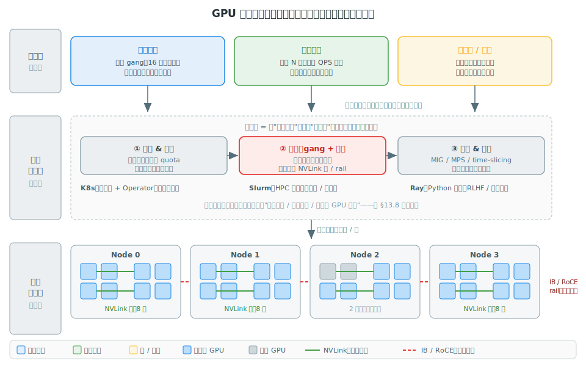

# 阶段 13｜集群编排、调度与 GPU 共享 ★★★

> 一句话定位：阶段 0–12 都默认"卡已经分给你了"，本章补上**谁来分、怎么分**——把 Kubernetes、Slurm、Ray 三种编排方案放在一张图上对比，讲清 gang 调度、配额、拓扑感知、MIG/MPS 共享、弹性伸缩这几件平台层的核心事，让你面对"50 个人 200 个作业抢一个 GPU 集群"时知道选哪套、怎么配。

## 目录

- [13.0 为什么需要这一层](#130-为什么需要这一层)
- [13.1 核心概念与术语](#131-核心概念与术语)
- [13.2 全景图与共同骨架](#132-全景图与共同骨架)
- [13.3 Kubernetes（深读）](#133-kubernetes深读)
- [13.4 Slurm（对照）](#134-slurm对照)
- [13.5 Ray（对照）](#135-ray对照)
- [13.6 GPU 共享与切分：MIG / MPS / time-slicing](#136-gpu-共享与切分mig--mps--time-slicing)
- [13.7 弹性伸缩、抢占与拓扑感知](#137-弹性伸缩抢占与拓扑感知)
- [13.8 横向对比矩阵](#138-横向对比矩阵)
- [13.9 选型决策清单](#139-选型决策清单)
- [13.10 常见坑与 FAQ](#1310-常见坑与-faq)
- [自测](#自测)
- [13.11 延伸阅读](#1311-延伸阅读)

---

## 13.0 为什么需要这一层

前面 12 个阶段教你把**一个作业**跑快、跑对、调优——单卡推理（阶段 1）、多卡并行（阶段 2）、推理引擎（阶段 6）、训练框架（阶段 7）。但它们有一个共同的隐含前提：**“这 8 张卡（或 256 张卡）已经是你的了”**。现实里这个前提不成立——卡是一整个团队共享的稀缺资源，谁能用、用多少、用哪几张，由**集群编排与调度层**决定。这一层是从“会跑单作业”到“会运营集群”的分水岭。

它解决的不是“算得快”，而是一组**平台级**的问题：

1. **多租户争抢**：50 个工程师、200 个作业，只有 64 张卡。怎么排队？怎么不让一个 512 卡的预训练把所有人饿死，也不让无数小作业把大作业永远卡在队列里？
2. **成组（gang）约束**：一个 TP=8 的训练作业要么**同时**拿到 8 张卡、要么一张都别给——给 5 张卡它根本跑不起来，还白白占着。通用调度器（按容器逐个塞）会造成**部分分配死锁**。
3. **放得对不对**：同样 8 张卡，排进**同一个 NVLink 域**和散在 4 台机器上，训练吞吐能差几倍（阶段 0 §0.2.3、阶段 3）。调度器得**拓扑感知**。
4. **碎片与共享**：一个 0.5B 模型的调试任务独占一张 H100 是巨大浪费。能不能把一张卡切给多个小任务（MIG / MPS）？碎片化的空闲卡怎么被小作业填掉？
5. **弹性**：推理服务半夜没流量，能不能缩到 0、把卡让给夜间训练？白天流量来了再秒级扩回来？训练作业跑到一半被高优先级任务抢占，怎么存盘退让、之后再续上？

这些问题，单作业视角的阶段 0–12 完全不碰，但它们恰恰是 AI infra 工程师的**主战场**。本章把这一层讲清楚。

本章的方法论（对应 CLAUDE.md 类型 B）：**以 Kubernetes 为主深读**（云原生事实标准、生态最广），**Slurm 和 Ray 对照阅读**（分别代表 HPC 超算路线和 Python 原生 / RLHF 路线）。三者做的是同一件事，差异只在“声明方式、调度模型、谁来管 GPU 共享”几个轴上——抓住共同骨架（§13.2），再看各家差异，就不会被一堆 YAML 和 CLI 淹没。

读完之后你应当能：

1. 画出“作业 → 调度器 → 物理卡”的统一骨架，说清调度器的三条核心职责（§13.2）；
2. 解释 gang 调度为什么是 GPU 作业的硬需求、通用调度器为什么会死锁（§13.2、§13.3）；
3. 给一个团队的真实负载（混合训练 + 推理 + 调试），选 K8s / Slurm / Ray 并说清理由（§13.8、§13.9）；
4. 判断一张卡该用 MIG、MPS 还是 time-slicing 来共享，以及各自的隔离代价（§13.6）；
5. 设计推理服务的弹性伸缩与训练作业的抢占退让策略（§13.7）。

---

## 13.1 核心概念与术语

本章术语集中在“调度与资源管理”，和阶段 0–12 的“计算”是正交的一层。

| 术语 | 全称 / 中文 | 一句话 |
|---|---|---|
| 编排（orchestration） | — | 把作业的资源声明，落实到具体节点 / 卡上并管理其生命周期 |
| 调度器（scheduler） | — | 编排系统的核心：决定“哪个作业、什么时候、放到哪些卡” |
| gang scheduling | 成组调度 | 一个作业的全部 worker 要么**全部**同时调度、要么都不调度（all-or-nothing） |
| 配额 / quota | — | 给租户 / 队列分配的资源上限，防止互相饿死 |
| 抢占（preemption） | — | 高优先级作业到来时，踢掉低优先级作业的卡（被踢者存盘退让） |
| binpack / spread | 装箱 / 摊开 | 放置策略：尽量塞满一台机（省碎片）vs 摊开（抗故障、均负载） |
| 拓扑感知（topology-aware） | — | 调度时考虑 NVLink 域 / 网络 rail，把同作业的卡排到高带宽近邻 |
| **MIG** | Multi-Instance GPU | 硬件把一张卡切成多个**物理隔离**的实例（如 1 张 H100 切 7 份） |
| **MPS** | Multi-Process Service | 多进程**共享**一张卡的 SM，软隔离、无显存硬隔离 |
| time-slicing | 时间片轮转 | 多个任务**分时**复用一张卡，最弱的共享方式，无隔离 |
| device plugin | — | K8s 里把 GPU 暴露为可调度资源（`nvidia.com/gpu`）的组件 |
| Operator | — | K8s 里用自定义资源（CRD）+ 控制器封装一类运维逻辑（如 GPU Operator） |
| HPA / KEDA | Horizontal Pod Autoscaler / — | K8s 的水平扩缩组件；KEDA 支持按队列长度、QPS 等自定义指标扩缩 |
| scale-to-zero | 缩到零 | 无流量时把服务副本缩到 0，省卡；有请求再冷启动拉起 |
| spot / 抢占式实例 | — | 云上的低价实例，随时可能被回收，适合可中断的批 / 训练作业 |
| MFU / 利用率 | Model FLOPs Utilization | 实际算力 / 峰值算力；集群层关心的是“买的卡有没有真在干活” |

> 阅读本章的心智准备：**编排层本质也是一个 loop**——“收集作业需求 → 看资源池现状 → 算一个放置方案 → 落地并监控 → 资源变化了再重排”。这和阶段 5 推理调度器“每 step 重新审视一批请求”是**同构**的，只是调度的单元从 token step 换成了**整个作业**、时间尺度从毫秒换成了分钟到天。抓住这条主线，K8s 的 Pod、Slurm 的 job、Ray 的 task/actor 都只是同一件事的不同外壳。

---

## 13.2 全景图与共同骨架

类型 B 章节的起手式：先给一张总图，让你看清三种编排方案的**共同骨架**和**差异轴**。读完本节，后面逐家剖析时你只需关注“它在哪个轴上做了什么不一样”，不会被各家的概念名淹没。

### 13.2.1 编排层都在做同一件事：把作业映射到卡



不管 Kubernetes、Slurm 还是 Ray，剥开外壳，集群编排都是一个**三层映射**（对应 SVG 三条横带）：

```
作业层      训练作业（gang）/ 推理服务（弹性）/ 批处理（填碎片）
   │  提交：声明“要几卡、什么拓扑、跑多久、什么优先级”
   ▼
编排调度层  一个循环：排队 → 放置 → 隔离/共享
   │  放置：选出具体节点和卡
   ▼
物理资源池  节点 × GPU，NVLink 域（节点内）+ IB/RoCE rail（跨节点）
```

调度器这一层（SVG 中间带）的工作可以收敛成**三条核心职责**——它们正是后面对比矩阵（§13.8）的列，也是判断一套编排系统强弱的三个着力点：

| 职责 | 解决什么 | 做不好的后果 |
|---|---|---|
| **① 排队 & 配额** | 多租户下谁先用、用多少（优先级 + quota） | 大作业饿死小作业，或反之；资源被一个租户独占 |
| **② 放置：gang + 拓扑** | 成组分配 + 排进高带宽近邻 | 部分分配死锁；8 卡散在 4 机，训练慢几倍 |
| **③ 隔离 & 共享** | 一张卡能不能安全地跑多个任务 | 小任务独占整卡 → 利用率低、碎片多 |

**这就是本章的核心洞察**：三家编排系统的全部差异，都落在这三条职责“各自怎么实现、谁来兜底”上。抓住这张图，后面读 K8s 的 YAML、Slurm 的 `sbatch`、Ray 的 placement group，都只是这三件事的不同写法。

### 13.2.2 为什么 GPU 作业的调度比普通服务难：gang 是分水岭

通用容器编排（K8s 最初为无状态 Web 服务设计）的调度是**逐个 Pod 独立**塞的：有一个空位就放一个。这对 Web 服务没问题——10 个副本调度上 7 个，就先服务 7 个。但对**多卡训练作业**是灾难。

设想一个 TP=8 的作业需要 8 张卡，集群里此刻只剩 5 张空闲：

- **通用调度器**：先给这个作业塞 5 个 worker（占住 5 张卡），剩 3 个 worker 卡在 pending 等卡。结果——这 5 张卡**被占着但跑不起来**（TP=8 少一张都没法启动），而其它作业也拿不到这 5 张卡。如果此时另一个作业也来抢剩余的卡，两边互相占着对方需要的卡谁也起不来，就是**部分分配死锁**（partial-allocation deadlock）。
- **gang 调度**：把这 8 个 worker 当成一个**不可分割的组**——要么 8 张卡同时到位、整组一起启动，要么整组继续在队列里等，**一张都不先占**。这样空闲的 5 张卡能立刻让给别的能跑的作业。

所以 **gang scheduling 是 GPU 训练作业的硬需求**，不是优化项。这也是为什么裸 K8s 跑大训练要额外装 Volcano 或 Kueue（§13.3）：默认调度器没有 gang 语义。Slurm 因为生来就是 HPC 批调度器，gang 是原生的（§13.4）；Ray 用 placement group 表达这种成组约束（§13.5）。

> 小结：**编排层 = 把“作业要什么卡”翻译成“用哪些物理卡”的调度循环，三条职责是排队/配额、gang+拓扑放置、隔离/共享。** GPU 作业相比普通服务的根本难点在 gang——多卡作业的全或无约束，是通用调度器会翻车、而 HPC 调度器天生擅长的地方。下面 §13.3–§13.5 按这条骨架逐个看三家怎么实现，§13.6–§13.7 深入“共享”和“弹性”两个最容易踩坑的维度，§13.8 收成对比矩阵。

---

## 13.3 Kubernetes（深读）

**定位**：云原生时代的事实标准编排系统。它本为无状态 Web 服务设计，GPU 调度是后来“补”上去的——理解这一点，就能理解它的强项（生态、弹性、推理服务）和短板（gang、拓扑要靠插件）从何而来。绝大多数公司的推理服务、以及越来越多的训练，都跑在 K8s 上。

### 13.3.1 K8s 怎么“看见”GPU：device plugin 与 GPU Operator

K8s 默认只认 CPU 和内存。GPU 通过 **device plugin** 机制接入：NVIDIA 的 device plugin 在每个节点上把 GPU 注册成一种可调度资源 `nvidia.com/gpu`，Pod 在 `resources.limits` 里像申请内存一样申请它：

```yaml
resources:
  limits:
    nvidia.com/gpu: 8        # 这个容器要 8 张整卡
```

但生产环境很少手动装 device plugin——而是用 **NVIDIA GPU Operator** 一键铺齐整条 GPU 栈：驱动、container toolkit、device plugin、DCGM（监控，阶段 11 / 未来的可观测性章）、MIG manager、node feature discovery（给节点打上 GPU 型号 / NVLink / MIG 能力的标签）。Operator 是 K8s 的标准封装模式：用自定义资源（CRD）+ 控制器把一类运维逻辑产品化，你声明“我要 GPU 栈”，它负责把每个节点拉齐到目标状态。

**关键认知**：`nvidia.com/gpu: 8` 这种写法，调度器眼里只是“8 个不可区分的计数单位”——它不知道这 8 张卡在不在同一个 NVLink 域、不知道它们要协同跑一个 TP 作业。这正是下面两个缺口的根源。

### 13.3.2 默认调度器的两个缺口：gang 与拓扑

回 §13.2.2：默认的 `kube-scheduler` **逐个 Pod 独立调度**，没有 gang 语义。一个 8-worker 的训练作业，它会有几个空位就塞几个，造成部分分配死锁。生产上靠两类项目补齐：

| 项目 | 怎么补 gang | 适合 |
|---|---|---|
| **Volcano** | 引入 `PodGroup` CRD，设 `minMember`——调度器凑齐 `minMember` 个 Pod 的资源才整组绑定，否则整组等待 | 训练为主、要 gang + 队列 + 公平调度的集群 |
| **Kueue** | 以 `Workload` 为单位做准入（admission）+ 配额借还，配合 coscheduling 插件实现成组 | 多队列、多租户配额管理，云原生味更浓 |

一个 Volcano gang 调度的最小骨架——`minMember: 8` 表达“8 个 worker 要么全调度、要么都等”：

```yaml
apiVersion: scheduling.volcano.sh/v1beta1
kind: PodGroup
metadata:
  name: llama-tp8
spec:
  minMember: 8                  # gang：8 个 worker 全或无
  queue: research               # 进哪个队列（队列带配额 + 优先级）
  minResources:
    nvidia.com/gpu: "8"
---
# 训练作业的 Pod 模板里声明归属这个 PodGroup，并指定用 volcano 调度器
# spec.schedulerName: volcano
# metadata.annotations: scheduling.k8s.io/group-name: llama-tp8
```

**拓扑感知**这个缺口更微妙。默认调度器不知道卡的物理近邻关系，可能把一个 8 卡作业拆到两台机各 4 张，NVLink 优势全失（阶段 0 §0.2.3）。当前的补法有几条路：Volcano 的 topology-aware 插件 + GPU feature discovery 打的节点标签做亲和性约束；更根本的是 K8s 正在标准化的 **DRA**（Dynamic Resource Allocation）——让设备申请从“要 N 个计数”升级到“要满足某种拓扑 / 能力约束的具体设备”，这是 K8s 原生解决细粒度、拓扑感知 GPU 调度的方向，也是接住 MIG / 多实例共享的未来接口。

### 13.3.3 K8s 的真正强项：推理服务的弹性

K8s 在**训练**上要靠插件补课，但在**推理服务**上是主场——这正是它无状态服务出身的红利：

- **声明式副本 + 滚动更新**：Deployment 管副本数，模型版本升级走金丝雀 / 蓝绿；
- **弹性伸缩**：HPA 按 CPU/GPU 利用率扩缩，**KEDA** 更进一步，能按队列长度、QPS、甚至自定义的 TTFT 指标扩缩，还支持 **scale-to-zero**（无流量缩到 0、省卡，有请求再冷启动，§13.7）；
- **服务发现 + 网关**：天然对接 §10.6 的路由网关、Service / Ingress。

所以一个常见的生产格局是：**推理服务用原生 K8s + HPA/KEDA，训练作业用 K8s + Volcano/Kueue**，两类负载共享同一个集群、靠队列和抢占（§13.7）做潮汐复用。

### 13.3.4 适用场景与限制

- **适合**：以推理服务为主、或训练 + 推理混合、已有云原生基础设施、要弹性和多租户的团队。生态最广，几乎所有 serving / 监控 / CI 工具都对接 K8s。
- **限制**：大规模**训练**的 gang、拓扑、高性能网络（IB/RoCE、GPUDirect RDMA）这些 HPC 特性，K8s 都要靠插件拼装，成熟度和“开箱即用”不如 Slurm；上千卡的紧耦合训练作业，很多团队仍然回到 Slurm（§13.4）。

> 一句话：**K8s 是“推理强、训练靠插件补”的通用底座。** 它的 GPU 调度是后补的，所以 gang（Volcano/Kueue）、拓扑（DRA）都是外挂；但它的弹性、多租户、生态是其它两家比不了的。看到 `nvidia.com/gpu` + `PodGroup` + `HPA`，就知道这是一个 K8s 集群在同时扛训练和推理。

---

## 13.4 Slurm（对照）

**定位**：HPC 超算世界的标准批调度器，几十年历史，全球绝大多数国家级超算和大型训练集群跑的都是它。和 K8s 正好相反——Slurm 生来就是为**多节点紧耦合批作业**设计的，所以 §13.2 那三条职责里最难的 **gang 和拓扑是它的原生能力**；但它没有“长期运行的服务”这个概念，弹性 / 服务化是它的短板。读 Slurm 的方式：**它和 K8s 在每条轴上几乎是镜像对称**。

### 13.4.1 调度模型：批队列 + 原生 gang + 原生拓扑

Slurm 的世界里没有 Pod、没有 Deployment，只有**作业**（job）和**分区**（partition，即队列）。你写一个批脚本，声明要多少节点、每节点几张卡、跑多久，提交进某个分区排队：

```bash
#!/bin/bash
#SBATCH --job-name=llama-tp8
#SBATCH --partition=research      # 队列（带 QOS / 配额 / 优先级）
#SBATCH --nodes=2                 # 2 个节点
#SBATCH --gpus-per-node=8         # 每节点 8 卡 —— 整个 16 卡分配是“全或无”
#SBATCH --ntasks-per-node=8       # 每卡一个 rank
#SBATCH --time=24:00:00           # 跑多久（HPC 必填，用于 backfill）

srun python train.py              # srun 在分到的 16 卡上拉起 16 个 rank
```

三个和 K8s 的关键差异，全在这段脚本里：

1. **gang 是默认的**：`--nodes=2 --gpus-per-node=8` 声明的是一个**整体分配**——Slurm 要么把 16 张卡一次性给齐、整个作业一起启动，要么让它在队列里等。**根本不存在“先给一半”的概念**，所以 §13.2.2 那种部分分配死锁在 Slurm 里天然不会发生。
2. **拓扑是原生的**：Slurm 用 topology 插件感知节点 / 交换机层级，分配时优先把同作业的卡排进同一拓扑域；和 IB/RoCE、GPUDirect RDMA、PMIx/MPI 启动是几十年磨合下来的紧耦合，**高性能网络开箱即用**——这正是 K8s 要费力补的部分。
3. **`--time` 是硬约束**：每个作业必须声明时长，调度器靠它做 **backfill**（把短作业塞进大作业等待的空隙），利用率很高。这背后的假设是“作业会结束”——和 K8s “服务长期运行”的假设根本对立。

### 13.4.2 它和 K8s 的镜像对称

| 轴 | Slurm | Kubernetes |
|---|---|---|
| 出身 | HPC 批作业 | 无状态 Web 服务 |
| gang 调度 | **原生** | 靠插件（Volcano/Kueue） |
| 拓扑 / 高性能网络 | **原生**（IB、RDMA、MPI） | 靠插件（DRA、GPU feature discovery） |
| 长期服务 / 弹性 | **几乎没有**（作业模型，非服务模型） | **原生**（Deployment、HPA、scale-to-zero） |
| 容器 / 生态 | 支持但非中心（pyxis/enroot、Apptainer） | 容器就是一等公民，生态最广 |
| 多租户 | account / QOS / 公平份额 | namespace / quota / RBAC |

一句话概括：**训练要的它都原生，服务要的它基本没有。**

### 13.4.3 适用场景与限制

- **适合**：以**大规模训练**为主、追求紧耦合多节点性能、已有 HPC 运维体系的团队（超算中心、大模型预训练）。上千卡的训练作业，Slurm 的 gang + 拓扑 + 低开销仍是最稳的选择。
- **限制**：**推理服务**几乎不该用 Slurm——它没有滚动更新、没有按 QPS 弹性、没有 scale-to-zero、没有服务发现。所以现实里常见“**Slurm 跑训练、K8s 跑推理**”的双栈，或用 Slinky / Soperator 这类项目把 Slurm 跑在 K8s 上、试图两全。

> 一句话：**Slurm 和 K8s 是一对镜像**——Slurm 把训练要的 gang、拓扑、高性能网络做成原生，却没有服务化和弹性；K8s 反之。选型本质是看你的负载重心在“紧耦合训练”还是“弹性服务”这一边（§13.8 矩阵会把这对照排全）。

---

## 13.5 Ray（对照）

**定位**：一个**分布式 Python 框架**——注意它和前两家不是一个层次。K8s / Slurm 是**集群资源管理器**（管物理节点和卡），Ray 是跑在它们**之上**的**应用层编排**（把一个 Python 程序拆成分布在多机的 task 和 actor）。所以 Ray 很少单独存在，通常是 **KubeRay 把 Ray 集群跑在 K8s 上**、或在 Slurm 分到的节点里拉起 Ray。理解这个层次关系，就不会问出“K8s 还是 Ray”这种错误的二选一——它们常常叠在一起用。

### 13.5.1 调度模型：task / actor + placement group

Ray 把分布式计算抽象成两个原语：**task**（无状态远程函数）和 **actor**（有状态远程类实例）。资源用逻辑声明的方式挂在上面：

```python
import ray

@ray.remote(num_gpus=1)          # 这个 actor 要 1 张逻辑 GPU
class Worker:
    def __init__(self): ...      # 在分到的卡上初始化模型分片
    def step(self, batch): ...

ray.init()
workers = [Worker.remote() for _ in range(8)]   # 8 个 worker，Ray 调度到有空闲卡的节点
```

`num_gpus=1` 是**逻辑资源记账**，不是硬隔离——Ray 用它做调度决策（这个节点还剩几张逻辑卡），但不像 MIG 那样物理隔离，你甚至能故意超订。

那 gang 怎么表达？靠 **placement group**：原子地**预留一组资源 bundle**，要么整组留住、要么不留，还能指定放置策略——`STRICT_PACK`（全挤进一个节点，等价拓扑亲和）、`SPREAD`（摊开抗故障）等。这就是 Ray 版的“gang + 拓扑提示”：

```python
from ray.util.placement_group import placement_group
# 预留 8 个各含 1 GPU 的 bundle，STRICT_PACK = 尽量同一节点（吃 NVLink）
pg = placement_group([{"GPU": 1}] * 8, strategy="STRICT_PACK")
ray.get(pg.ready())             # 整组就绪才继续 —— gang 语义
```

### 13.5.2 杀手场景：RLHF 与混合工作流

Ray 真正不可替代的地方，是**一个作业里要交织多种异构计算**的场景——这恰恰是 **RLHF / 后训练**的形态（阶段 15 草案）：一个 step 里既要用推理引擎做 rollout（生成样本）、又要做训练更新，还要在 actor / critic / reward / reference 几个模型之间传数据。这种“多个长期存活、角色不同、要协同通信”的组件，用 actor 建模天然贴合：

- **veRL、OpenRLHF 都建在 Ray 上**：用 Ray actor 摆放各个模型、用 placement group 控制它们 colocate 还是分卡，用 Ray 把 vLLM 当 rollout 引擎编排起来（阶段 15 §15.2 会细讲这个拓扑）；
- **Ray Train / Ray Data / Ray Tune**：分布式训练、流式数据、超参搜索，都用同一套 task/actor 抽象，适合“数据处理 + 训练 + 调参”串成一条 Python 流水的工作流；
- **Ray Serve**：模型服务 + 自动扩缩，但底层弹性最终还是落到 K8s。

一句话：**凡是“用 Python 把多种分布式计算粘在一起”的活，Ray 是最顺手的**——而纯粹的“N 卡数据并行预训练”，Slurm + Megatron 仍然更直接。

### 13.5.3 适用与限制

- **适合**：RLHF / 后训练、强化学习、大规模数据处理、超参搜索，以及任何需要在一个程序里编排异构分布式组件的场景。Python 原生、迭代快。
- **限制**：它**不是集群资源管理器**——多租户配额、节点供给、硬隔离这些还得靠底层的 K8s / Slurm；逻辑资源不强制隔离，靠纪律不超订；纯大规模紧耦合预训练，不比 Slurm + Megatron 更优。

> 一句话：**Ray 是应用层的分布式 Python 编排，跑在 K8s/Slurm 之上、不替代它们。** 它的主场是 RLHF 和混合工作流——用 task/actor 建模异构组件、用 placement group 表达 gang。看到 `@ray.remote(num_gpus=...)` + placement group，就知道这是一个把多种分布式计算粘在一起的 Python 作业（多半是 RLHF 或数据流水）。

---

## 13.6 GPU 共享与切分：MIG / MPS / time-slicing

前面三节是“怎么把整张卡分给作业”。但 §13.2 的第三条职责还有另一半：**一张卡能不能切给多个小任务**。这一节单独拎出来，因为它是利用率最容易被浪费、也最容易踩隔离坑的地方。

### 13.6.1 为什么要共享一张卡

一张 H100 80GB 拿去跑一个 0.5B 模型的调试、或一个低 QPS 的小模型推理，显存和算力都用不到 10%——**整卡独占是巨大浪费**。再加上 §13.2 SVG 里 Node 2 那种“2 张卡空闲、但没作业刚好要 2 张”的碎片，集群的真实利用率常年低于 50%。共享一张卡，就是把这些浪费收回来。

但“共享”有个根本矛盾：**多个任务挤一张卡，怎么保证它们不互相干扰**（一个跑飞了不拖垮另一个、一个 OOM 不连累别人）？三种方案就是在**隔离强度**和**灵活性 / 利用率**之间取不同的点。

### 13.6.2 三种方式：隔离强度递减

| 方式 | 隔离机制 | 隔离强度 | 代价 / 限制 | 适合 |
|---|---|---|---|---|
| **MIG** | 硬件分区：独占 SM + L2 + 显存 + 带宽 | **强**（硬隔离） | 静态划分（重配要排空）、profile 粒度固定、实例间无 NVLink | 多租户、要 QoS 保证的小模型推理 |
| **MPS** | 软件：多进程**空间**共享 SM | 中（可限显存 / 算力比例，故障隔离弱） | 一个进程跑飞可能影响他人 | 可信任务 co-locate、提满 SM 利用率 |
| **time-slicing** | **时间**片轮转，纯分时复用 | **无** | 互相抢、上下文切换开销、无显存隔离 | 开发 / 调试 / 演示、低频突发 |

**MIG**（Multi-Instance GPU）——Ampere 起（A100/H100/...）的硬件能力，把一张卡切成最多 7 个**物理隔离**的实例，每个实例有独占的 SM、L2 切片、显存和带宽，在系统里就是一块独立 GPU。一个任务在它的实例里跑飞，**完全不影响**别的实例——这是唯一提供硬 QoS 的方案。配置上先开 MIG 模式再按 profile 切：

```bash
nvidia-smi -i 0 -mig 1                       # GPU 0 开启 MIG 模式
nvidia-smi mig -i 0 -cgi 1g.10gb -C          # 切出一个 1g.10gb 实例（含 compute instance）
# K8s 侧由 GPU Operator 的 MIG manager + nvidia.com/mig-1g.10gb 资源暴露
```

代价是**静态**：profile（如 `1g.10gb` / `3g.40gb` / `7g.80gb`）粒度固定，重新划分要排空卡上的任务；实例间没有 NVLink，不能用于多卡协同。所以 MIG 适合“一堆互不信任、各要一小块、要稳定 QoS”的推理租户，不适合训练。

**MPS**（Multi-Process Service）——CUDA 的 MPS daemon 让多个进程**同时**用一张卡的 SM（空间共享，省掉上下文切换），比 time-slicing 利用率高。Volta 起支持给每个 client 限制显存上限和活跃线程比例（`CUDA_MPS_ACTIVE_THREAD_PERCENTAGE`），但**故障隔离仍弱**——一个 client 崩了或吃爆显存，可能连累同卡的其他 client。适合“你自己的几个可信任务”挤一张卡提利用率，不适合多租户。

**time-slicing**——最弱，本质是让多个任务**分时**轮流用整张卡（靠上下文切换）。K8s 的 device plugin 可以配置把一张物理卡“超订”成 N 个副本：

```yaml
# NVIDIA device plugin 配置：把每张物理 GPU 当 4 个可调度副本
sharing:
  timeSlicing:
    replicas: 4
```

没有任何显存 / 性能隔离，任务互相抢、还有切换开销——**只该用于开发 / 调试 / 演示**这种不在乎隔离和性能的场景。生产推理用它，等于把延迟交给运气。

### 13.6.3 怎么选 + 与编排层的关系

一条决策线：

- **要 QoS 保证、多租户推理** → MIG（唯一硬隔离）；
- **自己的可信任务、想提满利用率** → MPS；
- **只是开发 / 调试 / 跑 demo** → time-slicing；
- **要跑多卡训练** → 哪个都别用，共享和紧耦合训练是冲突的，老老实实整卡 + gang。

和编排层的关系：这三者都是**节点本地**的 GPU 配置，由 §13.3 的 GPU Operator（K8s）或节点配置（Slurm）落地，然后把切出来的份额作为**新的可调度资源**（如 `nvidia.com/mig-1g.10gb`）暴露给调度器。也就是说，**共享是“把一张卡变成多份可调度资源”，调度器照样按 §13.2 的三职责去分**——只是分的单位从“整卡”变成了“卡的一个切片”。

> 一句话：**MIG / MPS / time-slicing 是隔离强度递减的三档卡共享**——MIG 硬隔离（多租户推理）、MPS 软共享（可信任务提利用率）、time-slicing 无隔离（仅开发）。训练别共享。共享的产物是“更细粒度的可调度资源”，最终还是交回编排层按三职责调度。

---

## 13.7 弹性伸缩、抢占与拓扑感知

§13.3–§13.6 讲的是“静态”地分卡。这一节讲三件**动态**的事：服务怎么随负载伸缩、卡紧张时谁让位给谁、以及怎么把卡放对地方。这三件事决定了一个集群买来的卡到底有没有被榨干——也是利用率（MFU）从 30% 提到 70% 的关键。

### 13.7.1 推理弹性：按需扩缩与 scale-to-zero

推理服务的流量有明显波峰波谷，固定副本数要么浪费（按峰值配）、要么扛不住（按谷值配）。弹性伸缩就是让副本数跟着负载走（呼应阶段 10 §10.6/§10.7 的网关与指标）：

- **按什么扩**：CPU/GPU 利用率太粗。LLM 服务更该按**队列长度**或 **TTFT/QPS** 这类业务指标扩——这正是 **KEDA**（相对原生 HPA）的价值，它能接自定义指标：

```yaml
# KEDA：按推理网关暴露的“等待队列长度”扩缩，空闲可缩到 0
triggers:
  - type: prometheus
    metadata: {query: "vllm_num_requests_waiting", threshold: "8"}
minReplicaCount: 0          # scale-to-zero：没流量就交还所有卡
maxReplicaCount: 16
```

- **scale-to-zero 的代价是冷启动**：缩到 0 省了卡，但下一个请求来时要重新拉起——而 LLM 的冷启动**慢得离谱**，瓶颈是**把几十上百 GB 权重从存储搬进显存**（一个 70B 模型动辄几十秒到几分钟）。所以 scale-to-zero 只适合能容忍首请求高延迟的场景；想兼顾，要么留一个最小常驻副本（`minReplicaCount: 1`）、要么上**快速权重加载**（tensorizer、weight streaming——这正是阶段 14 草案要深入的“权重管线”）。**“弹性省卡”和“冷启动延迟”是一对必须显式权衡的矛盾。**

### 13.7.2 抢占与潮汐复用：让训练给推理让位

集群利用率的另一半红利来自**潮汐复用**：白天推理流量大、夜里训练接管空出来的卡。实现它的机制是**优先级 + 抢占**：

- 给作业标优先级（K8s `PriorityClass`、Slurm QOS）。高优先级的推理扩容时，调度器**抢占**低优先级的训练作业——踢掉它、收回卡。
- **被抢占的作业必须能优雅退让**：收到抢占信号后赶紧存 checkpoint、退出队列，等卡空了再重新调度、从 ckpt 续跑。**这把球抛给了容错与 checkpoint 工程**（阶段 14 草案）——没有快速 checkpoint，抢占就等于丢进度，潮汐复用无从谈起。
- **gang 让抢占更棘手**：抢占一个 8 卡 gang 作业，不能只踢 1 个 worker（剩下 7 个也立刻没法跑、还白占卡），必须**整组一起踢**。所以抢占也得是 gang 粒度的——这又是通用调度器容易做错、而 Volcano/Slurm 有原生支持的点。
- **spot / 抢占式实例**是云上的同款逻辑：低价但随时可能被云厂商回收，本质是“云在抢占你”，适合可中断、有 checkpoint 的训练 / 批作业。

### 13.7.3 拓扑感知：把同作业的卡排到一起

最后一件动态的事是**放对位置**。§13.2.1 提过：同样 8 张卡，排进同一 NVLink 域 vs 散在多机，性能天差地别。调度器做放置时有两种相反的倾向：

- **bin-pack**（装箱）：尽量塞满一台机再用下一台——好处是同作业的卡挨在一起（吃满 NVLink）、也减少碎片；
- **spread**（摊开）：副本分散到不同节点 / 机架——好处是抗单点故障、均摊负载。

**训练作业几乎总要 bin-pack + 拓扑感知**：TP/EP 这类高频通信必须在 NVLink 域内（阶段 2 §2.2、阶段 3），跨机会被 IB 带宽拖死；理想是排进 rail-optimized 网络的同一 rail，让 GPUDirect RDMA 走最短路径。**推理服务则常要 spread**：多副本分散抗故障。但注意——**多机推理**（如 PD 分离、阶段 5 §5.6）的 KV 传输同样吃跨节点带宽，也需要拓扑感知把 prefill/decode 节点排到高带宽近邻。

这也是为什么 §13.2 把“拓扑”和“gang”并列进放置职责：调度器不能只数“有几张空卡”，还得知道“这几张卡彼此有多近”。Slurm 原生就懂（§13.4），K8s 要靠 DRA / 插件补（§13.3.2）。

> 一句话：**动态三件事——弹性（KEDA + scale-to-zero，代价是冷启动）、抢占（优先级 + gang 粒度退让，依赖 checkpoint）、拓扑（训练 bin-pack 吃 NVLink、推理多 spread 抗故障）。** 它们合起来决定集群利用率能不能从“买了一堆卡只用三成”提到“潮汐复用、卡卡有活干”。其中弹性勾着阶段 14 的权重管线、抢占勾着阶段 14 的容错——平台层的事彼此咬合。

---

## 13.8 横向对比矩阵

把 §13.3–§13.7 的差异收成一张表。注意 §13.6 已经给过 MIG/MPS/time-slicing 的卡共享对比，这里对比的是**三个编排系统本身**。先记住一个层次前提：**K8s 和 Slurm 是同层的“集群资源管理器”二选一，Ray 是跨在它们之上的应用层**——所以表里 Ray 那一列很多项是“继承底层”。

| 维度 | Kubernetes | Slurm | Ray |
|---|---|---|---|
| 出身 / 定位 | 云原生容器编排（无状态服务） | HPC 批调度器 | 应用层分布式 Python（跑在前两者之上） |
| 调度单元 | Pod / Job | job（批脚本 `sbatch`） | task / actor |
| **gang 调度** | 靠插件（Volcano / Kueue） | **原生** | placement group |
| **拓扑 / 高性能网络** | 靠插件（DRA、NFD） | **原生**（IB / RDMA / MPI） | 继承底层 |
| 弹性 / scale-to-zero | **原生**（HPA / KEDA） | 几乎无 | Ray Serve（弹性仍落到 K8s） |
| 多租户 / 配额 | namespace / quota / RBAC | account / QOS / 公平份额 | 弱（靠底层） |
| GPU 共享归属 | GPU Operator 管 MIG/MPS/分时 | 节点配置 | 逻辑资源记账（不隔离） |
| 训练适配 | 中（gang / 拓扑靠插件补） | **强**（大规模紧耦合首选） | 中（数据并行 OK） |
| 推理适配 | **强**（弹性服务原生） | 弱（无服务模型） | 中（Ray Serve） |
| RLHF / 混合工作流 | 中 | 弱 | **强**（veRL / OpenRLHF 的底座） |
| 生态 / 社区 | 最广 | HPC 圈成熟 | Python / ML 圈 |
| 学习曲线 | 陡（YAML / CRD / 一堆插件） | 中（要懂 HPC 习惯） | 平（写 Python 即可） |

读这张表的方法——回 §13.2 的三条职责，每家强在不同职责上：

- **Slurm** 强在 ②（gang + 拓扑天生原生），是**训练侧**的标杆，但几乎没有 ① 之外的弹性 / 服务能力；
- **K8s** 强在弹性 / 多租户 / 生态（① 和服务化做得最好），是**推理侧**的标杆，但 ②（gang、拓扑）要靠 Volcano / Kueue / DRA 这些插件补；
- **Ray** 不在同一层——它把三职责**委托给底层** K8s / Slurm，自己专注“用 Python 把异构分布式组件编排起来”，强在 **RLHF / 混合工作流**。

一句话提炼：**Slurm 偏训练、K8s 偏推理、Ray 偏 RLHF；前两者是底座二选一，Ray 叠在上面。**

---

## 13.9 选型决策清单

矩阵是“看属性”，这一节是“按场景拍板”——给真实负载直接对号入座。

| 你的场景 | 选谁 | 为什么 / 怎么配 | 别选 / 坑 |
|---|---|---|---|
| 纯大规模预训练（自建 IDC / 超算，紧耦合千卡） | **Slurm** | gang + 拓扑 + IB/MPI 原生，开销低、最稳 | 别用裸 K8s——gang/拓扑全靠插件，千卡级容易踩坑 |
| 云上混合负载（训练 + 推理 + 调试都有） | **K8s** + Volcano/Kueue | 一套底座统管，弹性 / 多租户 / 生态最全；gang 靠插件补齐 | 别忘了装 gang 插件，否则多卡训练部分分配死锁（§13.2.2） |
| 以推理服务为主（多模型、弹性、多租户） | **K8s** | HPA/KEDA 弹性、namespace 多租户、滚动更新都是原生 | Slurm 完全不适合——没有服务模型（§13.4.3） |
| RLHF / 后训练 / 数据流水 | **Ray**（多半 on K8s） | actor 建模异构组件、placement group 控 colocate，veRL/OpenRLHF 的底座（阶段 15） | Ray 不管底层资源——多租户 / 硬隔离仍要 K8s/Slurm 兜底 |
| 小团队、已有 K8s、负载混杂 | **K8s** + 插件 | 别再引入第二套调度系统，运维成本翻倍 | 别为“训练性能”单独上 Slurm，除非真到紧耦合千卡规模 |
| 已有 HPC/Slurm，想加推理服务 | **双栈** 或 Slurm-on-K8s | Slurm 跑训练 + K8s 跑推理；或用 Slinky/Soperator 把 Slurm 跑在 K8s 上 | 别硬把推理塞进 Slurm 队列——延迟和弹性都不行 |

几条贯穿性的判断原则：

1. **先分清“资源管理器”和“应用层”**：K8s/Slurm 二选一（底座），Ray/Volcano/KubeRay 是叠加层。问题不是“K8s 还是 Ray”，而是“底座选谁 + 上面叠什么”。
2. **负载重心决定底座**：训练为主→Slurm，服务为主→K8s，两者都重→K8s + gang 插件（牺牲一点训练极致性能，换统一运维）。
3. **不要无谓引入第二套调度系统**：多一套就是多一份运维、监控、故障面。除非现有底座确实扛不住某类负载，否则单底座 + 插件优先。

**替换成本**（什么时候迁移划算）：

- **作业描述要重写**：Slurm 的 `sbatch` 脚本 ↔ K8s 的 YAML/CRD ↔ Ray 的 Python，是三套完全不同的表达，迁移=重写所有作业模板和 CI。
- **运维体系要重建**：监控、日志、配额、镜像/环境分发各不相同，这部分成本常比改作业脚本更高。
- **结论**：编排底座的迁移是**重决策**，轻易不动。更现实的是**双栈共存**（训练 Slurm + 推理 K8s）或**叠加**（Ray on K8s），而不是推倒重来。

> 一句话：**按负载重心选底座（训练→Slurm、服务→K8s、都重→K8s+gang 插件），RLHF 在底座上叠 Ray。** 编排系统迁移成本高（作业描述 + 运维体系都要重建），所以现实多是双栈或叠加，不是替换。选型的第一问永远是“我的负载重心在训练还是服务”。

---

## 13.10 常见坑与 FAQ

1. **多卡训练作业一直 pending、或占了几张卡却跑不起来**：典型的没配 gang 调度——通用调度器逐个塞 worker，凑不齐就部分占卡死锁（§13.2.2）。装 Volcano / Kueue，用 `PodGroup` 声明成组。
2. **8 卡训练慢得离谱**：八成是卡散在多机、没有拓扑感知，TP/EP 的高频通信走了 IB 而非 NVLink（§13.7.3）。用 `nvidia-smi topo -m`（阶段 0 §0.5）确认卡的物理近邻，调度上加拓扑亲和 / bin-pack。
3. **scale-to-zero 后首个请求要等几十秒**：冷启动的瓶颈是**把权重从存储搬进显存**，不是调度（§13.7.1）。要么留 `minReplicaCount: 1` 常驻、要么上快速权重加载（阶段 14），别指望调度器解决。
4. **训练作业被抢占后进度全丢**：被踢不等于白跑——但前提是你**响应了抢占信号、存了 checkpoint**。没处理就等于每次抢占都从头来（§13.7.2，依赖阶段 14 的容错）。
5. **MIG 切了，但多卡训练起不来**：MIG 实例之间**没有 NVLink**，不能做多卡协同（§13.6.2）。MIG 只给小模型推理用；训练要整卡 + gang。
6. **time-slicing 上生产推理，延迟忽高忽低**：time-slicing **无任何隔离**，同卡任务互相抢（§13.6.2）。生产要 QoS 就上 MIG，time-slicing 只配开发 / 调试。
7. **Ray 里 `num_gpus` 设了，进程还是 OOM 或互相干扰**：`num_gpus` 是**逻辑记账、不是硬隔离**（§13.5.1），它只影响调度决策，不会物理限制显存。别超订，要硬隔离请用 MIG。
8. **买了一堆卡，利用率常年 30%**：三个常见漏点——碎片没人填（小作业 + 共享）、没潮汐复用（优先级 + 抢占）、不共享小任务（MIG/MPS）。先用 DCGM 看真实利用率（阶段 14 草案的可观测性），再对症下药。
9. **K8s 上 GPU Pod 起不来 / 容器里看不到卡**：device plugin 或 GPU Operator 没装、或驱动 / CUDA 版本不匹配（§13.3.1）。先确认 `nvidia.com/gpu` 资源在节点上可见。
10. **配了 quota，大作业还是饿死小作业**（或反之）：光有配额不够，还要优先级 + 抢占 + 公平调度策略（§13.7.2）。配额管“上限”，公平和优先级管“顺序”，两者要一起配。

---

## 自测

1. **（概念）** 为什么多卡训练作业必须用 gang 调度？通用调度器逐个塞 worker 会出什么问题？
2. **（机制）** “一张卡切给多个任务”的三种方式 MIG / MPS / time-slicing，隔离强度怎么排序？生产多租户推理该选哪个、为什么？
3. **（判断）** 一个团队同时有大规模训练、弹性推理、和大量调试小作业，底座该选 K8s 还是 Slurm？要补什么？
4. **（机制）** scale-to-zero 能省卡，但代价是什么？这个代价的根源在哪一层、怎么缓解？
5. **（概念）** 为什么说“抢占”这件事强依赖 checkpoint？没有 checkpoint 时抢占等于什么？
6. **（判断）** 同样 8 张卡，为什么排进同一 NVLink 域和散在 4 台机器上，训练吞吐会差很多？调度器靠什么避免后者？
7. **（辨析）** “选 K8s 还是 Ray”这个问题本身错在哪？正确的问法是什么？
8. **（应用）** RLHF / 后训练为什么特别适合用 Ray？它把哪些事交给了底层 K8s/Slurm？

<br>

**参考答案**

1. 多卡作业是“全或无”——TP=8 少一张就启动不了。通用调度器逐个塞，凑不齐时**部分占卡却跑不起来**，还可能和别的作业互占对方需要的卡造成部分分配死锁。gang 把整组当不可分割单元，要么全调度、要么一张不占。（§13.2.2）
2. 隔离强度 **MIG > MPS > time-slicing**：MIG 硬件物理隔离、MPS 软件空间共享（可限比例但故障隔离弱）、time-slicing 纯分时无隔离。生产多租户推理选 **MIG**——唯一能给 QoS 保证。（§13.6）
3. 选 **K8s**（混合负载、弹性 / 多租户 / 生态最全），并补 **Volcano/Kueue** 提供 gang 调度、用 DRA / 拓扑插件保证训练放置。训练的极致性能略逊 Slurm，但换来统一运维。（§13.8、§13.9）
4. 代价是**冷启动延迟**——首请求要把几十上百 GB 权重从存储搬进显存，慢到几十秒甚至分钟级。根源在**权重加载**这一层（不是调度）。缓解：留最小常驻副本，或上快速权重加载 / streaming（阶段 14）。（§13.7.1）
5. 被抢占的作业要让出卡，如果不能把状态存成 checkpoint，重新调度时只能**从头再跑**，已算的进度全丢。所以没有快速 checkpoint，抢占 = 丢进度，潮汐复用就不成立。（§13.7.2）
6. TP/EP 是高频通信，NVLink 域内带宽是跨机 IB 的数倍到一个量级；散在多机时通信走 IB，直接把训练拖慢（阶段 2/3）。调度器靠**拓扑感知 + bin-pack**把同作业的卡排进同一 NVLink 域 / rail 来避免。（§13.7.3）
7. 错在把**不同层**的东西对立——K8s 是集群资源管理器（底座），Ray 是跑在它之上的应用层编排。正确的问法是“**底座选 K8s 还是 Slurm，上面叠不叠 Ray**”。（§13.8）
8. RLHF 一个 step 里要交织 rollout（推理）和训练、还要摆 actor/critic/reward/reference 多个模型——用 Ray 的 actor + placement group 建模异构组件天然贴合。它把**节点供给、多租户、硬隔离**交给底层 K8s/Slurm，自己只管应用层编排。（§13.5.2，详见阶段 15）

> 第 1、2 题考的是本章两个最硬的机制（gang、卡共享）；第 7 题考“层次感”——分不清资源管理器和应用层，选型就会问错问题；第 3、4 题是工程现场最常拍的两个板（选底座、配弹性）。这几题能脱手答，平台层的事就算入门了。

---

## 13.11 延伸阅读

- **Kubernetes 官方文档：Device Plugins / Dynamic Resource Allocation（DRA）** — 看 K8s 怎么把 GPU 变成可调度资源、以及拓扑感知调度的新机制。
- **Volcano / Kueue 文档** — K8s 上 gang 调度、队列、配额的两套主流实现，对照读最能理解“通用调度器缺什么”。
- **NVIDIA GPU Operator 文档** — 在 K8s 里一键管理 driver、device plugin、MIG/MPS 配置的标准方式。
- **Slurm 官方文档：gang scheduling、topology.conf、GRES** — HPC 调度器怎么把成组与拓扑做成原生。
- **NVIDIA MIG User Guide 与 MPS 文档** — 一张卡的硬隔离与软共享，profile 粒度和隔离边界都在这里。
- **Ray 文档：Placement Groups 与 Ray Serve** — 看 Ray 怎么表达 gang、怎么做模型服务的自动扩缩。
- **KEDA 文档** — 按队列长度 / 自定义指标做事件驱动弹性，比原生 HPA 更贴合 LLM 服务。
- **Tiresias / Gandiva 等 GPU 集群调度论文** — 读“调度策略怎么影响大规模 GPU 集群的利用率与公平性”的系统性思路。
