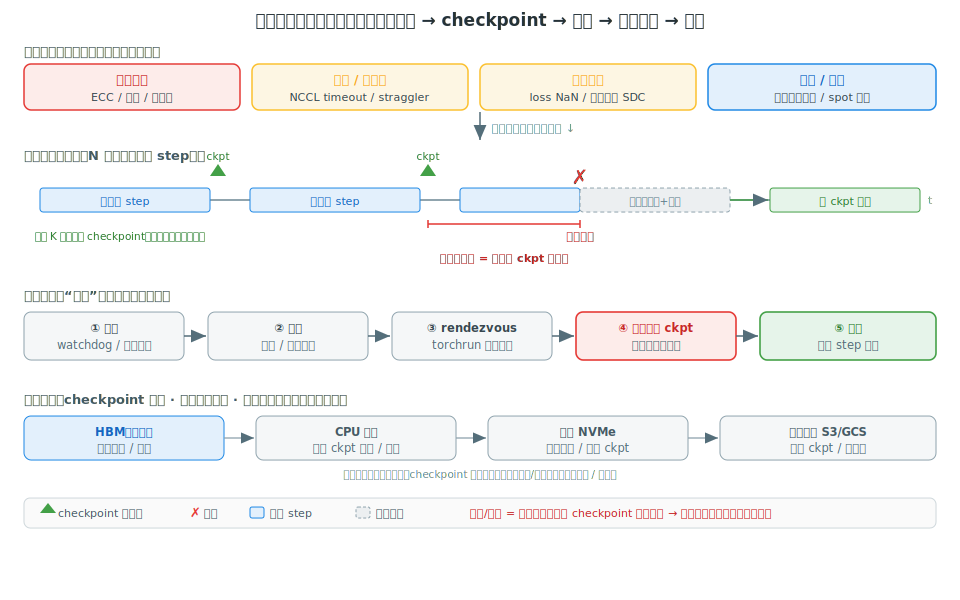

# 阶段 14｜大规模训练的容错、弹性与数据/权重管线 ★★★

> 一句话定位：阶段 13 把卡分给了作业，但作业跑起来之后呢？千卡作业每隔几小时就会挂一次——本章讲怎么让它**在故障里活下来**：故障检测、checkpoint、弹性重启的可靠性回路（A 类原理），喂数据的训练数据管线、加载权重的冷启动优化，以及一套排障 cookbook（D 类）。读完你能设计一个“挂了能自己爬起来、还不怎么丢进度”的训练系统。

## 目录

- [14.0 为什么需要这一层](#140-为什么需要这一层)
- [14.1 核心概念与术语](#141-核心概念与术语)
- [14.2 全局图：故障面与可靠性回路（A 类）](#142-全局图故障面与可靠性回路a-类)
- [14.3 故障检测：hang / straggler / NaN / SDC（A 类）](#143-故障检测hang--straggler--nan--sda-类)
- [14.4 弹性与恢复：torch elastic 与 rendezvous（A 类）](#144-弹性与恢复torch-elastic-与-rendezvousa-类)
- [14.5 Checkpoint 工程：异步、分层、并行加载（A 类）](#145-checkpoint-工程异步分层并行加载a-类)
- [14.6 训练数据管线：分片与流式读取（A 类）](#146-训练数据管线分片与流式读取a-类)
- [14.7 权重加载与分发：压掉冷启动（A 类）](#147-权重加载与分发压掉冷启动a-类)
- [14.8 端到端排障实战（D 类 cookbook）](#148-端到端排障实战d-类-cookbook)
- [14.9 常见坑与 FAQ](#149-常见坑与-faq)
- [自测](#自测)
- [14.10 延伸阅读](#1410-延伸阅读)

---

## 14.0 为什么需要这一层

阶段 13 解决了“卡怎么分给作业”，假设的是作业一旦拿到卡就能安稳跑完。**但在千卡规模上，这个假设是错的。** 故障不是意外，是常态：单卡、单网卡、单根光纤的平均无故障时间（MTBF）哪怕长达一年，把上千个这样的部件串在一个**必须全员在线**的同步训练作业里，期望故障间隔就被压到了**几小时一次**——大模型训练日志里动辄上百次重启，就是这么来的。

这就逼出一个单作业视角（阶段 1–12）从不考虑的问题：**作业一定会在跑到一半时挂掉，怎么办？** 一个没有容错的训练脚本，挂一次就从头再来；在故障频发的规模上，它可能**永远训不完**——还没跑到下一个 checkpoint 就又挂了，有效进度（goodput）趋近于零。让大模型训练在可接受成本内真正“训得出来”，靠的不是单步更快，而是**这一层可靠性工程**：

1. **故障检测**：卡死了、某个 rank 拖后腿、loss 变 NaN、甚至算错了却不报错（静默数据损坏）——怎么**及时发现并定位**，而不是让整个作业陪着一个坏 rank 空转几小时（§14.3）。
2. **弹性与恢复**：发现故障后，怎么换掉坏节点、重组通信组、从最近的 checkpoint **自动爬起来续跑**，而不是等人来重启（§14.4）。
3. **Checkpoint 工程**：存盘本身会打断训练、占带宽。怎么**异步、分层**地存，让“丢失的进度”和“存盘开销”都尽量小（§14.5，深化阶段 7 §7.8 只讲过的格式）。

可靠性之外，还有两条**喂养**作业的管线，规模一大同样会成为瓶颈：

4. **训练数据管线**：TB 级数据集怎么分片、流式读进来，不让 dataloader 拖慢昂贵的 GPU（§14.6）。
5. **权重加载与分发**：几十上百 GB 的权重，怎么从存储快速灌进显存——这既是训练 resume 的一步，也是推理冷启动（阶段 13 §13.7.1 的 scale-to-zero）的命门（§14.7）。

最后用一套 cookbook 把检测和恢复串成实战（§14.8）。本章横跨两种写法：**§14.2–§14.7 是原理**（A 类），**§14.8 是排障 cookbook**（D 类），小节标题已标注类型。

读完之后你应当能：

1. 用 MTBF 估算一个千卡作业多久挂一次，说清为什么没有容错就训不完（§14.2）；
2. 区分 hang / straggler / NaN / SDC 四类故障，各用什么手段检测（§14.3）；
3. 解释 torch elastic 的 rendezvous 怎么让作业在节点变动后自动重组续跑（§14.4）；
4. 设计 checkpoint 策略：间隔怎么定、为什么要异步、怎么并行加载（§14.5）；
5. 搭一条不拖慢 GPU 的数据管线、并把权重冷启动从分钟级压到秒级（§14.6–§14.7）。

---

## 14.1 核心概念与术语

本章术语分两摊：可靠性（检测 / 恢复 / 存盘）和管线（数据 / 权重）。

| 术语 | 全称 / 中文 | 一句话 |
|---|---|---|
| MTBF | Mean Time Between Failures | 平均无故障时间；部件越多、同步越强，作业级 MTBF 越短 |
| goodput | 有效吞吐 | 真正推进训练的算力占比（扣掉丢失进度 + 停摆），容错的最终目标 |
| checkpoint | 检查点 | 把训练状态（参数 + 优化器 + step + RNG）存盘，故障后回到这一步 |
| 异步 checkpoint | async checkpoint | 先把状态拷到 CPU、后台慢慢落盘，训练几乎不停（§14.5） |
| straggler | 拖后腿 rank | 某个 rank 异常变慢，同步训练被它拖住（全员等最慢的） |
| hang | 卡死 | 作业不前进也不报错，常因 collective mismatch / 死锁 |
| NCCL timeout / watchdog | — | collective 超时机制，把“静默 hang”变成可捕获的报错（阶段 11 §11.6） |
| SDC | Silent Data Corruption | 硬件算错却不报错，结果悄悄变坏，最隐蔽的故障 |
| loss spike / NaN | — | loss 突然飙升或变 NaN，数值发散的信号 |
| torch elastic / torchrun | — | PyTorch 的弹性启动器，节点变动后靠 rendezvous 重组继续 |
| rendezvous | 集合点 | 弹性训练里各 worker “重新点名、组队”的机制 |
| WebDataset / StreamingDataset | — | 把数据集打成分片、从远端流式读取的格式，避免本地全量落盘 |
| weight streaming | — | 边加载边用权重，把模型冷启动从分钟压到秒（tensorizer 等） |
| 对象存储 | object storage | S3 / GCS 等，存权威 checkpoint 和数据集的“最底层、最大、最慢” |

> 阅读本章的心智准备：**容错的本质是“用冗余换可用性”**——checkpoint 是时间维度的冗余（存历史状态）、弹性是资源维度的冗余（备节点顶上）、检测是把“静默变坏”变成“显式报错”。三者合起来，让一个由会坏的部件组成的系统，整体上能持续推进。下一节先把这套回路画清楚。

---

## 14.2 全局图：故障面与可靠性回路（A 类）

类型 A 的起手式：先把“为什么需要这一层”用一张图和一个估算钉死，再逐项展开。



### 14.2.1 先算一笔账：千卡作业多久挂一次

为什么单作业视角可以忽略故障、千卡视角不能？做个估算就清楚了。假设单个 GPU（连同它依赖的网卡、链路）的 MTBF 是相当乐观的**一年**（约 8760 小时）。一个同步训练作业要求**所有**卡同时在线——任何一张挂了，整个作业就得停。那么 $N$ 张卡的作业，期望故障间隔约为：

$$T_\text{fail} \approx \frac{\text{单卡 MTBF}}{N}$$

代入 $N=1024$：$8760 / 1024 \approx 8.6$ 小时挂一次。$N=10000$ 时不到 1 小时一次。这还只算了 GPU；加上交换机、光模块、电源、软件 bug，真实大集群的作业级故障间隔常以**小时**计。

这个估算解释了一切：**在这个尺度上，“一次训练跑到底”根本不存在。** 一个没有容错、挂了就从头再来的作业，如果跑满一遍要 100 小时、而每 8 小时挂一次，它永远跑不到终点——每次都没到下一个里程碑就又倒了。**容错不是优化项，是大模型训练能不能完成的前提。**

### 14.2.2 可靠性回路：丢失进度 + 停摆，两个都要压

既然故障必然发生，目标就从“不出故障”转成“**出故障后快速、少损失地恢复**”。这就是上图的回路：作业正常跑 step，**周期性存 checkpoint**；某一刻故障砸下来（上图红 ✗）；系统**检测**到、**弹性重组**、**从最近的 checkpoint 加载**、**续跑**。

衡量这套回路好不好，看 goodput——有效推进训练的时间占比。一次故障浪费的时间分两块（对应上图两段标注）：

- **丢失的进度** = 距上次 checkpoint 的时间。故障发生时，上个 checkpoint 之后跑的 step 全白干、得重来。**它由 checkpoint 间隔决定**：存得越密，丢得越少。
- **停摆时间** = 检测 + 重启 + 加载 checkpoint。这段作业完全不产出。**它由检测速度、调度恢复、加载速度决定**。

$$\text{goodput} \approx \frac{\text{有效训练时间}}{\text{有效训练时间} + \text{丢失进度} + \text{停摆时间}}$$

两块此消彼长，要一起压：**checkpoint 存得越密，单次丢的进度越少，但存盘本身的开销越大、越频繁打断训练**——所以不能无脑加密。最优间隔是在“丢失进度”和“存盘开销”之间取平衡（经典结论：最优间隔约正比于 $\sqrt{\text{MTBF} \times \text{单次存盘耗时}}$）。而**异步 checkpoint**（§14.5）能把“单次存盘耗时”几乎压没，从而允许存得更密、丢得更少——这就是它的价值。停摆时间那一块，则靠快速检测（§14.3）、弹性重组（§14.4）、并行加载（§14.5/§14.7）来压。

### 14.2.3 一套存储层级，贯穿三件事

最后看上图最下面那条带：checkpoint 往哪存、数据从哪来、权重从哪加载——**三件事共用同一套存储层级**（HBM → CPU 内存 → 本地 NVMe → 对象存储，回阶段 0 §0.2.2 的内存层级、阶段 5 §5.8 的 KV offload 同款思路）。规律一致：**越往下容量越大、越慢**。

- **checkpoint** 往下刷：先异步拷到 CPU、再后台落到 NVMe / 对象存储（§14.5）；
- **训练数据** 往上流：从对象存储 / NVMe 流式读进来喂 GPU（§14.6）；
- **权重** 往上加载：从对象存储把模型灌进 HBM（§14.7）。

三者都在和这套层级的**带宽**较劲——这也是为什么本章后半（§14.5–§14.7）反复回到“怎么把搬运藏起来 / 加速”。

> 一句话：**千卡作业每几小时挂一次（$T_\text{fail}\approx$ 单卡 MTBF / N），所以容错是前提而非优化。** 可靠性回路 = 周期 checkpoint + 检测 + 弹性重启 + 从 ckpt 续跑；要同时压“丢失进度”（靠 checkpoint 间隔 + 异步存盘）和“停摆时间”（靠快检测 + 弹性 + 并行加载）。checkpoint / 数据 / 权重三件事共用一套越往下越慢的存储层级，后面各节都在和它的带宽较劲。

---

## 14.3 故障检测：hang / straggler / NaN / SDC（A 类）

可靠性回路的第一环是**检测**。它难就难在：故障里最麻烦的几种**不会报错**——作业看着还在跑、GPU 灯还亮着，但要么悄悄卡住、要么悄悄变慢、要么悄悄算错。一个坏 rank 能拖着另外 1023 张卡空转好几个小时，直到有人发现。检测的全部功夫，就是**把这些"静默"尽快变成"显式信号"**。

### 14.3.1 检测的总思路：四类故障，四种信号

四类故障各有"现形"的办法，对应四种检测信号：

| 故障 | 表现 | 会报错吗 | 检测信号 |
|---|---|---|---|
| **hang**（卡死） | 不前进也不退出 | 否 | 超时（NCCL watchdog）+ 进度停滞 |
| **straggler**（拖后腿） | 某 rank 异常慢 | 否 | 统计离群（per-rank 时间分布） |
| **NaN / loss spike** | loss 飙升或变 NaN | 半（能算出但不崩） | 阈值监控（loss / grad norm） |
| **SDC**（静默损坏） | 结果悄悄算错 | **否** | 主动校验（一致性 / 自检） |

记住这张表的右列：**只有数值异常算是"半显式"，其余三类都得靠监控主动揪出**。下面逐个看。

### 14.3.2 hang：最常见的根因是 collective mismatch

同步训练里所有 rank 必须步调一致地调用每一个集合通信（AllReduce / AllGather…）。一旦某个 rank 因为分支逻辑、数据形状不一致等原因**少调或多调了一次 collective**，其余 rank 就会在对应的通信处**永远等它**——整个作业卡死，没有任何报错。这就是 collective mismatch，是大规模训练 hang 的头号原因（回阶段 11 §11.6）。

把它变显式靠两件套：

```bash
# NCCL watchdog：collective 超时就报错并 abort，而不是无限等
export TORCH_NCCL_BLOCKING_WAIT=1          # 或 ASYNC_ERROR_HANDLING=1
export TORCH_NCCL_TIMEOUT=600              # 超时阈值（秒）
# Flight Recorder：环形记录每个 rank 最后若干 collective，hang 后 dump 出来比对
export TORCH_NCCL_TRACE_BUFFER_SIZE=2000
```

- **watchdog** 把"无限 hang"变成"超时异常 + abort"——至少作业会**主动倒下**，触发后面的恢复（§14.4），而不是哑等几小时；
- **flight recorder** 在 hang 后 dump 出每个 rank 的最后几个 collective，**一眼看出哪个 rank 卡在哪、谁和谁对不上**——定位 mismatch 的利器。

此外还要一层**进度心跳**：训练循环每步更新一个 step 计数器 / 时间戳，外部监控发现它一段时间不涨就报警——这能兜住 watchdog 也抓不到的非通信类卡死（如某 rank 死在数据加载、磁盘 IO）。

### 14.3.3 straggler：没人报错，得靠统计揪出

straggler 是"没死但慢"：一张卡因为降频、ECC 持续修正、风扇/温度问题、网络劣化、或数据加载慢，比别人慢一截。同步训练**全员等最慢的那个**——一个 straggler 能把整批的吞吐拉到它的水平，而且**完全不报错**。

检测只能靠**统计离群**：采集 per-rank 的指标分布，找异常值。

- **每 rank 的 step 耗时 / collective 等待时间**：正常时各 rank 接近，某个 rank 的"计算时间"突出、或其余 rank 的"通信 wait"突然变长（都在等它），就锁定了它；
- **per-rank 的 SM 利用率 / 时钟 / 温度**（DCGM 采集）：辅助确认是硬件降频还是别的；
- 实践里常设一个阈值（如慢于中位数 1.5×）自动标记 straggler，重的直接当故障处理——把它的节点换掉（§14.4），好过让全员陪跑。

### 14.3.4 NaN / loss spike：监控曲线 + 回滚

数值异常是"半显式"的：loss 突然飙升或变 NaN，模型在发散。根因可能是学习率过大、一个坏 batch、混合精度（BF16/FP8）下的溢出、或梯度爆炸。它能被算出来、但训练不会自己崩，所以要**主动盯**：

- 实时监控 **loss 和 grad norm** 曲线，设阈值报警；在 loss / 梯度上跑 `torch.isnan` / `isinf` 检查；
- 触发后的标准动作：**回滚到上一个 checkpoint**，跳过或重排触发问题的 batch、调低学习率后续跑（所以 checkpoint 还兼当"数值事故的存档点"）；
- 留住触发前的 ckpt + 那批数据，便于复现定位——很多 spike 是特定脏数据引起的。

### 14.3.5 SDC：最隐蔽的，只能主动校验

最难对付的是 **SDC**（Silent Data Corruption，静默数据损坏）：硬件算错了却**不报任何错**——某个计算单元偶发出错、一个 bit 悄悄翻转，结果就这么带着错误往下走。它不 hang、不报 ECC、loss 也未必看得出异常，但模型在悄悄变坏。大厂的大规模训练实践里，SDC 已被确认是真实且影响显著的故障源。

因为没有任何被动信号，只能**主动校验**：

- **一致性校验**：数据并行的多个副本，相同输入本应得到相同结果——跨副本比对，不一致就说明有 rank 算错了；
- **确定性自检**：周期性用固定输入跑一小段、和已知正确结果（或自身重算）比对；
- **厂商诊断**：DCGM diagnostics、NVIDIA 的 SDC 检测工具，定期体检揪出可疑卡，从池子里剔除（呼应阶段 13 的节点健康检查）。

> 一句话：**检测的本质是把"静默"变"显式"——hang 靠 NCCL watchdog + flight recorder（揪 collective mismatch）、straggler 靠 per-rank 统计离群、NaN 靠 loss/grad 阈值 + 回滚、SDC 靠主动一致性校验。** 四类里只有数值异常半显式，其余都得监控主动出击；检测越快，§14.2 的"停摆时间"越短。检测到之后，怎么爬起来续跑是下一节。

---
