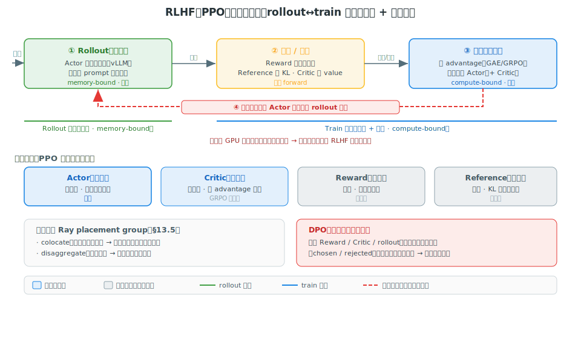

# 阶段 15｜Post-training 基础设施：RLHF / DPO ★★★

> 一句话定位：预训练只是把基座练出来，让模型"听话、有用、安全"靠的是后训练（对齐）。本章以一个 PPO/GRPO 系统为主案例（类型 C），讲清 RLHF 那个和预训练根本不同的作业拓扑——一个 step 里既要 rollout（推理生成）又要 train（反向更新）、还要同时摆下最多四个模型，以及框架（veRL/OpenRLHF）怎么用 Ray 把这套回路编排起来。读完你能看懂、搭起、调优一个对齐训练系统。

## 目录

- [15.0 为什么需要这一层](#150-为什么需要这一层)
- [15.1 核心概念与术语](#151-核心概念与术语)
- [15.2 案例全景：一个 RLHF 系统长什么样](#152-案例全景一个-rlhf-系统长什么样)
- [15.3 技术点逐项拆解](#153-技术点逐项拆解)
- [15.4 端到端复现路径](#154-端到端复现路径)
- [15.5 性能与调优](#155-性能与调优)
- [15.6 常见坑与 FAQ](#156-常见坑与-faq)
- [自测](#自测)
- [15.7 延伸阅读](#157-延伸阅读)

---

## 15.0 为什么需要这一层

阶段 7、14 讲的训练，都是**一个模型**的事：前向、反向、更新、存盘。但那只是预训练，产出的是一个会续写的基座模型——它不一定听指令、不一定说人话、更不一定安全。把基座变成能用的助手，靠的是**后训练**（post-training）：SFT、RLHF（基于人类反馈的强化学习）、DPO 等。其中 RLHF 这一步的**基础设施形态**，和前面所有训练都不一样——这正是本章要补的空白。

不一样在哪？预训练是"喂数据、算 loss、更新"的单一循环；RLHF 一个迭代里要做三件**性质迥异**的事，还要同时驱动**最多四个模型**：

1. **rollout**（生成）：当前策略模型要先对一批 prompt **生成回答**——这是一次**推理**（memory-bound，靠 vLLM 这类引擎跑），和训练的算力形态正好相反；
2. **打分 / 估值**：用奖励模型给回答打分、参考模型算 KL 约束、价值模型估基线——又是几个模型的前向；
3. **train**（更新）：根据分数算优势、反向更新策略模型——这才是熟悉的**训练**（compute-bound）。

于是 RLHF 系统冒出三个预训练从不操心、却决定成败的 infra 问题：

- **多模型怎么摆**：actor / critic / reward / reference 四个模型要同时在显存里，是挤在同一批卡上分时（colocate）、还是分到不同卡常驻（disaggregate）？显存和吞吐怎么权衡？
- **两相位怎么复用**：rollout 是推理（memory-bound）、train 是反向（compute-bound），两个相位 GPU 利用形态相反、还交替进行——卡在一个相位忙、另一个相位闲，资源怎么不浪费？这是 RLHF 吞吐的命门。
- **权重怎么同步**：每轮训练更新了策略模型，下一轮 rollout 必须用**新权重**生成——训练侧的新参数怎么快速灌回 rollout 引擎？

这些问题让 RLHF 成了当前最热、也最容易踩坑的 infra 题。它把前面几乎所有阶段都用上了：rollout 用推理引擎（阶段 6）、训练用并行框架（阶段 7）、编排用 Ray（阶段 13）、可靠性沿用容错那套（阶段 14）。所以本章放在最后——它是 AI Infra 平台层的"集大成"案例。

本章按**类型 C**（综合专题）组织：以一个 PPO/GRPO 系统为主案例（§15.2 全景），把每个技术点当作这个案例的一个侧面逐项拆解（§15.3），再给端到端复现（§15.4）和调优（§15.5）。

读完之后你应当能：

1. 画出 RLHF 的 rollout↔train 两相位回路，说清四个模型各自的角色（§15.2）；
2. 解释 PPO / GRPO / DPO 在 infra 上的差异，知道 DPO 为什么简单得多（§15.3）；
3. 判断四个模型该 colocate 还是 disaggregate，以及两相位资源怎么复用（§15.3、§15.5）；
4. 说清训练侧权重怎么同步回 rollout 引擎、延迟怎么藏（§15.3）；
5. 看懂 veRL / OpenRLHF 的架构取向，跑通一个小模型的 GRPO/DPO（§15.4）。

---

## 15.1 核心概念与术语

本章术语集中在"对齐算法"和"作业拓扑"两摊。算法只讲到理解 infra 所需的程度，不展开 RL 理论。

| 术语 | 全称 / 中文 | 一句话 |
|---|---|---|
| 后训练 | post-training | 预训练之后让模型对齐的阶段：SFT / RLHF / DPO 等 |
| RLHF | 基于人类反馈的强化学习 | 用奖励信号把模型往人类偏好上推 |
| RLAIF | 基于 AI 反馈 | 用 AI（而非人）产出偏好/奖励，省标注 |
| PPO | Proximal Policy Optimization | 经典 RLHF 算法，要 actor+critic+reward+reference 四模型 |
| GRPO | Group Relative Policy Optimization | 用一组采样的相对奖励当基线，**省掉 critic**（DeepSeek 用） |
| DPO | Direct Preference Optimization | 直接用偏好对优化，**不要 reward/critic/rollout**，最简 |
| Actor | 策略模型 | 被训练的主角，既要生成又要更新 |
| Critic | 价值模型 | 估 advantage 的基线，可训练（GRPO 省去） |
| Reward | 奖励模型 | 给回答打分，冻结、只前向 |
| Reference | 参考模型 | 算 KL 约束的锚，防策略跑偏，冻结、只前向 |
| rollout | 生成相位 | actor 对 prompt 批量生成回答（一次推理，memory-bound） |
| KL penalty | KL 惩罚 | 限制策略别偏离参考模型太远，防 reward hacking |
| advantage / GAE | 优势 | "这个回答比基线好多少"，决定往哪个方向更新 |
| on-policy | 同策略 | 用**当前**策略生成的数据训当前策略（需及时权重同步） |
| colocate / disaggregate | 共置 / 分离 | 多模型挤同卡分时 / 分卡常驻，§13.5 的放置在这里落地 |
| 权重同步 | weight sync | 训练更新后把新 actor 权重灌回 rollout 引擎 |
| veRL / OpenRLHF / NeMo-Aligner / TRL | — | 主流 RLHF 框架，多建在 Ray + vLLM 上 |

> 阅读本章的心智准备：**RLHF 系统 = 一个"推理 + 训练"交替的循环，外加几个常驻模型。** 你已经会推理（阶段 6）、会训练（阶段 7/14）、会编排（阶段 13）——RLHF 不是新东西，是把它们**拼成一个带反馈的回路**。难点全在"拼"：模型怎么摆、相位怎么复用、权重怎么同步。抓住这条主线，veRL 那一堆 actor / worker group 的概念都只是这个回路的零件。

---

## 15.2 案例全景：一个 RLHF 系统长什么样

类型 C 的起手式：先把主案例的全景图和总结表摆出来，让你看清这个系统里用到的所有技术点、以及它们怎么咬合。后面 §15.3 再逐点拆。



### 15.2.1 主案例：PPO 的一个迭代

上图就是一个 PPO 迭代的完整回路，四步（对应图中 ①–④）：

1. **① Rollout**（生成）：actor（当前策略）用推理引擎（vLLM）对一批 prompt 生成回答。这步是**推理**——memory-bound，吃的是 decode 那套（阶段 5/6）。
2. **② 打分 / 估值**：reward 模型给每个回答打分、reference 模型算 KL（约束策略别跑偏）、critic 估 value 基线。三个模型各做一次前向。
3. **③ 训练**（更新）：根据分数和基线算 advantage（GAE / GRPO），反向**更新 actor**（和 critic）。这步是**训练**——compute-bound。
4. **④ 权重同步**：actor 被更新了，下一轮 rollout 必须用新权重，所以把训练侧的新 actor 参数**灌回 rollout 引擎**，再回到 ①。

这个"生成 → 打分 → 更新 → 同步 → 再生成"的闭环，就是 RLHF 和预训练最本质的区别——**它是个带反馈的回路，不是单向的数据流**。

### 15.2.2 为什么它的 infra 比预训练难三个量级

把上图和预训练（阶段 7/14 的单循环）对比，难点集中在三处，全是预训练没有的：

- **四个模型同时在场**：actor（可训练）、critic（可训练）、reward（冻结）、reference（冻结）——光是把它们都塞进显存就是个摆放问题（§15.3.2）；
- **两个相位形态相反**：rollout 是推理（memory-bound）、train 是反向（compute-bound），交替进行。一个相位在忙时另一个的资源闲着——**怎么复用是吞吐命门**（§15.3.3、§15.5）；
- **on-policy 要求权重及时同步**：rollout 必须用最新策略生成，否则数据"过期"伤训练；同步几十上百 GB 参数的延迟必须藏好（§15.3.4，复用阶段 14 §14.7 的思路）。

### 15.2.3 技术点全景表

本案例用到的技术点、它在回路里的角色、以及去哪节细看：

| 技术点 | 在案例中的角色 | 耦合 / 出处 |
|---|---|---|
| **算法**（PPO/GRPO/DPO） | 决定要几个模型、要不要 rollout | §15.3.1 |
| **四模型放置** | colocate 省卡 vs disaggregate 高吞吐 | §15.3.2、Ray §13.5 |
| **rollout↔train 两相位** | 资源复用，吞吐命门 | §15.3.3、§15.5 |
| **rollout 引擎** | actor 生成回答，复用 vLLM | 阶段 6 |
| **权重同步** | 训练新权重灌回 rollout | §15.3.4、阶段 14 §14.7 |
| **训练并行** | actor/critic 的反向用 FSDP/Megatron | 阶段 2/7 |
| **框架**（veRL/OpenRLHF） | 用 Ray 把上面全编排起来 | §15.3.5、Ray §13.5 |
| **可靠性** | 长作业的容错沿用上一章 | 阶段 14 |

> 一句话：**RLHF 系统是一个"rollout（推理）→ 打分 → train（反向）→ 权重同步"的闭环，外加最多四个模型。** 它把推理（阶段 6）、训练（阶段 7）、编排（阶段 13）、容错（阶段 14）拼成一个带反馈的回路——难点不在任一零件，而在"怎么拼"：四模型怎么摆、两相位怎么复用、权重怎么同步。下面 §15.3 沿这张表逐点拆。

---

## 15.3 技术点逐项拆解

沿 §15.2.3 的全景表，逐个回答：这个技术点在案例里扮演什么角色、单独看是什么、和别的点怎么耦合。

### 15.3.1 算法形态：PPO / GRPO / DPO 决定要几个模型

算法不是纯理论选择——**它直接决定 infra 有多重**，因为它决定了"要几个模型、要不要 rollout"。

| 算法 | 模型数 | 要 rollout？ | infra 复杂度 | 代表 |
|---|---|---|---|---|
| **PPO** | 4（actor + critic + reward + reference） | 是 | 最高 | InstructGPT |
| **GRPO** | 3（**省去 critic**） | 是 | 中 | DeepSeek |
| **DPO** | 2（actor + reference，ref 冻结） | **否** | 最低（≈ SFT） | — |

- **PPO** 是经典形态，四模型俱全（§15.2 的图就是它）。critic 要训练、要占显存，是 infra 最重的一档。
- **GRPO**（DeepSeek 用）的关键省法：**不要 critic**。它对同一个 prompt 采样一组（G 个）回答，用**组内奖励的相对高低**当 advantage 的基线，省掉了"专门训一个价值模型"。少一个可训练模型，放置和显存都松一大截——这是它在工程上受欢迎的重要原因。
- **DPO** 更激进：**没有 reward、没有 critic、没有 rollout**。它直接拿人类标注的偏好对（chosen / rejected）做一次类似有监督的更新，只需要 actor + 一个冻结的 reference。于是 §15.2 那个复杂回路**整个坍缩成一次 forward + backward**——infra 复杂度掉到和普通 SFT 一个量级。

代价在算法侧：PPO/GRPO 是 **on-policy**（用当前策略现采的数据训，能探索），DPO 是 **off-policy**（吃固定的偏好数据集，不探索）。**infra 的简单是用算法的灵活性换的**——这正是选型的核心权衡：要极致效果上 PPO/GRPO 扛复杂 infra，要快速稳妥就 DPO。

### 15.3.2 四模型放置：colocate 还是 disaggregate

PPO 要把四个模型同时放进集群，这就是 §13.5 的 placement 在 RLHF 里的具体落地。两种摆法：

- **colocate**（共置）：四个模型**挤在同一批 GPU 上分时**。rollout 相位让 actor 的推理权重活跃、其余 offload 到 CPU；train 相位再把优化器状态等换回来。**省卡**，但相位切换有 offload/reload 开销。veRL 的 "hybrid engine" 就是把 actor 的训练和 rollout 放同一批卡、在两相位间 offload 切换。
- **disaggregate**（分离）：rollout 引擎、训练、reward/reference **各占一组卡常驻**。没有切换开销、吞吐高、各组可独立扩缩，但**占卡多**，且相位不匹配时有卡空闲。

一个关键简化：**reward 和 reference 是冻结的、只做前向**，比可训练的 actor/critic 轻得多——它们可以用更省的方式部署（甚至当成独立推理服务被调用），不必和训练模型抢同等资源。用 Ray placement group 表达时，给每个角色一组 bundle、按 colocate/disaggregate 选 `STRICT_PACK` 或分散策略（§13.5.1）。

### 15.3.3 rollout↔train 两相位：吞吐的命门

这是 RLHF 系统**最独特、也最影响吞吐**的一点。回 §15.2 的图：两个相位的 GPU 利用形态正好相反——

- **rollout 相位**：自回归生成，**memory-bound**（decode 那套，阶段 5），算力大量闲置；
- **train 相位**：反向传播，**compute-bound**，算力打满。

它们交替进行。最朴素的实现里，**rollout 时训练引擎闲着、train 时 rollout 引擎闲着**——任意时刻都有一半资源在晒太阳。压这块浪费有三招：

1. **colocate + offload**：同一批卡两相位都干，靠 offload 切换（§15.3.2 的 hybrid engine），消灭"另一半卡常驻空闲"；
2. **异步 / 流水**：训练第 i 批的同时，提前为第 i+1 批做 rollout，把两相位 overlap 起来——代价是 rollout 用的策略略微滞后（数据有点 off-policy，要控制 staleness）；
3. **把 rollout 提速**：rollout 常是整个迭代的瓶颈（长序列生成慢），所以直接复用推理栈的全套优化——continuous batching（阶段 5）、高效 kernel（阶段 4）、甚至投机解码（阶段 8）。

这也解释了为什么 RLHF 框架都把 **rollout 引擎和相位调度**当头等大事——**谁能让两相位少空闲、让 rollout 跑得快，谁的端到端吞吐就高**。

> 一句话：**算法定 infra 重量（PPO 四模型最重、GRPO 省 critic、DPO 坍缩成 SFT），放置定省卡还是高吞吐（colocate + offload vs disaggregate），两相位的资源复用定吞吐上限。** 三者层层相扣：选了 PPO 就得摆四模型、就得面对两相位空闲问题。下一节看把这套跑起来还差的最后一块——权重同步，以及谁把它们都编排起来。

### 15.3.4 权重同步：训练侧的新参数怎么灌回 rollout

回路的第 ④ 步：actor 被训练更新后，下一轮 rollout 必须用**新权重**生成（on-policy 的硬要求，§15.3.1）。难点在于——**同一个 actor 在两处以两种布局存在**：训练引擎里它被 FSDP / Megatron 按训练并行切片（还带优化器状态），rollout 引擎里它被按推理 TP 切片。同步要跨过两道坎：

1. **布局不同**：训练分片 ≠ 推理分片，参数要重新切/拼（reshape），不能直接按字节拷；
2. **量大又频繁**：几十上百 GB，**每一轮迭代都要同步一次**——比阶段 14 §14.7 的一次性冷启动更苛刻，延迟必须藏好。

三种做法，快慢差很多：

- **NCCL broadcast / GPU 直传**：训练 rank 把更新后的参数经 NVLink/IB 直接广播给 rollout rank，不落盘——最快，是大规模 RLHF 的主流。需要两边在可通信的进程组里（框架/Ray 来牵线）。
- **共享存储中转**：训练侧存 ckpt、rollout 侧重新加载——慢，只适合松耦合或调试。
- **colocate 的免费午餐**：若 actor 的训练和 rollout 在**同一批 GPU**上（§15.3.2 的 hybrid engine），同步几乎不花钱——参数本就在这些卡的显存里，重绑定 / 极小拷贝即可，**不用跨设备传**。这是 colocate 除省卡之外的一大隐藏好处。

所以权重同步和放置策略是**耦合**的：选 colocate，同步顺带就解决了；选 disaggregate，就得认真做 NCCL 直传并把它 overlap 到训练尾部。

### 15.3.5 框架对比：谁把这一切编排起来

上面这些（四模型、两相位、权重同步）没人想从零拼。主流 RLHF 框架就是把它们封装好——几乎都建在 **Ray**（编排，阶段 13）+ 推理引擎（rollout）+ 训练后端之上：

| 框架 | 训练底座 | rollout 引擎 | 放置取向 | 适合 |
|---|---|---|---|---|
| **veRL**（HybridFlow） | FSDP / Megatron | vLLM / SGLang | hybrid（colocate + offload） | 追吞吐 / 灵活的主流选择 |
| **OpenRLHF** | DeepSpeed | vLLM | 偏 disaggregate | 上手快、社区活跃 |
| **NeMo-Aligner** | Megatron-Core | TRT-LLM / vLLM | 大规模紧耦合 | Megatron 体系、超大规模 |
| **TRL** | accelerate / FSDP | 自带 / vLLM | 单机友好 | DPO、快速实验、入门 |

读这张表的方法和阶段 6/7 一样——看它在几个轴上的取向：

- **veRL**（字节 HybridFlow）：核心卖点是 hybrid engine（actor 训练 + rollout 共卡 + offload，§15.3.2），加上"单控制器"编程模型，让你像写单机代码一样描述这个分布式回路。灵活、吞吐高，是当前大规模 RLHF 的热门。
- **OpenRLHF**：Ray + vLLM + DeepSpeed 的清爽组合，文档友好、上手快，适合先把 RLHF 跑通。
- **NeMo-Aligner**：绑定 Megatron-Core 的并行体系，面向超大规模、已有 NeMo/Megatron 栈的团队。
- **TRL**（HuggingFace）：最轻量，单机和 DPO 友好，是做 DPO、小规模实验、入门的首选；要做大规模分布式 PPO 则力有不逮。

一条选型线：**做 DPO / 小规模 → TRL；主流大规模 RLHF → veRL 或 OpenRLHF；已是 Megatron 体系 / 超大规模 → NeMo-Aligner。**

> 一句话：**权重同步是每轮都要做的"跨布局、大体积"传输，colocate 几乎免费、disaggregate 靠 NCCL 直传——它和放置策略耦合。** 框架（veRL / OpenRLHF / NeMo-Aligner / TRL）把四模型 + 两相位 + 同步封装在 Ray + 推理引擎 + 训练后端之上，按"规模 + 是否 DPO + 已有栈"选。至此 §15.3 把全景表的技术点逐个落地，下面 §15.4 给一条能跑的复现路径。

---

## 15.4 端到端复现路径

给两条由简到繁的路：先用 TRL 把 DPO 跑通（infra 最轻），再用 veRL 跑完整的 GRPO 回路。**所有规模 / 耗时都标硬件**（守 CLAUDE.md §4）；性能数字只给量级方向，绝对值随硬件和配置变。

### 15.4.1 先跑通最简的：TRL 做 DPO

DPO 没有 rollout、没有 reward/critic（§15.3.1），所以 infra 和一次 SFT 差不多——**单机起步、7B 加 LoRA 甚至单张 A100/H100 80GB 就能跑**。数据是偏好对（每条含 prompt / chosen / rejected）：

```python
# pip install trl ；单机 1–8×GPU，7B+LoRA 可单卡 80GB 起步
from trl import DPOTrainer, DPOConfig
trainer = DPOTrainer(
    model=policy,           # 待对齐的 actor
    ref_model=None,         # None = 自动用初始权重副本当 reference（冻结）
    args=DPOConfig(beta=0.1, learning_rate=5e-7),  # beta 越大越贴近 ref、越保守
    train_dataset=pref_ds,  # 每条：prompt / chosen / rejected
)
trainer.train()
```

**预期**：训练 loss 稳步下降，`chosen` 相对 `rejected` 的隐式奖励差（reward margin）逐步拉开。跑通这个，你就有了对齐的最小闭环——但它不探索（off-policy），效果上限不如 PPO/GRPO。

### 15.4.2 跑通完整回路：veRL 做 GRPO

要 §15.2 那个完整回路，上 veRL 跑 GRPO（省了 critic，比 PPO 轻一档）。**硬件：单机 8×H100 80GB**；Ray 起集群、vLLM 做 rollout：

```bash
# 单机 8×H100 80GB；Ray + vLLM rollout，GRPO（adv 用组内相对奖励，省 critic）
python -m verl.trainer.main_ppo \
  algorithm.adv_estimator=grpo \                  # 选 GRPO
  actor_rollout_ref.model.path=Qwen2.5-7B \
  actor_rollout_ref.rollout.name=vllm \           # rollout 引擎 = vLLM
  actor_rollout_ref.rollout.n=8 \                 # 每个 prompt 采样 G=8 个回答（GRPO 组）
  actor_rollout_ref.actor.fsdp_config.param_offload=True \  # colocate + offload（§15.3.2）
  reward_model.path=<reward-model-or-rule> \
  trainer.n_gpus_per_node=8 trainer.nnodes=1
```

几个旋钮直接对应前面的原理：`adv_estimator=grpo` 省 critic（§15.3.1）；`rollout.name=vllm` 是 §15.2 的 rollout 引擎；`rollout.n=8` 是 GRPO 的组采样；`param_offload=True` 就是 §15.3.2 的 colocate + offload。

### 15.4.3 怎么判断"训对了"

RLHF 不像预训练那样看 loss 就行——reward 会涨不代表模型变好。盯这几个指标：

| 指标 | 健康 | 异常信号 |
|---|---|---|
| reward 均值 | 随 step 稳步上升 | 不动 / 剧烈震荡 → 学习率或奖励有问题 |
| KL（actor ‖ reference） | 在阈值内缓慢增长 | **飙升 = reward hacking**（钻奖励空子、偏离原模型） |
| response length | 平稳或温和变化 | 暴涨 = length hacking（用长度骗高分） |
| rollout / train 耗时比 | 用来定位瓶颈 | rollout 占绝大多数 → 该优化生成（§15.5） |

最后一条尤其关键：**KL 是 RLHF 的"安全带"**。reward 一路飙升而 KL 同时爆炸，几乎肯定是 reward hacking——模型找到了奖励模型的漏洞，而不是真的变好（§15.6 详谈）。所以**永远在独立验证集上看真实质量，别只信 reward 曲线**。

> 一句话：**先用 TRL/DPO 跑通最小闭环（单机、≈SFT 级 infra），再用 veRL/GRPO 跑完整回路（8×H100、Ray + vLLM）；命令里的旋钮一一对应 §15.3 的原理（GRPO 省 critic、vLLM rollout、组采样、colocate offload）。** 判断训对了不能只看 reward——要 reward 升、KL 受控、长度不失控，并在验证集上看真实质量。

---

## 15.5 性能与调优

RLHF 的调优分两摊：**吞吐**（跑得快）和**稳定性**（训得对）。先说吞吐——而吞吐的第一原则是**先 profile 再动手**（阶段 11），别凭感觉优化。

### 15.5.1 rollout 几乎总是头号瓶颈

绝大多数 RLHF 运行里，**rollout（生成）吃掉壁钟时间的大头**——自回归生成长序列本来就慢，而它又卡在每轮迭代的前面。所以先看 §15.4.3 那个"rollout / train 耗时比"，确认是 rollout-bound（通常是），再对症：

- **把 rollout 引擎调满**：它就是个推理服务，阶段 5/6 的全套优化都适用——continuous batching、合适的 TP、FP8 KV（阶段 8）；序列长就开 chunked prefill；
- **控制生成量**：`max_response_length` 别给太大；GRPO 的组大小 `rollout.n`（G）是权衡——G 大基线更准、但生成成本线性涨，常取 4–16；
- **激进一点**：rollout 也能上投机解码（阶段 8）——draft 猜、actor 验，省 forward。

记住：**rollout 是推理问题，不是 RL 问题**。把它当一个要榨吞吐的 serving 任务来调，收益最大。

### 15.5.2 两相位资源复用的旋钮

第二块吞吐来自 §15.3.3 的两相位别空闲：

- **colocate + offload**：`param_offload` / `optimizer_offload` 让两相位共卡——省卡，但 offload 有搬运延迟，按显存余量调粒度（够放就少 offload）；
- **disaggregate 时独立扩 rollout 池**：既然 rollout-bound，就给 rollout 多分卡、训练少分，把两相位的吞吐配平；
- **异步 rollout**：把第 i+1 批的生成 overlap 到第 i 批训练后面——能填满空闲，但引入数据滞后（off-policy staleness），这是个"吞吐换 on-policy 纯度"的旋钮，滞后别超过一两步。

### 15.5.3 稳定性旋钮：KL 系数是核心

吞吐之外，RLHF 训得稳不稳主要靠几个超参（影响的是质量/收敛，不是速度）：

| 旋钮 | 作用 | 调过头的后果 |
|---|---|---|
| **KL 系数 / beta** | 限制策略偏离 reference | 太低 → reward hacking / 跑偏；太高 → 学不动 |
| **学习率** | RLHF 用得极低（如 1e-6～1e-7） | 偏大就发散（§14.3.4 的 spike） |
| **组大小 G / clip 范围** | GRPO 基线质量 / PPO 更新幅度 | 影响方差与稳定性 |

其中 **KL 系数是核心安全带**——它直接决定模型敢不敢钻奖励空子（§15.4.3）。RLHF 的不稳定大多能追到它或学习率上。

### 15.5.4 何时该退化为更简方案

这是 C 类章节最该给的判断——**别为了用 PPO 而用 PPO**。对齐方案有一条由简到繁的阶梯，能用简单的达标就别上复杂的：

1. **SFT**：监督微调够用就别碰 RL（很多任务 SFT + 好数据就到位了）；
2. **拒绝采样 / Best-of-N + SFT**（RAFT/RFT）："穷人的 RLHF"——用模型生成多个回答、按 reward 筛出好的、再 SFT。**没有 RL 回路、复用 SFT infra**，却能拿到大部分收益；
3. **DPO**：要用上偏好信号、但想避开 rollout 回路 → off-policy、infra ≈ SFT（§15.4.1）；
4. **GRPO / PPO**：确实需要 on-policy 探索、要冲效果上限 → 才上完整回路，扛四模型 + 两相位 + 权重同步的全部复杂度。

决策线一句话：**从 SFT 往上爬，每一档都比上一档省一大截 infra，停在"刚好达标"那一档。** 大量团队其实在第 2、3 档就够了，真正需要第 4 档完整 RLHF 的是少数追极致的场景。

> 一句话：**吞吐先优化 rollout（它是推理问题，套阶段 5/6/8 的优化）、再压两相位空闲（colocate offload / 独立扩 rollout / 异步）；稳定性主要拧 KL 系数和学习率。** 而最大的"优化"是选对档位——SFT → 拒绝采样+SFT → DPO → GRPO/PPO 由简到繁，用最简单能达标的方案，别默认上 PPO。

---

## 15.6 常见坑与 FAQ

1. **reward 一直涨、模型却变差**：典型 reward hacking——模型钻了奖励模型的空子。看 KL（爆了就是），提高 KL 系数、换更鲁棒的 reward、并在验证集上看真实质量（§15.4.3、§15.5.3）。
2. **回答越来越长**：length hacking，用长度骗高分。加长度惩罚或对奖励做长度归一化。
3. **训练吞吐很低**：多半 rollout-bound。先看 rollout/train 耗时比确认，再把 rollout 当推理服务优化（§15.5.1），别瞎调训练侧。
4. **四个模型 OOM**：上 colocate + offload（§15.3.2）；reward/reference 用更小模型或部署成独立服务；或直接换 GRPO 省掉 critic。
5. **rollout 用了过期权重**（off-policy 太严重）：权重同步没跟上，或异步 rollout 滞后太多。检查 §15.3.4 的 sync、把 staleness 控制在一两步内。
6. **KL 突然爆炸 / loss NaN**：学习率太大或 KL 系数太小。RLHF 学习率本就极低（1e-6 量级）；回滚到上个 ckpt 调参续跑（沿用阶段 14 的容错）。
7. **默认上了 PPO，其实 DPO 就够**：没先评估简单方案。按 §15.5.4 的阶梯从简往繁试，多数场景停在拒绝采样 + SFT 或 DPO。
8. **reward 模型打分和人类偏好对不上**：reward 模型本身质量 / 分布问题，尤其对 OOD（训练分布外）回答的打分不可信。reward 模型不是真理，KL 安全带正是为防它被钻空子。
9. **多机权重同步很慢**：别走共享存储中转，用 NCCL 直传（§15.3.4）；能 colocate 就 colocate，同步几乎免费。
10. **训练"成功"、线上没提升**：只看了 reward 曲线、没看真实任务指标。reward 是代理目标不是最终目标，务必用业务验证集复核（§15.4.3）。

---

## 自测

1. **（概念）** RLHF 的一个 PPO 迭代是哪四步？为什么说它是"带反馈的回路"而不是预训练那样的单向数据流？
2. **（辨析）** PPO / GRPO / DPO 在 infra 上的核心差异是什么？DPO 为什么 infra 最轻？
3. **（机制）** 为什么 rollout↔train 两相位是 RLHF 吞吐的命门？有哪三招压它的空闲？
4. **（辨析）** colocate 和 disaggregate 各自利弊？colocate 对"权重同步"有什么隐藏好处？
5. **（机制）** 权重同步难在哪两点？三种做法各自的快慢？
6. **（应用）** KL 系数调太高 / 太低各会怎样？reward hacking 怎么从指标上看出来？
7. **（概念）** 为什么 rollout 常是瓶颈？为什么说"它是推理问题，不是 RL 问题"？
8. **（判断）** 对齐方案由简到繁的阶梯是什么？什么时候不该上完整 PPO？

<br>

**参考答案**

1. ① rollout（actor 生成回答）→ ② 打分/估值（reward+reference+critic）→ ③ 训练（算 advantage、更新 actor/critic）→ ④ 权重同步（新 actor 灌回 rollout），再回 ①。它是回路：训练的产物（新策略）反过来决定下一轮生成什么数据，而预训练是固定数据集的单向流。（§15.2.1）
2. 差异在"要几个模型、要不要 rollout"：PPO 四模型 + rollout（最重）；GRPO 用组内相对奖励省掉 critic（三模型）；DPO 没有 reward/critic/rollout，直接用偏好对做类 SFT 更新（两模型、最轻）。DPO 简在它是 off-policy、不用生成回路。（§15.3.1）
3. rollout 是 memory-bound 推理、train 是 compute-bound 反向，交替进行——朴素实现里任意时刻一半资源闲着。三招：colocate + offload（共卡）、异步/流水 overlap（代价是 off-policy 滞后）、把 rollout 提速（套推理优化）。（§15.3.3、§15.5）
4. colocate 省卡但有相位切换 offload 开销；disaggregate 吞吐高、可独立扩缩但占卡多、相位不匹配时空闲。colocate 的隐藏好处：actor 训练和 rollout 在同卡，权重同步几乎免费（不用跨设备传）。（§15.3.2、§15.3.4）
5. 难在：① 训练分片布局 ≠ 推理分片布局，要 reshape；② 每轮都要传几十上百 GB。三法：NCCL 直传（最快、主流）、共享存储中转（慢）、colocate 几乎免费。（§15.3.4）
6. KL 太高 → 策略被钉在 reference 附近、学不动；太低 → 放任偏离、易 reward hacking。reward hacking 的信号：reward 飙升的同时 KL 爆炸、且验证集真实质量不升反降。（§15.4.3、§15.5.3）
7. 自回归生成长序列本就慢、又在每轮迭代前段，常吃掉壁钟大头。它本质是推理任务，所以阶段 5/6/8 的推理优化（continuous batching、FP8 KV、投机解码）全都适用——当 serving 调即可。（§15.5.1）
8. SFT → 拒绝采样 + SFT（RAFT）→ DPO → GRPO/PPO，由简到繁、infra 逐档加重。能用简单方案达标就别上 PPO——只有确实需要 on-policy 探索、冲效果上限时才上完整回路。（§15.5.4）

> 第 1、3 题考 RLHF 最独特的两点（带反馈回路、两相位）；第 2、8 题考"按需选档位"的工程判断（别默认上 PPO）；第 6 题考 KL 这条安全带——这几题答得出，就抓住了 RLHF infra 的骨架。

---

## 15.7 延伸阅读

- **《Training language models to follow instructions》（InstructGPT, Ouyang 2022）** — RLHF + PPO 的奠基，四模型回路的由来。
- **《Direct Preference Optimization》（Rafailov 2023）** — DPO 怎么用一个等价目标去掉 reward 模型与 rollout，理解"infra 坍缩"的原理。
- **DeepSeekMath / DeepSeek-R1 报告（GRPO）** — GRPO 省 critic 的出处与大规模实践，附带 R1 的纯 RL 路线。
- **《HybridFlow: A Flexible and Efficient RLHF Framework》（veRL）** — hybrid engine、single-controller、colocate + offload 的设计，读它理解两相位复用。
- **OpenRLHF 文档** — Ray + vLLM + DeepSpeed 的清爽实现，跑通 RLHF 的上手参考。
- **TRL（HuggingFace）文档** — DPO / PPO 的最小实现，单机入门与小规模实验首选。
- **《Scaling Laws for Reward Model Overoptimization》（Gao 2022）** — 量化 reward hacking，理解 KL 安全带为什么不可少。
- **NeMo-Aligner 文档** — Megatron-Core 体系下的大规模对齐，超大规模 / 已有 Megatron 栈时参考。
